# 10일차 - 6/9(화) #
- 회의 참석: https://whaleon.us/o/CSvuJa/64dffed07c6741c990f69804e3b62d6e

# 딥러닝(Deep Learning)
## 딥러닝이란? 
- 인간의 신경망 원리를 모방한 심층 신경망 기반의 인공지능 기술
- 데이터를 통해 스스로 규칙을 학습하는 인공지능 기술
## 신경망 구조
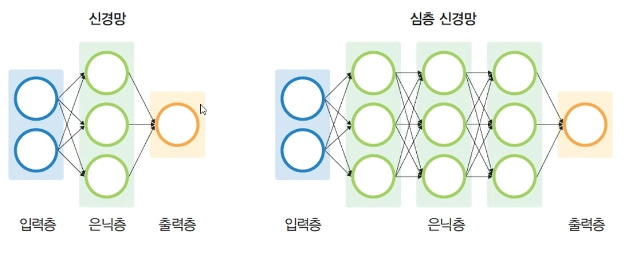
- `입력층`: 데이터를 처음 받는 부분
- `은닉층`: 데이터를 분석하고 특징을 추출하는 부분
- `출력층`: 최종 결과를 출력하는 부분
## 역전파 계산
- 모델의 예측 결과와 실제 값의 차이(오차)를 이용해 가중치를 수정하는 과정
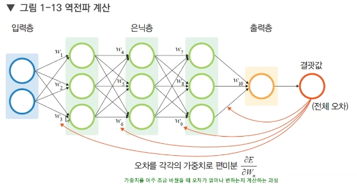
- 출력 결과에서 오차를 계산
- 오차를 뒤에서부터 앞(출력층 → 입력층)으로 전달
- 각 층의 가중치를 조금씩 수정
## 학습 분류
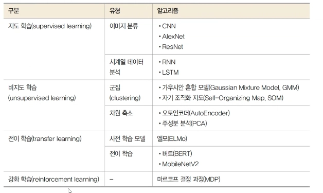
## 합성곱 신경망(CNN 모델)## 
- 이미지 데이터를 처리하는 데 특화된 딥러닝 모델
- 이미지의 특징(패턴)을 자동으로 추출하는 데 강하다.
### CNN 참고 사이트: http://taewan.kim/post/cnn/
### CNN 학습 방식
- 이미지에서 중요한 부분(특징)을 찾아냄
- 필터(커널)를 사용해 데이터를 반복적으로 분석
- 공간 정보(위치, 형태)를 유지하면서 학습
### 사용 예시### 
- 이미지 분류 (고양이/강아지 구분)
- 얼굴 인식
- 객체 탐지
- 자율주행
## RNN 모델 (Recurrent Neural Network)
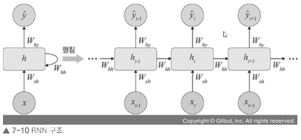
- 순서가 있는 데이터를 처리하는 데 특화된 딥러닝 모델
- 이전 정보를 기억하면서 다음 데이터를 학습한다.
### RNN 개념
- 이전 입력 정보를 기억 (순환 구조)
- 데이터의 흐름(순서)을 고려
- 시간에 따른 변화 학습 가능
### RNN 사용 예시
- 문장 처리 (자연어 처리)
- 음성 인식
- 시계열 데이터 분석 (주가, 센서 데이터 등)

# 딥러닝 실습
- 내가 이날 학교 시험 때문에 빠져서 실습코드 받아 놓았고 하나씩 실행해 볼 예정
- 딥러닝 실습 파일들은 workspace에 옮겨 놓았다.
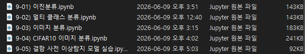
- 위에는 정호님이 주신 파일, 아래는 예진이가 준 파일..
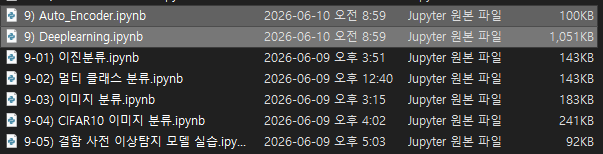
- 둘 다 확인해 볼 것

## 1. 이진 분류 실습
- 신규 파일 생성: [9-01) 이진분류]
### tensorflow를 통해 개발 진행 (없으면 설치)
- `import tensorflow as tf`

### [1] 라이브러리 임포트
```py
import numpy as np
import pandas as pd
import matplotlib.pyplot as plt
from sklearn.model_selection import train_test_split
from sklearn.preprocessing import StandardScaler
from sklearn.metrics import accuracy_score, confusion_matrix, classification_report, roc_auc_score, auc
from sklearn.datasets import load_breast_cancer          # 암진단 데이터
import joblib

from tensorflow.keras import Sequential
from tensorflow.keras.layers import Dense, Dropout       # 딥러닝 레이어 구성 및 드롭아웃
from tensorflow.keras.callbacks import EarlyStopping     # 학습 조기종료 콜백 함수
```

### [2] 데이터 읽어오기
```py
data = load_breast_cancer()
X = data.data
y = data.target

feature_names = data.feature_names   # 특성 이름
df = pd.DataFrame(X, columns=feature_names)

df["target"] = y
print("전체 데이터 shape:", df.shape)
df.head()
```
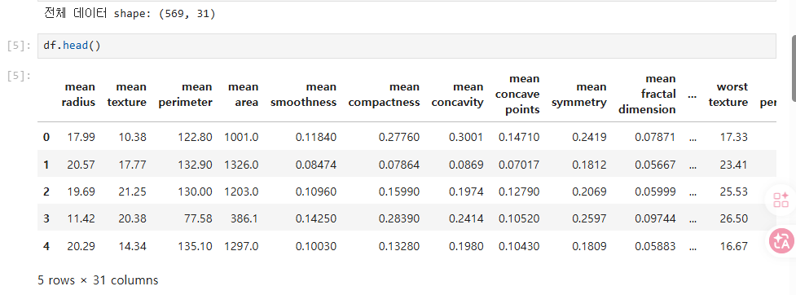

### [3] 학습용/테스트용 데이터 분리
```py
X_train, X_test, y_train, y_test = train_test_split(
    X, y, test_size=0.2, random_state=42, stratify=y
)
```

### [4] 스케일링
```py
scaler = StandardScaler()
X_train_scaled = scaler.fit_transform(X_train)
X_test_scaled = scaler.fit_transform(X_test)
```

### [5] [중요] 딥러닝 모델 정의 (순차적으로 층을 쌓는 구조)
```py
# 딥러닝 모델 (순차적으로 층을 쌓는 구조)
model = Sequential()

# 첫 번째 은닉층
# Dense: 모든 입력이 모든 뉴런과 연결되는 층
# 64개 뉴런 → 특징 64개로 변환
# ReLU: 음수는 0, 양수는 그대로
model.add(Dense(64, activation="relu", input_shape=(X_test_scaled.shape[1],)))

# 과적합 방지 (20% 랜덤 제거)
model.add(Dropout(0.2))

# 두 번째 은닉층
# 32개 뉴런 → 특징 압축
model.add(Dense(32, activation="relu"))

# 과적합 방지
model.add(Dropout(0.2))

# 출력층 (이진 분류)
# 1개 출력 → 0 또는 1 확률
# sigmoid: 0~1 확률 출력
model.add(Dense(1, activation="sigmoid"))

# 모델 구조 확인
model.summary()
```
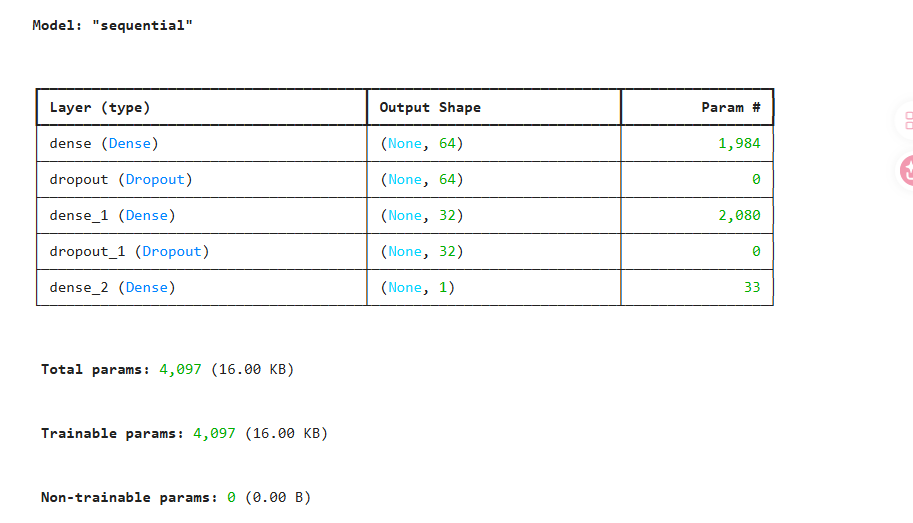

### [6] 모델 학습 설정(compile) & 학습 중단 조건(EarlyStopping) 지정
```py
# 모델 학습 설정 (compile)
# → 모델이 "어떻게 공부할지" 정하는 단계
model.compile(
    optimizer="adam",              # 공부 방법 (가중치 업데이트 방식)
    loss="binary_crossentropy",    # 틀린 정도 계산 (오차)
    metrics=["accuracy"]           # 성적 확인 (정확도)
)


# 학습 중단 조건 (EarlyStopping)
# → 성능이 안 좋아지면 학습 멈춤
early_stop = EarlyStopping(
    monitor="val_loss",            # 기준: 검증 데이터 오차
    patience=10,                   # 10번 동안 개선 없으면 stop
    restore_best_weights=True      # 가장 잘한 시점으로 되돌림
)
```

### [7] 모델 학습 (fit)
- 실제로 데이터를 넣어서 모델을 학습시키는 단계
```py
history = model.fit(
    # 학습 데이터 (입력값)
    X_train_scaled,

    # 정답 데이터 (라벨)
    y_train,

    # 전체 데이터의 20%를 검증용으로 사용 → 학습 중 과적합 여부 확인
    validation_split=0.2,

    # 전체 데이터를 100번 반복 학습 → 단, early stopping으로 중간에 멈출 수 있음
    epochs=100,

    # 한 번에 32개씩 나눠서 학습 → 메모리 효율 + 학습 안정성
    batch_size=32,

    # 조기 종료 적용 → 성능이 안 좋아지면 자동으로 학습 중단
    callbacks=[early_stop],

    # 학습 과정 출력
    # 0: 출력 없음, 1: 진행상황 자세히 출력, 2: epoch 결과만 간단 출력
    verbose=1
)
```
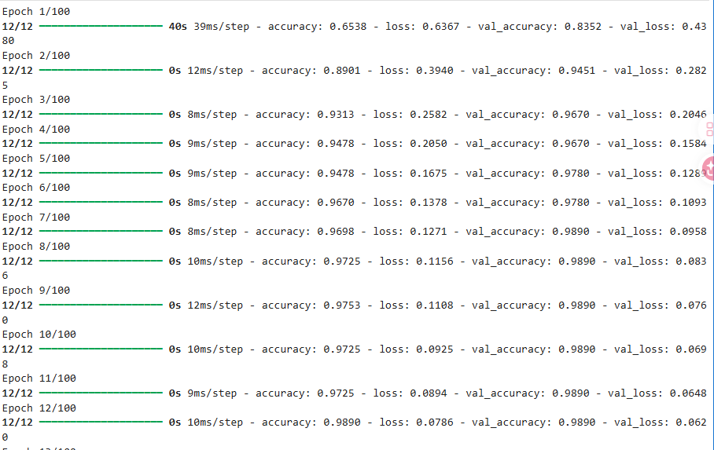
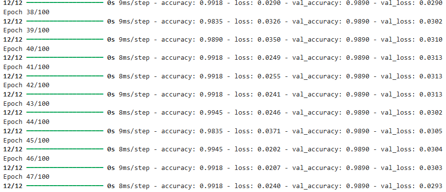
- 위와 같이 학습이 진행된다.

### [8] 모델 평가 
```py
# evaluate(): 테스트 데이터로 모델 성능(손실, 정확도)을 계산하는 함수
test_loss, test_acc = model.evaluate(X_test_scaled, y_test, verbose=0)

print("테스트 손실: ", test_loss)
print("테스트 정확도: ", test_acc)

# 예측 확률
y_prob = model.predict(X_test_scaled)

# 확률을 0 또는 1 클래스로 변환
y_pred = (y_prob >= 0.5).astype(int).flatten()

# 정확도 계산
acc = accuracy_score(y_test, y_pred)

# confusion matrix 계산
cm = confusion_matrix(y_test, y_pred)

# 분류 리포트 출력
print("정확도: ", acc)
print("confusion matrix : \n", cm)
print("분류 리포트: \n", classification_report(y_test, y_pred))
```
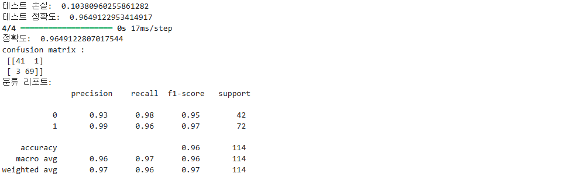

### [9] 학습 결과 저장 (모델을 파일로 저장)
```py
# 파일 저장
# workspace 폴더에 results 폴더 생성
model.save("./results/9-01) Binary_Classification.h5")

# 학습이력 데이터 프레임으로 변환
history_df = pd.DataFrame(history.history)

# 학습 이력 csv로 저장
history_df.to_csv("./results/9-01) Binary_Classification.csv", index=False)

print(" 모델 및 학습 이력 저장 완료 ")
```
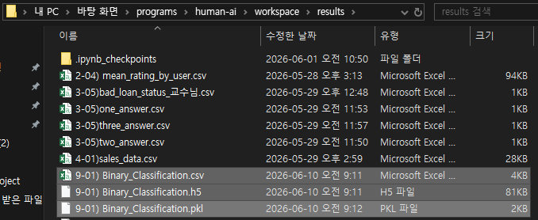
- 위와 같이 저장됨.

### [9-2] 저장 결과 읽어와서 저장
```py
loaded_model = tf.keras.models.load_model("./results/9-01) Binary_Classification.h5")
```

### [10-1] 모델 성능 확인 - Loss
```py
# Loss
plt.figure(figsize=(10,4))
plt.plot(history.history["loss"], label="train_loss")
plt.plot(history.history["val_loss"], label="val_loss")
plt.title("Binary_Classification - Loss")
plt.xlabel("epoch")
plt.ylabel("loss")
plt.legend()
plt.grid(True)
plt.show()
```
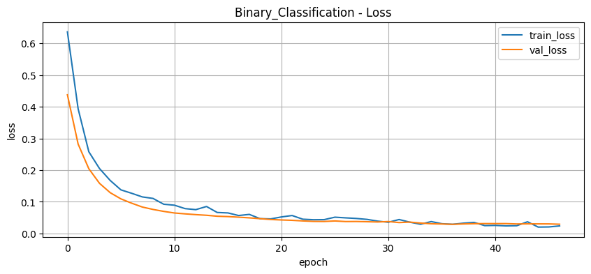

### [10-2] 모델 성능 확인 - Accuracy 
```py
# accuracy
plt.figure(figsize=(10,4))
plt.plot(history.history["accuracy"], label="train_accuracy")
plt.plot(history.history["val_accuracy"], label="val_accuracy")
plt.title("Binary_Classification - Accuracy")
plt.xlabel("epoch")
plt.ylabel("accuracy")
plt.legend()
plt.grid(True)
plt.show()
```
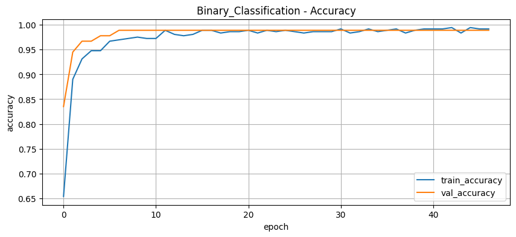

### [11] confusion matrix 시각화
```py
# confusion matrix 시각화
plt.figure(figsize=(6,5))
plt.imshow(cm, cmap="Blues")   # confusion matrix를 이미지 형태로 출력 (파란색 계열)
plt.title("Confusion Matrix")

# x축과 y축 눈금 설정
plt.xticks([0,1], ["Pred 0", "Pred 1"])  # 예측값 (열 기준)
plt.yticks([0,1], ["True 0", "True 1"])  # 실제값 (행 기준)

# CM 내부에 숫자 표시
# cm.shape → (행 개수, 열 개수)
for i in range(cm.shape[0]):       # 행 반복
    for j in range(cm.shape[1]):   # 열 반복
        plt.text(j, i, cm[i, j],   # (x=j, y=i) 위치에 숫자 출력
                 ha="center",      # 가로 중앙 정렬
                 va="center")      # 세로 중앙 정렬

plt.xlabel("Predicted label")
plt.ylabel("True label")

plt.show()
```
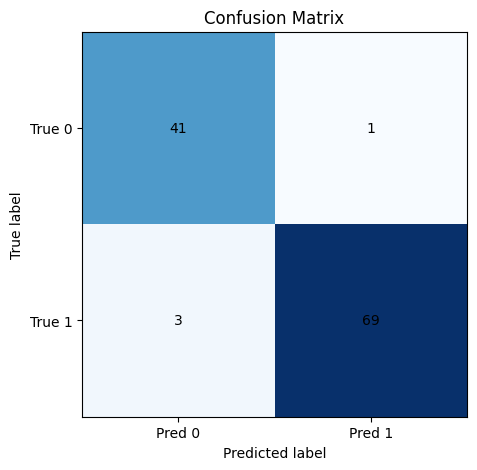

### [12] 재사용하기 위해 pkl로 저장 
```py
# scaler 객체를 "Binary_Classification.pkl" 파일로 저장
# (학습된 스케일링 기준을 나중에 재사용하기 위함)
joblib.dump(scaler, "./results/9-01) Binary_Classification.pkl")
```
-> ['./results/9-01) Binary_Classification.pkl'] 출력됨

### [13] 추론 진행
```py
# 신규 데이터 예측 (추론)
new_data = X_test[:5]

# 저장해둔 scaler 불러오기 (학습 때 사용한 기준 그대로 사용)
loaded_scaler = joblib.load("./results/9-01) Binary_Classification.pkl")

# 동일한 스케일링 적용
new_data_scaled = loaded_scaler.transform(new_data)

# 모델을 이용해 예측 확률 계산 (0~1 사이 값)
new_prob = loaded_model.predict(new_data_scaled)

# 확률을 기준으로 클래스 변환 (0.5 이상 → 1, 미만 → 0)
# flatten(): 2차원 배열을 1차원으로 변환
new_pred = (new_prob >= 0.5).astype(int).flatten()

# 각 샘플별 예측 결과 출력
for i in range(len(new_data)):
    # 예측 확률은 소수점 4자리까지 출력
    print(f"{i+1}번 샘플 - 예측확률: {new_prob[i][0]:.4f}, 예측클래스: {new_pred[i]}")
```
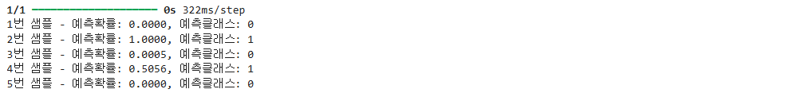

## 2. 
### [] 
```py
```

### [] 
```py
```

### [] 
```py
```