# 10일차 - 6/9(화) #
- 회의 참석: https://whaleon.us/o/CSvuJa/64dffed07c6741c990f69804e3b62d6e

# 딥러닝(Deep Learning)
## 딥러닝이란? 
- 인간의 신경망 원리를 모방한 심층 신경망 기반의 인공지능 기술
- 데이터를 통해 스스로 규칙을 학습하는 인공지능 기술
## 신경망 구조

- `입력층`: 데이터를 처음 받는 부분
- `은닉층`: 데이터를 분석하고 특징을 추출하는 부분
- `출력층`: 최종 결과를 출력하는 부분
## 역전파 계산
- 모델의 예측 결과와 실제 값의 차이(오차)를 이용해 가중치를 수정하는 과정

- 출력 결과에서 오차를 계산
- 오차를 뒤에서부터 앞(출력층 → 입력층)으로 전달
- 각 층의 가중치를 조금씩 수정
## 학습 분류

## 합성곱 신경망(CNN 모델)## 
- 이미지 데이터를 처리하는 데 특화된 딥러닝 모델
- 이미지의 특징(패턴)을 자동으로 추출하는 데 강하다.
### CNN 참고 사이트: http://taewan.kim/post/cnn/
### CNN 학습 방식
- 이미지에서 중요한 부분(특징)을 찾아냄
- 필터(커널)를 사용해 데이터를 반복적으로 분석
- 공간 정보(위치, 형태)를 유지하면서 학습
### 사용 예시### 
- 이미지 분류 (고양이/강아지 구분)
- 얼굴 인식
- 객체 탐지
- 자율주행
## RNN 모델 (Recurrent Neural Network)

- 순서가 있는 데이터를 처리하는 데 특화된 딥러닝 모델
- 이전 정보를 기억하면서 다음 데이터를 학습한다.
### RNN 개념
- 이전 입력 정보를 기억 (순환 구조)
- 데이터의 흐름(순서)을 고려
- 시간에 따른 변화 학습 가능
### RNN 사용 예시
- 문장 처리 (자연어 처리)
- 음성 인식
- 시계열 데이터 분석 (주가, 센서 데이터 등)

# 딥러닝 실습
- 내가 이날 학교 시험 때문에 빠져서 실습코드 받아 놓았고 하나씩 실행해 볼 예정
- 딥러닝 실습 파일들은 workspace에 옮겨 놓았다.

- 위에는 정호님이 주신 파일, 아래는 예진이가 준 파일..

- 둘 다 확인해 볼 것

## 1. 이진 분류 실습
- 신규 파일 생성: [9-01) 이진분류]
### tensorflow를 통해 개발 진행 (없으면 설치)
- `import tensorflow as tf`

### [1] 라이브러리 임포트
```py
import numpy as np
import pandas as pd
import matplotlib.pyplot as plt
from sklearn.model_selection import train_test_split
from sklearn.preprocessing import StandardScaler
from sklearn.metrics import accuracy_score, confusion_matrix, classification_report, roc_auc_score, auc
from sklearn.datasets import load_breast_cancer          # 암진단 데이터
import joblib

from tensorflow.keras import Sequential
from tensorflow.keras.layers import Dense, Dropout       # 딥러닝 레이어 구성 및 드롭아웃
from tensorflow.keras.callbacks import EarlyStopping     # 학습 조기종료 콜백 함수
```

### [2] 데이터 읽어오기
```py
data = load_breast_cancer()
X = data.data
y = data.target

feature_names = data.feature_names   # 특성 이름
df = pd.DataFrame(X, columns=feature_names)

df["target"] = y
print("전체 데이터 shape:", df.shape)
df.head()
```


### [3] 학습용/테스트용 데이터 분리
```py
X_train, X_test, y_train, y_test = train_test_split(
    X, y, test_size=0.2, random_state=42, stratify=y
)
```

### [4] 스케일링
```py
scaler = StandardScaler()
X_train_scaled = scaler.fit_transform(X_train)
X_test_scaled = scaler.fit_transform(X_test)
```

### [5] [중요] 딥러닝 모델 정의 (순차적으로 층을 쌓는 구조)
```py
# 딥러닝 모델 (순차적으로 층을 쌓는 구조)
model = Sequential()

# 첫 번째 은닉층
# Dense: 모든 입력이 모든 뉴런과 연결되는 층
# 64개 뉴런 → 특징 64개로 변환
# ReLU: 음수는 0, 양수는 그대로
model.add(Dense(64, activation="relu", input_shape=(X_test_scaled.shape[1],)))

# 과적합 방지 (20% 랜덤 제거)
model.add(Dropout(0.2))

# 두 번째 은닉층
# 32개 뉴런 → 특징 압축
model.add(Dense(32, activation="relu"))

# 과적합 방지
model.add(Dropout(0.2))

# 출력층 (이진 분류)
# 1개 출력 → 0 또는 1 확률
# sigmoid: 0~1 확률 출력
model.add(Dense(1, activation="sigmoid"))

# 모델 구조 확인
model.summary()
```


### [6] 모델 학습 설정(compile) & 학습 중단 조건(EarlyStopping) 지정
```py
# 모델 학습 설정 (compile)
# → 모델이 "어떻게 공부할지" 정하는 단계
model.compile(
    optimizer="adam",              # 공부 방법 (가중치 업데이트 방식)
    loss="binary_crossentropy",    # 틀린 정도 계산 (오차)
    metrics=["accuracy"]           # 성적 확인 (정확도)
)


# 학습 중단 조건 (EarlyStopping)
# → 성능이 안 좋아지면 학습 멈춤
early_stop = EarlyStopping(
    monitor="val_loss",            # 기준: 검증 데이터 오차
    patience=10,                   # 10번 동안 개선 없으면 stop
    restore_best_weights=True      # 가장 잘한 시점으로 되돌림
)
```

### [7] 모델 학습 (fit)
- 실제로 데이터를 넣어서 모델을 학습시키는 단계
```py
history = model.fit(
    # 학습 데이터 (입력값)
    X_train_scaled,

    # 정답 데이터 (라벨)
    y_train,

    # 전체 데이터의 20%를 검증용으로 사용 → 학습 중 과적합 여부 확인
    validation_split=0.2,

    # 전체 데이터를 100번 반복 학습 → 단, early stopping으로 중간에 멈출 수 있음
    epochs=100,

    # 한 번에 32개씩 나눠서 학습 → 메모리 효율 + 학습 안정성
    batch_size=32,

    # 조기 종료 적용 → 성능이 안 좋아지면 자동으로 학습 중단
    callbacks=[early_stop],

    # 학습 과정 출력
    # 0: 출력 없음, 1: 진행상황 자세히 출력, 2: epoch 결과만 간단 출력
    verbose=1
)
```


- 위와 같이 학습이 진행된다.

### [8] 모델 평가 
```py
# evaluate(): 테스트 데이터로 모델 성능(손실, 정확도)을 계산하는 함수
test_loss, test_acc = model.evaluate(X_test_scaled, y_test, verbose=0)

print("테스트 손실: ", test_loss)
print("테스트 정확도: ", test_acc)

# 예측 확률
y_prob = model.predict(X_test_scaled)

# 확률을 0 또는 1 클래스로 변환
y_pred = (y_prob >= 0.5).astype(int).flatten()

# 정확도 계산
acc = accuracy_score(y_test, y_pred)

# confusion matrix 계산
cm = confusion_matrix(y_test, y_pred)

# 분류 리포트 출력
print("정확도: ", acc)
print("confusion matrix : \n", cm)
print("분류 리포트: \n", classification_report(y_test, y_pred))
```


### [9] 학습 결과 저장 (모델을 파일로 저장)
```py
# 파일 저장
# workspace 폴더에 results 폴더 생성
model.save("./results/9-01) Binary_Classification.h5")

# 학습이력 데이터 프레임으로 변환
history_df = pd.DataFrame(history.history)

# 학습 이력 csv로 저장
history_df.to_csv("./results/9-01) Binary_Classification.csv", index=False)

print(" 모델 및 학습 이력 저장 완료 ")
```

- 위와 같이 저장됨.

### [9-2] 저장 결과 읽어와서 저장
```py
loaded_model = tf.keras.models.load_model("./results/9-01) Binary_Classification.h5")
```

### [10-1] 모델 성능 확인 - Loss
```py
# Loss
plt.figure(figsize=(10,4))
plt.plot(history.history["loss"], label="train_loss")
plt.plot(history.history["val_loss"], label="val_loss")
plt.title("Binary_Classification - Loss")
plt.xlabel("epoch")
plt.ylabel("loss")
plt.legend()
plt.grid(True)
plt.show()
```


### [10-2] 모델 성능 확인 - Accuracy 
```py
# accuracy
plt.figure(figsize=(10,4))
plt.plot(history.history["accuracy"], label="train_accuracy")
plt.plot(history.history["val_accuracy"], label="val_accuracy")
plt.title("Binary_Classification - Accuracy")
plt.xlabel("epoch")
plt.ylabel("accuracy")
plt.legend()
plt.grid(True)
plt.show()
```


### [11] confusion matrix 시각화
```py
# confusion matrix 시각화
plt.figure(figsize=(6,5))
plt.imshow(cm, cmap="Blues")   # confusion matrix를 이미지 형태로 출력 (파란색 계열)
plt.title("Confusion Matrix")

# x축과 y축 눈금 설정
plt.xticks([0,1], ["Pred 0", "Pred 1"])  # 예측값 (열 기준)
plt.yticks([0,1], ["True 0", "True 1"])  # 실제값 (행 기준)

# CM 내부에 숫자 표시
# cm.shape → (행 개수, 열 개수)
for i in range(cm.shape[0]):       # 행 반복
    for j in range(cm.shape[1]):   # 열 반복
        plt.text(j, i, cm[i, j],   # (x=j, y=i) 위치에 숫자 출력
                 ha="center",      # 가로 중앙 정렬
                 va="center")      # 세로 중앙 정렬

plt.xlabel("Predicted label")
plt.ylabel("True label")

plt.show()
```


### [12] 재사용하기 위해 pkl로 저장 
```py
# scaler 객체를 "Binary_Classification.pkl" 파일로 저장
# (학습된 스케일링 기준을 나중에 재사용하기 위함)
joblib.dump(scaler, "./results/9-01) Binary_Classification.pkl")
```
-> ['./results/9-01) Binary_Classification.pkl'] 출력됨

### [13] 추론 진행
```py
# 신규 데이터 예측 (추론)
new_data = X_test[:5]

# 저장해둔 scaler 불러오기 (학습 때 사용한 기준 그대로 사용)
loaded_scaler = joblib.load("./results/9-01) Binary_Classification.pkl")

# 동일한 스케일링 적용
new_data_scaled = loaded_scaler.transform(new_data)

# 모델을 이용해 예측 확률 계산 (0~1 사이 값)
new_prob = loaded_model.predict(new_data_scaled)

# 확률을 기준으로 클래스 변환 (0.5 이상 → 1, 미만 → 0)
# flatten(): 2차원 배열을 1차원으로 변환
new_pred = (new_prob >= 0.5).astype(int).flatten()

# 각 샘플별 예측 결과 출력
for i in range(len(new_data)):
    # 예측 확률은 소수점 4자리까지 출력
    print(f"{i+1}번 샘플 - 예측확률: {new_prob[i][0]:.4f}, 예측클래스: {new_pred[i]}")
```


## 2. 멀티클래스(다중클래스) 분류 실습
- 파일 생성: [9-02) 멀티 클래스 분류]
- 데이터 : wine dataset
- 클래스 : 3개
- 데이터 로드 > 학습 모델 설정 > 학습 > 핛급 결과 저장 > 성능 확인 > 신규 데이터 예측 > 결과 시각화

### [1] 라이브러리 임포트
```py
import numpy as np
import pandas as pd
import matplotlib.pyplot as plt
from sklearn.model_selection import train_test_split
from sklearn.preprocessing import StandardScaler
from sklearn.metrics import accuracy_score, confusion_matrix, classification_report, roc_auc_score, auc
from sklearn.datasets import load_wine # 와인 데이터 읽어오기
import joblib # 파이썬 객체 저장을 위한 joblib
import tensorflow as tf # 텐서플로우 lib

# 케라스의 모델 저장 및 로드 기능을 사용하기 위한 필요 모듈
from tensorflow.keras import Sequential
from tensorflow.keras.layers import Dense, Dropout
from tensorflow.keras.callbacks import EarlyStopping
from tensorflow.keras.utils import to_categorical

np.random.seed(42)
tf.random.set_seed(42)
```

### [2] 와인 데이터셋 데이터 읽어오기
```py
data = load_wine()
X = data.data
y = data.target

feature_names = data.feature_names   # 특성 이름
df = pd.DataFrame(X, columns=feature_names)

df["target"] = y
print("전체 데이터 shape:", df.shape)
df.head()
```
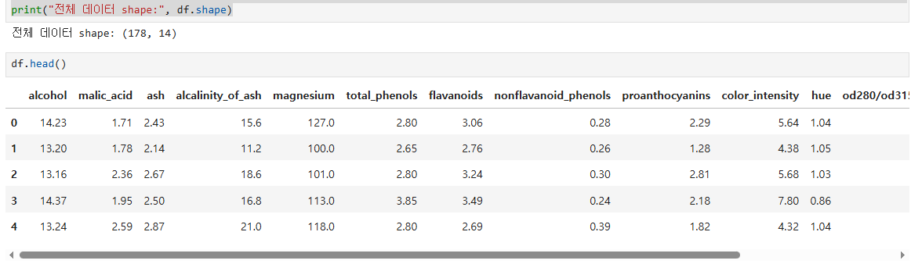
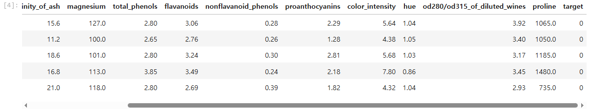

### [3] 학습 데이터 분할
```py
X_train, X_test, y_train, y_test = train_test_split(
    X, y, test_size=0.2, random_state=42, stratify=y
)
```

### [4] 스케일링 
```py
scaler = StandardScaler()
X_train_scaled = scaler.fit_transform(X_train)
X_test_scaled = scaler.transform(X_test)
```

### [5] one-hot 인코딩(클래스별 확률 값에서 가장 큰 값을 1로 치환하고, 나머지는 0으로 치환하여 1의 결과를 반환) 수행 
```py
y_train_cat = to_categorical(y_train)
y_test_cat = to_categorical(y_test)
```

### [6] 모델 정의
```py
model = Sequential()
model.add(Dense(64, activation="relu", input_shape=(X_test_scaled.shape[1],))) # 첫번째 은닉층 생성
model.add(Dropout(0.2)) # 과적합 방지를 위한 드롭아웃 적용
model.add(Dense(32, activation="relu")) # 두번째 은닉층 추가
model.add(Dense(3, activation="softmax")) # 출력층은 클래스 3개, 활성화 함수는 softmax
model.summary()
```
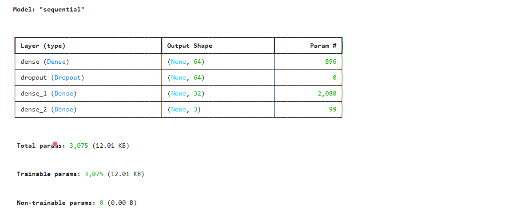

### [7] 모델 컴파일 설정 및 조기 종료 콜백 정의
```py
# 모델 컴파일 설정
model.compile(
    optimizer="adam",
    loss="categorical_crossentropy",
    metrics=["accuracy"]
)

# 조기 종료 콜백 정의
early_stop = EarlyStopping(
    monitor = "val_loss",
    patience=10,
    restore_best_weights=True
)
```

### [8] 모델 학습
```py
history = model.fit(
    X_train_scaled,
    y_train_cat,
    validation_split=0.2,
    epochs=100,
    batch_size=16,
    callbacks=[early_stop],
    verbose=1
)
```
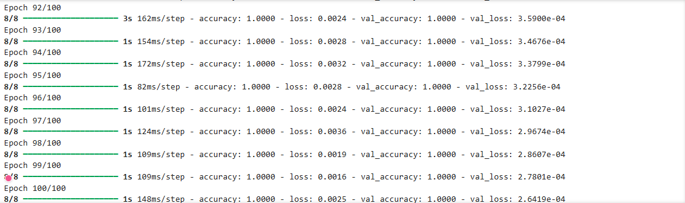

### [9] 학습 Loss 결과 시각화
```py
plt.figure(figsize=(10,4))
plt.plot(history.history["loss"], label="train_loss")
plt.plot(history.history["val_loss"], label="val_loss")
plt.title("Multi_Classification - Loss")
plt.xlabel("epoch")
plt.ylabel("loss")
plt.legend()
plt.grid(True)   # 그래프를 격자로 표시
plt.show()
```
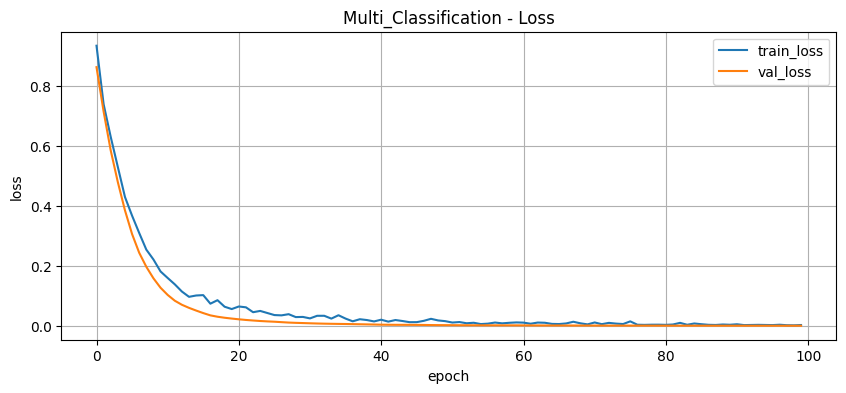

### [9-2] 학습 Accuracy 결과 시각화
```py
plt.figure(figsize=(10,4))
plt.plot(history.history["accuracy"], label="train_accuracy")
plt.plot(history.history["val_accuracy"], label="val_accuracy")
plt.title("Multi_Classification - Accuracy")
plt.xlabel("epoch")
plt.ylabel("accuracy")
plt.legend()
plt.grid(True)   # 그래프를 격자로 표시
plt.show()
```
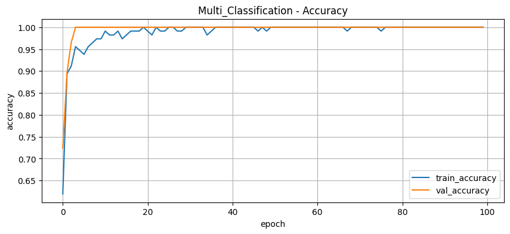

### [10] 모델 평가 (테스트 데이터에 대한 손실과 정확도 평가)
```py
test_loss, test_acc = model.evaluate(X_test_scaled, y_test_cat, verbose=0)

print("테스트 손실: ", test_loss)
print("테스트 정확도: ", test_acc)

# 예측확률
y_prob = model.predict(X_test_scaled)

# 가장 확률이 높은 클래스를 선택
y_pred = np.argmax(y_prob, axis=1)

# 정확도 계산
acc = accuracy_score(y_test, y_pred)

# CM 계산
cm = confusion_matrix(y_test, y_pred)

# 분류 리포트 출력
print("정확도:", acc)
print("confusion matrix: \n", cm)
print("분류 리포트 : \n", classification_report(y_test, y_pred))
```
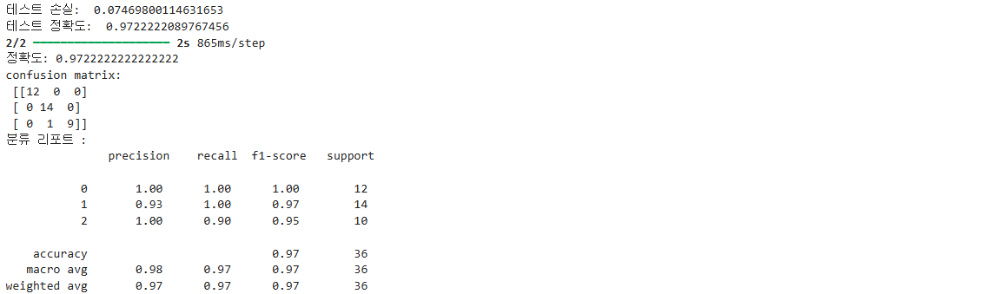

### [11] 학습 결과 저장
```py
# 모델을 파일로 저장
model.save("./results/9-02) multiclass_model.h5")
# 스케일러 저장
joblib.dump(scaler, "./results/9-02) multiclass_model.pkl")
# 학습이력 데이터프레임으로 변환
history_df = pd.DataFrame(history.history)
# 학습이력 저장
history_df.to_csv("./results/9-02) multiclass_model.csv", index=False)
print("저장 완료")
```
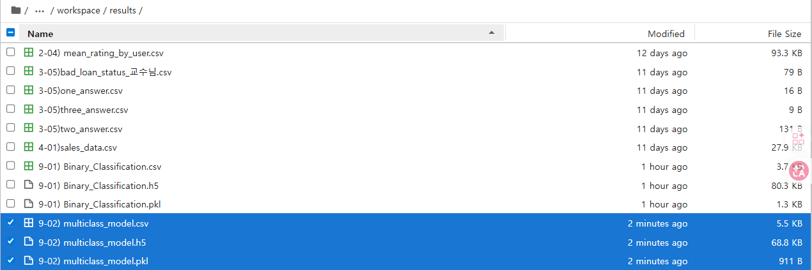

### [11-2] 저장 결과 읽어오기
```py
loaded_model = tf.keras.models.load_model("./results/9-02) multiclass_model.h5")
loaded_scaler = joblib.load("./results/9-02) multiclass_model.pkl")
```
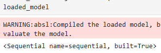
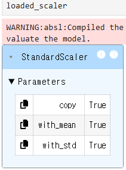

### 신규 데이터 예측 흐름
1. 신규 데이터 5행을 가져옴 (X_test)
   → 모델이 학습에 사용하지 않은 새로운 데이터를 선택
2. 학습 데이터와 스케일을 맞춤
   → 학습할 때 사용한 scaler로 transform 수행
3. 학습 결과 기반으로 신규데이터에 대해 예측 수행
   → model.predict()를 통해 각 클래스에 대한 확률 계산
4. X에 해당하는 클래스별 확률 계산
   → 예: [0.3, 0.1, 0.6] (A 30%, B 10%, C 60%)
5. 가장 높은 확률을 가진 클래스를 최종 결과로 선택
   → np.argmax()로 최대값의 인덱스를 선택

### [12] 신규 데이터 예측 (추론)
```py
new_data = X_test[:5]
new_data_scaled = loaded_scaler.transform(new_data)
new_prob = loaded_model.predict(new_data_scaled)
new_pred = np.argmax(new_prob, axis=1)

# 예측 결과 출력
for i in range(len(new_data)):
    print(f"{i+1}번 샘플 - 예측클래스: {new_pred[i]}, 클래스별 확률: {new_prob[i]}")
```
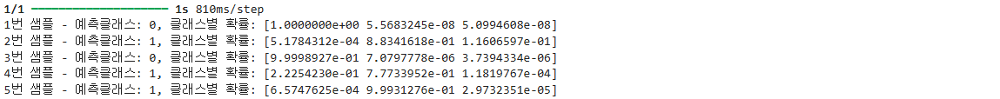

### [13] 결과시각화
```py
plt.figure(figsize=(10,5))
for i in range(len(new_prob)):
    plt.bar(
        np.arange(3) + i*0.3,
        new_prob[i],
        width=0.3,
        label=f"Sample {i}"
    )
plt.xticks([0,1,2], ["Class 0", "Class 1", "Class 2"])
plt.title("new data prediction probabilites")
plt.legend()
plt.show()
```
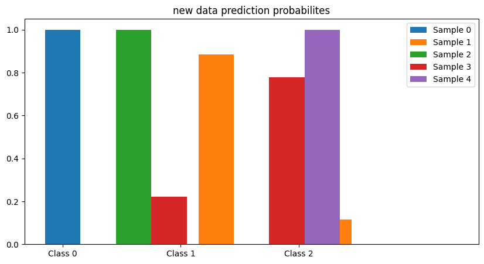

## 3. 의류 이미지 분류 실습 
- 파일 생성: [9-03) 이미지 분류]

### [1] 라이브러리 임포트
```py
import numpy as np
import pandas as pd
import matplotlib.pyplot as plt
from sklearn.model_selection import train_test_split
from sklearn.preprocessing import StandardScaler
from sklearn.metrics import accuracy_score, confusion_matrix, classification_report, roc_auc_score, auc
import joblib
import tensorflow as tf

from tensorflow.keras import Sequential
from tensorflow.keras.layers import Conv2D, MaxPooling2D, Flatten, Dense, Dropout
from tensorflow.keras.callbacks import EarlyStopping
from tensorflow.keras.utils import to_categorical

np.random.seed(42)
tf.random.set_seed(42)
```

### [2] 데이터 가져오기 및 각 의류 클래스 이름 정의
```py
# 데이터 가져오기
(X_train, y_train), (X_test, y_test) = tf.keras.datasets.fashion_mnist.load_data()

# 클래스 이름 정의
class_names = [
    "T-shirt/top", "Trouser", "Pullover", "Dress", "Coat", "Sandal",
    "Shirt", "Sneaker", "Bag", "Ankle boot"
]

print("X_train shape : ", X_train.shape)
print("X_test shape : ", X_test.shape)
```
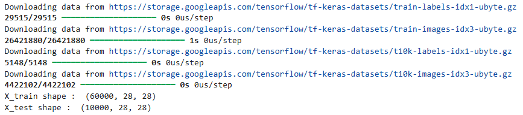

### [3] 데이터 정규화
```py
# 픽셀값 0~1 범위로 정규화
X_train = X_train / 255.0
X_test = X_test / 255.0

# cnn 입력 형태에 맞게 채널 차원을 reshape
X_train = X_train.reshape(-1, 28, 28, 1)
X_test = X_test.reshape(-1, 28, 28, 1)
```

### [4] CNN 모델 정의
```py
# 모델 정의
model = Sequential()   # 순차형 신경망 생성

# 첫번째 합성곱(convolution layer) 층을 추가
# activation="relu" → 음수 값은 0으로, 양수는 그대로 통과시켜 중요한 특징만 남김 (비선형성 추가)
model.add(Conv2D(32, (3,3), activation="relu", input_shape=(28,28,1)))
# 풀링층 추가
# (2,2,) → 마지막 ,는 튜플 문법/스타일일 뿐이며 없어도 동일하게 동작함
model.add(MaxPooling2D((2,2,)))

# 두번째 합성곱(convolution layer) 층을 추가
model.add(Conv2D(64, (3,3), activation="relu"))
# 풀링층 추가
model.add(MaxPooling2D((2,2,)))

# 1차원 벡터로 펼침
model.add(Flatten())
# 완전 연결층 추가
model.add(Dense(128, activation="relu"))
# dropout 추가
model.add(Dropout(0.3))

# 출력층 추가
# activation="softmax" → 출력값을 확률로 변환하여 각 클래스에 속할 확률을 계산하고, 총합이 1이 되도록 정규화함
model.add(Dense(10, activation="softmax"))

model.summary()
```
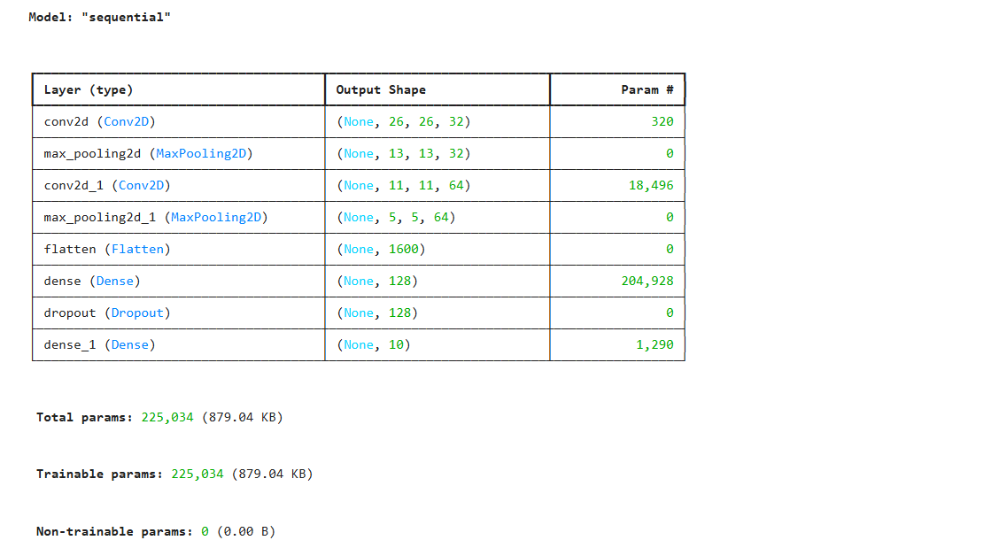

### [5] 모델 컴파일
```py
model.compile(
    optimizer="adam",
    loss="sparse_categorical_crossentropy",
    metrics=["accuracy"]
)

early_stop = EarlyStopping(
    monitor="val_loss",
    patience=5,
    restore_best_weights=True
)
```

### [6] 모델 학습
```py
history = model.fit(
    X_train,
    y_train,
    validation_split=0.2,
    epochs=30,
    batch_size=64,
    callbacks=[early_stop],
    verbose=1
)
```
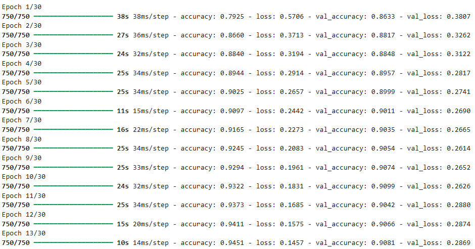

### [7-1] 모델 학습 결과 시각화 - Loss
```py
plt.figure(figsize=(10,4))
plt.plot(history.history["loss"], label="train_loss")
plt.plot(history.history["val_loss"], label="val_loss")
plt.title("CNN - Loss")
plt.xlabel("epoch")
plt.ylabel("loss")
plt.legend()
plt.grid(True)
plt.show()
```
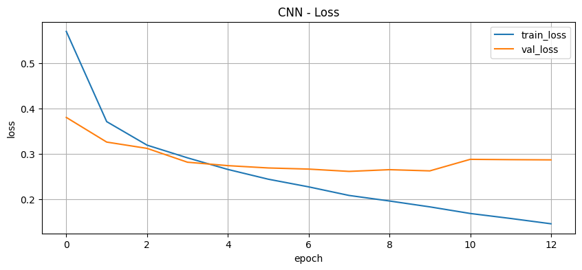

### [7-2] 모델 학습 결과 시각화 - Accuracy
```py
plt.figure(figsize=(10,4))
plt.plot(history.history["accuracy"], label="train_accuracy")
plt.plot(history.history["val_accuracy"], label="val_accuracy")
plt.title("CNN - Accuracy")
plt.xlabel("epoch")
plt.ylabel("accuracy")
plt.legend()
plt.grid(True)
plt.show()
```
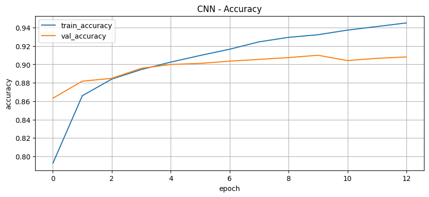

### [8] 모델 성능 평가 (evaluate)
```py
test_loss, test_acc = model.evaluate(X_test, y_test, verbose=0)

print("테스트 손실:", test_loss)
print("테스트 정확도:", test_acc)
```
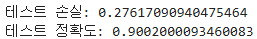

### [9] 예측 확률 계산 (predict -> argmax)
```py
# 테스트 데이터 예측 확률 계산
y_prob = model.predict(X_test)

# 최종 예측 클래스 계산
y_pred = np.argmax(y_prob, axis=1)
```

### [10] 학습 결과 저장 및 읽어오기
```py
# 학습 결과 저장
model.save("./results/9-03) cnn_fashion_mnist.h5")
# 읽어오기
loaded_model = tf.keras.models.load_model("./results/9-03) cnn_fashion_mnist.h5")
```
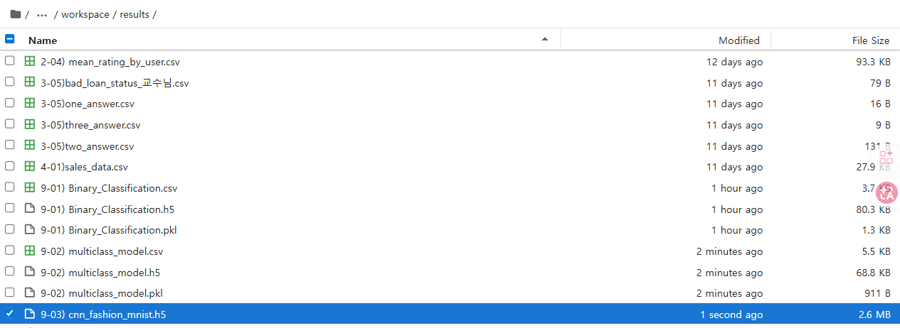

### [11] 신규 데이터 예측/분류
```py
# 신규 데이터 예측/분류
new_images = X_test[:5]

# 신규 이미지 예측
new_prob = loaded_model.predict(new_images)

# 최종 클래스 예측값 계산
new_pred = np.argmax(new_prob, axis=1)

# 예측결과 출력
for i in range(len(new_images)):
    print(f"{i+1}번 이미지 - 예측클래스: {new_pred[i]} ({class_names[new_pred[i]]})")
```
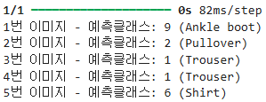

### [11-1] 예측 결과 시각화 (테스트 이미지 10개와 예측 결과 시각화)
```py
plt.figure(figsize=(12,6))
for i in range(10):
    plt.subplot(2, 5, i+1)
    plt.imshow(X_test[i].reshape(28,28), cmap="gray")
    plt.title(f"P: {class_names[y_pred[i]]} \n T: {class_names[y_test[i]]}")

plt.tight_layout()
plt.show()
```
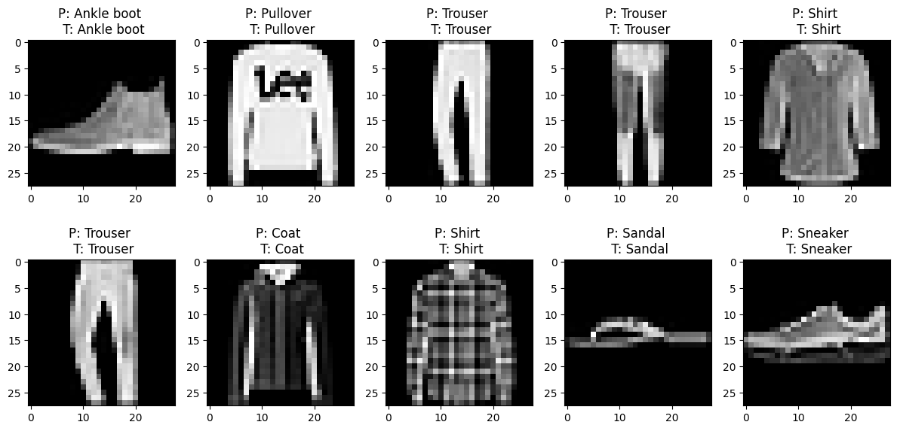

### [11-2] 신규 이미지 5개에 대한 확률 분포 시각화
```py
plt.figure(figsize=(12,6))
for i in range(5):
    plt.subplot(1,5,i+1)
    plt.bar(range(10), new_prob[i])
    plt.title(f"Sample {i+1}")
    plt.xticks(range(10), rotation=90)

plt.tight_layout()
plt.show()
```
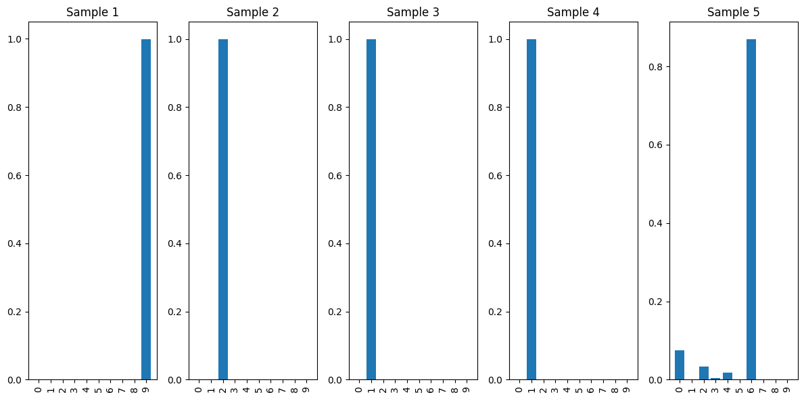

## 4. CIFAR10 이미지 분류
- 파일 생성: [9-04) CIFAR10 이미지 분류]

### [1] 라이브러리 임포트 및 한글 폰트 설정
```py
import numpy as np
import pandas as pd
import matplotlib.pyplot as plt
from sklearn.model_selection import train_test_split
from sklearn.preprocessing import StandardScaler
from sklearn.metrics import accuracy_score, confusion_matrix, classification_report, roc_auc_score, auc
import joblib
import tensorflow as tf

from tensorflow.keras import layers, models

from tensorflow.keras import Sequential
from tensorflow.keras.layers import Conv2D, MaxPooling2D, Flatten, Dense, Dropout
from tensorflow.keras.callbacks import EarlyStopping
from tensorflow.keras.utils import to_categorical

# 그래프 한글 폰트 설정
from matplotlib import font_manager, rc
plt.rcParams["font.family"] = "Malgun Gothic"          # 한글 폰트 지정
plt.rcParams["axes.unicode_minus"] = False             # 마이너스 부호 깨짐 방지

np.random.seed(42)
tf.random.set_seed(42)
```

### [2] 데이터 가져오기 (32x32 이미지 크기) -> 채널 차원 reshape
```py
# 데이터 가져오기 (32x32 이미지 크기)
(X_train, y_train), (X_test, y_test) = tf.keras.datasets.cifar10.load_data()

# cnn 입력 형태에 맞게 채널 차원을 reshape
y_train = y_train.reshape(-1)
y_test = y_test.reshape(-1)
```

### [3] 픽셀값 0~1 범위로 정규화
```py
X_train = X_train / 255.0
X_test = X_test / 255.0
```

### [4] CIFAR10 이미지 분류 클래스 정의
```py
class_names = ["Airplane", "Automobile", "Bird", "Cat", "Deer", "Dog",
               "Frog", "Horse", "Ship", "Truck"]
```

### [5] [중요] CNN 모델 정의 (3레이어+Fully레이어+출력층)
```py
model = models.Sequential([
    # 첫번쨰 CNN Layer
    layers.Conv2D(32, (3,3), padding="same", input_shape=(32,32,3)), # 컬러 이미지 입력
    layers.BatchNormalization(), # 학습 안정화 및 수행속도 향상
    layers.Activation("relu"),
    layers.MaxPooling2D(2,2), # 특징 추출해서 크기를 감소
    layers.Dropout(0.5),

    # 두번째 CNN Layer
    layers.Conv2D(64, (3,3), padding="same"),
    layers.BatchNormalization(),
    layers.Activation("relu"),
    layers.MaxPooling2D(2,2),
    layers.Dropout(0.5),
    
    # 세번째 CNN Layer
    layers.Conv2D(128, (3,3), padding="same"),
    layers.BatchNormalization(),
    layers.Activation("relu"),
    layers.MaxPooling2D(2,2),

    # Fully Connected Layer
    layers.Flatten(), # 2D --> 1D 벡터로 변환
    layers.Dense(256), # 256개의 뉴런으로 학습
    layers.BatchNormalization(),
    layers.Activation("relu"),
    layers.Dropout(0.5),

    # 출력층
    layers.Dense(10, activation="softmax") # 10개 클래스에 대한 확률 출력
])

model.summary()
```
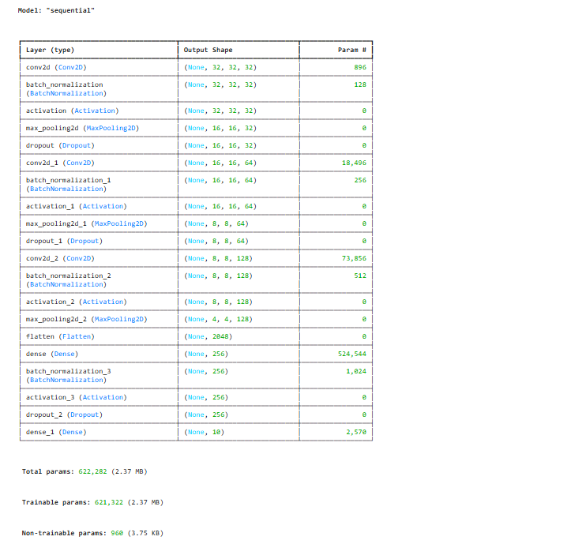

### [6] CNN 모델 컴파일
```py
# 모델 컴파일
model.compile(
    optimizer="adam",
    loss="sparse_categorical_crossentropy",
    metrics=["accuracy"]
)
```

### [7] CNN 모델 학습
```py
# 모델 학습
history = model.fit(
    X_train,
    y_train,
    validation_split=0.2,
    epochs=20,
    batch_size=64,
    verbose=1
)
```
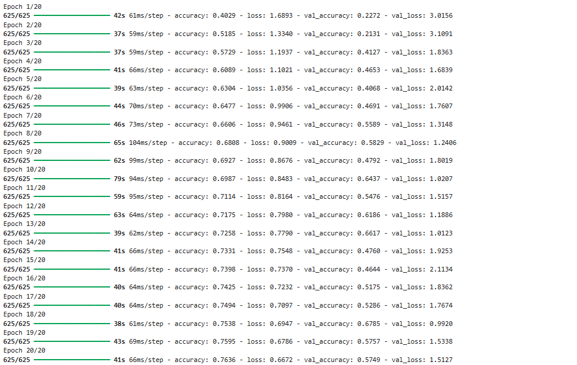

### [8] CNN 결과 시각화 (Loss, Accuracy)
```py
plt.figure(figsize=(10,4))
plt.plot(history.history["loss"], label="train_loss")
plt.plot(history.history["val_loss"], label="val_loss")
plt.title("CNN - Loss")
plt.xlabel("epoch")
plt.ylabel("loss")
plt.legend()
plt.grid(True)
plt.show()

plt.figure(figsize=(10,4))
plt.plot(history.history["accuracy"], label="train_accuracy")
plt.plot(history.history["val_accuracy"], label="val_accuracy")
plt.title("CNN - Accuracy")
plt.xlabel("epoch")
plt.ylabel("accuracy")
plt.legend()
plt.grid(True)
plt.show()
```
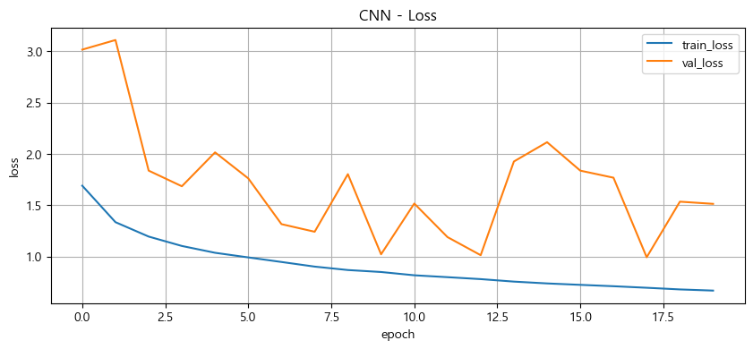
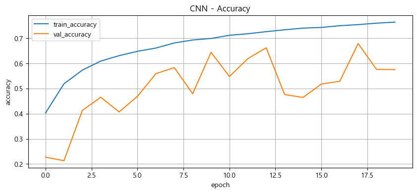

### [9] 예측 확률 계산
```py
# 테스트 데이터 예측 확률 계산
y_prob = model.predict(X_test)
# 최종 예측 클래스 계산
y_pred = np.argmax(y_prob, axis=1)
```
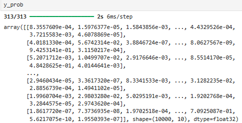
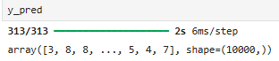
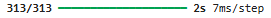

### [10] 10개 이미지 예측 시각화
```py
plt.figure(figsize=(12, 6))
for i in range(10):
    plt.subplot(2,5,i+1)
    plt.imshow(X_test[i])
    plt.title(f"정답: {class_names[y_test[i]]}\n예측: {class_names[y_pred[i]]}")
    plt.axis("off")
plt.suptitle("CIFAR-10 예측 결과", fontsize=16)
plt.tight_layout()
plt.show()
```
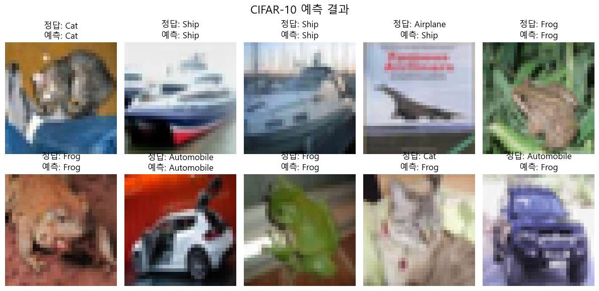
- 10개 중 7개를 맞췄다.

### [11] 개별 이미지 클래스별 예측 확률 시각화
```py
plt.figure(figsize=(10, 4))
plt.bar(range(10), y_prob[0])
plt.xticks(range(10), class_names, rotation=45)
plt.xlabel("클래스명")
plt.ylabel("예측 확률")
plt.title("첫 번째 이미지 예측 확률 분포")
plt.show()
```
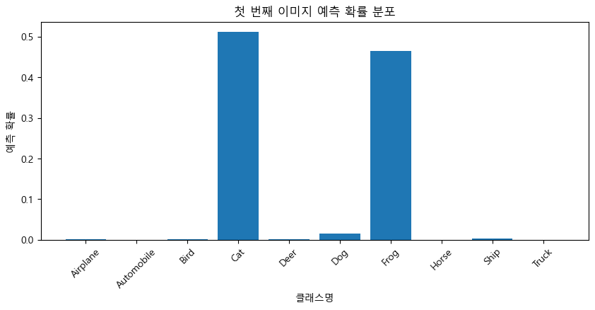

## 5. 결함 사전 이상탐지 모델 실습
- 파일 생성: [9-05) 결함 사전 이상탐지 모델 실습]

### [1] 라이브러리 임포트
```py
import numpy as np
import pandas as pd
import matplotlib.pyplot as plt
from sklearn.model_selection import train_test_split
from sklearn.preprocessing import StandardScaler
from sklearn.metrics import accuracy_score, confusion_matrix, classification_report, roc_auc_score, auc, roc_curve
import joblib
import tensorflow as tf
from tensorflow.keras import layers, models

np.random.seed(42)
tf.random.set_seed(42)
```

### [1] 가상 센서 데이터 생성 (정상, 이상 // numpy)
```py
# 가상 센서 데이터 생성
n_normal = 5000     # 정상데이터 샘플 수
n_anomaly = 500     # 이상 데이터 샘플 수
n_features = 4      # 센서 개수

# 정상 데이터 : 평균 0, 표준편차 1인 정규분포 내에서 값을 생성
normal_data = np.random.normal(loc=0.0, scale=1.0, size=(n_normal, n_features))

# 이상 데이터 : 평균을 크게 이동시키고, 분산을 키워서 비정상적인 패턴의 센서 데이터 생성
anomaly_data = np.random.normal(loc=3.0, scale=1.5, size=(n_anomaly, n_features))

# 정상과 이상 데이터를 위아래로 이어 붙임
X = np.vstack([normal_data, anomaly_data])

# 정상은 0, 이상은 1로 레이블 벡터를 만듬
y = np.hstack([np.zeros(n_normal), np.ones(n_anomaly)])
```
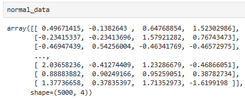
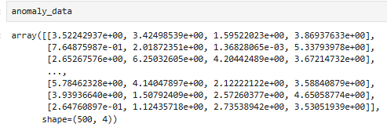
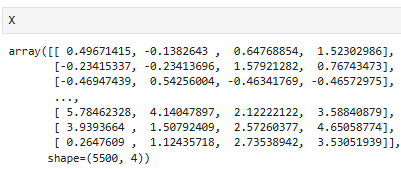
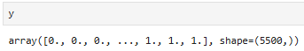

### [2] 학습/테스트 데이터 분리 및 정상 샘플 필터링
```py
# 학습/테스트 데이터 분리
X_train, X_test, y_train, y_test = train_test_split(
    X, y, test_size=0.3, random_state=42, stratify=y
)

# autoencoder는 정상 데이터로만 학습하므로 정상 샘플만 필터링
X_train_normal = X_train[y_train == 0]
```

### [3] 데이터 스케일링 진행
```py
# 데이터 스케일링
scaler = StandardScaler()
scaler.fit(X_train_normal)

X_train_normal_scaled = scaler.transform(X_train_normal)
X_test_scaled = scaler.transform(X_test)
```

### [4] [중요] AUTO ENCODER 모델 정의
- 인코더 레이어: 입력을 작은 차원으로 압축하는 레이어
- 디코더 레이어: 압축된 표현을 다시 원래 차원으로 복원하는 레이어
```py
# AUTO ENCODER 모델 정의
input_dim = n_features # 입력 차원은 센서 개수와 동일하게 설정
encoding_dim = 2 # 잠재공간(latent space) 2차원으로 설정해서 압축 진행

# 입력 레이어 정의 (입력 크기는 센서 개수와 동일하게)
input_layer = layers.Input(shape=(input_dim,), name="input")

# 인코더 부분 (입력을 작은 차원으로 압축하는 레이어)
# 8개의 뉴런으로 첫번째 레이어를 구성
encoded = layers.Dense(8, activation="relu", name="encoder_dense1")(input_layer)
# 2차원 잠재 표현으로 압축
encoded = layers.Dense(encoding_dim, activation="relu", name="encoder_dense2")(encoded)

# 디코더 부분 (압축된 표현을 다시 원래 차원으로 복원하는 레이어)
# 8개의 뉴런으로 복원을 하는 중간 레이어
decoded = layers.Dense(8, activation="relu", name="decoder_dense1")(encoded)
# 원래 입력 차원으로 복원 출력
decoded = layers.Dense(input_dim, activation="linear", name="decoder_output")(decoded)
# 입력부터 출력까지를 연결해주는 autoencoder 모델 구성
autoencoder = models.Model(inputs=input_layer, outputs=decoded, name="autoencoder_model1")

autoencoder.summary()
```
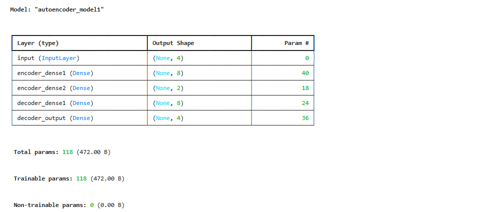

### [5] autoencoder 모델 컴파일 설정
```py
autoencoder.compile(
    optimizer="adam", # 학습 최적화 알고리즘 adam 사용
    loss="mse" # 입력과 복원된 출력의 차이를 제곱 오차로 계산
)
```

### [] 
```py
```

### [] 
```py
```

### [] 
```py
```

### [] 
```py
```

### [] 
```py
```

### [] 
```py
```

### [] 
```py
```

### [] 
```py
```

### [] 
```py
```