# 11일차 - 6/10(수)
- 회의 참석: https://whaleon.us/o/CSvuJa/64dffed07c6741c990f69804e3b62d6e
- 오늘은 CNN층 + LSTM층? + self attention 층으로 섞어서 multi tasking 으로 수업 한다고 예정되어 있음

# 딥러닝 응용 실습
## 1. [중요] AI 사운드 분석 실습
- 시그널 프로세싱 까지 실습 진행할 예정이다.

### 실습 목표
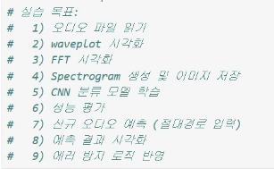
### [설명] AI 사운드 분석에 관하여
#### 소리에 관하여
- 소리가 크고 작은것은 내가 보고자 하는 소음을 잡을순 없다. 데시벨 데이터 가지고는 뽑아낼 수가 없다. 왜냐면 항상 외부 노이트가 껴있기 때문이다. == 외부 노이즈에 의해 데시벨이 커지기도 하고 작아지기 때문
- 뽑아내는 법: 주파수 데이터 형식으로 변환해야 한다. FFT
- 헤르츠 단위로 소음이 나타난다.
- 소리 -> FFT 변환 -> 스펙트로그램을 뽑음 -> AI 모델에 활용
#### 순서
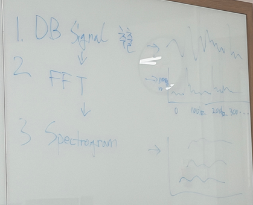
1. DB Signal 추출
2. FFT로 변환 --> 그러면 주파수 형태의 피크값을 뽑아낼 수가 있게 된다.
3. Spectrogram 으로 변환해서 그 피크 특징의 어떤 형상인지 shape을 뽑아낼 수 있다. (물결 모양, 하모닉하게 나타남)
- 아래와 같이 작업 예정
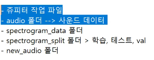

### [0-1] 학습에 사용할 audio 파일 가져오기
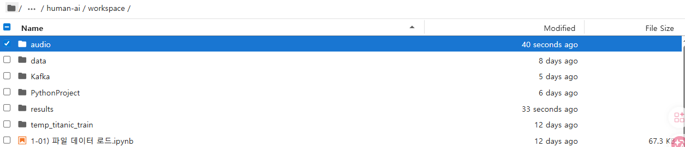
- 깃에 audio.gip 파일 올려놨다.
    - https://github.com/ilovejwoo1004-bit/AI_advanced/blob/main/audio.zip
    - 이 사운드를 가지고 분석할 것이다.
    - 워크스페이스에 audio를 그대로 풀어준다.
    - 6개의 악기 음악 사운드가 들어있다. (mp3 파일)
        - 첼로 100개, 플룻 100개, ... (총 6개 악기)
        - 각 파일은 1.5~2초
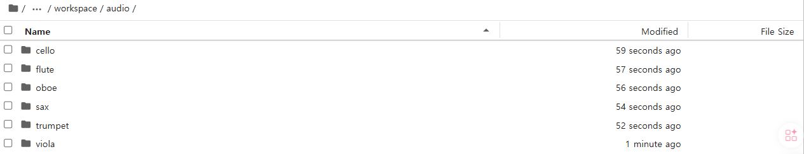

### [0-2] 아나콘다 프롬프트에서 librosa 설치
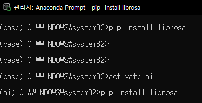
- `pip install librosa`
    - 이걸 설치해야 스펙트로그램으로 나타낼 수 있다.

### [0-3] 파일 생성: [10-1) AI Sound Classiier 실습_01]
- Jupyter Notbook에서 workspace 폴더 내에 생성함.

### [1] 라이브러리 임포트
```py
# ====================================
# 1. 라이브러리 import
# ====================================
import os
import glob
import random
import shutil # 폴더 삭제, 생성 등 파일시스템 작업에 사용

# 데이터 처리 및 시각화 라이브러리
import numpy as np
import pandas as pd
import matplotlib.pyplot as plt
import seaborn as sns

# 오디오 라이브러리
import librosa # 오디오 로딩
import librosa.display

# 이미지 처리 라이브러리
from PIL import Image

# 분석 라이브러리
from sklearn.metrics import classification_report, confusion_matrix
import tensorflow as tf
from tensorflow.keras import layers, models
from tensorflow.keras.preprocessing.image import ImageDataGenerator
from tensorflow.keras.callbacks import EarlyStopping, ModelCheckpoint

import warnings
warnings.filterwarnings('ignore')

%matplotlib inline

SEED = 42
random.seed(SEED)
np.random.seed(SEED)
tf.random.set_seed(SEED)
```

### [2] 기본 경로 및 전역 하이퍼 파라미터 설정
```py
BASE_DIR = os.getcwd() # root 디렉토리 설정 (workspace)
AUDIO_DIR = os.path.join(BASE_DIR, "audio") # 오디오 파일이 저장된 루트 폴더 지정
SPEC_DIR = os.path.join(BASE_DIR, "spectrogram_data") # 스펙트로그램으로 변환한 이미지 저장할 폴더 지정
SPLIT_DIR = os.path.join(BASE_DIR, "spectrogram_split") # 학습 데이터가 저장될 폴더 지정 (ai 학습용으로 train/test/val 구조로 저장할 예정)

# 최종 학습 모델 결과를 저장할 경로 및 파일명 지정
BEST_MODEL_PATH = os.path.join(BASE_DIR, "results/best_instrument_cnn_model.keras") 
#신규 예측 시 임시로 스펙트로그램 이미지를 저장할 경로 및 파일명 지정
TEMP_PREDICT_IMAGE_PATH = os.path.join(BASE_DIR, "temp_predict_spectrogram.png") 

# 분류할 클래스는 6개 (폴더명과 일치하도록 정의하기)
CLASSES = ['cello','flute','sax','oboe','trumpet','viola']

# CNN 입력 이미지 높이
IMG_HEIGHT = 224
# CNN 입력 이미지 너비
IMG_WIDTH = 224

# Signal processing 파라미터 설정 (전문가 영역/깊게 알기 전 감잡기)
# [아래 영역은 오디오 상태에 따라 최적값을 직접 잡아 주어야 한다.]
SR = 44100 # 오디오 샘플링 주파수
DURATION = 1.5 # 오디오 길이 (초단위)
SAMPLES_PER_TRACK = SR*DURATION # 1개 오디오 샘플당 기대되는 총 샘플 수
N_FFT = 2048 # 멜 스펙트로그램 생성 시 사용할 FFT 윈도우 길이 (시그널 데이터도 시계열 형식으로 들어올때 윈도우 구간으로 잘라서 분석한다. 얼마나 자를지 지정한 것이다.)
HOP_LENGTH = 1024 # 프레임 간 HOP 크기 (값이 작을수록 시간 해상도 증가)
N_MELS = 126 # MEL Filter bank (너무 작으면 정보 깨지고, 너무 크면 이미지 복잡해짐)

BATCH_SIZE = 16 # 학습 미니배치 크기
EPOCHS = 20 # 반복 학습 수
```
- 시그널 프로세싱을 위해 전역적으로 경로와 하이퍼 파라미터를 잡아준다.


### [3] 유효성 검사 및 공통 유틸리티 함수들 구현
```py
# 지정한 디렉토리가 존재하지 않으면 생성하는 함수
def ensure_directory_exists(dir_path):
    os.makedirs(dir_path, exist_ok== True)

# audio 폴더와 클래스 별 하위 폴더가 존재하는지 확인하는 함수
def validate_audio_directory_structure(audio_dir, classes):
    if not os.path.exists(audio_dir):
        raise FileNotFoundError(f"[오류] audio 루트 폴더를 찾을 수 없습니다: {audio_dir}")

    for cls in classes:
        class_dir = os.path.join(audio_dir, cls)
        if not os.path.exists(class_dir):
            raise FileNotFoundError(f"[오류] 클래스 폴더가 없습니다: {class_dir}")

# 클래스 별 오디오 파일 개수를 집계하여 dict 형태로 변환하는 함수
def count_audio_files(audio_dir, classes, extention="*.mp3"):
    counts = {}
    for cls in classes:
        pattern = os.path.join(audio_dir, cls, extention)
        counts[cls] = len(glob.glob(pattern))
    return counts

# 각 클래스에 최소 개수 이상의 파일이 존재하는지 검증
def validate_minimum_files_per_class(file_counts, minimum_count=3):
    for cls, count in file_counts.items():
        if clunt < minimum_count:
            raise ValueError(
                f"[오류] 클래스 '{cls}'의 파일 수가 너무 적습니다."
                f"최소 {minimum_count}개 이상 필요하지만 현재 {count}개 입니다."
                
            )

# 파일 또는 디렉토리가 존재할 때만 삭제
def safe_remove_path(path): 
    if os.path.isdir(path):
        shutil.rmtree(path)
    elif os.path.isfile(path):
        os.remove(path)

# 섹션 구분이 명확하게 보이도록 제목 출력
def print_section_title(title):
    print("\n"+("="*60))
    print(title)
    print("="*60)
```
- 데이터를 읽어오고 처리하는 데 위와 같이 유효성 검사 로직을 추가하였다.

### [4] 위 함수들을 활용하여 데이터 폴더 구조 및 파일 개수 확인
```py
# audio 폴더와 클래스별 하위 폴더가 실제로 존재하는지 검증
validate_audio_directory_structure(AUDIO_DIR, CLASSES)

# 클래스 별 MP3 개수 집계
file_counts = count_audio_files(AUDIO_DIR, CLASSES, extention='*.mp3')

# 각 클래스가 최소한의 샘플 수를 갖는지 확인
validate_minimum_files_per_class(file_counts, minimum_count=3)

# 집계 결과를 판다스의 데이터 프레임으로 변환
file_count_df = pd.DataFrame(list(file_counts.items()), columns=["Class","Count"])

# 현재 데이터 구성 상황을 출력
print_section_title("데이터 폴더 및 파일 개수 확인")
print("원본 오디오 루트 경로:", AUDIO_DIR)
print("스펙트로그램 저장 경로:", SPEC_DIR)
print("분할 데이터 저장 경로:", SPLIT_DIR)
print(file_count_df)

# 클래스별 데이터 불균형 여부를 matplotlib과 seaborn으로 시각화하여 확인
plt.figure(figsize=(8,4))
sns.barplot(data=file_count_df, x="Class", y="Count")
plt.title("Number of Audio Files Per Instrument Class")
plt.xlabel("Instrument Class")
plt.ylabel("Number of MP3 Files")
plt.xticks(rotation=30)
plt.tight_layout()
plt.show()
```
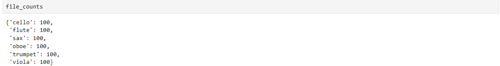
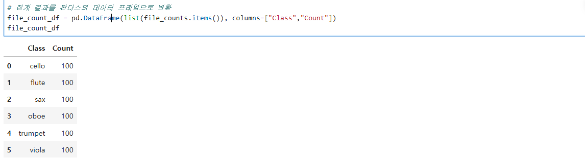
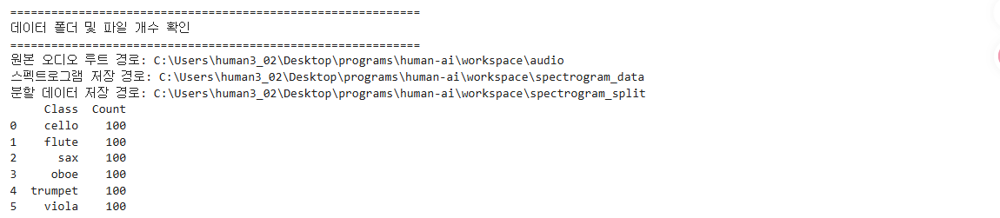
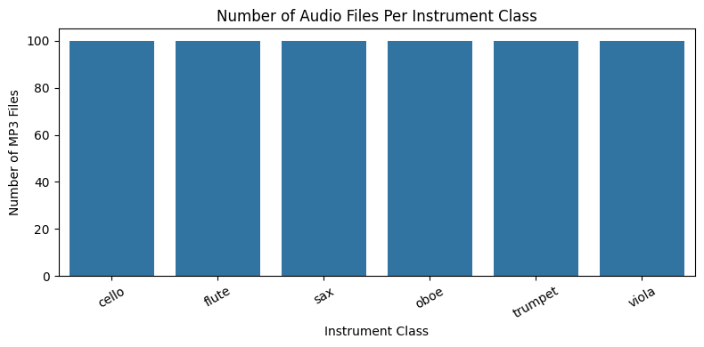
- 클래스에 데이터 인발란스 문제가 있으면 안된다. (나중에 예측결과에 영향을 미치므로 이처럼 균등하게 맞춰 주는게 좋다.)
- 첼로가 제일 많으면 첼로가 예측될 확률이 높다. 그게 데이터 인발란스 문제이다. 데이터가 균형있게 학습 되어야 한다.

### [5] 오디오 로드 함수 정의
- 오디오 파일을 모노 신호로 읽고, 지정 길이로 고정하는 함수 구현
    1. 모델 입력 일관성을 위해 모든 오디오 길이를 동일하게 맞춘다.
    2. 너무 짧은 파일은 zero-padding 한다.
    3. 너무 긴 파일은 앞부분을 사용한다.
```py
# 오디오 파일을 모노 신호로 읽고, 지정 길이로 고정하는 함수
def load_audio_file(file_path, sr=SR, duration=DURATION):
    # 입력 경로가 문자열인지 확인
    if not isinstance(file_path, str):
        raise TypeError(f"[오류] file_path는 문자열이어야 합니다. 현재 타입: {type(file_path)}")

    # 실제 파일 존재여부 확인
    if not os.path.exists(file_path):
        raise FileNotFoundError(f"[오류] 오디오 파일이 존재하지 않습니다: {file_path}")

    # 파일 확장자 확인
    valid_exts = [".mp3",".wav",".flac",".ogg",".m4a"]
    ext.os.path.splitext(file_path)[1].lower()
    if ext not in valid_exts:
        raise ValueError(f"[오류] 지원하지 않는 오디오 확장자입니다: {ext}")

    try:
        y, sr = librosa.load(file_path, sr=sr, mono=True)
    except Exception as e:
        raise RuntimeError(f"[오류] 오디오 로드 실패: {file_path}\n원인: {e}")

    # 비어있는 배열이 들어오면 이후 FFT/STFT에서 실패하므로 사전 차단
    if y is None or len(y) == 0:
        raise ValueError(f"[오류] 오디오 데이터가 비어 있습니다: {file_path}")

    # 목표 샘플 길이 계산
    target_length = int(sr*duration)
    if len(y) < target_length:
        # 길이가 짧으면 뒤를 0으로 패딩하여 고정 길이를 맞춤
        pad_width = target_length-len(y)
        y = np.pad(y, (0, pad_width), mode="constant")
    else: 
        # 길이가 길면 앞부분만 사용
        y = y[:target_length]

    return y, sr
```
- 오디오를 읽어오기 위한 처리는 다 했다. 이제 오디오를 읽어와서 분석을 진행할 것이다.

### [6] 샘플 오디오 파일 1개 선택 및 해당 클래스(파일) 기본 분석
```py
# 데이터 시각화 예제로 사용할 첫 번째 샘플 분석
sample_file = None
sample_class = None
for cls in CLASSES:
    pattern = os.path.join(AUDIO_DIR, cls, "*.mp3")
    files = glob.glob(pattern)
    if len(files)>0:
        sample_file = files[0]
        sample_class = cls
        break

# 샘플 파일을 하나도 찾지 못한 경우 즉시 에러 발생
if sample_file is None:
    raise FileNotFoundError("[오류] 샘플로 사용할 mp3 파일을 찾지 못했습니다.")

# 샘플 파일 로드
y_sample, sr_sample = load_audio_file(sample_file)

# 샘플 파일 정보 출력
print("샘플 클래스: ", sample_class)
print("샘플 파일: ", sample_file)
print("샘플링 주파수: ", sr_sample)
print("총 샘플 수: ", len(y_sample))
print("총 길이(초): ", len(y_sample)/sr_sample)
```


### [7] 샘플 오디오(첼로) waveplot 시각화
```py
# wave 파형은 시간축에서 신호 진폭이 어떻게 변하는지 보여줌 (dB)
plt.figure(figsize=(14,4))
librosa.display.waveshow(y_sample, sr=sr_sample)
plt.title(f"Waveform - {sample_class}")
plt.xlabel("Time (seconds)")
plt.ylabel("Amplitude")
plt.tight_layout()
plt.show()
```
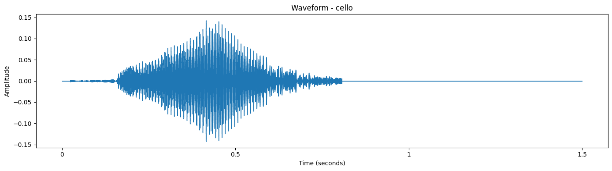
- amplitude: 소리의 크기
- 이것만 가지고는 소리의 특징을 분석할 수 없다.
- 이것 웨이브폼 데이터 기반으로 테스트머시기로 변환한 다음 주파수로 변환한다. 그후 어떤 주파수 성분이 강한지 확인한다.

### [8] 샘플 오디오(첼로) FFT 시각화 (주파수 데이터로 변환/numpy)
- FFT: 시간영역 신호를 주파수 영역으로 변환하여 어떤 주파수 성분이 강한지 확인
```py
# FFT: 시간영역 신호를 주파수 영역으로 변환하여 어떤 주파수 성분이 강한지 확인
fft_sample = np.fft.fft(y_sample)
# magnitude = 복소수 프리에 계수의 절대값을 취해서 magnitude spectrum을 계산
magnitude_sample = np.abs(fft_sample)
# freqs_sample = 각 인덱스가 실제 어떤 주파수에 대응하는지 계산
freqs_sample = np.fft.fftfreq(len(magnitude_sample), d=1/sr_sample)
# 실수 신호 fft가 음수 주파수 구간이 대칭이므로 양수 영역만 사용
positive_freqs_sample = freqs_sample[:len(freqs_sample)//2]
positive_magnitude_sample = magnitude_sample[:len(magnitude_sample)//2]

plt.figure(figsize=(14,4))
plt.plot(positive_freqs_sample, positive_magnitude_sample)
plt.title(f"FFT Spectrum - {sample_class}")
plt.xlabel("Frequency (Hz)")
plt.ylabel("Magnitude")
plt.xlim(0,8000)
plt.tight_layout()
plt.show()
```
- magnitude: 복소수 프리에 계수의 절대값을 취해서 magnitude spectrum을 계산
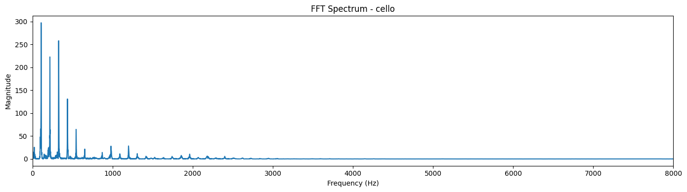
- 소리의 크기(wave plot) 데이터를 가지고 주파수 데이터로 만들었다.
- x축: 헤르츠, y축: 크기
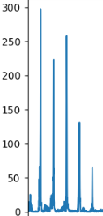
- 이와같이 5개 튀는 게 첼로 특징인 것이다. 200Hz, 300Hz 등에서 강한 특징이 나타나고 있는 것이다.
- 첼로의 주파수 대역은 100Hz, 200Hz, 300Hz 정도이구나
- 또 100Hz 정도로 하모닉하게 특징이 나타나네 정도로 해석할 수 있다. (첼로의 주파수 특징) // 주파수의 피크를 확인한 것이다.
- 이것을 학습 데이터로 변환하기 위해, 이런 특징들을 스펙트로그램 이미지로 확인하면 어떤 모양으로 나오는지(물결) 쉐잎을 확인할 수 있다. 그게 스펙트로그램이다.

### STFT: 짧은 시간 구간 별로 FFT를 수행하여 시간-주파수 2차원으로 시그널 표현

### [9] 샘플 오디오(첼로) STFT Spectrogram 시각화 (librosa,matplotlib)
```py
# 짧은 시간 구간 별로 FFT를 수행하여 시간-주파수 2차원으로 시그널 표현 샘플
stft_sample = librosa.stft(y_sample, n_fft=N_FFT, hop_length=HOP_LENGTH)
# 복소수 stft 결과의 절대값을 취하여 magnitude spectrogram 생성
spectrogram_sample = np.abs(stft_sample)
# 사람의 청각 및 신호 에너지 해석에 유리하도록 dB 스케일로 변환
spectrogram_db_sample = librosa.amplitude_to_db(spectrogram_sample, ref=np.max)

# 로그 주파수 축 Spectrogram 그리기
plt.figure(figsize=(8,5))
librosa.display.specshow(
    spectrogram_db_sample,
    sr=sr_sample,
    hop_length=HOP_LENGTH,
    x_axis='time',
    y_axis='log',
    cmap="magma"
)
plt.colorbar(format="%+2.0f dB")
plt.title(f"Spectrogram - cello")
plt.tight_layout()
plt.show()
```
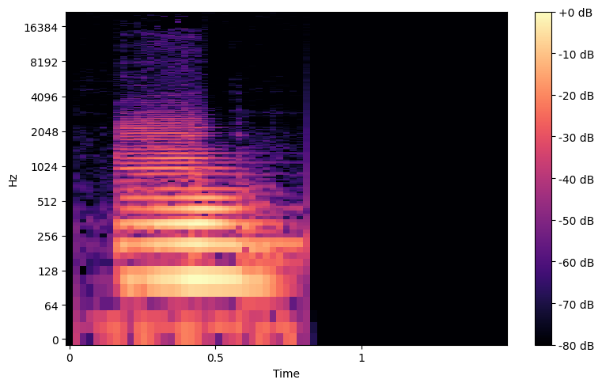
- 처음에 세팅했던 값들을 읽어와서 시그널 프로세싱을 했다.
- N_FFT를 2048->4096으로 변경시 이렇게 바뀐다: 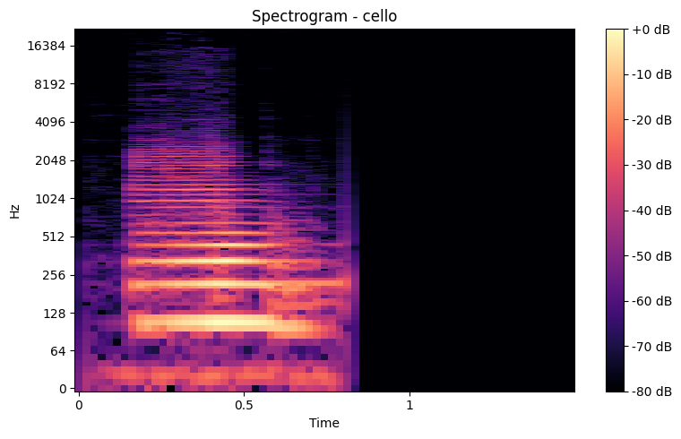
- 현재는 좀 튜닝이 필요해 보인다.
- HOP_LENGTH를 1024->512로 변경하면 이렇게 바뀐다: 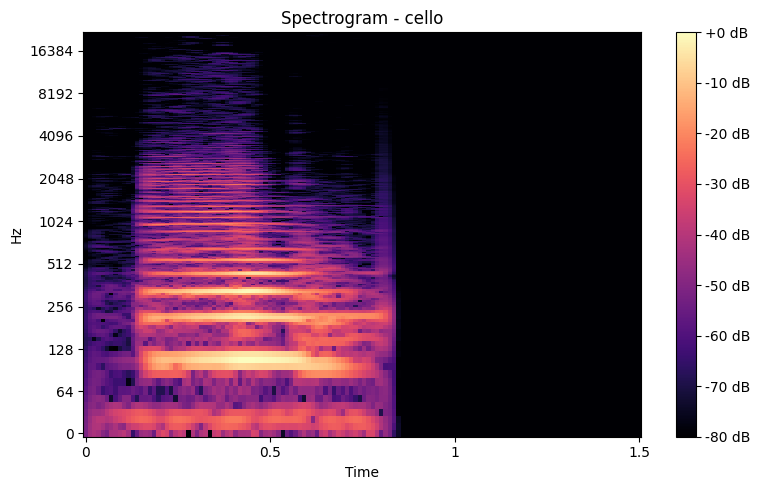
- 이처럼 줄이 하모닉하게 나타나는 것이 첼로의 특징인 것이다.
- 이게 첼로의 피쳐인 것이다.
- 지금까지 AI 분석을 위해 피쳐 엔지니어링(피쳐 추출)을 한 것이다.
- 이제 이것을 이미지로 변환해서 학습 데이터로 만들 것이다 -> 그 후 분석 진행
- 숫자 데이터 FFT -> 스펙트로그램 -> 이미지 -> 이미지 분류모델을 사용.
- 지금까지 사운드 데이터 피쳐 추출하는 분석을 진행했다.
- 모든 사운드에 대해서 이처럼 변환한 최종 결과를 모든 사운드에 대해서 이미지로 변환후 저장할 것이다.
- 이 결과를 더 선명하게 표현하려면 파라미터들을 튜닝하면 된다.

#### [중요] 이처럼 AI는 이미지 모델이 성능 정확도가 잘 나오기 때문에, 숫자 데이터여도 이미지 모델을 활용하여 학습 시키는 경우가 많이 있다.

### [10] [중요] 모든 오디오 파일에 대해 Spectrogram 이미지 저장 함수 구현 (matplotlib,librosa)
- [중요] 메모리 정리를 위해 figure를 닫는다 (`plt.close(fig)`)
- 이미지 하나 만들 때마다 figure를 만드는데 만들 때마다 만들고 close를 안하면 메모리가 쌓여서 실행이 안 될 것이다. (안하면 엄청 과부화 생김)
```py
# 모든 오디오 파일에 대해 Spectrogram 이미지를 저장하는 함수
def save_spectrogram_image(audio_path, save_path, sr=SR, duration=DURATION):
    # 저장 경로의 상위 폴더가 존재하도록 보장
    save_dir = os.path.dirname(save_path)

    # save_path가 현재 작업 디렉토리 바로 아래 파일인 경우 dirname이 빈 문자열일 수 있음
    if save_dir != "":
        ensure_directory_exists(save_dir)

    # 오디오 로드 (기존 함수 사용)
    y, sr = load_audio_file(audio_path, sr=sr, duration=duration)

    # melspectrogram 계산 (librosa-melspectrogram)
    mel_spec = librosa.feature.melspectrogram(
        y=y,
        sr=sr,
        n_fft=N_FFT,
        hop_length=HOP_LENGTH,
        n_mels=N_MELS,
        power=2.0
    )

    # power spectrogram을 dB로 변환 (librosa, numpy)
    mel_spec_db = librosa.power_to_db(mel_spec, ref=np.max)

    fig = plt.figure(figsize=(4,4))

    # 축/눈금 없이 스펙트럼 패턴만 저장되도록 그리기 (matplotlib,librosa/타이틀, 레이블 다 필요없기 때문에 이미지 특징값만 뽑아서 저장)
    librosa.display.specshow(
        mel_spec_db,
        sr=sr,
        hop_length=HOP_LENGTH,
        x_axis=None,
        y_axis=None,
        cmap='magma',
    )

    # cnn이 의미 없는 축 텍스트를 학습하지 않도록 축 제거
    plt.axis('off')
    # 저장 시 여백 최소화
    plt.tight_layout(pad=0)
    # png로 저장
    plt.savefig(save_path, bbox_inches="tight", pad_inches=0)
    # [중요] 메모리 정리를 위해 figure를 닫는다
    # 이미지 하나 만들 때마다 figure를 만드는데 만들 때마다 만들고 close를 안하면 메모리가 쌓여서 실행이 안 될 것이다.
    plt.close(fig)
    
    # 저장된 이미지를 열어 rgb로 변환 후 입력 크기로 통일 (지정된 높이/너비 사이즈)
    img = Image.open(save_path).convert("RGB")
    img = img.resize((IMG_WIDTH, IMG_HEIGHT)) # 이 크기만큼 학습 데이터 크기 저장
    img.save(save_path)
```

### [11] 전체 오디오 파일 --> Spectrogram 이미지 생성
```py
# 이전 실행 결과가 남아 있으면 삭제
safe_remove_path(SPEC_DIR)
# Spectrogram 루트 폴더 생성
ensure_directory_exists(SPEC_DIR) # spectrogram_data 폴더
print_section_title("스펙트로그램 이미지 생성 시작")

# 클래스 별로 모든 mp3 파일을 순회하면서 spectrogram 이미지를 생성
for cls in CLASSES:
    class_audio_dir = os.path.join(AUDIO_DIR, cls)
    class_spec_dir = os.path.join(SPEC_DIR, cls)

    # 클래스 별 spectrogram 저장 폴더 생성
    ensure_directory_exists(class_spec_dir)
    # 해당 클래스의 mp3 목록 가져오기
    audio_files = glob.glob(os.path.join(class_audio_dir, "*.mp3"))
    # 처리 현황 출력
    print(f"{cls}: {len(audio_files)}개 파일 처리 중....")

    # 각 파일을 spectrogram 으로 변환 (하나씩 읽어옴)
    for audio_file in audio_files:
        base_name = os.path.splitext(os.path.basename(audio_file))[0]
        save_path = os.path.join(class_spec_dir, f"{base_name}.png")
        save_spectrogram_image(audio_file, save_path)

print_section_title("스펙트로그램 이미지 생성 완료")
```
- 각 클래스 별로 오디오 파일을 읽어와서
- 하나하나를 rms => ~~~ -> 로 변환해서 
- 스펙트로그램 
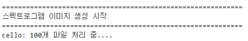
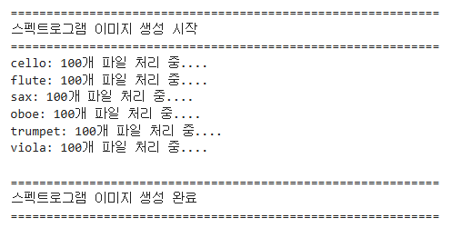
- C:\Users\human3_02\Desktop\programs\human-ai\workspace\spectrogram_data
- 다음과 같이 저장됨
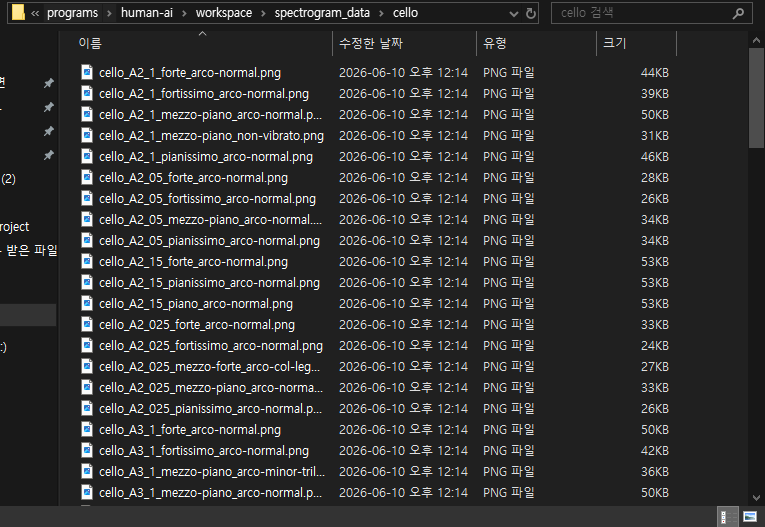
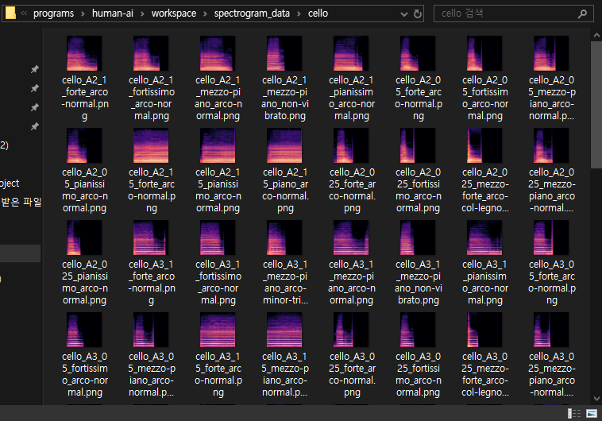

### [12] train/test/val 분할 함수 구현
```py
# 스펙트로그램 이미지를 클래스 별로 train/val/test 폴더 구조로 분할하는 함수
def split_dataset_to_folders(source_dir, target_dir, classes, train_ratio=0.7, val_ratio=0.15, test_ratio=0.15):
    # 비율의 합이 1인지 검증
    if abs(train_ratio + val_ratio + test_ratio - 1.0) >= 1e-6:
        raise ValueError("[오류] train_ratio + val_ratio + test_ratio의 합은 반드시 1이어야 함")
        
    # 기존 split 폴더 삭제
    safe_remove_path(target_dir)

    # 각 클래스 별 분할 진행
    for cls in classes:
        # 클래스 폴더 정의
        class_dir = os.path.join(source_dir, cls)
        # 원본 클래스 이미지가 존재하는지 확인
        if not os.path.exists(class_dir):
            raise FileNotFoundError(f"[오류] 스펙트로그램 클래스 폴더가 없습니다: {class_dir}")

        # 이미지 파일 정의
        image_files = glob.glob(os.path.join(class_dir, "*.png"))
        # 클래스 별 이미지가 없으면 학습 불가이므로 중단
        if len(image_files) == 0:
            raise ValueError(f"[오류] 클래스 '{cls}'의 스펙트로그램 이미지가 없습니다.")

        # 이미지 파일들을 무작위 셔플 후 분할
        random.shuffle(image_files)
        n_total = len(image_files)
        n_train = int(n_total*train_ratio)
        n_val = int(n_total*val_ratio)
        train_files = image_files[:n_train]
        val_files = image_files[n_train :n_train+n_val]
        test_files = image_files[n_train+n_val:]

        # split 별 폴더를 생성
        for split_name in ["train","val","test"]:
            ensure_directory_exists(os.path.join(target_dir, split_name, cls))

        # 데이터 날아감 방지를 위한 복사 보조 함수
        def copy_files(files, split_name):
            for f in files:
                dst = os.path.join(target_dir, split_name, cls, os.path.basename(f))
                shutil.copy2(f, dst)

        # 파일을 각 폴더에 복사 (train, val, test)
        copy_files(train_files, "train")
        copy_files(val_files, "val")
        copy_files(test_files, "test")
        print(f"{cls} -> train:{len(train_files)}, val: {len(val_files)}, test: {len(test_files)}")

# split 이후 각 폴더에 최소 1개 이상의 이미지가 있는지 검증하는 함수
def validate_split_dataset(target_dir, classes):
    print_section_title("분할 데이터셋 검증")

    for split_name in ["train","val","test"]:
        print(f"[{split_name}]")
        for cls in classes:
            class_dir = os.path.join(target_dir, split_name, cls)
            count = len(glob.glob(os.path.join(class_dir, "*.png")))
            print(f" {cls}: {count}개")
            if count == 0:
                raise ValueError(
                    f"[오류] {split_name}/{cls} 폴더에 이미지가 없습니다.",
                    f"클래스 별 샘플 수가 너무 적거나 분할 비율 조정이 필요합니다.",
                )
```

### [13] 데이터셋 분할 수행
```py
print_section_title("train/val/test 분할 시작")
split_dataset_to_folders(SPEC_DIR, SPLIT_DIR, CLASSES, train_ratio=0.7, val_ratio=0.15, test_ratio=0.15)
validate_split_dataset(SPLIT_DIR, CLASSES)
print("데이터 분할 완료")
```
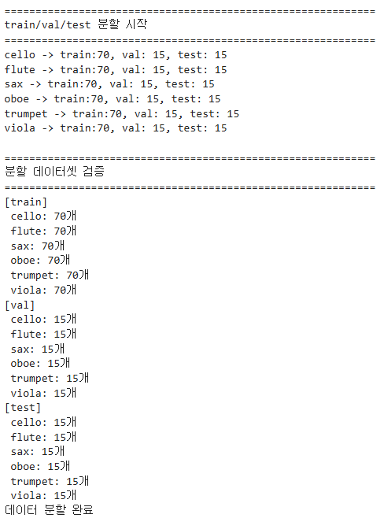
- 새로운 폴더(spectrogram_split)가 생성됨: C:\Users\human3_02\Desktop\programs\human-ai\workspace\spectrogram_split
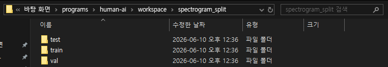
- train: 70개
- validation: 15개
- test: 15개 
- 위와 같은 비율로 이미지 데이터가 분할됨 (학습을 위해)
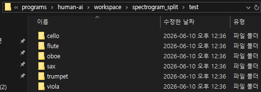
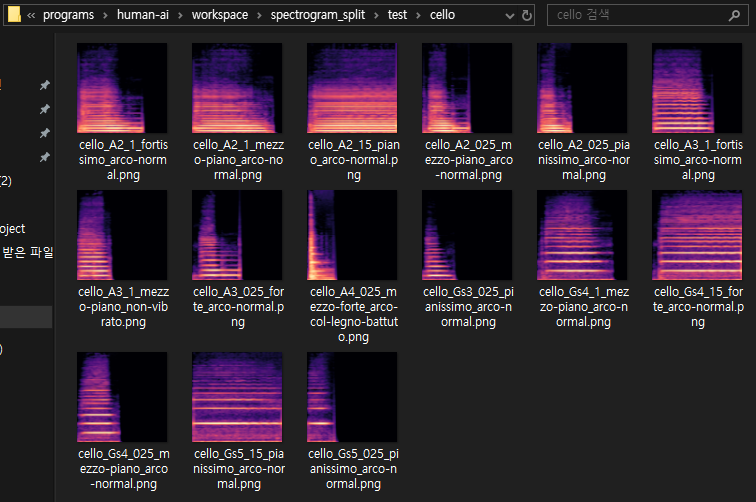
- 위 이미지와 같이 테스트 첼로 이미지가 15개 들어있는 것을 확인할 수 있다.
### 특징 분석 + 이미지 제너레이터 + 데이터 어그멘테이션(필수/데이터 증강)
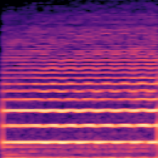
- 첼로가 꼭 이렇게 하모닉하게 나타날까?
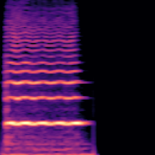
- 첼로 악기마다 연주하는 스타일에 따라 직선이 물결 형태나 다른 식으로 나타날 수도 있다.
- shape의 형태는 조금씩 다를 수 있다.
- 일직선만 학습했는데, 첼로 쉐입이 물결로 나온 경우 -> ai는 학습하지 않았기 때문에 첼로로 못 잡을 가능성이 있다.
- 이처럼 스케일이 변할 경우가 있어서 이미지 제너레이터를 많이 활용한다.
- 반전시키고, 뒤집고, 기울기를 바꾸고 틀어서 변경하는 것이다.
- 조금더 변형된 데이터로 어그멘테이션 시킨다. (데이터를 증강시킴)

### [14] [중요] ImageDataGenerator 설정 (이미지를 기울이고, 늘이고, 줄이고 등의 변형하는 내용)
```py
# 학습 데이터의 augmentation을 적용하여 일반화 성능을 높이기 위함
train_datagen = ImageDataGenerator(
    rescale=1.0 / 255.0,
    rotation_range=5,
    width_shift_range=0.05,
    height_shift_range=0.05,
    zoom_range=0.05
)

# 검증/테스트 데이터는 모델 평가의 일관성을 위해 정규화 수행
val_test_datagen = ImageDataGenerator(rescale=1.0 / 255.0)

# train generator 생성
train_generator = train_datagen.flow_from_directory(
    directory=os.path.join(SPLIT_DIR, "train"),
    target_size=(IMG_HEIGHT, IMG_WIDTH),
    batch_size=BATCH_SIZE,
    class_mode='categorical',
    shuffle=True,
    seed=SEED
)

# val generator 생성
val_generator = val_test_datagen.flow_from_directory(
    directory=os.path.join(SPLIT_DIR, "val"),
    target_size=(IMG_HEIGHT, IMG_WIDTH),
    batch_size=BATCH_SIZE,
    class_mode='categorical',
    shuffle=False
)

# test generator 생성
test_generator = val_test_datagen.flow_from_directory(
    directory=os.path.join(SPLIT_DIR, "test"),
    target_size=(IMG_HEIGHT, IMG_WIDTH),
    batch_size=BATCH_SIZE,
    class_mode='categorical',
    shuffle=False
)

# 클래스 인덱스 매핑을 출력
print_section_title("클래스 인덱스 매핑")
print(train_generator.class_indices)

# index -> class 이름 역매핑을 미리 만들어둔다.
idx_to_class = {v: k for k, v in train_generator.class_indices.items()}
print("역매핑:", idx_to_class)
```
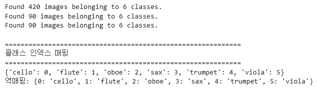

### 이제부터 본격적으로 AI 모델 구현 (CNN)
- 조금더 정확하게 하려면 1->2->3 cnn 분류
- FFT 특징 데이터 추출하면 또 벡터 데이터로 데이터를 뽑을 수 있다. -> 그걸 머신러닝이나 nlp 모델로 학습할 수 있다.
- 머신러닝/nlp모델/cnn모델 이렇게 3가지를 앙상블하면 조금 더 정확도를 낼 수 있다.
- 그렇게 하면 너무 좋은 모델인데 코드가 길어지니까 이번엔 CNN 모델만 진행한다.
### 위까지(오전까지) 진행한 내용
- ..., 유효성 검사, 데이터 몇개 구성되어 있는지 데이터 읽어와서 인발란스 확인, 오디오 읽어올 수 있는 함수 정의 후 오디오 읽음, 타임시리즈 시그널 데이터 변환하여 오디오 데이터 시그널 데이터 그래프 확인, 주파수 데이터 피크 특징 확인(FFT 주파수 데이터로 변환), FFT를 한 번 더 쉐입을 확인하기 위해 스펙트로그램으로 변환하여 쉐입 확인, 전체 오디오를 각 오디오마다 스펙트로그램 이미지를 뽑아서 저장(spectrogram_data 폴더에 저장), 학습을 위해 spectrogram_data의 파일을 가지고 spectrogram_split 폴더에 이미지 데이터를 분할(70:15:15), 이미지 제너레이터를 이용하여 데이터 어그멘테이션 수행
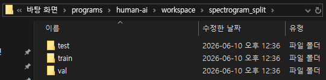
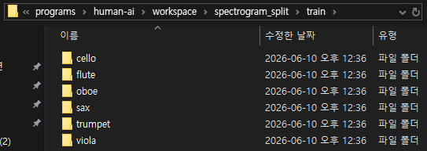
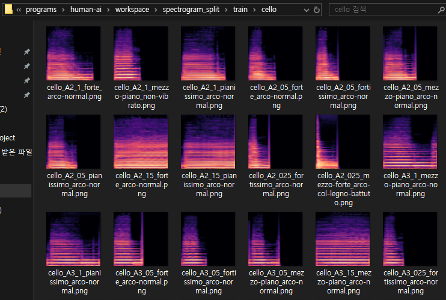
- 위와 같이 학습,테스트,검증 데이터 준비가 끝났다. 이제 음악을 듣고 어떤 악기인지 분류하는 AI 모델을 개발할 것이다.

### [15] [중요] CNN 모델 정의
- relu: 영향 있으면 다음 뉴런에 0이상의 값을 전달, 영향 없으면 0으로 치환하여 전달한다. (cativation이 영향을 판단하는 것이다)
- Conv2D의 의미 
    - 1D: 1차원 / 벡터 형태
    - 2D: 2차원 / 이미지 분석
- MaxPooling: MoxPool은 컨볼루션 레이어에서 옆으로 스프라이트 특징값을 뽑는다. 특징값을 뽑아서 작은사이즈 맵을 만드는게 맥스 풀링이다.
- 뉴런 개수는 자유롭게 해도 된다. 정답은 없다.
- 하지만 출력층은 클래스랑 딱 맞춰 주어야 한다.
- 복잡해서 레이어를 한 층 더 만들었다.
- [중요] convolution layer를 만든 후에는, feature map을 1차원 벡터로 변환해야 한다. (풀리 커넥션 레이어 구성)
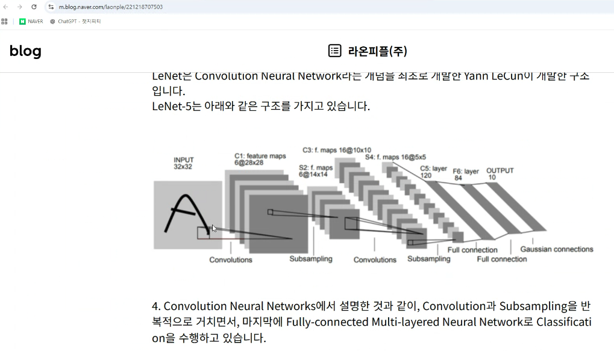
- 현재 위 이미지처럼 4개의 레이어를 구성했다.
- 그걸 1차원 벡터로 쫙 펼쳐서 풀리 커넥션 레이어를 구성해야 한다.
```py
# 입력 SHAPE은 고정된 스펙트로그램 RGB 이미지 크기
input_shape = (IMG_HEIGHT, IMG_WIDTH, 3)

# Sequential 모델 생성
model = models.Sequential()

# 1 convolution layer: 저수준 adge/texture 패턴을 추출
model.add(layers.Conv2D(32, (3,3), activation='relu', padding='same', input_shape=input_shape))
model.add(layers.MaxPool2D((2,2)))

# 2 convolution layer: 중간 수준의 패턴 조함을 추출 (뉴런 64개)
model.add(layers.Conv2D(64, (3,3), activation='relu', padding='same'))
model.add(layers.MaxPool2D((2,2)))

# 3 convolution layer: 더 복잡한 주파수 특징, 하모닉 구조, 시간-주파수 패턴을 학습 (뉴런 128개)
model.add(layers.Conv2D(128, (3,3), activation='relu', padding='same'))
model.add(layers.MaxPool2D((2,2)))

# 4 convolution layer: 클래스 구분력이 높은 상위 수준의 특성 추출 (뉴런 256개)
model.add(layers.Conv2D(256, (3,3), activation='relu', padding='same'))
model.add(layers.MaxPool2D((2,2)))

# feature map을 1차원 벡터로 변환
model.add(layers.Flatten())

# 완전연결층: 추출된 특징을 256차원으로 결합해 분류에 필요한 고수준 패턴을 학습
model.add(layers.Dense(256, activation='relu'))
# 학습의 과적합 방지를 위해 드롭아웃 적용
model.add(layers.Dropout(0.5)) 

# 최종 출력층 (6개 클래스 확률 분포를 생성)
# 출력층에는 소프트맥스 엑티베이션을 적용해야 한다.
model.add(layers.Dense(len(CLASSES), activation='softmax'))

model.summary()
```
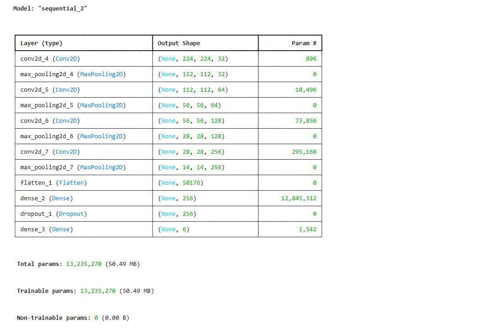
- 여러 층으로 깊이있게 만들어 봤다.

### [15-2] CNN 모델 컴파일 설정
```py
model.compile(
    optimizer='adam',
    loss='categorical_crossentropy',
    metrics=['accuracy']
)
```

### [16] [중요] 학습 롤백 설정 + 모델 자동 저장 설정(accuracy 최고점)
- [중요] 이미지 모델 학습시 얼리 스탑핑을 하는게 좋다. 이미 성능 좋고 어느정도 올라왔다면 더 할 필요가 없다.
```py
# validation loss가 일정 epoch 동안 개선되지 않으면 학습을 조기 종료
early_stopping = EarlyStopping(
    monitor= 'val_loss', # 이 것을 가지고 판단
    patience=5,
    restore_best_weights=True
)

# validation accuracy가 최고일 때, 모델을 자동으로 저장
# 모델 결과는 h5로 저장해도 되고, keras로 저장해도 된다
checkpoint = ModelCheckpoint(
    filepath=BEST_MODEL_PATH,
    monitor='val_accuracy',
    save_best_only=True,
    mode='max',
    verbose=1
)
```

### [17] 모델 학습
```py
history = model.fit(
    train_generator,
    validation_data=val_generator,
    epochs=EPOCHS,
    callbacks=[early_stopping, checkpoint]
)
```
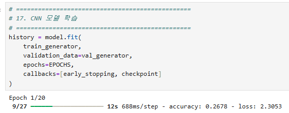
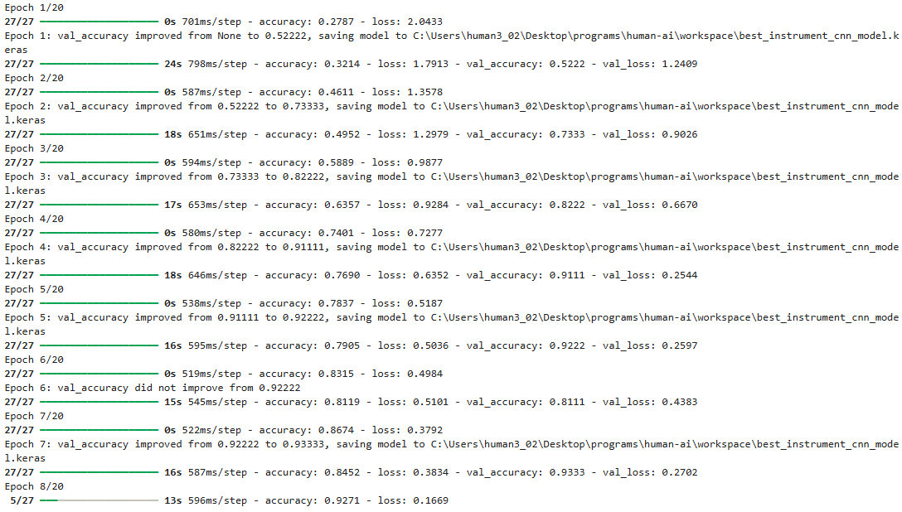

- 학습을 거치며 accuracy가 높아지고 loss가 낮아진다.
- 초기 에포크: accuracy 0.27, loss: 2.0
- 마지막 에포크: 

### [18] 학습 과정 시각화 (accuracy, loss)
```py
plt.figure(figsize=(8,4))
plt.plot(history.history["accuracy"], label="Train Accuracy")
plt.plot(history.history["val_accuracy"], label="Validation Accuracy")
plt.title("Training and Validation Accuracy")
plt.xlabel("Epoch")
plt.ylabel("Accuracy")
plt.legend()
plt.grid(True)
plt.show()

plt.figure(figsize=(10,4))
plt.plot(history.history["loss"], label="Train Loss")
plt.plot(history.history["val_loss"], label="Validation Loss")
plt.title("Training and Validation Loss")
plt.xlabel("Epoch")
plt.ylabel("Loss")
plt.legend()
plt.grid(True)
plt.show()
```
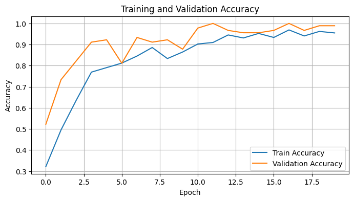
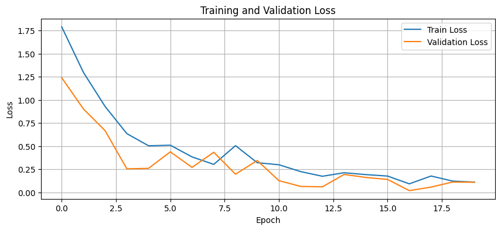

### [19] 테스트셋 분류 리포트 및 confusion matrix 확인
```py
# 테스트셋 전체에 대해 클래스별 확률을 예측
pred_probs = model.predict(test_generator)
# 가장 큰 확률을 갖는 인덱스를 최종 예측 클래스로 사용
pred_classes = np.argmax(pred_probs, axis=1)
# 실제 정답 라벨
true_classes = test_generator.classes
# 클래스 이름 목록
class_labels = list(test_generator.class_indices.keys())

print_section_title("분류 리포트")
print(classification_report(
    true_classes,
    pred_classes,
    target_names=class_labels,
    zero_division=0
))

cm = confusion_matrix(true_classes, pred_classes)

plt.figure(figsize=(7, 6))
sns.heatmap(
    cm,
    annot=True,
    fmt='d',
    cmap='Blues',
    xticklabels=class_labels,
    yticklabels=class_labels
)
plt.title("Confusion Matrix")
plt.xlabel("Predicted Label")
plt.ylabel("True Label")
plt.tight_layout()
plt.show()
```
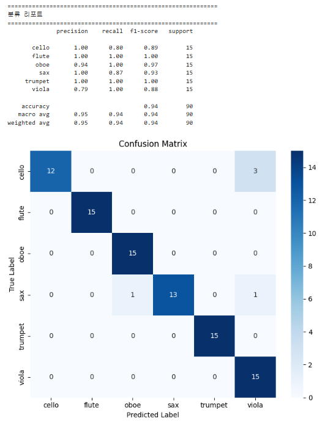
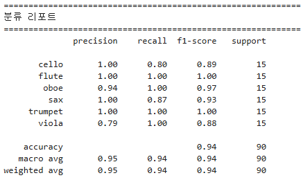
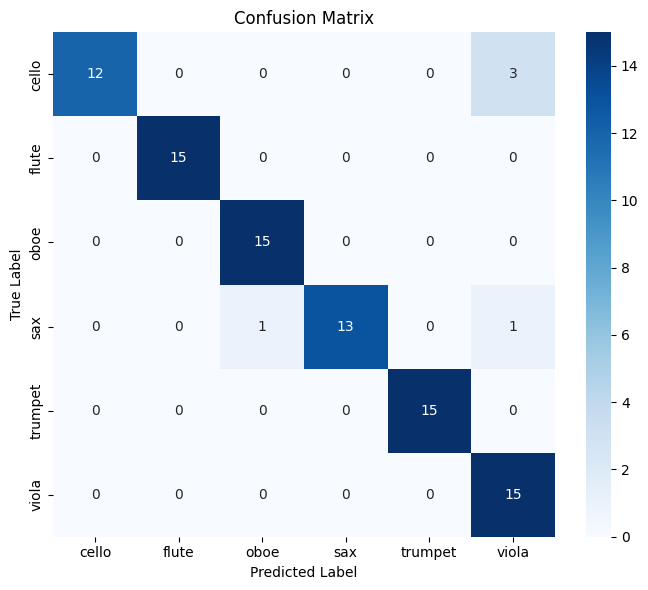

### [20] 예측용 오디오 분석/시각화 함수
```py
# 신규 입력 오디오에 대해 waveplot, fft, spectogram을 순차적으로 시각화 하는 함수
def visualize_audio_analysis(audio_path, predicted_class=None, probs_dict=None):
    # 오디오 로드
    y, sr = load_audio_file(audio_path)

    # 파일명만 표시용으로 추출
    file_name = os.path.basename(audio_path)

    # 1) waveplot 시각화
    plt.figure(figsize=(14,4))
    librosa.display.waveshow(y, sr=sr)
    plt.title(f"Input Audio Waveform - {file_name}")
    plt.xlabel("Time (Seconds)")
    plt.ylabel("Amplitude")
    plt.tight_layout()
    plt.show()

    # 2) FFT 시각화
    fft_vals = np.fft.fft(y)
    magnitude = np.abs(fft_vals)
    freqs = np.fft.fftfreq(len(magnitude), d=1 / sr)
    positive_freqs = freqs[:len(freqs) // 2]
    positive_magnitude = magnitude[:len(magnitude) // 2]
    
    plt.figure(figsize=(14,4))
    plt.plot(positive_freqs, positive_magnitude)
    plt.title(f"Input Audio FFT Spectrum - {file_name}")
    plt.xlabel("Frequency (Hz)")
    plt.ylabel("Magnitude")
    plt.tight_layout()
    plt.show()

    # 3) 스펙트로그램 시각화
    stft = librosa.stft(y, n_fft=N_FFT, hop_length=HOP_LENGTH)
    spectrogram = np.abs(stft)
    spectrogram_db = librosa.amplitude_to_db(spectrogram, ref=np.max)

    plt.figure(figsize=(14,4))
    librosa.display.specshow(
        spectrogram_db,
        sr=sr,
        hop_length=HOP_LENGTH,
        x_axis='time',
        y_axis='log'
    )
    plt.colorbar(format='%+2.0f db')
    if predicted_class is None:
        plt.title(f"Input Audio Spectrogram - {file_name}")
    else:
        plt.title(f"Input Audio Spectrogram - {file_name}\nPredicted:{predicted_class}")

    plt.tight_layout()
    plt.show()

    # 4) 예측 확률 막대 그래프
    if probs_dict is not None:
        probs_df = pd.DataFrame({
            "Class" : list(probs_dict.keys()),
            "Probability": list(probs_dict.values())
        }).sort_values("Probability", ascending=False)

        plt.figure(figsize=(8,4))
        sns.barplot(data=probs_df, x= "Class", y="Probability")
        plt.title(f"Predicted Probability - {file_name}")
        plt.xlabel("Instrument Class")
        plt.ylabel("Probability")
        plt.xticks(rotation=30)
        plt.ylim(0, 1.0)
        plt.tight_layout()
        plt.show()
```

### [21] 신규 오디오 예측 함수
- 기능
    - 입력 파일 유효성 검사
    - spectrogram 임시 이미지 생성
    - 모델 추론
    - 예측 클래스 및 확률 반환
    - 입력 오디오 waveplot / FFT / spectrogram / 확률 시각화 수행
```py
# 절대경로로 지정한 신규 오디오 파일을 읽어와 CNN으로 예측하는 함수
def predict_instrument_from_audio_absolute_path(audio_path, model, class_indices, save_temp_image=False):
    # 입력값 타입 검증
    if not isinstance(audio_path, str):
        raise TypeError("[오류] audio_path는 문자열이어야 합니다.")
    # 절대경로인지 확인한다. 사용자 요청 조건을 강제하기 위한 검증.
    if not os.path.isabs(audio_path):
        raise ValueError(f"[오류] 신규 오디오 예측 경로는 절대경로여야 합니다: {audio_path}")
    # 실제 파일 존재 여부 확인
    if not os.path.exists(audio_path):
        raise FileNotFoundError(f"[오류] 신규 예측용 오디오 파일이 존재하지 않습니다: {audio_path}")
    # 모델 유효성 확인
    if model is None:
        raise ValueError("[오류] 학습된 모델이 없습니다.")
    # 클래스 인덱스 매핑 확인
    if not isinstance(class_indices, dict) or len(class_indices) == 0:
        raise ValueError("[오류] class_indices가 비어 있거나 유효하지 않습니다.")

    # 임시 spectrogram 이미지가 남아 있으면 삭제
    if os.path.exists(TEMP_PREDICT_IMAGE_PATH):
        os.remove(TEMP_PREDICT_IMAGE_PATH)

    # 신규 오디오를 spectrogram 이미지로 변환
    save_spectrogram_image(audio_path, TEMP_PREDICT_IMAGE_PATH)

    # 임시 이미지가 실제 생성되었는지 확인
    if not os.path.exists(TEMP_PREDICT_IMAGE_PATH):
        raise FileNotFoundError("[오류] 예측용 임시 spectrogram 이미지 생성에 실패했습니다.")

    # 저장된 이미지를 열어 RGB 변환
    img = Image.open(TEMP_PREDICT_IMAGE_PATH).convert("RGB")
    # 모델 입력 크기로 리사이즈
    img = img.resize((IMG_WIDTH, IMG_HEIGHT))
    # numpy 배열로 변환 후 0~1 범위로 정규화
    img_array = np.array(img).astype("float32") / 255.0
    # (H, W, C) -> (1, H, W, C)로 배치 축을 추가
    img_array = np.expand_dims(img_array, axis=0)

    # 모델 추론을 수행한다.
    probs = model.predict(img_array, verbose=0)[0]
    # 최대 확률 클래스 인덱스를 찾는다.
    pred_idx = int(np.argmax(probs))

    # index -> class 역매핑 생성
    idx_to_class_local = {v: k for k, v in class_indices.items()}
    # 예측 클래스 이름
    predicted_class = idx_to_class_local[pred_idx]

    # 클래스별 확률 dict 생성
    probs_dict = {idx_to_class_local[i]: float(probs[i]) for i in range(len(probs))}

    # 예측용 spectrogram 이미지 자체를 보여준다.
    plt.figure(figsize=(5, 5))
    plt.imshow(Image.open(TEMP_PREDICT_IMAGE_PATH))
    plt.title(f"Prediction Spectrogram\nPredicted: {predicted_class}")
    plt.axis('off')
    plt.tight_layout()
    plt.show()

    # 입력 오디오의 wave/FFT/spectrogram/확률을 함께 시각화
    visualize_audio_analysis(
        audio_path=audio_path,
        predicted_class=predicted_class,
        probs_dict=probs_dict
    )

    # 임시 저장을 원하지 않으면 삭제
    if not save_temp_image and os.path.exists(TEMP_PREDICT_IMAGE_PATH):
        os.remove(TEMP_PREDICT_IMAGE_PATH)

    return predicted_class, probs_dict
```

### [22] 신규 오디오 예측 결과 수행
- NEW_AUDIO_ABSOLUTE_PATH에서 파일 경로를 맞춰준다. 나는 다음과같이 첼로 음악을 가져와서 복붙해뒀다(절대경로): 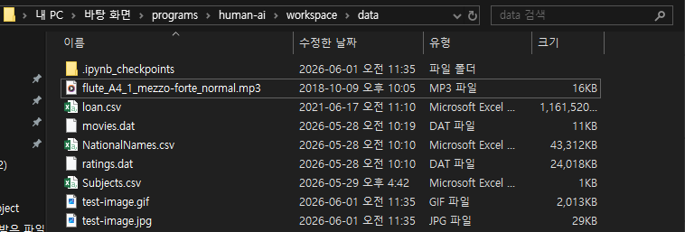
```py
NEW_AUDIO_ABSOLUTE_PATH = r"C:\Users\human3_02\Desktop\programs\human-ai\workspace\data\flute_A4_1_mezzo-forte_normal.mp3"

print_section_title("신규 오디오 예측 준비")
print("절대경로 :", NEW_AUDIO_ABSOLUTE_PATH)

if os.path.exists(NEW_AUDIO_ABSOLUTE_PATH):
    predicted_class, probs_dict = predict_instrument_from_audio_absolute_path(
        audio_path=NEW_AUDIO_ABSOLUTE_PATH,
        model=model,
        class_indices=train_generator.class_indices,
        save_temp_image=False
    )

    print("\n 예측 클래스:", predicted_class)
    print("\n 클래스 별 예측 확률:")
    for cls, prob in sorted(probs_dict.items(), key=lambda x: x[1], reverse=True):
        print(f"{cls}: {prob:.4f}")
else:
    print("NEW_AUDIO_ABSOLUTE_PATH를 실제 존재하는 절대경로로 수정한 뒤 예측을 실행하세요.")
```
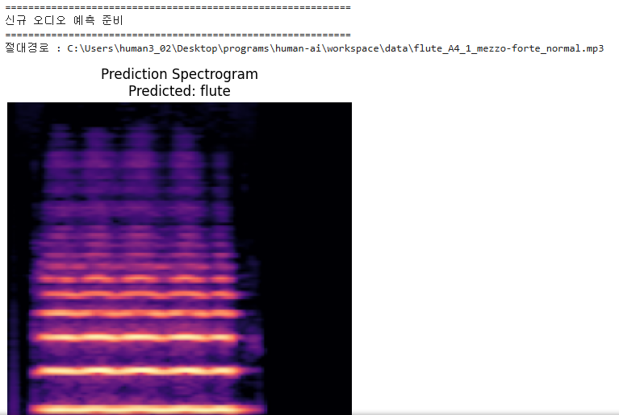
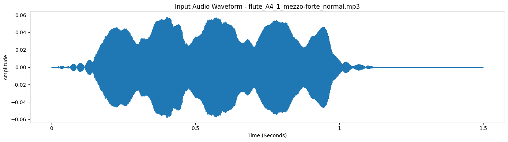
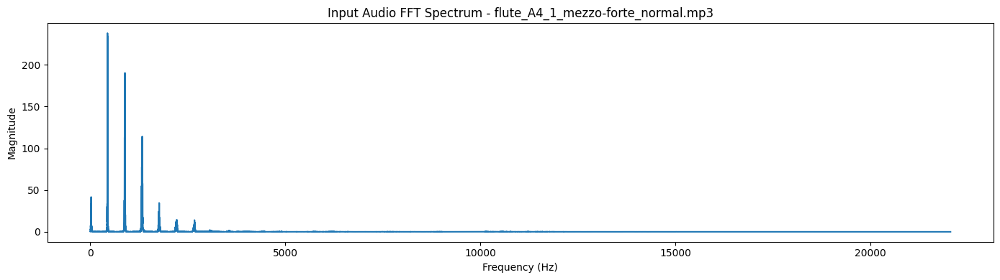
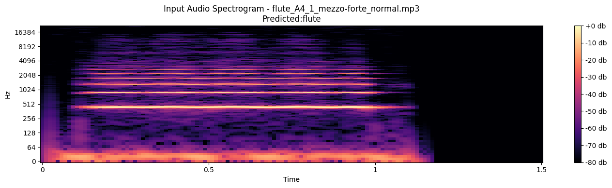
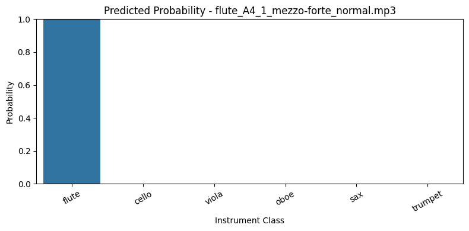
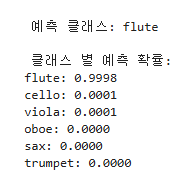


## 다음과 같이 실습 예정: 다변량(멀티) 시계열 기반 설비 고장 조기 예측 + 품질 인 분류 멀티태스크 모델
1. 제조 설비 센서 데이터를 시뮬레이션
2. 시계열 윈도우를 생성 (시계열이기 때문에 1D CNN 사용)
3. [중요] 1D CNN + BiLSTM + Attension 기반 멀티 태스크 모델 성 및 학습
    - 더 좋은 결과가 나올 수 있게 이처럼 융합해서 개발을 하면 개발을 굉장히 잘하는 수준의 경지에 있는 사람이다.
4. 고장 여부와 원인 분류 수행
5. 모델, 스케일러, 학습 이력, 예측 결과 저장 및 수행 
6. 신규 데이터 기반 예측 결과 및 시각화 수행


## 2. AI 멀티 테스크 모델 실습 (다변량(멀티) 시계열 기반 설비 고장 조기 예측 + 품질 원인 분류 멀티태스크 모델)
- 신규 파일 생성: [10-2) 멀티태스크 모델 실습]

### [0] 라이브러리 임포트
```py
import numpy as np
import pandas as pd
import matplotlib.pyplot as plt

from sklearn.model_selection import train_test_split
from sklearn.preprocessing import StandardScaler
from sklearn.metrics import accuracy_score, confusion_matrix, classification_report

import joblib
import tensorflow as tf

from tensorflow.keras.layers import Input, Dense, Dropout, Conv1D, MaxPooling1D
from tensorflow.keras.layers import Bidirectional, LSTM, GlobalAveragePooling1D
from tensorflow.keras.layers import MultiHeadAttention, LayerNormalization, Add
from tensorflow.keras.layers import Concatenate

from tensorflow.keras.models import Model

# 학습 제어 콜백을 불러온다.
from tensorflow.keras.callbacks import EarlyStopping, ReduceLROnPlateau, ModelCheckpoint

np.random.seed(42)
tf.random.set_seed(42)
```
- 시계열 모델 구성에 필요한 라이브러리 임포트 -> numpy/TensorFlow 시드값 42로 고정

### [1] 데이터 설정 (실제 상황을 모사한 데이터 생성)
- 시뮬레이션 파라미터 정의 -> 4000개 시퀀스, 길이 60, 센서 6개(온도/압력/진동/전류/속도/두께), 고장 원인 클래스 4개
```py
# 전체 시뮬레이션 샘플 수를 정의
n_sequences = 4000
# 한 시퀀스의 길이를 정의
seq_len = 60
# 센서 개수를 정의
n_features = 6
# 품질 고장에 대한 원인 클래스 수를 정의
n_cause_classes = 4
# 센서 이름을 정의 (온도, 압력, 진동, 전류, 속도, 두께)
feature_names = ["temperature", "pressure", "vibration", "current", "speed", "thickness"]
```

### [2] 데이터 생성 (시계열 데이터 생성 함수 정의)
- 시퀀스 생성 함수 정의 -> 각 센서는 사인/코사인 기반 정상 패턴에 노이즈 추가 -> fault 모드일 경우 원인 클래스별 지정 센서에 점진적 이상 패턴 삽입
```py
# 하나의 시퀀스를 생성하는 함수를 정의
def generate_sequence(seq_len, mode, cause_class):
    # 시간축을 0부터 1까지 균등 분할하여 생성
    t = np.linspace(0, 1, seq_len)

    # temperature 기본 패턴을 생성
    temperature = 50 + 3 * np.sin(2 * np.pi * 2 * t) + np.random.normal(0, 0.6, seq_len)
    # pressure 기본 패턴을 생성
    pressure = 100 + 5 * np.cos(2 * np.pi * 1.5 * t) + np.random.normal(0, 0.8, seq_len)
    # vibration 기본 패턴을 생성
    vibration = 10 + 0.5 * np.sin(2 * np.pi * 6 * t) + np.random.normal(0, 0.3, seq_len)
    # current 기본 패턴을 생성
    current = 20 + 1.2 * np.sin(2 * np.pi * 3 * t) + np.random.normal(0, 0.4, seq_len)
    # speed 기본 패턴을 생성
    speed = 1500 + 25 * np.cos(2 * np.pi * 2.5 * t) + np.random.normal(0, 5, seq_len)
    # thickness 기본 패턴을 생성
    thickness = 1.20 + 0.02 * np.sin(2 * np.pi * 1.2 * t) + np.random.normal(0, 0.01, seq_len)

    # 정상 모드가 아니라면 이상 패턴을 삽입
    if mode == "fault":
        # 원인 클래스 0이면 온도와 전류 상승 패턴을 삽입
        if cause_class == 0:
            temperature += np.linspace(0, 10, seq_len)
            current += np.linspace(0, 8, seq_len)

        # 원인 클래스 1이면 압력 급상승과 두께 편차를 삽입
        elif cause_class == 1:
            pressure += np.linspace(0, 18, seq_len)
            thickness += np.linspace(0, 0.10, seq_len)

        # 원인 클래스 2이면 진동 증가와 속도 저하를 삽입
        elif cause_class == 2:
            vibration += np.linspace(0, 6, seq_len)
            speed -= np.linspace(0, 160, seq_len)

        # 원인 클래스 3이면 복합 이상 패턴을 삽입
        elif cause_class == 3:
            temperature += np.linspace(0, 6, seq_len)
            pressure += np.linspace(0, 10, seq_len)
            vibration += np.linspace(0, 3, seq_len)
            current += np.linspace(0, 4, seq_len)

    # 생성된 각 센서를 열 방향으로 쌓아 하나의 2차원 시퀀스로 만듬
    sequence = np.column_stack([temperature, pressure, vibration, current, speed, thickness])

    # 생성된 시퀀스를 반환
    return sequence
```
- 이상 데이터를 넣었다.

### [3] 전체 데이터 셋 설정
- 3개의 데이터를 만드는 것이다. 전체 샘플 70% 정상 / 30% 고장으로 배정 -> 입력 시퀀스(X), 고장 여부(y_fault), 원인 라벨(y_cause) 세 배열 생성 -> 클래스 분포 확인
```py
# 입력 시퀀스를 저장할 리스트를 생성
X_list = []
# 고장 여부 라벨을 저장할 리스트를 생성
y_fault_list = []
# 원인 클래스 라벨을 저장할 리스트를 생성
y_cause_list = []

# 전체 샘플 수만큼 반복
for i in range(n_sequences):
    mode = np.random.choice(["normal", "fault"], p=[0.7, 0.3])  # 70%는 정상, 30%는 이상이 되도록 랜덤하게 모드를 선택

    if mode == "normal":
        cause_class = 0
        
    # 이상일 경우 1~3 중 하나를 원인 클래스로 사용
    else:
        cause_class = np.random.choice([1, 2, 3])

    # 시퀀스를 생성
    seq = generate_sequence(seq_len=seq_len, mode=mode, cause_class=cause_class)

    # 입력 리스트에 시퀀스를 추가
    X_list.append(seq)
    # 고장 여부 라벨을 추가, 정상은 0, 이상은 1
    y_fault_list.append(0 if mode == "normal" else 1)
    # 원인 클래스 라벨을 추가
    y_cause_list.append(cause_class)

# 입력 리스트를 numpy 배열로 변환
X = np.array(X_list)
# 고장 여부 라벨을 numpy 배열로 변환
y_fault = np.array(y_fault_list)
# 원인 클래스 라벨을 numpy 배열로 변환
y_cause = np.array(y_cause_list)

# 고장 여부 라벨 shape를 출력
print("y_fault shape:", y_fault.shape)
# 원인 라벨 shape를 출력
print("y_cause shape:", y_cause.shape)
# 고장 여부 클래스 분포를 출력
print("Fault label distribution:\n", pd.Series(y_fault).value_counts().sort_index())
# 원인 클래스 분포를 출력
print("Cause label distribution:\n", pd.Series(y_cause).value_counts().sort_index())
```
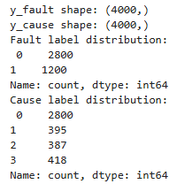
- 데이터의 쉐입을 보면, 정상: 2800개
- 첫번째 워닝 395, 두번째 워닝 387, 세번째 워닝은 418 개로 구성하였다.
- 정상을 포함해 1200개의 워닝 클래스 -> 정상 데이터, 이상 데이터 나눠서 구성했다.

### [4] 시퀀스 데이터 시각화
- 첫 번째 샘플의 6개 센서 값을 subplot으로 시각화 -> 정상 패턴의 진폭/주기가 적절한지 확인.
```py
plt.figure(figsize=(14, 8))

# 각 센서별로 subplot을 생성하기 위해 반복
for idx in range(n_features):
    # 3행 2열 구조의 subplot을 생성
    plt.subplot(3, 2, idx + 1)

    # 첫 번째 정상 샘플의 해당 센서 시퀀스를 표시
    plt.plot(X[0, :, idx], label="sample_0")
    plt.title(feature_names[idx])
    plt.legend()
    plt.grid(True)

plt.tight_layout()
plt.show()
```
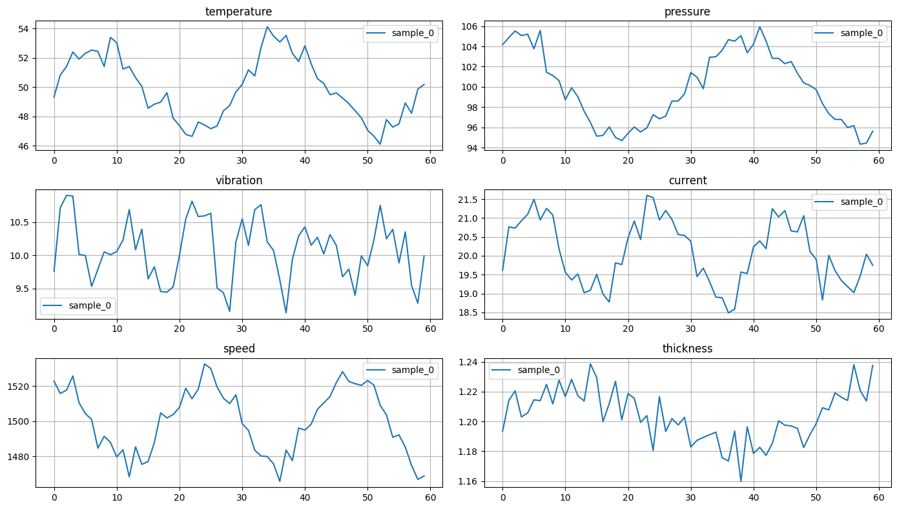
- 시계열 데이터를 쭉 보았다. 근데 프레셔는 지금 과하게 만들어졌다. 온도도 조금 상수의 성격의 패턴이 나와야 되는데 과하게 만들어졌다.
- 나머지는 실제처럼 나왔다.
- 전반적으로 생성한 데이터의 패턴을 보았다.
- 이처럼 시계열 데이터는 반드시 시각화 해서 봐야 한다.

### [5] 학습 / 검증 / 테스트 데이터 분리
- 전체 데이터를 80:10:10으로 분리 -> 80% 학습, 나머지 20%를 반반으로 나눠 검증/테스트 구성 -> stratify=y_fault로 정상/고장 비율 균등 유지
```py
# 학습용과 임시용으로 데이터를 분리
X_train, X_temp, y_fault_train, y_fault_temp, y_cause_train, y_cause_temp = train_test_split(
    X, y_fault, y_cause, test_size=0.2, random_state=42, stratify=y_fault
)

# 임시 데이터를 검증용과 테스트용으로 분리
X_val, X_test, y_fault_val, y_fault_test, y_cause_val, y_cause_test = train_test_split(
    X_temp, y_fault_temp, y_cause_temp, test_size=0.5, random_state=42, stratify=y_fault_temp
)

# 분리 결과 shape를 출력
print("Train:", X_train.shape, y_fault_train.shape, y_cause_train.shape)
print("Val  :", X_val.shape, y_fault_val.shape, y_cause_val.shape)
print("Test :", X_test.shape, y_fault_test.shape, y_cause_test.shape)
```
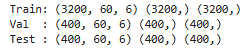
- 학습 데이터: 80%, 테스트 데이터 20%
- 검증 10%, 테스트 10% 비율로 데이터를 분할했다.

### [6] 시계열 데이터 정규화
- 3차원 데이터를 2차원으로 reshape -> 학습 데이터 기준으로만 fit -> 검증/테스트는 동일 스케일러로 transform만 수행 -> 3차원으로 복원. 데이터 누수 방지를 위해 학습 데이터로만 fit
```py
# 시계열 데이터 : (samples, timestamps, features)
# 시계열 데이터는 3차원 형태이므로 스케일러 적용을 위해 2차원으로 펼쳐야 함
# 먼저 StandardScaler 객체를 생성
scaler = StandardScaler()

# 학습 데이터를 (샘플*시점, 센서수) 형태로 reshape
X_train_2d = X_train.reshape(-1, n_features)
# 검증 데이터를 2차원으로 reshape
X_val_2d = X_val.reshape(-1, n_features)
# 테스트 데이터를 2차원으로 reshape
X_test_2d = X_test.reshape(-1, n_features)

# 학습 데이터 기준으로 스케일러를 학습하고 변환
X_train_scaled_2d = scaler.fit_transform(X_train_2d)
# 검증 데이터를 동일 스케일러로 변환
X_val_scaled_2d = scaler.transform(X_val_2d)
# 테스트 데이터를 동일 스케일러로 변환
X_test_scaled_2d = scaler.transform(X_test_2d)

# 다시 원래의 3차원 시계열 형태로 복원
X_train_scaled = X_train_scaled_2d.reshape(-1, seq_len, n_features)
# 검증 데이터도 3차원으로 복원
X_val_scaled = X_val_scaled_2d.reshape(-1, seq_len, n_features)
# 테스트 데이터도 3차원으로 복원
X_test_scaled = X_test_scaled_2d.reshape(-1, seq_len, n_features)
```
- 위와 같이 데이터 준비가 완료됐다.

### [중요] 멀티태스크 모델 구성 구조
- `입력 -> Conv1D -> Pooling -> BiLSTM -> Self-Attension -> Dense`
    - Conv1D: 기본적 특성 추출
    - BiLSTM: 이전 단계와 현재 미래를 연결해서 분석하는 것이다. 시간의 흐름에 따른 특성(특징)을 추출할 것이다.
    - Self-Attension 시간에 나타나는 의미 관계를 추출
    - Dense: 출력층
- 출력 1: fault_output(정상/이상)
- 출력 2: cause_output(멀티클래스 분류 (4개))
- CNN 은 이미지만 추출하는 게 아니라 벡터데이터도 추출할 수 있다.

### [7] [중요] 멀티태스크 모델 구성 (코드 좀 다듬기)
- 경력기술서에 멀티태스크 모델을 구성해서 분류기를 만들었다고 말할 수 있으면 좋다. / 이력서에 어필하기 좋은 내용이다.
- 시간의 특징을 비교해서 이전의 특징과 현재의 특징 어떤게 있는지 찾아서 결과를 출력하게 된다.
- 데이터와 데이터 간의 어떤 관계/의미가 있는지 특징을 뽑는 데 되게 좋은 모델이다.
- 텍스트 분석, 자연어 분석 증에도 자주 사용되는게 셀프 어텐션이다.
- 좀더 정확한 피쳐를 뽑기위한 것이다.
- 과적합 막을 때, 드롭아웃 이름(name 부분)에는 공백이 들어가면 안 된다.
- 입력 -> Conv1D(패턴 추출) -> MaxPooling -> BiLSTM(시간 흐름 앞뒤 학습) -> MultiHeadAttention(시점 간 중요도) -> 잔차 연결 -> GlobalAveragePooling -> 공유 Dense -> 분기 -> 고장 여부(sigmoid 이진 분류) / 원인 클래스(softmax 다중 분류) 두 헤드로 출력
```py
## LSTM Layer
# 입력 텐서 레이어 정의 
inputs = Input(shape=(seq_len, n_features), name="sensor_input")

# 첫 번째 1D CNN 레이어를 적용해서 기본적인 패턴 추출 (input)
x = Conv1D(filters=64, kernel_size=3, padding="same", activation="relu", name="conv1")(inputs)
# 과적합 방지를 위해 드롭아웃 적용 (20%)
x = Dropout(0.2, name='dropout_conv1')(x)

# 두 번째 1D CNN 레이어를 적용해서 조금 더 복잡한 패턴 추출 (첫 번째 레이어의 X값을 가져옴)
x = Conv1D(filters=64, kernel_size=3, padding="same", activation="relu", name="conv2")(x)
# 풀링을 적용해서 시퀀스 길이를 축소하고 핵심 특징으로 압축
x = MaxPooling1D(pool_size=2, name="maxpool1")(x)


## BiLSTM Layer
# BiLSTM Layer: 양방향 LSTM을 적용해서 과거와 현재 미래의 연결성을 반영
x = Bidirectional(LSTM(64, return_sequences=True), name= "bilstm")(x)

# Self-Attension 적용 전 정규화 수행
attn_input = LayerNormalization(name="attn_norm1")(x)
# 멀티헤드 어텐션을 적용하여 중요한 시점 간 관계를 학습
attn_output = MultiHeadAttention(num_heads=4, key_dim=32, name="multihead_attention")(attn_input, attn_input)
# 잔차 연결을 통해 원본 특징과 어텐션 결과를 더해준다.
x = Add(name="attn_residual")([x, attn_output])

# 다시 정규화 수행
x = LayerNormalization(name="attn_norm2")(x)
# 시계열의 전체 정보를 요약하기 위한 GlobalAveragePooling1D 적용 (pooling: 압축하는 것)
x = GlobalAveragePooling1D(name="global_avg_pool")(x)

## Dense Layer1 (128, 0.3 // x)
# 공통으로 다시 한 번 표현하기 위한 학습용 Dense 레이어 추가
shared = Dense(128, activation="relu", name="shared_dense1")(x)
shared = Dropout(0.3, name="shared_dropout1")(shared)

## Dense Layer2 (64, 0.2 // shared)
shared = Dense(64, activation="relu", name="shared_dense2")(shared)
shared = Dropout(0.2, name="shared_dropout2")(shared)

# 고장 여부 예측용 분류기 dense 레이어 정의 (32, relu, shared)
fault_branch = Dense(32, activation="relu", name="fault_dense")(shared)
# 고장 여부 이진 분류를 위한 출력층 정의 (1, sigmoid, fault_branch // 이진분류니까 뉴런은 하나만 받아온다) 
# 0또는 1을 구분하는 것이 시그모이드 함수이다.
fault_output = Dense(1, activation="sigmoid", name="fault_output")(fault_branch)

# 원인 분류용 분류기 dense 레이어 정의 
cause_branch = Dense(32, activation="relu", name="cause_dense")(shared)
# 원인 멀티클래스 분류 출력층 정의  (원인분류에는 소프트맥스 사용)
# 여러 클래스 간에 확률값을 계산해서 가장 높은 값을 1으로 출력하는 모델이 소프트맥스이다.
cause_output = Dense(n_cause_classes, activation="softmax", name="cause_output")(cause_branch)

# 멀티 출력 모델 생성
model = Model(inputs=inputs, outputs=[fault_output, cause_output], name="predictive_maintenance_multitask_model")
model.summary()
```
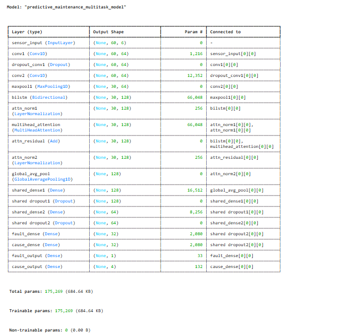
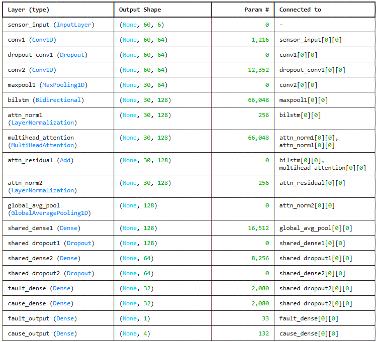

### [8] 모델 컴파일
- 고장 여부 -> binary_crossentropy / 원인 분류 -> sparse_categorical_crossentropy 지정 -> 두 손실 가중치 동일하게 1.0 설정 -> Adam lr=0.001로 컴파일
```py
# 멀티태스크 손실함수와 평가지표를 지정하여 모델을 컴파일한다.
model.compile(
    # 러닝레이트도 학습의 정확도를 내는데 영향을 많이 미친다.
    # 러닝레이트가 크면 U자 모양에서 기울기를 타고 내려올때 얼마의 간격을 가질 것이냐인데,
    # 크면 오버핏, 작으면 로컬미니멈에 빠져서 내려가지 않기 때문에
    # 학습을 통해 하이퍼 파라미터 튜닝을 진행하여야 한다.
    optimizer=tf.keras.optimizers.Adam(learning_rate=0.001),
    loss={
        "fault_output":"binary_crossentropy",
        "cause_output":"sparse_categorical_crossentropy",
    },
    loss_weights={
        "fault_output":1.0,
        "cause_output":1.0,
    },
    metrics={
        "fault_output":["accuracy"],
        "cause_output":["accuracy"],
    }
)
```

### [9] 콜백 설정 (조기종료)
- 손실이 정체되거나, 성능이 잘 나올 때 조기 종료한다.
- EarlyStopping -> val_loss 10 에포크 정체 시 조기 종료 + 최적 가중치 복원 / ReduceLROnPlateau -> val_loss 5 에포크 정체 시 학습률 절반으로 감소 / ModelCheckpoint -> val_loss 기준 최적 모델 자동 저장
```py
# 검증 손실이 개선되지 않으면 학습을 조기 종료하는 콜백정의
early_stop = EarlyStopping(
    monitor="val_loss",
    patience=10,
    restore_best_weights=True
)
# 검증 손실이 정체시, 학습률을 감소시키는 콜백 정의
reduce_lr = ReduceLROnPlateau(
    monitor="val_loss",
    factor=0.5,
    patience=5,
    min_lr=1e-6
)
# 가장 좋은 모델을 파일로 저장하는 콜백 정의
checkpoint = ModelCheckpoint(
    filepath="results/best_multitask_model.keras",
    monitor="val_loss",
    save_best_only=True
)
```
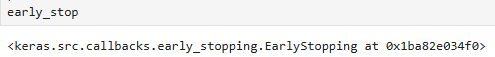
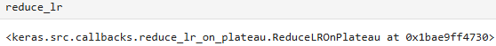
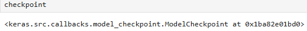

### [10] 모델 학습
- 두 출력 헤드에 라벨을 딕셔너리로 지정하여 학습 수행 -> 최대 50 에포크이나 EarlyStopping으로 조기 종료 가능 -> 시뮬레이션 데이터 특성상 초기부터 높은 정확도/낮은 손실이 나타날 수 있음
```py
history = model.fit(
    X_train_scaled, 
    {
        "fault_output": y_fault_train,
        "cause_output": y_cause_train,
    }, 
    validation_data=(X_val_scaled, {
        "fault_output": y_fault_val,
        "cause_output": y_cause_val,
    }),
    epochs=50,
    batch_size=64,
    callbacks=[early_stop, reduce_lr, checkpoint],
    verbose=1
)
```
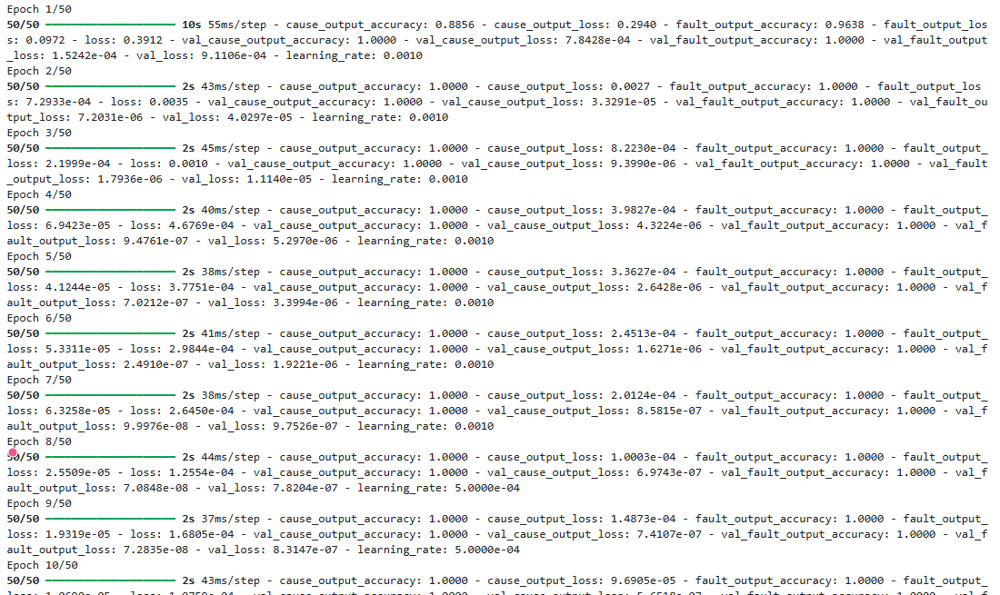
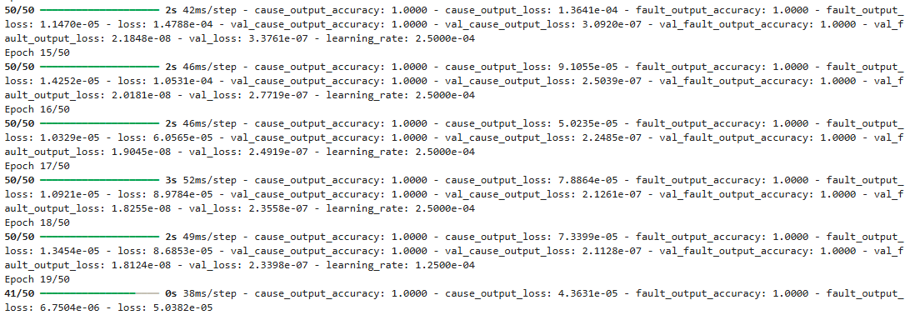
- 처음부터 데이터가 너무 깨끗해서 학습에 의미 없는 데이터이긴 했다.
- 하지만 결과는 이렇게 나오는 것이 맞다. (어쨌든 0에 수렴하였다.)
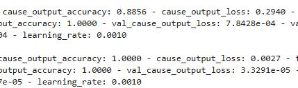
- 처음부터 정확도가 높고 로스가 별로 없었다.
- 학습이 잘못된 것은 아니다!

### [11] 테스트 성능 평가
```py
# 테스트 데이터에서 모델 성능을 평가
eval_result = model.evaluate(
    X_test_scaled,
    {
        "fault_output": y_fault_test,
        "cause_output": y_cause_test
    },
    verbose=0
)

# 평가 결과를 출력
print("Evaluation Result:", eval_result)
```
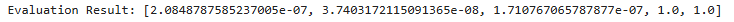
- 성능 평가 -> 두 출력 헤드 각각의 손실/정확도 확인

### [12] 테스트 데이터 예측
- 테스트 전체 예측 수행 -> 고장 여부는 확률 0.5 기준으로 0/1 변환 -> 원인 클래스는 argmax로 최대 확률 인덱스 선택
```py
# 테스트 데이터에 대한 예측 수행
fault_prob_test, cause_prob_test = model.predict(X_test_scaled)
# 고장 여부 확률을 0 또는 1 클래스로 변환
fault_pred_test = (fault_prob_test.flatten() >= 0.5).astype(int)
# 원인 클래스는 가장 큰 확률을 선택하는 argmax 적용
cause_pred_test = np.argmax(cause_prob_test, axis=1)
```
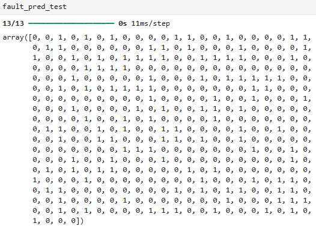
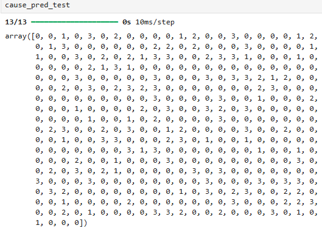

### [13] 성능 출력 - 고장 여부(이진분류)
- 정확도 / confusion matrix / classification report 출력 -> 실제 고장을 정상으로 놓치는 False Negative 수치를 확인
```py
# 고장 여부 정확도 계산
fault_acc = accuracy_score(y_fault_test, fault_pred_test)
# Confusion Matrix 계산
fault_cm = confusion_matrix(y_fault_test, fault_pred_test)

# 고장 여부 정확도 출력
print("\n[고장 여부 이진분류 성능]")
print("Accuracy:", fault_acc)
# 고장 여부 Confusion Matrix 출력
print("Confusion Matrix:\n", fault_cm)
# 고장 여부 분류 리포트 출력
print("Classification Report:\n", classification_report(y_fault_test, fault_pred_test))
```
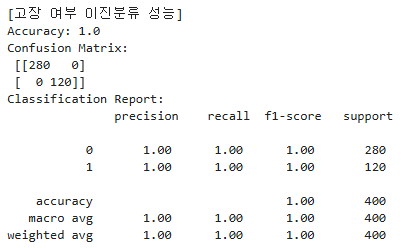

### [14] 성능 출력 - 원인 분류
- 4개 원인 클래스별 precision / recall / f1-score 확인 -> 클래스별 support 값도 함께 확인하여 샘플 불균형 여부 파악
```py
# 원인 분류 정확도 계산
cause_acc = accuracy_score(y_cause_test, cause_pred_test)
# 원인 분류 confusion_matrix 계산
cause_cm = confusion_matrix(y_cause_test, cause_pred_test)

# 원인 분류 정확도 출력
print("\n[원인 멀티클래스 분류 성능]")
print("Accuracy:", cause_acc)
# 원인 분류 confusion_matrix 출력
print("Confusion Matrix:\n", cause_cm)
# 원인 분류 리포트 출력
print("Classification Report:\n", classification_report(y_cause_test, cause_pred_test))
```
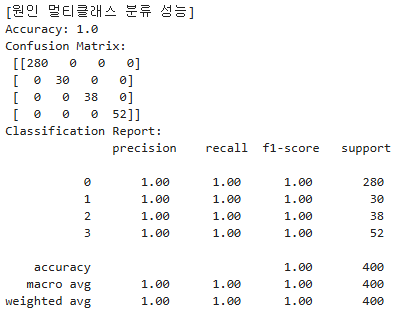

### [15] 모델 / 스케일러 / 학습 이력 저장
- 모델 -> .keras 
- 스케일러 -> joblib .pkl 
- 학습 이력 -> .csv 저장 
- 신규 데이터 예측 시 반드시 동일 스케일러 사용 필요
```py
# 전체 모델을 파일로 저장
model.save("10-2) final_multitask_model.keras")
# 스케일러를 파일로 저장
joblib.dump(scaler, "10-2) timeseries_scaler.pkl")

# 학습 이력을 데이터프레임으로 변환
history_df = pd.DataFrame(history.history)
# 학습 이력을 CSV 파일로 저장
history_df.to_csv("10-2) training_history.csv", index=False)

# 저장 완료 메시지를 출력
print("모델, 스케일러, 학습 이력 저장 완료")
```
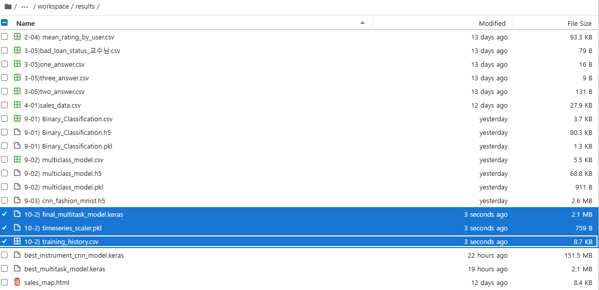
- --> 모델, 스케일러, 학습 이력 저장 완료

### [16] 저장된 모델 / 스케일러 불러오기
- 저장된 모델/스케일러/이력 CSV 로드 -> 실 운영 환경에서는 이 단계부터 시작하여 바로 예측 가능 -> 불러온 이력 앞부분 출력으로 정상 저장 확인
```py
# 저장된 모델을 다시 불러오기
loaded_model = tf.keras.models.load_model("results/10-2) final_multitask_model.keras")
# 저장된 스케일러를 다시 불러오기
loaded_scaler = joblib.load("results/10-2) timeseries_scaler.pkl")
# 저장된 학습 이력을 다시 불러오기
loaded_history_df = pd.read_csv("results/10-2) training_history.csv")

# 불러온 학습 이력 일부를 출력
print(loaded_history_df.head())
```
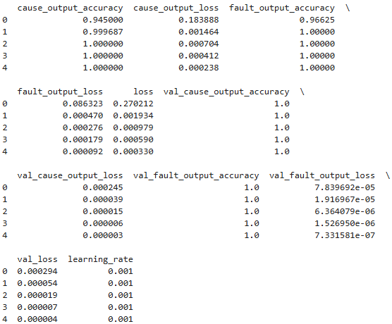

### [17] 신규 데이터 생성
- 정상 1개 / 원인1 고장 1개 / 원인2 고장 1개 총 3개 샘플 생성 -> (저장된 스케일러로 동일하게 전처리 후 예측 준비)
```py
# 신규 샘플 시퀀스 데이터를 저장할 리스트 생성
new_sequences = []

# 첫 번째 신규 샘플은 정상 패턴으로 생성
new_sequences.append(generate_sequence(seq_len=seq_len, mode="normal", cause_class=0))
# 두 번째 신규 샘플은 원인1 유형의 이상 패턴으로 생성
new_sequences.append(generate_sequence(seq_len=seq_len, mode="fault", cause_class=1))
# 세 번째 신규 샘플은 원인2 유형의 이상 패턴으로 생성
new_sequences.append(generate_sequence(seq_len=seq_len, mode="fault", cause_class=2))

# 신규 샘플을 numpy 배열로 변환
new_sequences = np.array(new_sequences)
# 신규 데이터를 2차원으로 펼침 (시계열 데이터 3차원, 정규화는 2차원 필요)
new_sequences_2d = new_sequences.reshape(-1, n_features)
# 저장된 스케일러로 변환
new_sequences_scaled_2d = loaded_scaler.transform(new_sequences_2d)

# 다시 3차원 시계열 형태로 복원 (모델은 3차원으로 인식 필요)
new_sequences_scaled = new_sequences_scaled_2d.reshape(-1, seq_len, n_features)
```

### [18] 신규 데이터 예측
- 3개 샘플 예측 수행 -> 샘플별 고장 확률 / 고장 예측값 / 원인 예측값 / 원인별 확률 출력 -> 결과를 데이터프레임으로 변환 후 CSV 저장으로 예측 이력 로그 생성
```py
# 불러온 모델로 신규 데이터 예측
new_fault_prob, new_cause_prob = loaded_model.predict(new_sequences_scaled)

# 고장 여부 최종 예측값 계산
new_fault_pred = (new_fault_prob.flatten() >= 0.5).astype(int)
# 원인 클래스 최종 예측값 계산
new_cause_pred = np.argmax(new_cause_prob, axis=1)

# 결과를 저장할 리스트 생성
prediction_rows = []

# 각 신규 샘플별 예측 결과 순회
for i in range(len(new_sequences)):
    # 한 샘플의 결과를 딕셔너리 형태로 정리
    row = {
        "sample_id": i + 1,
        "fault_probability": float(new_fault_prob[i][0]),
        "fault_prediction": int(new_fault_pred[i]),
        "cause_prediction": int(new_cause_pred[i]),
        "cause_prob_class_0": float(new_cause_prob[i][0]),
        "cause_prob_class_1": float(new_cause_prob[i][1]),
        "cause_prob_class_2": float(new_cause_prob[i][2]),
        "cause_prob_class_3": float(new_cause_prob[i][3]),
    }

    # 결과 리스트에 예측결과 추가
    prediction_rows.append(row)

    # 화면에 결과 출력
    print(f"\n[신규 샘플 {i+1}]")
    print("고장 확률:", float(new_fault_prob[i][0]))
    print("고장 예측:", int(new_fault_pred[i]))
    print("원인 예측:", int(new_cause_pred[i]))
    print("원인별 확률:", new_cause_prob[i])

# 예측 결과 Log 이력 생성
# 예측 결과를 데이터프레임으로 변환
prediction_df = pd.DataFrame(prediction_rows)

# 예측 결과를 CSV 파일로 저장
prediction_df.to_csv("results/10-2) new_data_predictions.csv", index=False)

# 저장된 예측 결과를 출력
print("\n신규 데이터 예측 결과")
print(prediction_df)
```
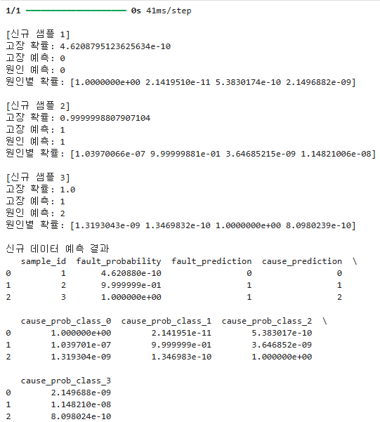
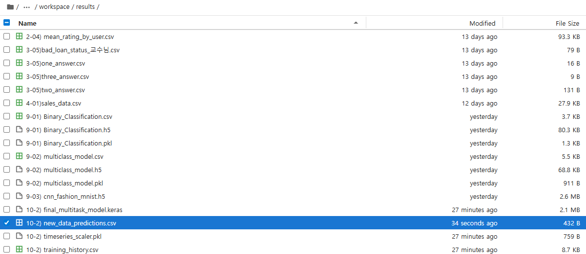

### [19] 학습 곡선 시각화 - 전체 손실
- 에포크별 전체 손실 변화를 train/validation으로 구분하여 시각화
```py
# figure 생성
plt.figure(figsize=(10, 4))

# 학습 손실
plt.plot(history.history["loss"], label="train_loss")
# 검증 손실
plt.plot(history.history["val_loss"], label="val_loss")

plt.title("Total Loss")
plt.xlabel("Epoch")
plt.ylabel("Loss")
plt.legend()
plt.grid(True)
plt.show()
```
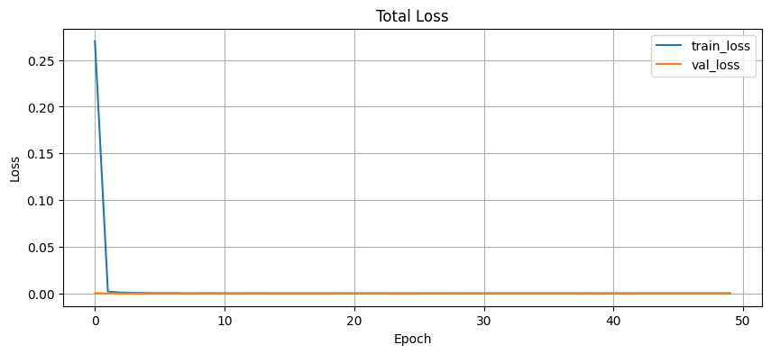
- 두 곡선이 함께 수렴하면 정상 // val_loss만 상승하면 과적합 신호

### [20] 학습 곡선 시각화 - 고장 여부 분류기(정상 or 고장)
- 고장 여부 헤드의 train/validation 정확도 변화 시각화
```py
plt.figure(figsize=(10, 4))

# 고장 여부 학습 정확도
plt.plot(history.history["fault_output_accuracy"], label="train_fault_acc")
# 고장 여부 검증 정확도
plt.plot(history.history["val_fault_output_accuracy"], label="val_fault_acc")

plt.title("Fault Output Accuracy")
plt.xlabel("Epoch")
plt.ylabel("Accuracy")
plt.legend()
plt.grid(True)
plt.show()
```
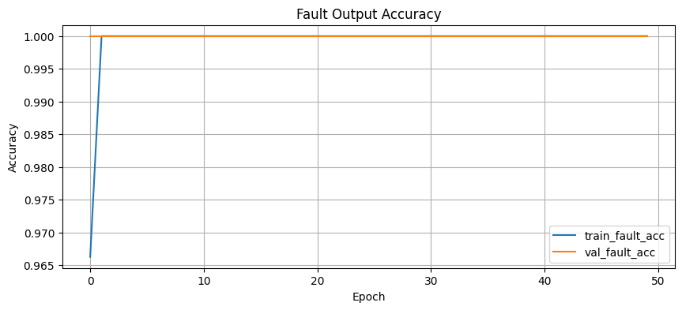
- 이진 분류 특성상 빠르게 높은 정확도에 도달한다.

### [21] 학습 곡선 시각화 - 원인 분류기 (멀티클래스)
```py
plt.figure(figsize=(10, 4))

# 원인 분류 학습 정확도
plt.plot(history.history["cause_output_accuracy"], label="train_cause_acc")
# 원인 분류 검증 정확도
plt.plot(history.history["val_cause_output_accuracy"], label="val_cause_acc")

plt.title("Cause Output Accuracy")
plt.xlabel("Epoch")
plt.ylabel("Accuracy")
plt.legend()
plt.grid(True)
plt.show()
```
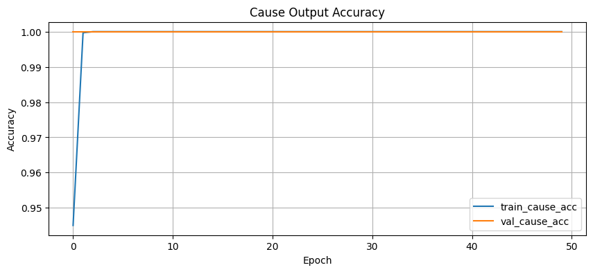
- 원인 분류 헤드의 train/validation 정확도 변화 시각화 
- 고장 여부보다 수렴이 느릴 수 있으며 두 곡선 간격이 크게 벌어지면 과적합 신호이다.

### [22] confusion matirix 시각화 - 고장 여부
```py
plt.figure(figsize=(5, 4))

# confusion matirix 이미지 표시
plt.imshow(fault_cm, cmap="Blues")
plt.title("Fault Confusion Matrix")
plt.xticks([0, 1], ["Pred Normal", "Pred Fault"])

# y축 눈금 설정
plt.yticks([0, 1], ["True Normal", "True Fault"])

# 셀 내부에 숫자 작성
for i in range(fault_cm.shape[0]):
    for j in range(fault_cm.shape[1]):
        plt.text(j, i, fault_cm[i, j], ha="center", va="center")

plt.xlabel("Predicted")
plt.ylabel("True")
plt.show()
```
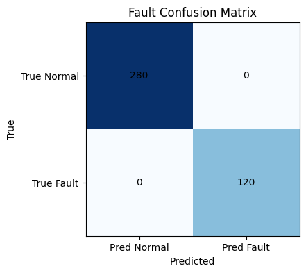
- 고장 여부 confusion matrix 시각화 
- 행: 실제 라벨 / 열: 예측 라벨 
- 대각선이 클수록 성능 양호 (False Negative 수치 중점 확인)

### [23] confusion matirix 시각화 - 원인 분류
```py
plt.figure(figsize=(6, 5))

# confusion matirix 이미지 표시
plt.imshow(cause_cm, cmap="Oranges")
plt.title("Cause Confusion Matrix")

# x축 눈금 설정
plt.xticks(range(n_cause_classes), [f"Pred {i}" for i in range(n_cause_classes)])
# y축 눈금 설정
plt.yticks(range(n_cause_classes), [f"True {i}" for i in range(n_cause_classes)])

# 셀 내부에 숫자 작성
for i in range(cause_cm.shape[0]):
    for j in range(cause_cm.shape[1]):
        plt.text(j, i, cause_cm[i, j], ha="center", va="center")


plt.xlabel("Predicted")
plt.ylabel("True")
plt.show()
```
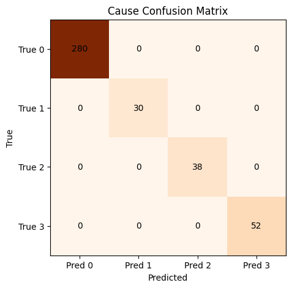
- 원인 4개 클래스 confusion matrix 시각화
- 어떤 클래스 간 혼동이 자주 발생하는지 확인 --> 혼동이 잦은 클래스 쌍은 이상 패턴 강도 조정 또는 추가 센서 특징을 활용해야 함.

### [24] 신규 데이터 예측 결과 시각화 - 고장 확률
- 신규 3개 샘플의 고장 확률을 막대그래프로 시각화
```py
plt.figure(figsize=(8, 4))

# 신규 샘플 고장 확률 막대그래프
plt.bar(range(len(new_fault_prob)), new_fault_prob.flatten())

# 기준선 0.5 표시
plt.axhline(0.5, linestyle="--")

plt.title("New Sample Fault Probabilities")
plt.xlabel("Sample Index")
plt.ylabel("Fault Probability")
plt.grid(True)
plt.show()
```
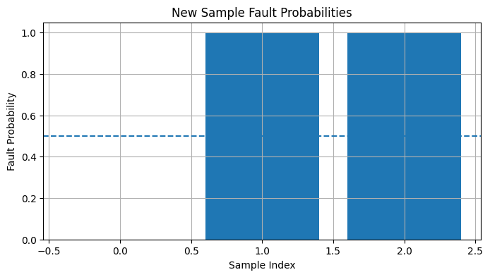
- 0.5 기준선 표시
- 정상 샘플은 기준선 아래 / 고장 샘플은 기준선 위에 위치

### [25] 신규 데이터 예측 결과 시각화 - 원인 클래스 확률
- 3개 샘플 각각의 원인 클래스별 확률을 subplot으로 시각화
```py
plt.figure(figsize=(12, 4))

# 신규 샘플 수만큼 반복
for i in range(len(new_cause_prob)):
    # 1행 N열 구조로 subplot을 생성
    plt.subplot(1, len(new_cause_prob), i + 1)

    # 해당 샘플의 원인 클래스 확률 막대그래프
    plt.bar(range(n_cause_classes), new_cause_prob[i])

    plt.title(f"Sample {i+1}")
    plt.xlabel("Cause Class")
    plt.ylabel("Probability")

    # x축 눈금 설정
    plt.xticks(range(n_cause_classes))
    plt.grid(True)

plt.tight_layout()
plt.show()
```
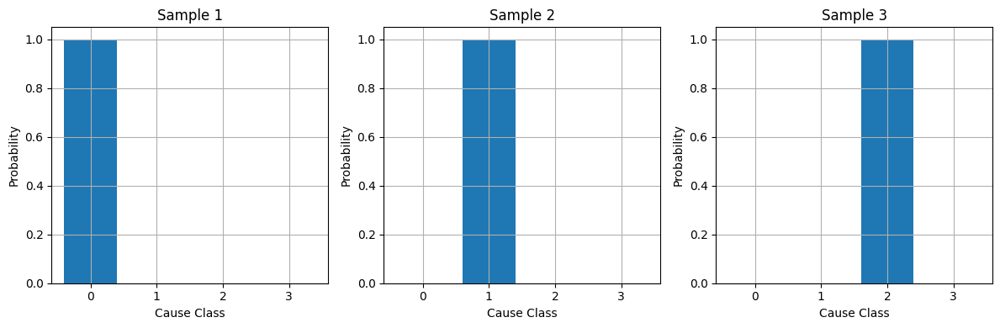
- 해당 클래스의 막대가 압도적으로 높아야 정상 예측 
- + 확률이 여러 클래스에 분산되면 모델이 패턴을 명확히 구분하지 못하는 것이다.
