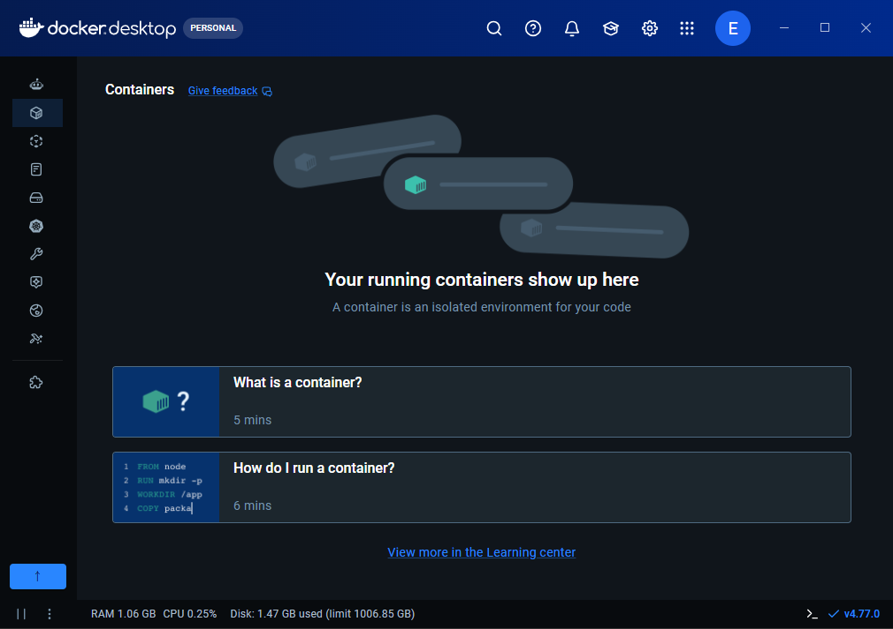

# 12일차 - 6/11(목)
- 회의 참석: https://whaleon.us/o/CSvuJa/64dffed07c6741c990f69804e3b62d6e

# 11일차 뒷부분 나머지 코드 올려놨다
- https://github.com/ilovejwoo1004-bit/AI_advanced/blob/main/%EC%84%A4%EB%B9%84%EA%B3%A0%EC%9E%A5%20%EC%82%AC%EC%A0%84%20%EC%98%88%EC%B8%A1%2B%ED%92%88%EC%A7%88%EC%9B%90%EB%B6%84%EB%A5%98%20%EB%A9%80%ED%8B%B0%ED%83%9C%EC%8A%A4%ED%81%AC%20%EB%AA%A8%EB%8D%B8_%EC%8B%A4%EC%8A%B5.ipynb

# MLOps 환경 구축에 관하여

- AI 플랫폼 아키텍처이다. 실제 회사에서 이렇게 설계하고 플랫폼 구축 했었다.
- 아랫단 쿠퍼네티스, 윗단 쿠버플로우
- 엔드 투 엔드 플랫폼
- 센서데이터들이 아래에서 실시간으로 올라온다

- MQTT 카프카로 실시간으로 원천디비에 적재한다

- 분석과 스토리지 서버 모니터링 서버 분석서버 등 병렬로 클러스터링 구성한다

- 쿠버네티스는 전반적 오케스트레이션 관리한다.
- 쿠버에서 실시간 데이터 처리를 위해 어떤 컴퓨터 부하가 적은지 등 로드밸런싱 자동으로 해준다.
- 쿠버네티스는 데이터 끌어올때 하둡과 스파크가 프레임워크로 내재 돼 있어서 분산/병렬처리가 자동으로 된다.

- AI 서비스가 배포되면 서비스 서빙해주는 기능도 있고 여러가지 기타 보안, 사용자권한, 깃/레포 관리 등 전반적 오케스트레이션 해주는 기능이 있다.

- 쿠버플로우는 데이터가져와서 전처리하고 -> 모델개발하고(머신러닝/딥러닝) ->튜닝하고 -> 학습결과 배포하고 서비스단 운영하는데, 운영할때 새로운 데이터 들어오면 기존 데이터와 다른 성격 데이터인 경우 드리프트 감지하고 -> 재훈련 및 재배포 하는 부분까지 (모델운영) 서비스로 관리해야 한다.

- 쿠버플로우는 이걸 각자 배포하지않고 이런 분석과정을 파이프라인으로 자동화 연결한다. 그것이 MLOps 이다.
- 이렇게 서빙이 되면, 더 윗단 엔드투엔드 유저단 실시간 사용자와 데이터를 주고받으면서 피드백을 하게 된다.

- 오늘 실습할 내용: 쿠버플로우 단, MLOps, 드리프트 감지, 재훈련/재배포
- 쿠버플로우를 사용하면 버튼몇개만 설정하면 자동으로 해주지만, 버튼을 누를때 백단에서 작업을 해야한다.
- 도커 이미지로 빌드하고 이미지 컨테이너화 해서 컴포즈로 구성해서 자동화하는 과정을 또 직접 해야한다. 쿠버도 도커컨테이너 기반 자동화를 해준다. 
- 제일 오래 걸리는 것: 수집. 데이터스케일설정, 센서구성, 설비데이터가져오기(PLC통신), 스키마설계/구성 등등
- 구축하는 건 오픈소스라서 그렇게 오래 걸리진 않았다. 데이터 준비가 더 오래걸림
- 한가지 팁: 쿠버네티스/쿠버플로우 빅데이터에서 굉장히 효율적이다. 하둡스파크로 자동 분산병렬처리 해주기 때문이다. 하지만 빅데이터는 대기업같은 곳에서 하루에 몇백테라 쌓이는 경우(한달 어마어마) 이런 경우 쓰면 좋다. 하지만 중소/중견에서는 데이터 사이즈가 그렇게 크지 않다. 그럼 굳이 쿠버네티스 쓸 필요가 없다. 
## 도커컨테이너
- 도커컨테이너로 배포/운영 관리를 해도 충분하다. 삼성SNS/LG-CNS/SK 대기업 중심 거래인 경우 프레임워크를 사용하는데, 중소/중견 수준이면 쿠버까지는 필요가 없고 도커컨테이너 쓰는 게 대부분이다.
- 오늘은 도커컨테이너 기반으로 MLOps 실습하는 것을 진행할 것이다.
- 도커는 오픈소스 기반의 가상화 플랫폼이다.
## 버추얼 머신과 도커의 차이점

- 버추얼 머신은 가상화 환경을 띄움. 운영체제 베이스 위에 프로세스 구성할 수 있도록 가상화 환경마다 잡아 주어야 한다
- 근데 도커는 도커위에 바로 앱(프로세스)
- 도커는 프로세스만 가상화 시키면 된다. 모든 설치 코드베이스로 가상화환경 운영/배포할 수 있고 리소스가 훨씬 가볍다.

- 도커는 리눅스 베이스 위에서 동작된다. 윈도우에서는 안된다.
- 도커 이미지에는 어플리케이션 파일을 넣는다. 파이썬파일, pip install 라이브러리 등등, 연결되는 config 파일 등 어플리케이션에 필요한 파일들을 넣고 빌드시킨다. -> 컨테이너에 포함시켜 서비스를 배포하는 구조이다.
- 도커 이미지를 굉장히 잘 구성해야 한다.
- 그걸 또 컴포즈로 통합시킬 수도 있다.

## MLOps 구성
### 개발 영억

- 도커 이미지 빌드를 컨테이너화 시켜서 배포

- 배포 파일들에 대하여 형상관리가 되어야 한다

- 개발환경 관리, 자원관리 등은 쿠버네티스 단에서 다 해주는 것이다.

### 검증 영역

- 배포 이미지를 가지고 실시간 데이터 가져오면 추론해서 결과 도출하고 서비스를 하게 되는 것이다.

### 배포 영역

- 배포용 도커 이미지를 배포하게 된다.

- 관리들은 자동적으로 깃/젠킨스 기반으로 연결해서 처리할 것이다
- 중소/중견: 도커/도커컨테이너 기반 리소스 -> 젠킨스를 통해 배포 및 운영/관리 한다.

# MLOps 구성 실습
## 0. 설치 및 환경 설정

### 1. Anaconda PowerShell Prompt (관리자) 에서 wsl 설치

- 위처럼 아나콘다 파워쉘 프롬프트를 실행하여 `wsl --install` 진행

- 위와 같이 user account 설정을 해준다

- 버전 확인: `wsl -l -v`
- 

- 이제 이렇게 들어가 줌

- 이렇게 접속 가능: `sudo su - root`
### 2. ubuntu 에서 파이썬 설치 
- 설치된 우분투 열어서 루트 권한으로 접속(`sudo su - root`): 
- 나의 계정(human3_02) 경로로 이동: `cd /home/human3_02`
- 파이썬 설치
    - `sudo apt update`
    - `sudo apt install python3 python3-pip -y`
    - `python3 --version`: 
### 3. 도커 설치 + 도커 테스크톱 환경 설정
- 설치 URL: https://www.docker.com/products/docker-desktop/
- 내 pc 마우스 오른쪽 -> 속성 확인: 
- 인텔 코어인 경우 amd 설치: 
- 거의 다 기본으로 설치(OK): 
- 배경화면에 도커 데스크톱 프로그램 생김.
- 도커 데스크톱 상단의 Settings - Resources - WSL integration -> 둘 다 체크 + `Apply`: 
- 도커 데스크톱 기본 화면: 
