# 12일차 - 6/11(목)
- 회의 참석: https://whaleon.us/o/CSvuJa/64dffed07c6741c990f69804e3b62d6e

# MLOps 환경 구축에 관하여
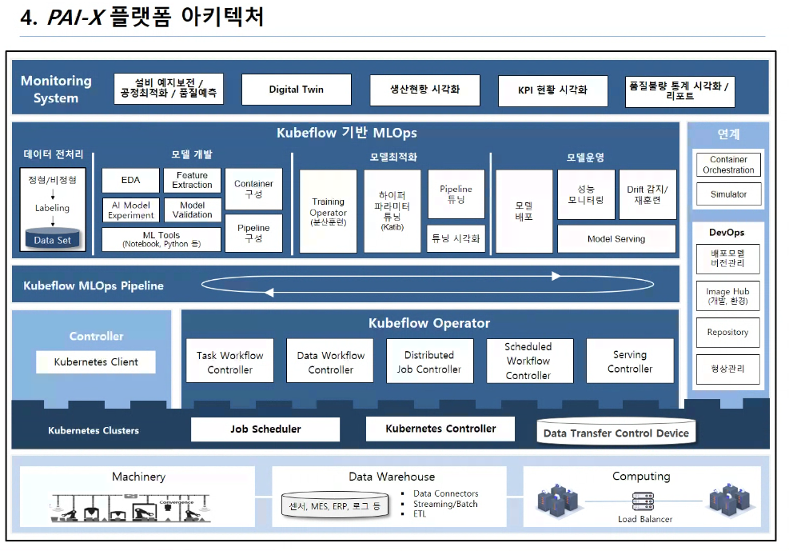
- AI 플랫폼 아키텍처이다. 실제 회사에서 이렇게 설계하고 플랫폼 구축 했었다.
- 아랫단 쿠퍼네티스, 윗단 쿠버플로우
- 엔드 투 엔드 플랫폼
- 센서데이터들이 아래에서 실시간으로 올라온다: 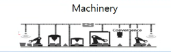
- MQTT 카프카로 실시간으로 원천디비에 적재한다: 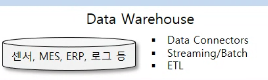
- 분석과 스토리지 서버 모니터링 서버 분석서버 등 병렬로 클러스터링 구성한다: 
- 쿠버네티스는 전반적 오케스트레이션 관리한다.
- 쿠버에서 실시간 데이터 처리를 위해 어떤 컴퓨터 부하가 적은지 등 로드밸런싱 자동으로 해준다.
- 쿠버네티스는 데이터 끌어올때 하둡과 스파크가 프레임워크로 내재 돼 있어서 분산/병렬처리가 자동으로 된다.
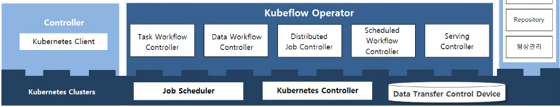
- AI 서비스가 배포되면 서비스 서빙해주는 기능도 있고 여러가지 기타 보안, 사용자권한, 깃/레포 관리 등 전반적 오케스트레이션 해주는 기능이 있다.
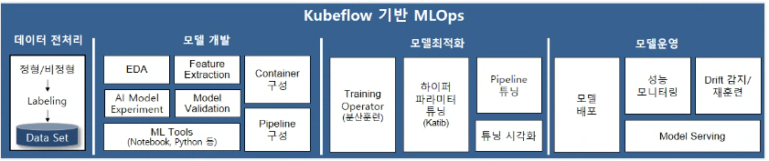
- 쿠버플로우는 데이터가져와서 전처리하고 -> 모델개발하고(머신러닝/딥러닝) ->튜닝하고 -> 학습결과 배포하고 서비스단 운영하는데, 운영할때 새로운 데이터 들어오면 기존 데이터와 다른 성격 데이터인 경우 드리프트 감지하고 -> 재훈련 및 재배포 하는 부분까지 (모델운영) 서비스로 관리해야 한다.

- 쿠버플로우는 이걸 각자 배포하지않고 이런 분석과정을 파이프라인으로 자동화 연결한다. 그것이 MLOps 이다.
- 이렇게 서빙이 되면, 더 윗단 엔드투엔드 유저단 실시간 사용자와 데이터를 주고받으면서 피드백을 하게 된다.
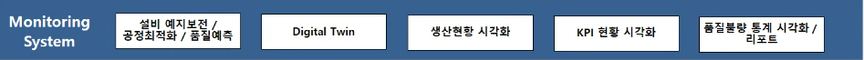
- 오늘 실습할 내용: 쿠버플로우 단, MLOps, 드리프트 감지, 재훈련/재배포
- 쿠버플로우를 사용하면 버튼몇개만 설정하면 자동으로 해주지만, 버튼을 누를때 백단에서 작업을 해야한다.
- 도커 이미지로 빌드하고 이미지 컨테이너화 해서 컴포즈로 구성해서 자동화하는 과정을 또 직접 해야한다. 쿠버도 도커컨테이너 기반 자동화를 해준다. 
- 제일 오래 걸리는 것: 수집. 데이터스케일설정, 센서구성, 설비데이터가져오기(PLC통신), 스키마설계/구성 등등
- 구축하는 건 오픈소스라서 그렇게 오래 걸리진 않았다. 데이터 준비가 더 오래걸림
- 한가지 팁: 쿠버네티스/쿠버플로우 빅데이터에서 굉장히 효율적이다. 하둡스파크로 자동 분산병렬처리 해주기 때문이다. 하지만 빅데이터는 대기업같은 곳에서 하루에 몇백테라 쌓이는 경우(한달 어마어마) 이런 경우 쓰면 좋다. 하지만 중소/중견에서는 데이터 사이즈가 그렇게 크지 않다. 그럼 굳이 쿠버네티스 쓸 필요가 없다. 
## 도커컨테이너
- 도커컨테이너로 배포/운영 관리를 해도 충분하다. 삼성SNS/LG-CNS/SK 대기업 중심 거래인 경우 프레임워크를 사용하는데, 중소/중견 수준이면 쿠버까지는 필요가 없고 도커컨테이너 쓰는 게 대부분이다.
- 오늘은 도커컨테이너 기반으로 MLOps 실습하는 것을 진행할 것이다.
- 도커는 오픈소스 기반의 가상화 플랫폼이다.
## 버추얼 머신과 도커의 차이점
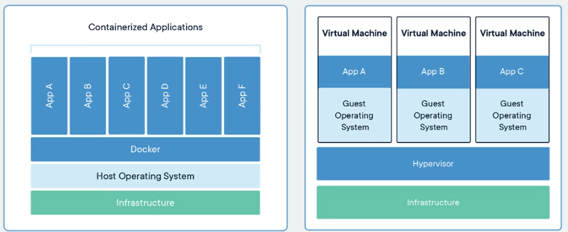
- 버추얼 머신은 가상화 환경을 띄움. 운영체제 베이스 위에 프로세스 구성할 수 있도록 가상화 환경마다 잡아 주어야 한다: 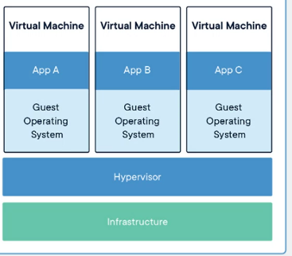
- 근데 도커는 도커위에 바로 앱(프로세스): 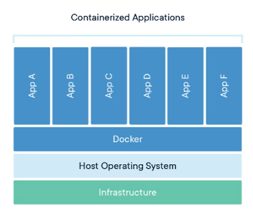
- 도커는 프로세스만 가상화 시키면 된다. 모든 설치 코드베이스로 가상화환경 운영/배포할 수 있고 리소스가 훨씬 가볍다.
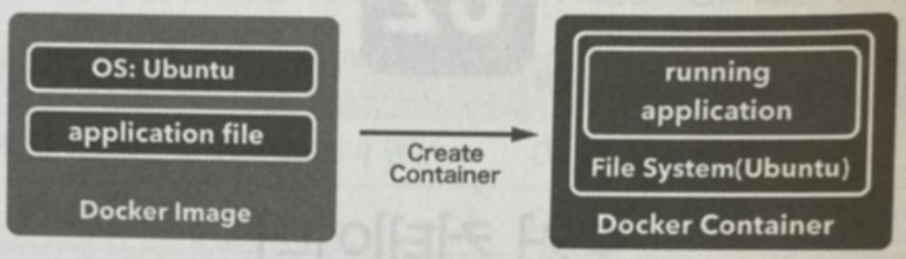
- 도커는 리눅스 베이스 위에서 동작된다. 윈도우에서는 안된다.
- 도커 이미지에는 어플리케이션 파일을 넣는다. 파이썬파일, pip install 라이브러리 등등, 연결되는 config 파일 등 어플리케이션에 필요한 파일들을 넣고 빌드시킨다. -> 컨테이너에 포함시켜 서비스를 배포하는 구조이다.
- 도커 이미지를 굉장히 잘 구성해야 한다.
- 그걸 또 컴포즈로 통합시킬 수도 있다.

## MLOps 구성
### 개발 영억
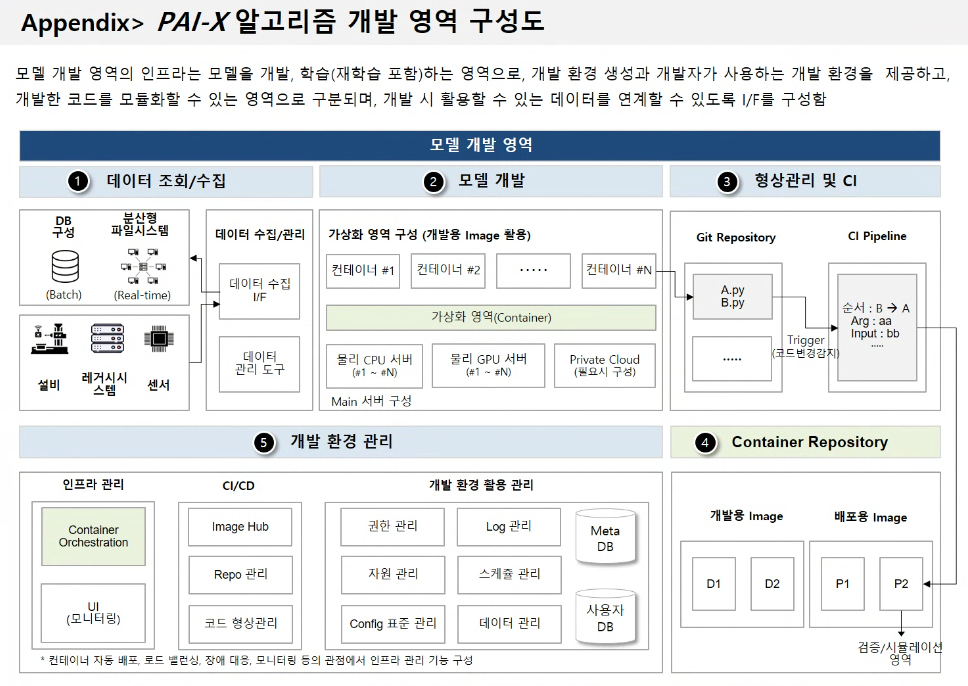
- 도커 이미지 빌드를 컨테이너화 시켜서 배포: 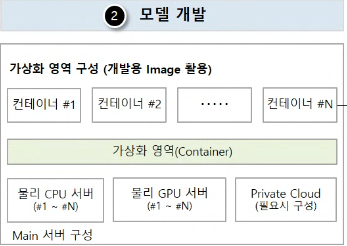
- 배포 파일들에 대하여 형상관리가 되어야 한다: 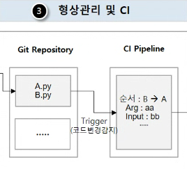
- 개발환경 관리, 자원관리 등은 쿠버네티스 단에서 다 해주는 것이다.

### 검증 영역
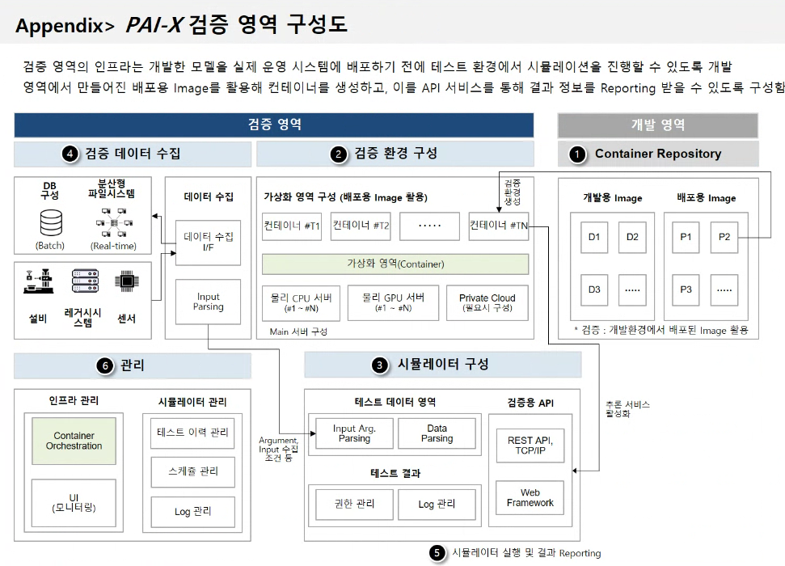
- 배포 이미지를 가지고 실시간 데이터 가져오면 추론해서 결과 도출하고 서비스를 하게 되는 것이다.

### 배포 영역
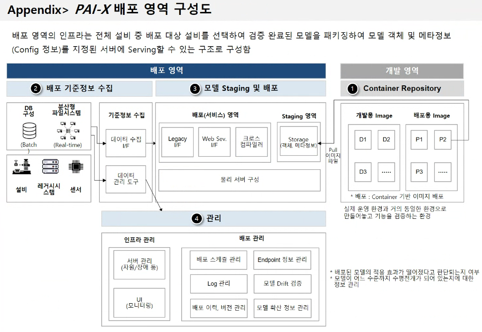
- 배포용 도커 이미지를 배포하게 된다.
- 관리들은 자동적으로 깃/젠킨스 기반으로 연결해서 처리할 것이다: 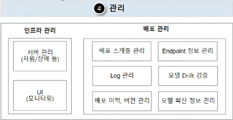
- 중소/중견: 도커/도커컨테이너 기반 리소스 -> 젠킨스를 통해 배포 및 운영/관리 한다.

# MLOps 구성 실습 (Docker, DockerCompose)
## 0. 설치 및 환경 설정
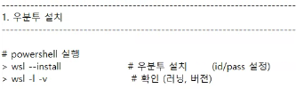
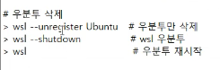
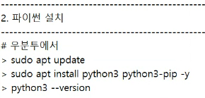
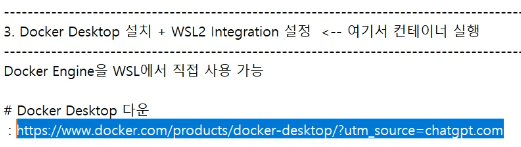
### 1. Anaconda PowerShell Prompt (관리자) 에서 wsl 설치
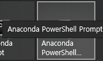
- 아나콘다 파워쉘 프롬프트를 실행하여 `wsl --install` 해줘야 한다: 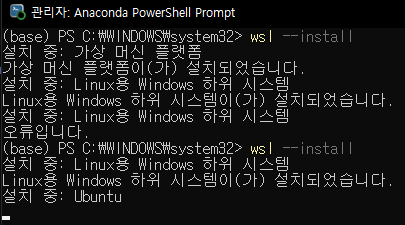
- user account 설정을 해준다: 
- 버전 확인: `wsl -l -v`: 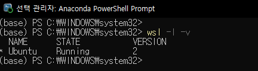
- 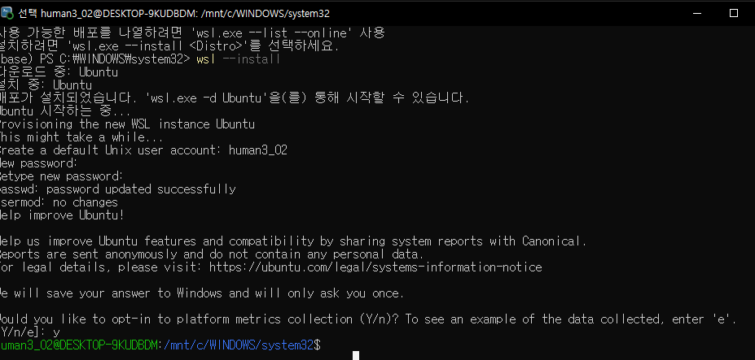
- 이제 이렇게 들어가 줌: 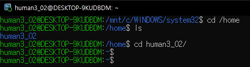
- 이렇게 접속 가능: `sudo su - root`: 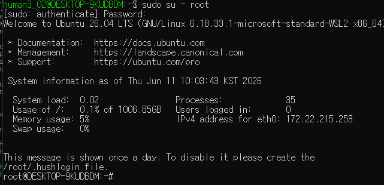
### 2. ubuntu 에서 파이썬 설치 
- 설치된 우분투 열어서 루트 권한으로 접속(`sudo su - root`): 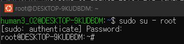
- 나의 계정(human3_02) 경로로 이동: `cd /home/human3_02`
- 파이썬 설치
    - `sudo apt update`
    - `sudo apt install python3 python3-pip -y`
    - `python3 --version`: 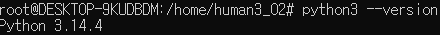
### 3. 도커 설치 + 도커 테스크톱 환경 설정
#### 설치 URL
- https://www.docker.com/products/docker-desktop/
#### 내 PC - 속성 - 프로세서 확인
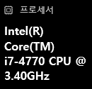
- 내 PC - 마우스 오른쪽 -> 속성 -> 프로세서 확인: Intel Core i7
#### 프로세서에 맞는 도커 설치
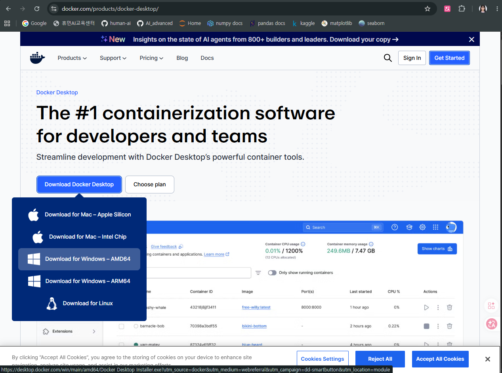
- 인텔 코어인 경우 설치 URL에서 amd 설치
- ARM인 경우 ARM 설치
#### 설치 진행
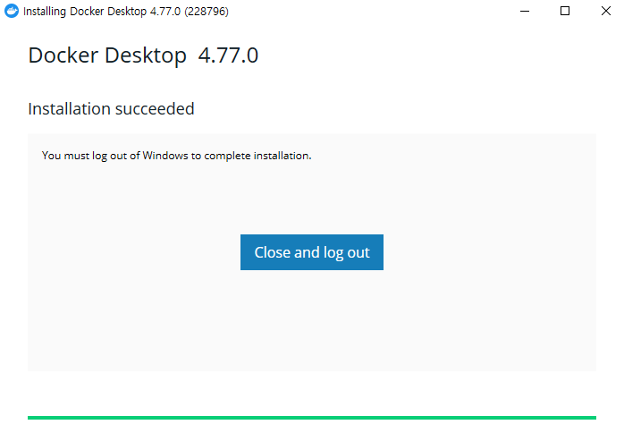
- 거의 다 기본으로 설치 (OK)
- 설치 완료시 배경화면에 도커 데스크톱 프로그램 생김
#### 도커 데스크톱 환경 설정
 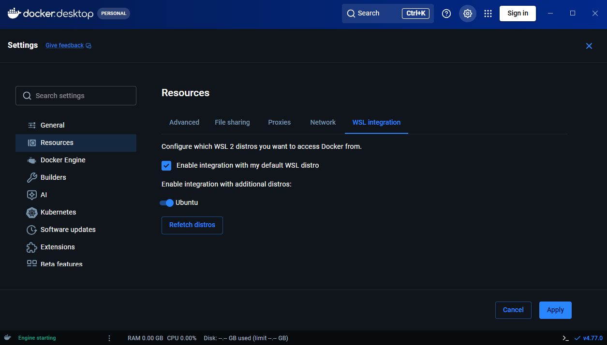
- 도커 데스크톱 상단의 Settings - Resources - WSL integration -> 둘 다 체크 + `Apply & Restart`
#### Anaconda PowerShell Prompt에서 도커 설치 확인
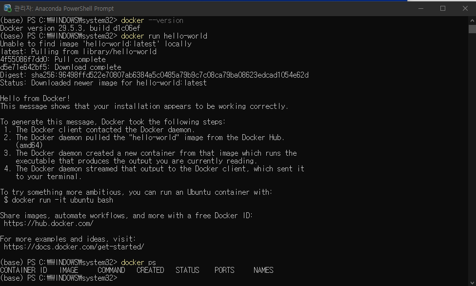
- `docker --version`
- `docker run hello-world`
- `docker ps`

### 4. 실습 환경 구성
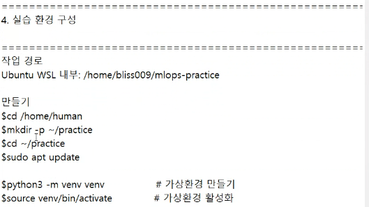
- 위와 같이 진행. 나는 /home에 있는 유저 이름이 human3_02 라서 이 경로에 진행했다: /home/human3_02/practice
#### 가상 환경 설치 및 접속
- `python3 -m venv venv`
- `source venv/bin/activate`
#### 가상 환경에 라이브러리 설치
- `pip install fastapi uvicorn scikit-learn joblib numpy pandas seaborn matplotlib`

## 1. AI 모델 생성 실습 (가상환경)
### [1] vi make_model.py
```bash
cat > make_model.py << 'EOF'
from sklearn.ensemble import RandomForestClassifier
import numpy as np
import joblib

X = np.random.randn(200, 3)
y = (X[:,0] + X[:,1] > 0).astype(int)

model = RandomForestClassifier()
model.fit(X, y)

joblib.dump(model, "model.pkl")
print("model.pkl 생성 완료!")
EOF
```
- 터미널에서 그냥 그대로 붙여넣기 -> 파일 생성됨
- 이후 이 파일 실행하기: `python make_model.py` -> model.pkl 생성 완료됨.

### [2] vi app.py
```py
from fastapi import FastAPI
import joblib

app = FastAPI()
model = joblib.load("model.pkl")

@app.get("/predict")
def predict(f1: float, f2: float, f3: float):
    pred = model.predict([[f1, f2, f3]])
    return {"prediction": int(pred[0])}
```
- 복붙하면 깨져서 그냥 다음과 같이 실행함: 
```bash
cat > app.py << 'EOF'
from fastapi import FastAPI
import joblib
import numpy as np

app = FastAPI()
model = joblib.load("model.pkl")

@app.get("/predict")
def predict(a: float, b: float, c: float):
    pred = model.predict(np.array([[a, b, c]]))
    return {"prediction": int(pred[0])}
EOF
```

### [3] 서버 실행 및 브라우저 테스트
- app.py 실행: `uvicorn app:app --host 0.0.0.0 --port 8000`
- 브라우저 테스트: http://localhost:8000/predict?a=0.1&b=-1&c=2.5
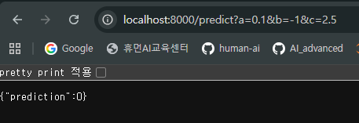

## 2. Dockerfile 생성 및 AI 모델 서버 패키징 진행
- 모델 + 서버 + 라이브러리를 이미지로 묶어 어디서든 실행 가능하게 만듦

### [0] 도커 파일 생성
```bash
cat > Dockerfile << 'EOF'
FROM python:3.10
RUN pip install fastapi uvicorn scikit-learn joblib numpy pandas seaborn matplotlib
COPY app.py /app/app.py
COPY model.pkl /app/model.pkl
WORKDIR /app
CMD ["uvicorn","app:app","--host","0.0.0.0","--port","8000"]
EOF
```

### [2] 도커 이미지 빌드
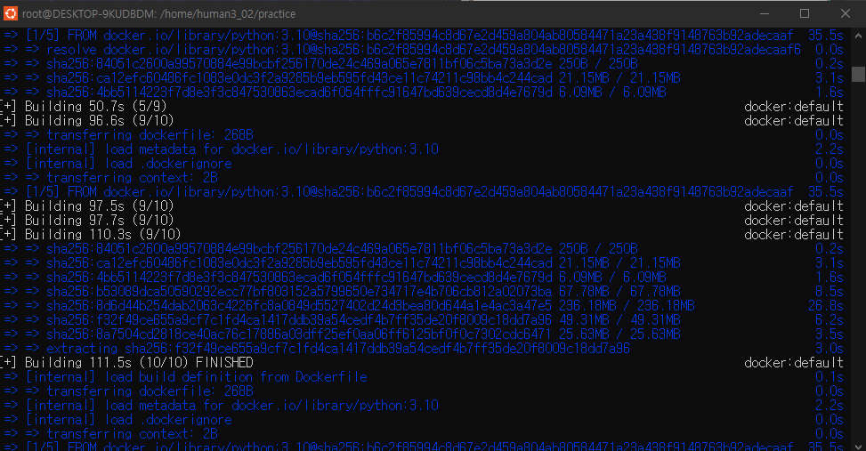
- `sudo docker build -t ai/model:v1 .`

### [3] 도커 모델 서버 실행 및 상태 확인
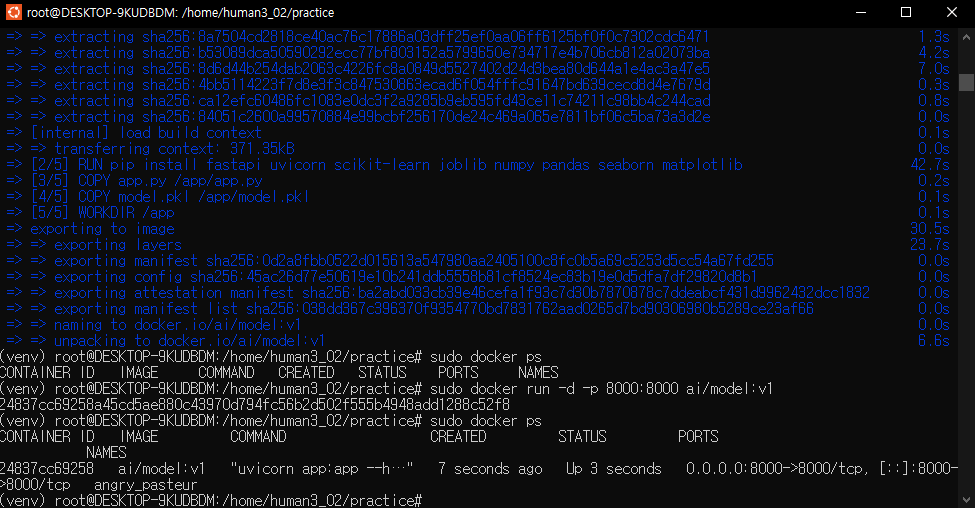
- 확인: `sudo docker ps`
- 도커 서버 실행: `sudo docker run -d -p 8000:8000 ai/model:v1`
- 재확인: `sudo docker ps`

### [4] 테스트 
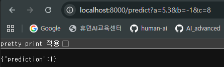
- http://localhost:8000/predict?a=5.3&b=-1&c=8

### 여러개 이중화 시켜서 서버를 띄워 운영할 수 있다.

## 3. 도커 스케일링 실습 (K8s Deployment 유사 실습)
- 컨테이너 아이디: 24837cc69258
- 서버 죽이기: `sudo docker stop 24837cc69258`

### [1] 서버 3개 띄우기 
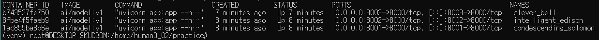
- `sudo docker run -d -p 8001:8000 ai/model:v1`
- `sudo docker run -d -p 8002:8000 ai/model:v1`
- `sudo docker run -d -p 8003:8000 ai/model:v1`

### [2] 결과 테스트
- http://localhost:8001/predict?a=5.3&b=-1&c=8
- http://localhost:8002/predict?a=5.3&b=-1&c=8
- http://localhost:8003/predict?a=5.3&b=-1&c=8
- 위와같이 브라우저에서 url 호출시 셋다 `{"prediction":1}` 라는 결과가 응답된다.

## 4. 무중단 모델 업데이트 진행
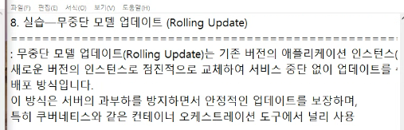
- 8003 포트는 모델 내용 자체를 업데이트 하고 싶다고 가정.
- 현재는 서버 3개가 랜덤포레스트인데, 8003만 로지스틱 리그레션 모델로 하고 싶다면
- 롤링 업데이트(무중단 모델 업데이트)를 진행할 수 있다.

### [1] 새로운 모델 파일 (v2)
```py
cat > make_model_v2.py << 'EOF'
from sklearn.linear_model import LogisticRegression
import numpy as np
import joblib

X = np.random.randn(200, 3)
y = (X[:,0] + X[:,1] > 0).astype(int)

model = LogisticRegression()
model.fit(X, y)

joblib.dump(model, "model.pkl")
print("v2 모델 생성 완료!")
EOF
```
- 실행: `python3 make_model_v2.py`
- --> v2 모델 생성 완료!

### [2] v2 이미지 빌드
- `sudo docker build -t ai/model:v2 .`
- 확인: `docker ps` -> 셋다 실행중 (8001,8002,8003)
- 8001: 1ac855ba3b6e 
- 8002: 8fbe4f5faeb9 
- 8003: b743527fe750 

### [3] 기존 v1 컨테이너 하나씩 교체
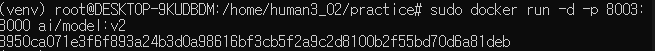
- stop: `sudo docker stop b743527fe750`
- 새로운 모델로 교체: `sudo docker run -d -p 8003:8000 ai/model:v2`
- --> 8950ca071e3f6f893a24b3d0a98616bf3cb5f2a9c2d8100b2f55bd70d6a81deb

### 도커 종료
- `docker stop 1ac855ba3b6e`
- `docker stop 8fbe4f5faeb9`
- `docker stop 8950ca071e3f `
- 확인: `docker ps` -> 셋다 종료됨
- 종료: sudo docker-compose down

## 5. Docker Compose로 단일 명령 배포 실습
- 쿠버네티스의 Deployment + Service를 Docker Compose 1개 파일로 설명 및 docker-compose.yml 생성
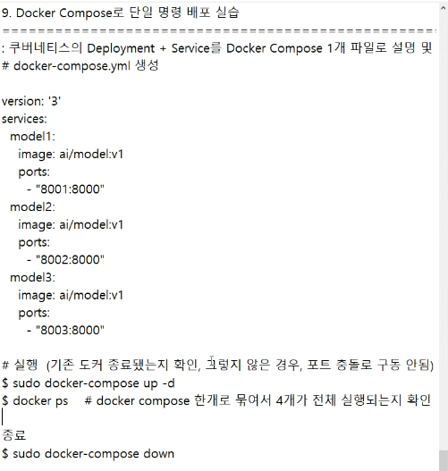

### [1] docker-compose.yml 파일 생성
```bash
cat > docker-compose.yml << 'EOF'
version: '3'
services:
  model1:
    image: ai/model:v1
    ports:
      - "8001:8000"
  model2:
    image: ai/model:v1
    ports:
      - "8002:8000"
  model3:
    image: ai/model:v1
    ports:
      - "8003:8000"
EOF
```
- [TIP] 복붙할 때 `:set paste` 하고 붙여넣으면 잘 맞춰져서 복붙된다고 한다.

### [2] 도커 컴포즈 실행
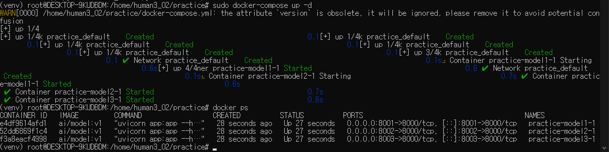
- `sudo docker-compose up -d`
- 확인: `docker ps` -> 셋다 실행됨
- 8001: e4df9614afd1 
- 8002: 52dd6869f1c4 
- 8003: f3a8eacf4998 

### [3] 도커 컴포즈 종료
- `sudo docker-compose down`

# 구글 AI 플랫폼 아키텍처
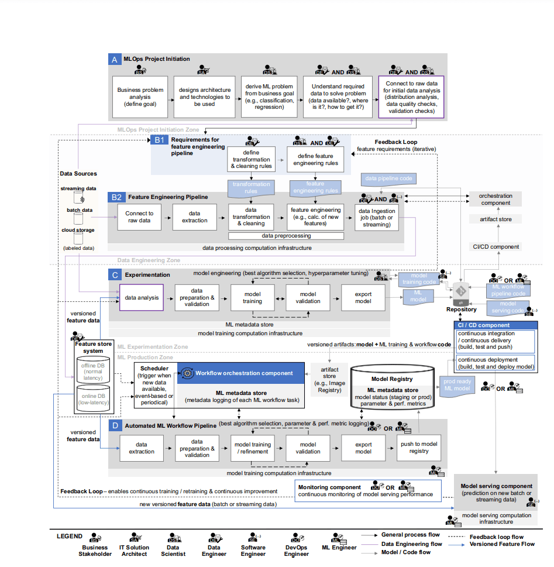
- 아키텍처 설계 -> 데이터 사이언티스트가 문제 풀기위한 문제정의/비즈니스 방향 수립 -> 데이터사이언티스트/엔지니어 알고리즘 어프로치 등 설계 -> 분석 시작
- 피쳐 엔지니어링 파이프라인 부분: 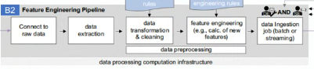
- 코드화 해서 피쳐뽑고 데이터를 저장함(학습 데이터 스토리지): 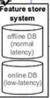
- 실험 단계(개발자의 개별 PC): 각자 모델 테스트
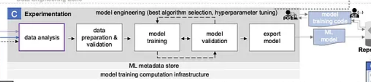
- 좋은 모델이 나오면 export model을 한다.
- 개발자마다 성능좋은 모델이 나오게 되면, 우측 깃에서 형상관리(도커이미지/도커컴포즈 등) 개발/배포/검증 이미지 등
- 우측 레포지터리에 올라가면 담당자가 승인한다.(배포해도 돼)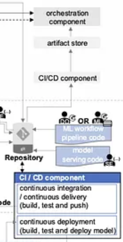
- 그후 CI/CD 젠킨스 배포를 한다.
- 배포 파일은 모델 레지스트리에 있는것이다: 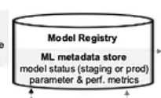
- 이 부분이 실제 MLOps 구축되는 부분이다: 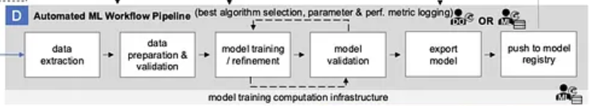
- 그 아래는 모니터링 컴포넌트. 퍼포먼스 떨어지는것 모니터링 한다(AI 모델 성능 판단/이 부분은 꼭 들어가야 함.): 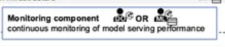
- 모니터링 컴포넌트: 드리프트 감지, 서빙, 재배포 자동으로 될 수 있게 구성해야 한다.
- AI는 운영이 문제이다. 대부분 운영문제. 그걸 최소화하는게 드리프트 재학습 재배포이다(최소) 그러면 조금 더 길게 쓸 수 있다.
    - 차이가 있으면 재학습 트리거(pkl 학습결과 파일 업데이트) -> 인퍼런스쪽 서버도 재가동 시켜야 한다. (자동화)
- 추가적인 참고 URL
    - https://docs.cloud.google.com/architecture/mlops-continuous-delivery-and-automation-pipelines-in-machine-learning
    - https://www.backend.ai/ko/blog/2025-06-airflow-fasttrack2-model-serving
- 이 구글 AI 플랫폼 아키텍처가 플랫폼 아키텍처로서 되게 이상적인 그림이다. (잘 만들었다)

#### 그 외
- 논문이나 자료 찾아서 벤치마킹 해보기

# 도커 컨테이너 기반 MLOps 구축 실습 (venv 가상환경)
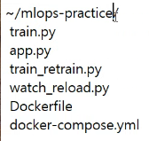
- 사용자 폴더에 mlops-practice 폴더 생성: /home/human3_02/mlops-practice
- train.py
- app.py
- train_retain.py
- watch_reload.py
- Dockerfile
- docker-compose.py
- 가상환경 실행 안된 경우/라이브러리 설치 안된 경우
    - `python3 -m venv venv`
    - `source venv/bin/activate`
    - `pip install fastapi uvicorn scikit-learn joblib numpy pandas seaborn matplotlib`

## 1. train.py (모델 학습)
- 기본 모델(RandomForestClassifier) 학습
- model.pkl 파일 생성
- Drift 기준(reference) 데이터 저장

### [1] train.py 파일 생성 및 실행
```bash
cat > train.py << 'EOF'
"""
train.py
- 최초의 학습 데이터로 모델을 학습하고 model.pkl로 저장
- 학습 데이터 분포(reference.npy)를 저장하여 drift 감지 기준으로 사용
"""

import numpy as np
import joblib
from sklearn.ensemble import RandomForestClassifier
import matplotlib.pyplot as plt
import seaborn as sns

# ----------------------------------------
# 1. 학습 데이터 생성
# ----------------------------------------

# 정규분포를 따르는 실수 데이터 200개 생성
X = np.random.randn(200, 1)

# threshold(0)를 기준으로 이진 라벨 생성
y = (X[:,0] > 0).astype(int)

# ----------------------------------------
# 2. 모델 학습
# ----------------------------------------

model = RandomForestClassifier()
model.fit(X, y)

# ----------------------------------------
# 3. 학습된 모델과 레퍼런스 데이터 저장
# ----------------------------------------

joblib.dump(model, "model.pkl")      # 모델 저장
np.save("reference.npy", X)          # 학습 당시 데이터 분포 저장

print("모델 학습 완료: model.pkl / reference.npy 생성됨")

# ----------------------------------------
# 4. 학습 데이터 분포 시각화
# ----------------------------------------

# 데이터 로드
reference = np.load("reference.npy")

# 분포 시각화
plt.figure(figsize=(10,5))

# 히스토그램 + KDE
sns.histplot(reference[:,0], bins=30, kde=True)

plt.title("Reference Data Distribution (Training Data)")
plt.xlabel("Feature Value")
plt.ylabel("Frequency")

plt.grid()
plt.show()
EOF
```
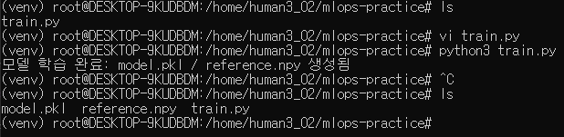
- 실행: `python3 train.py`
- --> 모델 학습 완료: model.pkl / reference.npy 생성됨

## 2. app.py
- 예측 수행
- drift 감지
- drift 발생 시 자동 재학습 트리거

### [1] app.py 파일 생성 및 실행
- 신규 인풋데이터에 대해 분석 결과를 추론해주는 파일이다.
- 감지 -> train_retrain.py 파일 실행해 달라고 트리거를 건다.
- --> train_retrain.py 에서 재학습 하는 코드 있으면 된다.
```bash
cat > app.py << 'EOF'
from fastapi import FastAPI
import numpy as np
import joblib
from scipy.stats import ks_2samp
import subprocess

app = FastAPI()

# ---------------------------------------------------------
# 1. 모델과 기준(reference) 데이터 로드
# ---------------------------------------------------------
model = joblib.load("model.pkl")
reference = np.load("reference.npy").ravel()   # KS-test 용 1차원 데이터
incoming = []  # 운영 데이터 누적 리스트

# ---------------------------------------------------------
# 2. 예측 엔드포인트
# ---------------------------------------------------------
@app.get("/predict")
def predict(value: float):
    """
    입력된 value 값에 대해 예측을 수행하고,
    incoming 데이터를 누적하여 drift 여부를 반환한다.
    """

    incoming.append(value)

    drift_detected = False  # 기본값

    # ---------------------------------------------------------
    # Drift 감지: 50개 이상 쌓이면 KS-test 수행
    # ---------------------------------------------------------
    if len(incoming) > 50:
        stat, p = ks_2samp(reference, incoming)
        drift_detected = bool(p < 0.05)  # numpy.bool -> python bool 변환

        if drift_detected:
            print("Drift 감지 -> incoming.npy 저장")
            np.save("incoming.npy", np.array(incoming))

            # 자동 재학습 프로세스 실행
            subprocess.Popen(["python3", "train_retrain.py"])

    # ---------------------------------------------------------
    # 모델 예측 수행
    # ---------------------------------------------------------
    pred = model.predict([[value]])  # 입력 shape(1,1) 유지 필수

    return {
        "value": value,
        "prediction": int(pred[0]),
        "drift_detected": drift_detected,
        "sample_size": len(incoming)
    }
EOF
```
### [2] 서버 실행
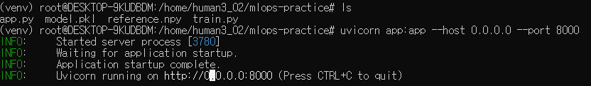
- `uvicorn app:app --host 0.0.0.0 --port 8000`
- fast-api 예측 서버가 구동되었다.

### [3] 테스트 (정상 데이터 요청/이상 데이터 요청)
#### 정상 데이터 요청
- `for i in $(seq 1 40); do curl "http://localhost:8000/predict?value=0.1"; echo; done`
- `for i in $(seq 1 10); do curl "http://localhost:8000/predict?value=10"; echo; done`
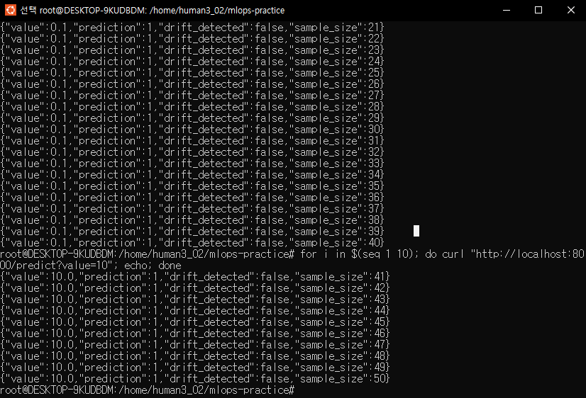

#### 이상 데이터 요청 (드리프트 감지)
- `for i in $(seq 1 20); do curl "http://localhost:8000/predict?value=-5"; echo; done`
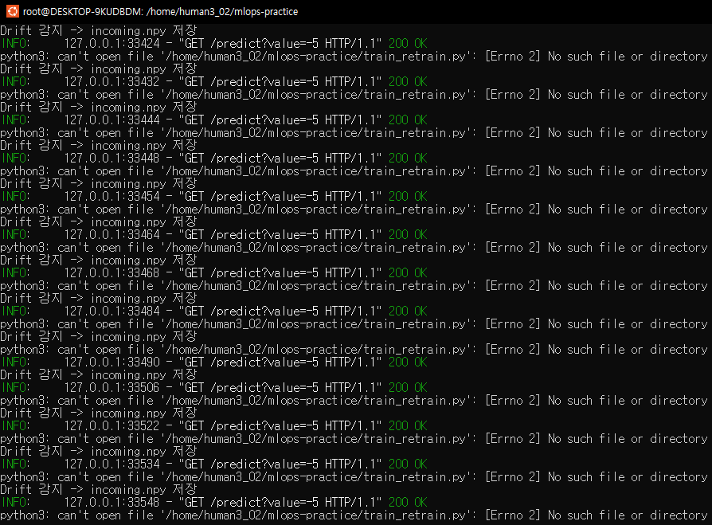
- 드리프트 감지됨

## 3. train_retrain.py
- incoming.npy 기반 재학습
- model.pkl 업데이트

### [1] train_retrain.py 파일 생성 및 드리프트 재학습 (드리프트 -> 재학습)
- Drift 발생 후 저장된 incoming.npy로 재학습 수행 
- 단일 클래스 데이터일 경우 재학습 생략하여 오류 방지
```bash
cat > train_retrain.py << 'EOF'
import numpy as np
import joblib
from sklearn.linear_model import LogisticRegression

print("재학습 시작")

# ---------------------------------------------------------
# 1. incoming 데이터 로드
# ---------------------------------------------------------
incoming = np.load("incoming.npy")
X = incoming.reshape(-1, 1)           # 2차원으로 변환
y = (X[:,0] > 0).astype(int)          # threshold 기반 라벨 생성

# ---------------------------------------------------------
# 2. 단일 클래스 여부 체크
# ---------------------------------------------------------
unique_classes = np.unique(y)
print("incoming 데이터 클래스:", unique_classes)

if len(unique_classes) < 2:
    print("단일 클래스 -> 재학습 스킵")
    exit(0)

# ---------------------------------------------------------
# 3. 모델 재학습
# ---------------------------------------------------------
model = LogisticRegression()
model.fit(X, y)

# ---------------------------------------------------------
# 4. 새로운 모델 저장
# ---------------------------------------------------------
joblib.dump(model, "model.pkl")

print("재학습 완료 -> model.pkl 업데이트됨")
EOF
```
- 일단 만들어만 뒀음. 
### [2] 다시 이상 데이터 요청 (드리프트 감지)
- `for i in $(seq 1 20); do curl "http://localhost:8000/predict?value=-5"; echo; done`

### [3] 결과
- 드리프트 감지되고, 재학습하고, model.pkl 파일까지 업데이트 한다.
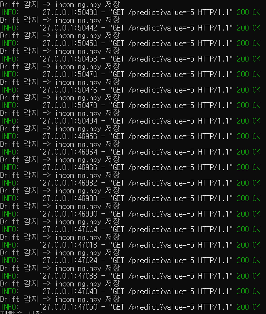
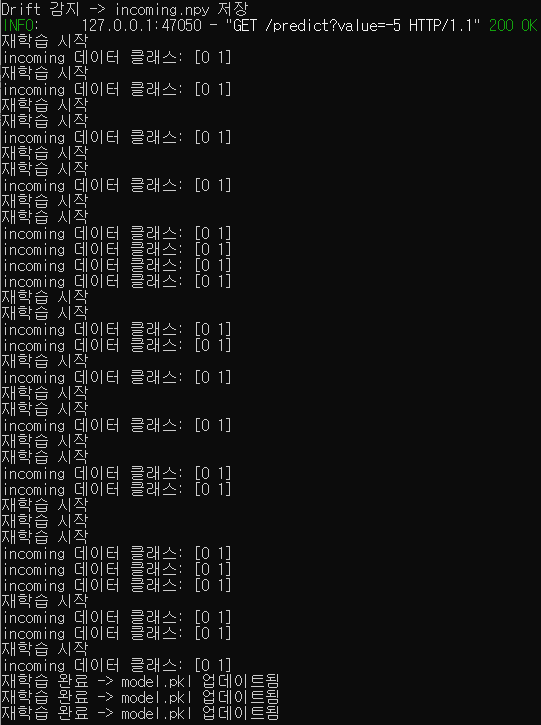
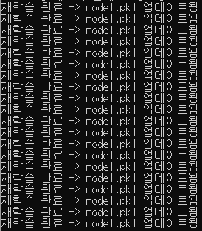

### [4] 결과 해석
1. 단일 클래스일 때
    - incoming 데이터 클래스: [1]
    - 단일 클래스 → 재학습 스킵
    - 기존 모델 유지
2. 다중 클래스일 때
    - incoming 데이터 클래스: [0 1]
    - 재학습 완료 → model.pkl 업데이트됨
    - 이후 시나리오 4에서 자동 reload 발생

### [참고] 드리프트 감지에 관하여
- 드리프트 감지 모듈은 별도로 모듈을 구축해야 한다. (구글 AI 아키텍처 우측중하단 부분에 빈 부분 참고)

## 4. watch_reload.py
- o	model.pkl 변경 감지 → FastAPI 재시작

### [1] watch_reload.py 파일 생성 및 실행 (모델 변경(.pkl 변경) 감지->FastAPI 자동 재시작)
- model.pkl이 변경되면 -> FastAPI 서버 자동 재시작 (자동 재배포 효과)
```bash
cat > watch_reload.py << 'EOF'
"""
watch_reload.py
- model.pkl 파일의 수정시간(mtime)을 모니터링
- 변경되면 FastAPI 서버를 자동 재시작하여 새로운 모델 즉시 반영
"""

import os
import time
import subprocess

MODEL_FILE = "model.pkl"

# ---------------------------------------------------------
# model.pkl의 수정 시간 반환 함수
# ---------------------------------------------------------
def get_ts():
    return os.path.getmtime(MODEL_FILE)

print("model.pkl 변경 감지 시작")

last_ts = get_ts()

# ---------------------------------------------------------
# FastAPI 최초 실행
# ---------------------------------------------------------
process = subprocess.Popen([
    "uvicorn", "app:app",
    "--host", "0.0.0.0",
    "--port", "8000"
])

# ---------------------------------------------------------
# 파일 변경 감지 루프
# ---------------------------------------------------------
while True:
    time.sleep(1)
    new_ts = get_ts()

    if new_ts != last_ts:  # 변경됨
        print("model.pkl 변경 감지 -> FastAPI 재시작")

        process.kill()
        process = subprocess.Popen([
            "uvicorn", "app:app",
            "--host", "0.0.0.0",
            "--port", "8000"
        ])

        last_ts = new_ts
        print("FastAPI 재시작 완료 (새 모델 적용됨)")
EOF
```
- 기존 유비콘 서버 종료
- 실행: `python watch_reload.py`

### [2] 이상 데이터 요청 (드리프트 감지)
```bash
for i in $(seq 1 30); do curl "http://localhost:8000/predict?value=5"; echo; done
for i in $(seq 1 30); do curl "http://localhost:8000/predict?value=-5"; echo; done
```
### [3] 결과 확인
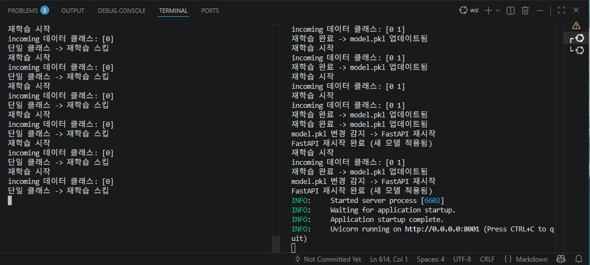
- 재학습 되면서 model.pkl 이 업데이트 되고, model.pkl의 변경을 감지하여 FastAPI가 재시작 되었다.

## [참고] 재학습 흐름에 대한 구조
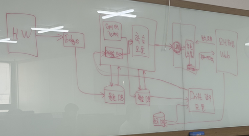
- 모니터링 Web 분석 요청 -> 추론 모듈 (.PKI) -> 결과 피드백
- HW -> Edge -> 원천 DB <-> 재학습 트리거 -> 학습 모듈 -> .PKI <-> 추론 모듈 -> Serving -> 모니터링 Web 결과 피드백
- 모니터링 Web -> 신규 DB -> Drift 감지 모듈 -> 재학습 트리거 -> 학습 모듈 -> .PKI 업데이트 <-> 추론 모듈 -> Serving -> 결과 피드백

## 5. Docker + Docker Compose 통합 실행
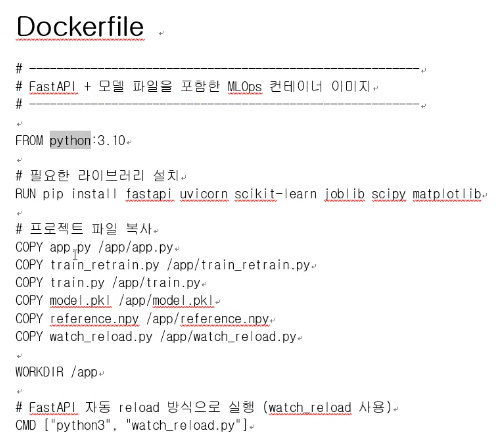
- 기존 생성 되었던 인커밍 데이터 지우기: `rm incoming.npy`
- 기존 실행 중인 서버들 다 중지 시키기
- 이 부분이 현업 MLOps와 동일한 구조이다.

### [1] Dockerfile 생성
```bash
cat > Dockerfile << 'EOF'
# ---------------------------------------------------------
# FastAPI + 모델 파일을 포함한 MLOps 컨테이너 이미지
# ---------------------------------------------------------

FROM python:3.10

# 필요한 라이브러리 설치
RUN pip install fastapi uvicorn scikit-learn joblib scipy

# 프로젝트 파일 복사
COPY app.py /app/app.py
COPY train_retrain.py /app/train_retrain.py
COPY train.py /app/train.py
COPY model.pkl /app/model.pkl
COPY reference.npy /app/reference.npy
COPY watch_reload.py /app/watch_reload.py

WORKDIR /app

# FastAPI 자동 reload 방식으로 실행 (watch_reload 사용)
CMD ["python3", "watch_reload.py"]
EOF
```

### [2] docker-compose.yml 생성
```bash
cat > docker-compose.yml << 'EOF'
version: "3.8"

services:
  mlops-api:
    build: .
    container_name: mlops-fastapi
    ports:
      - "8000:8000"     # FastAPI 포트
    volumes:
      - .:/app          # model.pkl 변경 시 즉시 반영
    restart: always
EOF
```

### [3] 도커 기반 전체 실행 흐름
1. 이미지 빌드: `docker build -t mlops/api:v1 .`
2. 컨테이너 실행: `docker-compose up`
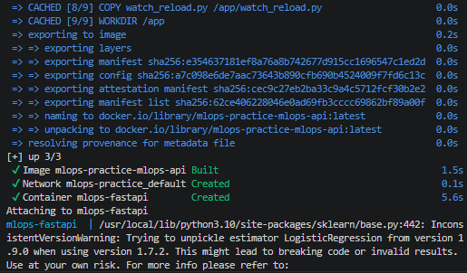
3. 예측 요청: `curl "http://localhost:8000/predict?value=0.5"`
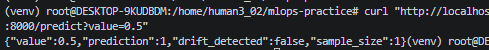
4. drift 유도: `for i in $(seq 1 60); do curl "http://localhost:8000/predict?value=10"; echo; done`
```
- drift 감지
- incoming.npy 저장
- train_retrain.py 자동 실행
- model.pkl 업데이트
- FastAPI 자동 reload
- 컨테이너 내부에서도 자동 반영됨
```

### [3-2] 결과 확인 (드리프트 감지 -> 재학습 스킵)
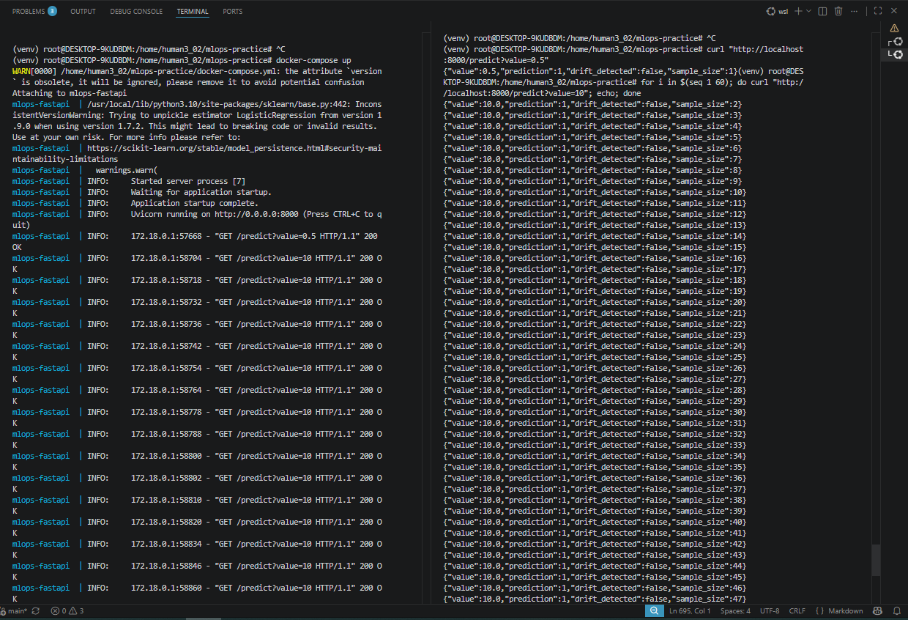
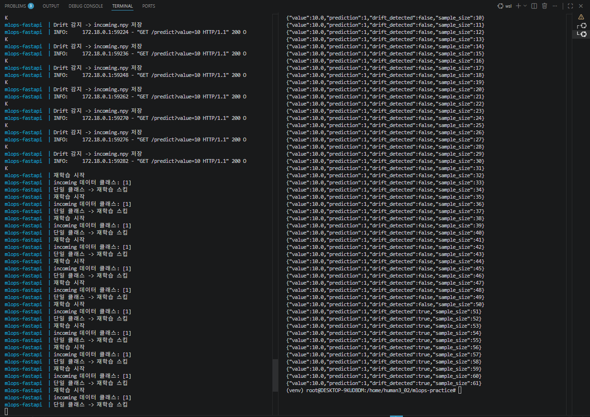
### [4] 드리프트 유도
```bash
for i in $(seq 1 30); do curl "http://localhost:8000/predict?value=5"; echo; done
for i in $(seq 1 30); do curl "http://localhost:8000/predict?value=-5"; echo; done
```
#### [4-2] 결과 확인 (드리프트 감지 -> incoming.npy 저장 -> 재학습 시작 -> incoming 데이터 클래스[0,1] -> 재학습 완료 -> model.pkl 업데이트 -> 전체 재학습/pkl 업데이트 완료시 -> 서버 재시작)
- 드리프트 감지 -> incoming.npy 저장 -> 재학습 시작
- -> incoming 데이터 클래스[0,1] -> 재학습 완료
- -> model.pkl 업데이트 -> 전체 재학습/pkl 업데이트 완료 -> 서버 재시작
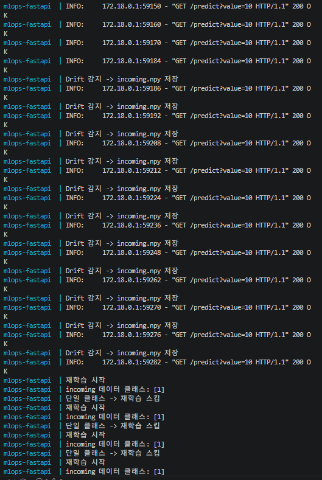
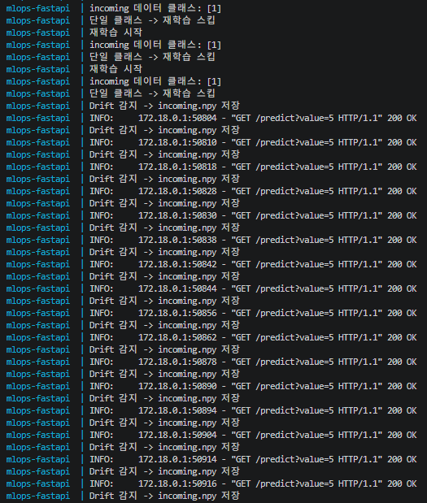
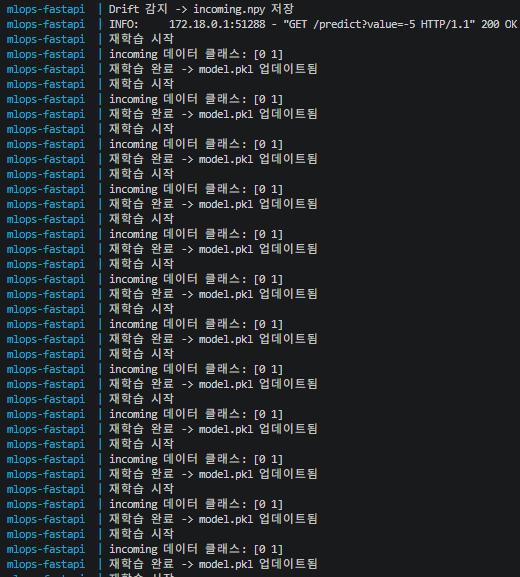
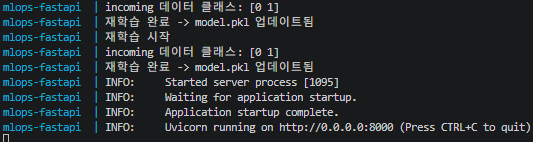
