# 13일차 - 6/15(월)
- 회의 참석: https://whaleon.us/o/CSvuJa/64dffed07c6741c990f69804e3b62d6e

# CI/CD에 관하여
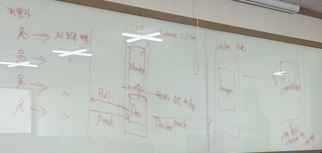
- 우리도 깃에다 우리가 만든 모델 pkl 및 yaml 파일 등등의 소스코드 들을 올릴 것이다.
- dev -> 관리자 승인 -> main(master)
- docker push를 하면 docker hub에 푸시가 되어 이미지들을 관리할 수 있다.
- 깃과 도커 허브에서 관리를 해나갈 예정이다.

## AI Architecture Checkpoint 기반으로 설명
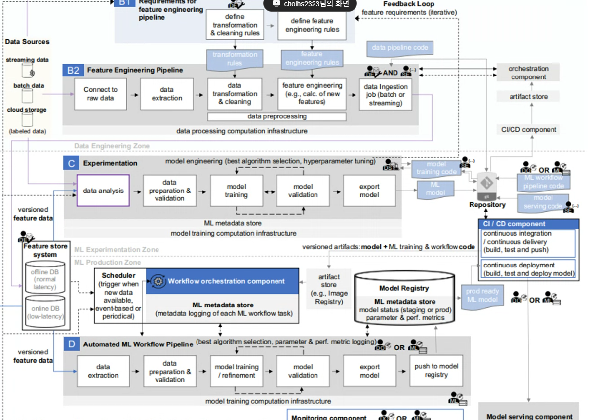
### 개발자의 로컬 PC
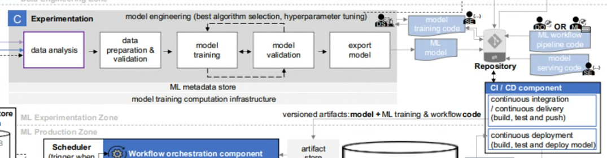
- 이 부분이 개발자의 로컬 pc에서 개발하는 부분이다. push 하면
- -> 우측 CI/CD 컴포넌트 (보통 젠킨스 자동 빌드 배포 툴 많이 사용한다.)
### CI/CD -> 배포 하면 서비스로 나아감 (자동 순환)
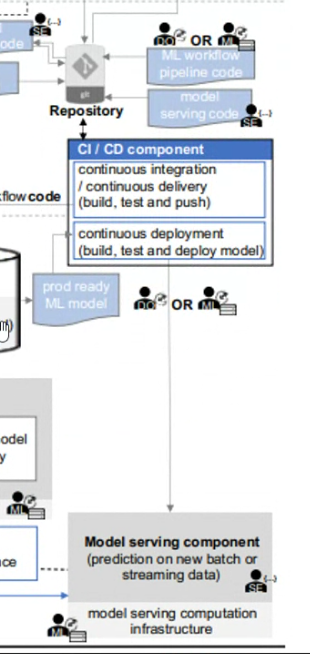
- 지속적 자동 빌드, 자동 배포 -> 서비스
- 오늘은 이 실습을 진행하는 것이다.

# 실습 진행 예정 흐름
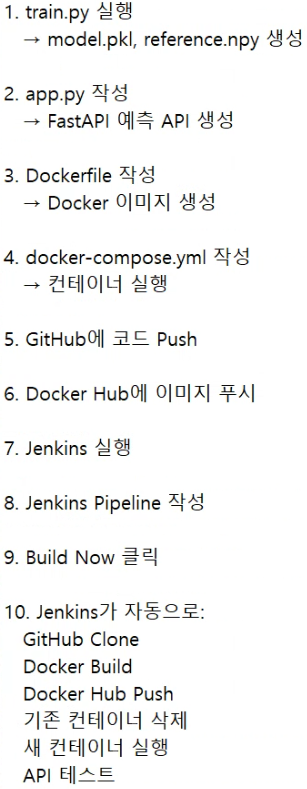

# CI/CD 관점의 실습 (Jenkins)
## 0. 우분투 실습 폴더 세팅 & 가상환경 실행
- 우분투에서 지난번 실습했던 이 경로까지 오고: `/home/human3_02/practice`
- 가상환경 실행: `source venv/bin/activate`
- 폴더 조회: `ls -al`
### [1] 가상화 환경만 냅두고 다 지우기
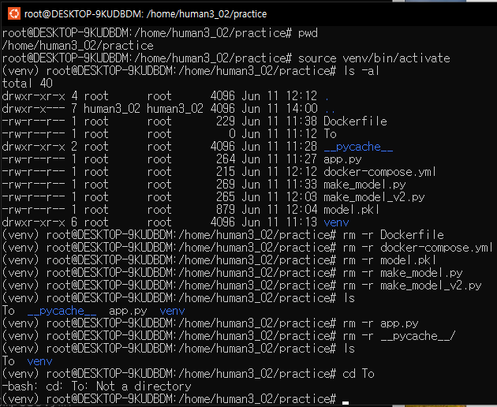
- `rm -r Dockerfile`
- `rm -r Dockerfile`
- `rm -r model.pkl`
- `rm -r make_model.py`
- `rm -r make_model.py`
- `rm -r app.py`
- `rm -r __pycache__/`

## 1. 파일 세팅
### [1] train.py 파일 생성 및 실행
```py
cat > train.py << 'EOF'
import numpy as np
import pickle
from sklearn.ensemble import RandomForestClassifier

X = np.random.randn(200, 1)
y = (X[:, 0] > 0).astype(int)

model = RandomForestClassifier()
model.fit(X, y)

with open("model.pkl", "wb") as f:
    pickle.dump(model, f)

np.save("reference.npy", X)

print("model.pkl, reference.npy 생성 완료")
EOF
```
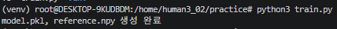
- 실행: `python3 train.py`

### [2] app.py 파일 생성 및 실행
```py
cat > app.py << 'EOF'
from fastapi import FastAPI
import pickle
import numpy as np

app = FastAPI()

with open("model.pkl", "rb") as f:
    model = pickle.load(f)

@app.get("/")
def home():
    return {"message": "AI Model API is running"}

@app.get("/predict")
def predict(value: float):
    X = np.array([[value]])
    pred = model.predict(X)[0]
    return {
        "input": value,
        "prediction": int(pred)
    }
EOF
```
- 실행: `python3 app.py`

### [3] requirements.txt 파일 생성
```py
cat > requirements.txt << 'EOF'
fastapi
uvicorn
scikit-learn
numpy
EOF
```
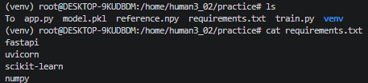

### [4] Dockerfile 파일 생성
```py
cat > Dockerfile << 'EOF'
FROM python:3.10-slim

WORKDIR /app

COPY requirements.txt .
RUN pip install --no-cache-dir -r requirements.txt

COPY . .

EXPOSE 8000

CMD ["uvicorn", "app:app", "--host", "0.0.0.0", "--port", "8000"]
EOF
```

## 2. 도커 허브 설치
### [0] 도커 데스크탑 띄워두기
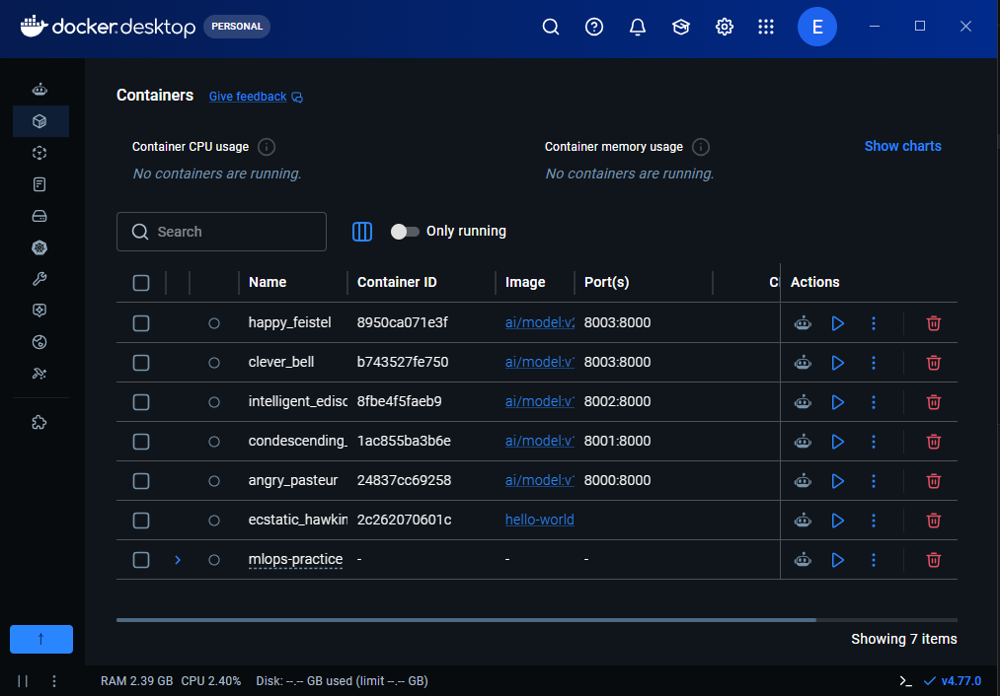
- 실행되고 있는 것 있으면 중지

### [1] 도커 허브 홈페이지 접속 및 로그인
- 홈페이지: https://hub.docker.com/
- 우측 상단 로그인 버튼을 통해 로그인 진행
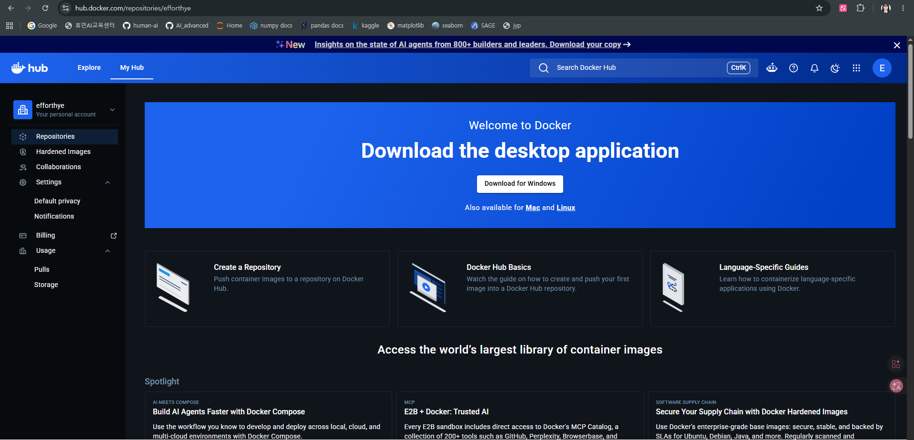

## 3. 도커 이미지 레포지토리 만들기
- create repository 버튼 클릭
- 레포지토리 이름: human_docker
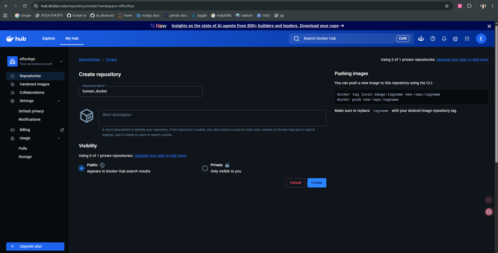
### 이미지 레포지토리 생성 확인
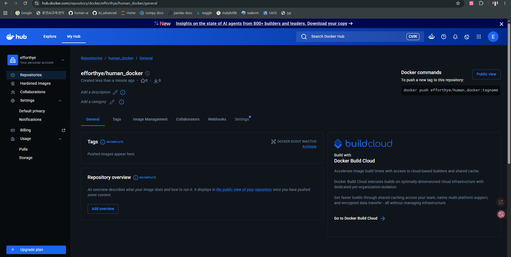

## 도커 허브 및 레포지토리 등 관련 정보 잘 저장해 두기
- Docker Hub ID: efforthye
- Docker Hub Repository: human_docker
- Docker Image: efforthye/human_docker.latest
- Container Name: ai-model-api
- Port: 8000
- Jenkins Port: 8080

## 4. 새로운 우분투 창 열기 -> 도커 로그인
- 터미널에서 도커 허브가 연결되지 않으면 나중에 push가 되지 않으므로 새 창에서 연결시킨다.

### [1] `docker login` 명령어 입력
- 그러면 `브라우저 주소`와 `코드`가 나오게 됨
- 브라우저 주소에 들어가서 코드를 입력하면 로그인 됨
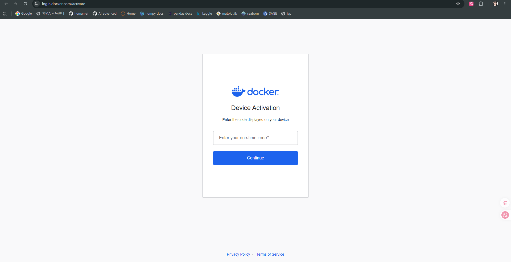
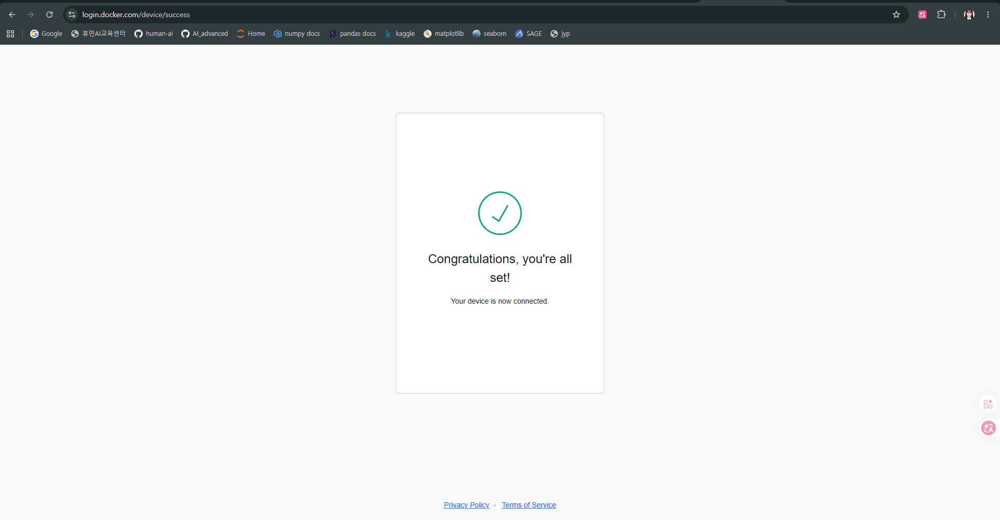
#### 로그인 성공 확인
- `docker info | grep Username`
- --> Username 출력됨
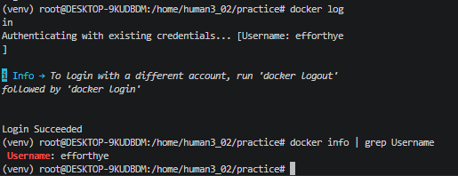

## 5. 도커 이미지 생성
### [1] 도커 이미지 생성
- `docker build -t ai-model-api:latest .`
- 위 명령어 실행시 기존 작성한 Dockerfile 기반으로 도커 이미지가 생성된다.
#### 도커 이미지 생성 중 (building)
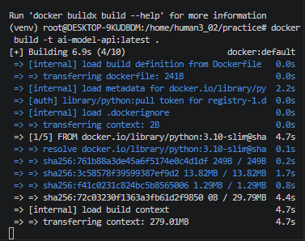

### [1-2] [참고] 도커 이미지 삭제
- 아래 삭제 명령어는 실행하지는 말고 추후 문제 생겼을시 이미지 삭제 후 위처럼 도커파일을 도커 빌드하여 이미지 재생성 하면 된다.
- `docker rmi ai-model-api:latest`

### [2] Docker Hub 이름으로 태그 변경
- `docker tag ai-model-api:latest efforthye/human_docker.latest`
#### 도커 이미지 생성 확인
- `docker images`
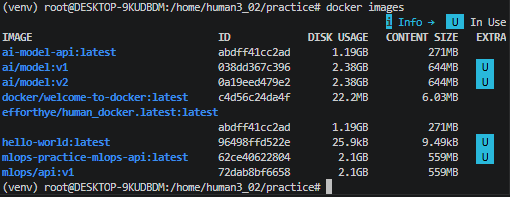
#### 유저 네임 나오면 정상
- `docker info | grep Username`
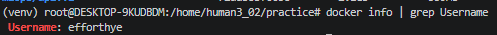

### [3] Docker Push (도커 허브에 도커 이미지 저장)
- `docker push efforthye/human_docker:latest`
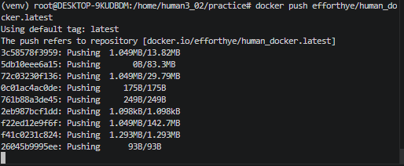
#### 도커 푸시 완료됨
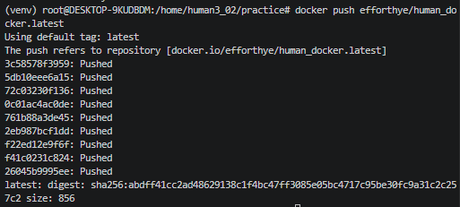
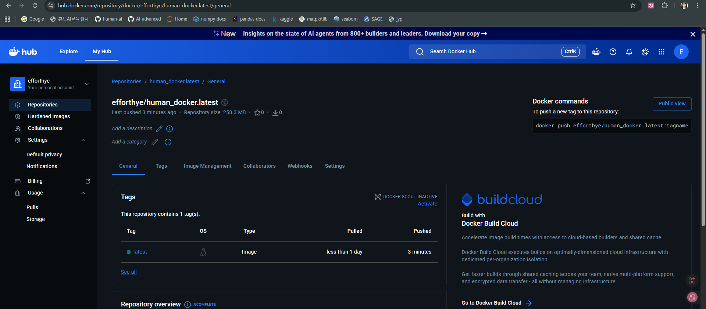
#### 다른 곳에 생겼길래 이렇게 다시 만듦
```
docker tag efforthye/human_docker.latest:latest efforthye/human_docker:latest
docker push efforthye/human_docker:latest
```
#### Image Management로 들어가면 푸시된 도커 이미지들 확인 가능
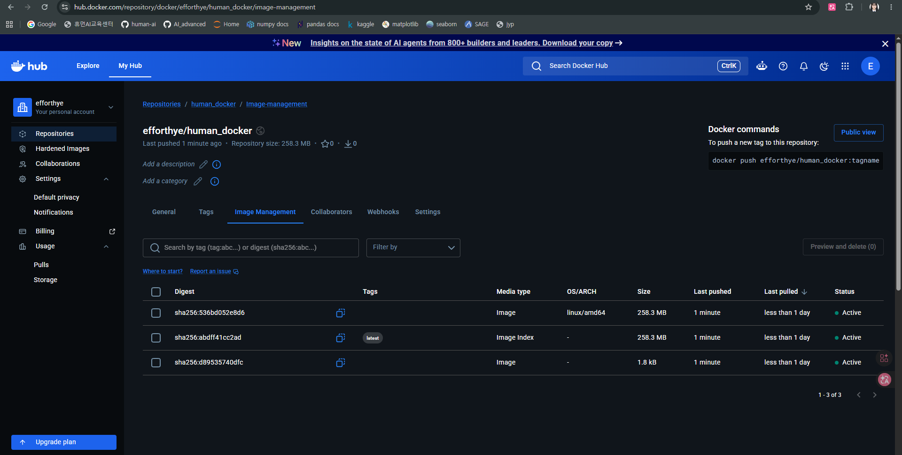

### 이처럼 개발환경, 배포환경, 운영환경 이미지 이런 식으로 여러 이미지를 관리하게 된다.
- 관리해야 하는 3가지: 깃, 도커 허브, 젠킨스
- 지금은 수작업으로 하나하나 빌드, 푸시하고 있다 (최초 1회)
- 마지막에 Jenkins를 할 때는 자동 빌드, 자동 테스트, 자동 배포를 진행할 것이다.
- Jenkins Webhook 이 있어서 코드 변경되면 자동으로 푸시되고 -> 해당 이미지를 읽어서 자동 빌드 배포하는 파이프라인이 자동 연결된다.
- 깃에다 코드만 올리면 젠킨스가 빌드 테스트 배포를 자동으로 해준다.

### [참고] 필드에서의 서버 환경
- 온프레미스(내부에 여러 서버 구축), 클라우드, 하이브리드(온프레미스+클라우드) 로 나뉜다.
- 큰기업들은 보안이 강해서 외부망에 데이터를 연결할 수 있는 상황이 거의 없다.
- 내부 로우데이터를 웬만하면 방화벽으로 막아놔서 못내보낸다.
- `분석엔진서버(학습서버)`: 내부에 서버1(CPU), 서버2(GPU), 서버3(스토리지), 서버4, ... 이런 식으로 분산시켜 구축한다. (온프레미스 환경/서버실) ==> 분석엔진 서버에서는 실시간 데이터 땡겨와서 학습까지 이루어진다.
    - 다 클라우드에 올리기에는 비용이 어마어마하기 때문 + 보안 --> 보통 온프레미스로 구축
- `추론서버`: [학습 결과], [추론 모듈 <-> endpoint] <-> `엔드유저 웹서비스`
    - 추론서버는 온프레미스 또는 클라우드 형태로 구축된다. 보안에 문제 없는 이유: 로우 데이터를 보낼 일이 었기 때문에 보안적으로 조금 문제가 덜 해진다. 그래서 클라우드로 구성하기도 한다.
- 추론서버에 학습결과 업데이트 하는 것 까지는: Batch Scheduling 으로 계속 작업 돌림
- 추론서버와 엔드유저 사이는 Real Time 으로 처리된다. (실시간)
- 위와 같이 하이브리드 형태로 시스템/플랫폼 환경이 구축된다. 
- 프로젝트 진행 시, 필드 환경을 최대한 모사하는 게 좋다. 필드 형태와 비슷하게 진행한다.

## 5. 도커 컴포즈 실행 (도커 허브)

### [1] docker-compose.yml 파일 생성
```py
cat > docker-compose.yml << 'EOF'
version: '3.8'

services:
  app:
    build: .
    ports:
      - "8000:8000"
    volumes:
      - .:/app
    restart: always
EOF
```
#### 도커 구동 중인 것 없어야 함
- `docker ps` 로 확인 후 있으면 제거

### [2] 도커 컴포즈 실행
- `docker compose up -d`
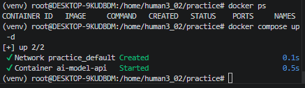
#### 도커 실행 확인
- `docker ps`
- --> 컨테이너 1개 올라와 있음: 9b3a9ee89976
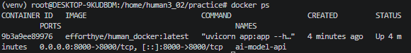

### [3] 도커 컴포즈 테스트
- 요청: `curl http://localhost:8000/`
- 결과: {"message":"AI Model API is running"}
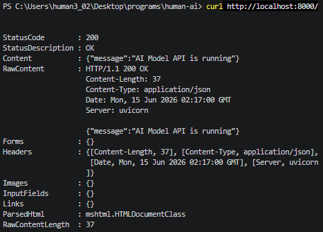
- 요청: `curl http://localhost:8000/predict?value=1.5`
- 결과: {"input":1.5,"prediction":1}
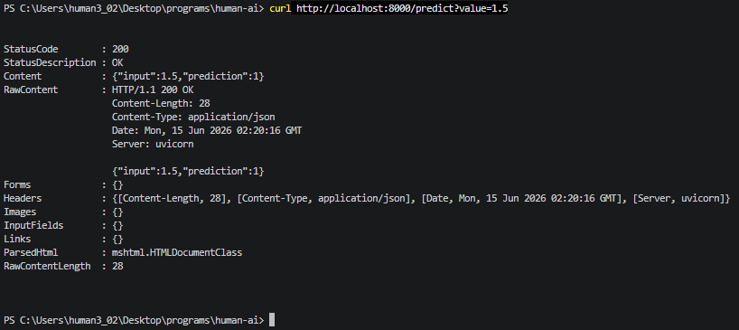
#### 도커 로그 확인
- 실시간 로그: `docker logs -f ai-model-api`
- 최근 50줄: `docker logs --tail 50 ai-model-api`
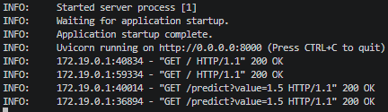
#### 만약 코드 오류 있으면 다시 도커 이미지 빌드/Push 해야 함

### 현재까지 진행 된 내용
#### 개발 영역
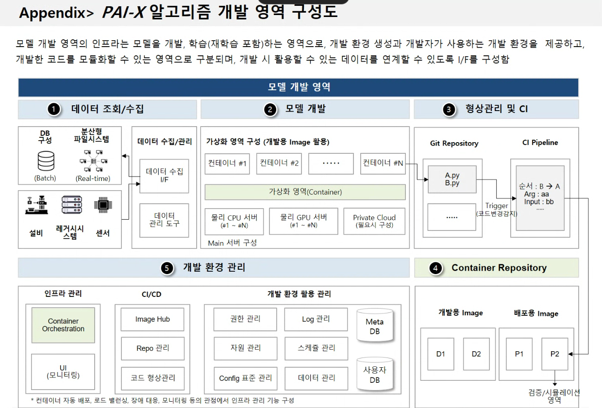
- 개발 영역에서 `3. 형상관리 및 CI`, `4. Container Repository` 를 진행한 것이다.
- CI 파이프라인이 젠킨스이다. (자동으로 빌드 -> 빌드 이미지 -> 깃허브에 push) // 현재는 수작업으로 4번으로 옮겼다.
- 두 개의 깃에서 관리가 되어야 한다. 
- 젠킨스는 깃에서 코드 변경을 감지해서 도커 허브에 자동 빌드/테스트/배포를 진행한다.
- 현재는 간단하게 하고 있지만, 필드에서는 세부적으로 관리 해야 한다. 현재는 개발 영역이지만 검증 영역/배포 영역 다 따로따로 관리하여야 한다.
    - 검증 영역: 
    - 배포 영역: 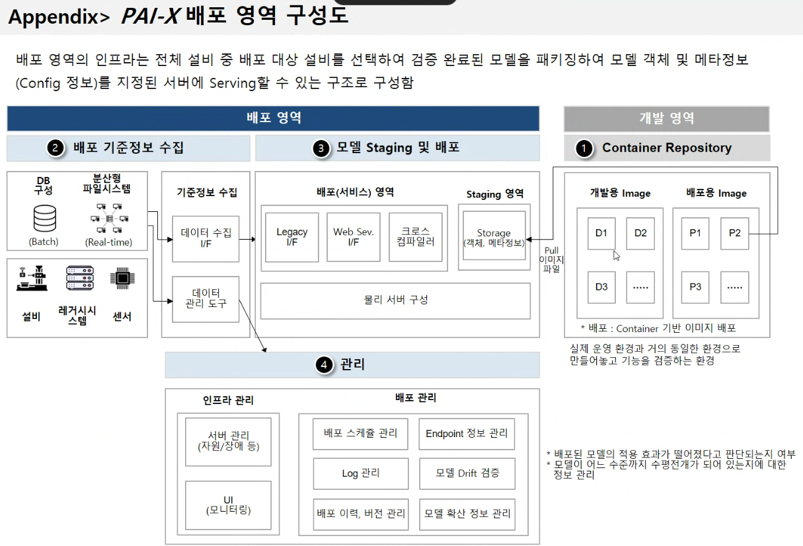
#### 검증 영역

- 온프레미스 방식으로 서버 구성됨
    - 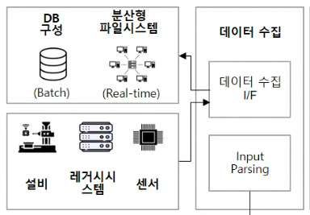
- CPU서버, GPU서버 등 구성해서 분석을 진행한다.
    - 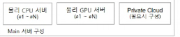
- 검증을 진행할 때는 인퍼런스 하는 부분이 3번이다. (클라우드 형태로 구성)
    - 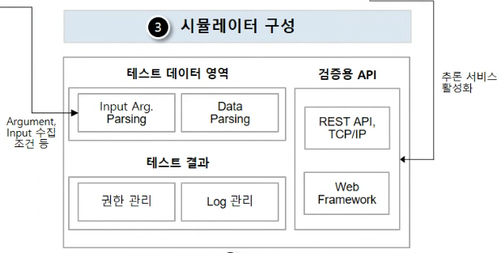

## 6. 깃 설치 및 [ai-model-cicd-practice] 레포 생성
- 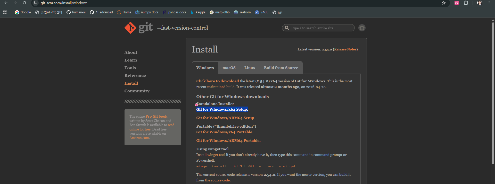
- 깃 config 도 설정해주기
- 나는 이미 설치 되어 있으므로 패스..

### [0] 우분투 practice 폴더의 파일들을 C드라이브 Temp 폴더로 옮기기 
- cp 명령어로 venv만 빼고 옮기라고 함
    - 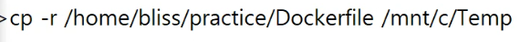
    - 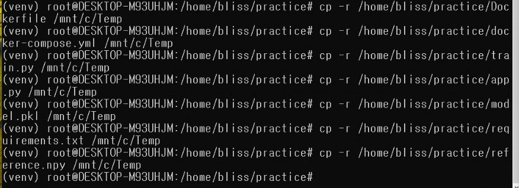
- 나는 그냥 리눅스로 접근해서 복붙 했음
    - 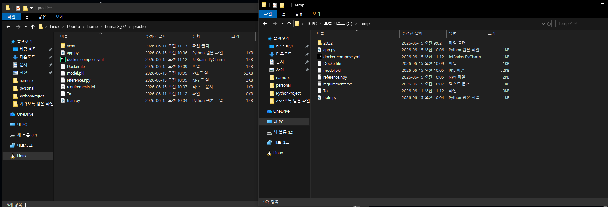

### [1] 깃의 워크스페이스를 c/temp 로 설정
- 깃헙 사이트 -> 계정 로그인 -> new repository -> [ai-model-cicd-practice] 로 생성
- 아마 temp 폴더 경로에서 git remote해서 깃 연결해야할듯
```bash
# 1. C드라이브 Temp 폴더로 이동
cd /c/Temp
# 2. git 초기화
git init
# 3. 깃허브 원격 레포 연결
git remote add origin https://github.com/efforthye/ai-model-cicd-practice.git
# 4. 파일 전체 추가
git add .
# 5. 커밋
git commit -m "first commit"
# 6. push
git branch -M main
git push -u origin main
```

### [TIP] Git 운영 팁
- 서비스 레벨에서 말씀드리면 우리 팀만 있는 게 아니라 `여러 팀, 여러 센터`가 있다.
- 여러 조직들이 있고, 그런 경우 각 조직마다 서비스를 런칭하기 위해 APP을 개발한다고 가정한다.
- [개발조직] 조직1->APP1, 조직2->APP2, 조직3->APP3, ... (==> GIT/패키징팀)
- 근데 이 앱은 하나의 플랫폼에 관리해야 하는 앱인 경우 하나의 플랫폼은 빌드 패키징 팀이라는 게 있다.
- [패키징팀] 전체 앱들을 GIT으로 모아 관리한다. -> 젠킨스
- 젠킨스: [빌드->코드테스트->패키징] ==> 배포 ==> Service
    - 이 부분은 단계별로 오류가 매우 많이 발생하기 때문에 별도의 전문 팀이 관리해 주어야 한다.
- 업무 체계가 잘 시스템화 되어 있으면 이 부분은 패키징 팀이라는 별도의 팀이 관리한다. -> 개발팀은 개발+푸시만 한다. [큰 기업의 케이스]
- 근데 작은 기업들은 다 해야됨.
- 대기업이 좋지 않은 부분: 바보가 됨. 내가 해야 하는 것만 딱 하면 됨
    - 엔지니어는 여러 툴들을 다 아는것이 유용하다.
    - 그 회사는 업무 스펙트럼이 넓어 -> 이것밖에 안 해봤기 때문에 다양한 스펙트럼을 맞출 수 없다.
    - 위와 같은 경우 많이 발생한다. (경력 쌓기 더 안 좋은 것 같다고 한다.)

### [2] 로컬 폴더 <-> 깃 레포 연결
```bash
# 1. C드라이브 Temp 폴더로 이동
cd /c/Temp
# 2. git 초기화
git init
# 3. 깃허브 원격 레포 연결
git remote add origin https://github.com/efforthye/ai-model-cicd-practice.git
# 4. 파일 전체 추가
git add .
# 5. 커밋
# [중요] 상세하게 작성하여야 한다. 패키징팀이 메시지를 보고 뭐가 변경되었는지 확인해야 하기 때문.
# 엑셀 형태로 이번에 변경된 내용들이 뭔지 변경 이력 파일도 같이 올리게 된다. 코드만 올리면 욕 바가지로 먹는다ㅎㅎ
git commit -m "first commit"
# 6. push
git branch -M main
git push -u origin main
```
#### 깃허브 레포지토리 확인
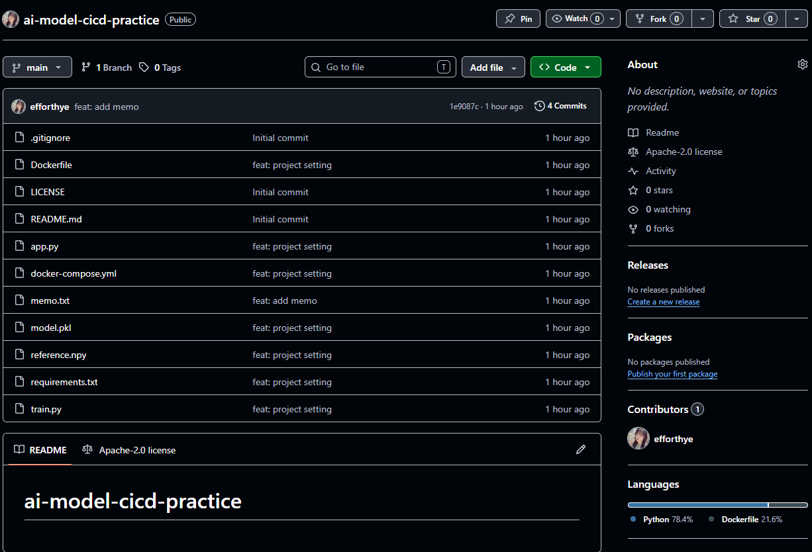

#### 깃 리모트 확인
- `git remote -v`
    - 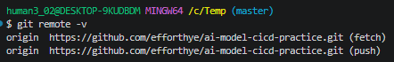
#### 깃 상태(반영되지 않은 항목들) 확인
- `git status`
    - 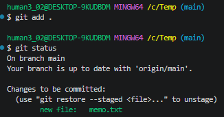

### 프로젝트에서 가장 중요한 것: 커뮤니케이션
- 어떻게든 설득해서 되는 방향으로 풀어 나가야 한다.
- 엔지니어들 안타까웠던 것: 개발 잘함, 근데 말로서 표현을 못함(or 문서)
- 개발을 잘 아는 사람은 어려운거 했네 라고 알아듣지만 안 한 사람들이 들으면 평가하기는 어려움
- 그렇게 개발은 잘 해놓고 보상은 제대로 못 받는 경우가 많았다.
- 프로젝트 하면 마지막에 완료 보고서를 작성해야 한다. (프로젝트에 대해서 표현)
- 그 부분에 대해서 노력 및 표현을 해 보는 것을 추천함.
- 면접에서 보는 것
    - 1) AI 정체성 확립(재미삼아 하는게 아닌지) 
    - 2) 커뮤니케이션 스타일 괜찮은지 
    - 3) 문서 역량이 좋은지 
    - 4) AI 역량이 있는지 
    - 5) 이 쪽 분야 도메인 사전 지식이 있는지 
    - 6) 안 좋은 상황을 주고 어떻게 극복 하는지 테스트 (조직에 적응을 잘 할 수 있을지)
    - 최종 점수를 total 으로 인사팀에 넘겼다.
- LG에너지솔루션에서는 그렇게 봤지만 다른 기업들에서도 비슷하기 때문에 그런 관점으로 준비해야 한다.

### 프로젝트
- 기획 -> 브레인스토밍(산업적으로 효과 낼 수 있는 주제를 선정) -> 주제선정 -> 주제 내용 구체화 작업
    - 1) 데이터가 있는지, 어떤 데이터를 활용해야 할지 조사
    - 2) 이 데이터를 가지고 실제 산업적 효과 낼 수 있는지, 문제가 있는지 문제 정의를 한다.
    - 2-2) AI 를 가지고 어떤 효과를 낼수 있는지 방향성을 제시
    - 3) 기술적인 구체화를 시킨다. end-to-end 사용자가 사용할 수 있는 수준(엔드유저)의 프론트 서비스까지 나와야 함(시스템화)
    - 3-2) 시스템을 구축하기 위한 시스템 설계, 데이터 파이프라인 프로세스 구성/설계, 문제를 풀기 위해 어떤 어프로치를 통해 모델 사용했는지에 대한 근거, 설득하기 위한 AI 아키텍처/알고리즘 측면에서도 기획 및 작성 해야함, 테스트/검증, 산업적 기대 효과, 프로젝트 기술을 가지고 비즈니스 모델 관점에서 활용할 수 있는지까지 제시할 것이다. (회사에서 사용하는 형식/회사에서 바라보는 관점으로 진행 예정)
    - 제일 중요한 것: 타겟과 어떤 AI솔루션을 활용할지 문제 정의를 잘 해야 함. + 어떻게 풀어나갈지(아키텍처/시스템/...등등) 효과를 제시해야 한다.
- AI 전문가: 문제를 많이 접해 보았기 때문에 생긴 기술적 노하우를 많이 갖고 있는 사람들
- 항상 문제 정의를 잘 하고, 그걸 기술적으로 어떻게 풀었었는지에 대한 경험을 많이 쌓아야 한다.
- 제약이 많아도 극복하고 해내야 함. 그럴려면 중간에 실패를 많이 접하고 혼나면서 성장.
- 젠슨황 유퀴즈에 왔다. 똑똑하게 애를 키우는 법? -> 공부할 환경만 제공해주고, `많은 실수/실패 많이 접하게 해줘라`. -> 실패 극복해 나가면서 성공

### 요즘 KPI 매기는 법
- 논문 내용을 가지고 양산에 몇번 적용을 했는지. 가지고 평가를 한다.
- 효과 80->90% 몇 퍼센트 개선 했는지. 이런 식으로 양산 기준으로 평가한다. 필드에 나가서 일한다.
- 현장에서의 문제를 알아야 개선점을 찾을 수 있다.

### 학원에서 SI(AI) 관련 사업 진행
- 기업 문제 찾아서 AI로 개선할 수 있는 방향 제안드리기, 시스템 구축, 분석 모델, 서비스까지 솔루션 개발.
- 개발을 할 인력이 없는 상황이라고 한다. 학원에서 같이 해볼만 한 친구 있으면 알아봐줘~
- 수업이 끝날 쯤 기업과 연계한 프로젝트가 생길 것 같고, 역량이 있으면 참여해 보면 좋을 것 같다.
- 대학생들 인턴 경험 / 사회 경험 하는 관점에서 필드 경험을 쌓을 수 있는 좋은 기회다. -> 팔로우업 해서 하고 싶은 사람은 말해보기

### [3]
```py
```

### []
```py
```

### []
```py
```

### []
```py
```

### []
```py
```

### []
```py
```

### []
```py
```

### []
```py
```

### []
```py
```

### []
```py
```

### []
```py
```

### []
```py
```

### []
```py
```

### []
```py
```

### []
```py
```

### []
```py
```

### []
```py
```

### []
```py
```

### []
```py
```

### []
```py
```

### []
```py
```

### []
```py
```

### []
```py
```

### []
```py
```