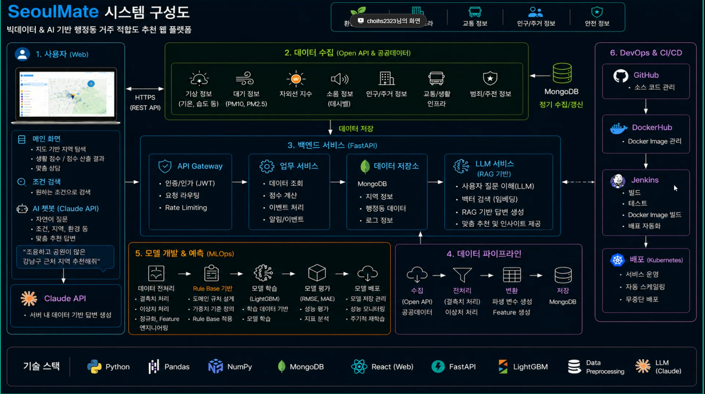
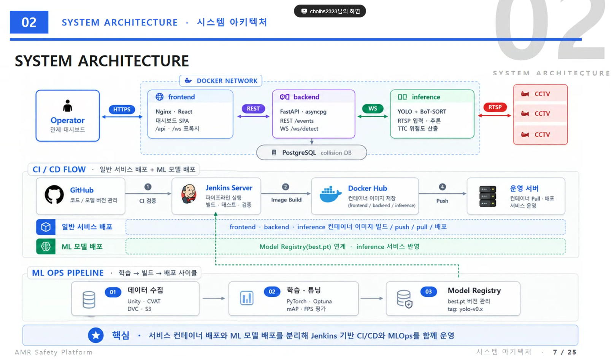
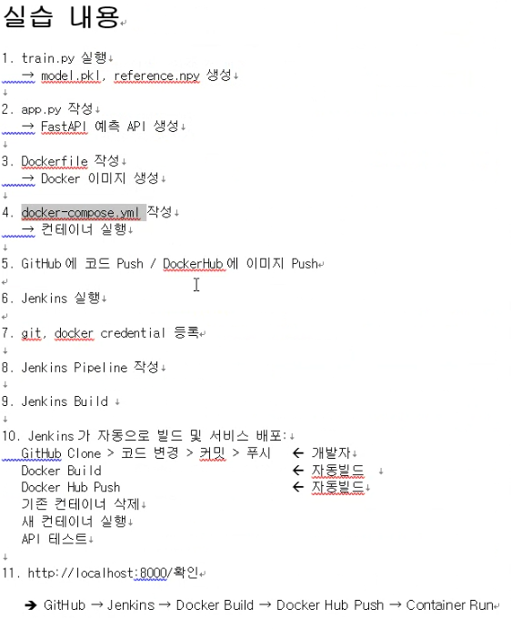

# 16일차 - 6/18(목)
- 회의 참석: https://whaleon.us/o/CSvuJa/64dffed07c6741c990f69804e3b62d6e

# DevOps

#### ex. 시스템 구성도

- 도커 허브에서 도커 이미지 관리
- 거기서 땡겨와서 젠킨스에서 이미지 빌드, 테스트, 배포 자동화 등을 수행한다.
- 실제 젠킨스로 배포 관리를 할 수도 있지만 조금 더 큰 기업은 AI 프레임워크 쿠버네티스를 활용하여 운영하기도 한다. (여러 분산서버 구축 -> 분산서버에 대한 자동 스케일링, 데이터 끌어올 때 기본적 백엔드 단의 spark/hadoop 분산 병렬처리를 자동으로 해준다. 데이터를 읽어올 때 그냥 기본적으로 해준다. 그래서 그냥 데이터를 읽어오기만 하면 된다 + 무중단 배포 등을 관리해준다.)

#### ex. 시스템 아키텍처

- CI/CD 플로우로 진행했다. 이런 구조로 진행했다.

# 실습

## 0. 실습 예정 사항

- 랜덤포레스트 이진분류
- FastAPI 서버

## 1. 실습 내용
1. train.py 실행 -> model.pkl, reference.npy 생성
2. app.py 작성 -> FastAPI 예측 API 생성
3. Dockerfile 작성 -> Docker 이미지 생성
4. docker-compose.yml 작성 -> 컨테이너 실행
5. GitHub에 코드 Push / DockerHub에 이미지 Push
6. Jenkins 실행
7. git, docker credential 등록
8. Jenkins Pipeline 작성
9. Jenkins Build
10. Jenkins가 자동으로 빌드 및 서비스 배포:
    - GitHub Clone > 코드 변경 > 커밋 > 푸시 (개발자)
    - Docker Build (자동빌드)
    - Docker Hub Push (자동빌드)
    - 기존 컨테이너 삭제
    - 새 컨테이너 실행
    - API 테스트
11. http://localhost:8000/docs 확인
    - GitHub -> Jenkins -> Docker Build -> Docker Hub Push -> Container Run

### 기본 정보
- GIT HUB Remote URL : https://github.com/ilovejwoo1004-bit/ai-model-cicd-practice.git
- Docker Hub ID : bliss009
- Docker Hub Repo : bliss_docker
- Docker Image : bliss009/bliss_docker:latest
- Container Name : ai-model-api
- Port : 8000
- Jenkins Port : 8080

## 2. 모델 파일 생성 및 도커 이미지 생성/컴포즈 실행

### 2-1. 실습 폴더 생성
```bash
mkdir -p /home/bliss/practice
cd /home/bliss/practice
```

### 2-2. train.py 생성
```py
import numpy as np
import pickle
from sklearn.ensemble import RandomForestClassifier

X = np.random.randn(200, 1)
y = (X[:, 0] > 0).astype(int)

model = RandomForestClassifier()
model.fit(X, y)

with open("model.pkl", "wb") as f:
    pickle.dump(model, f)

np.save("reference.npy", X)

print("model.pkl, reference.npy 생성 완료")
```

### 2-3. app.py 생성
```py
from fastapi import FastAPI
import pickle
import numpy as np

app = FastAPI()

with open("model.pkl", "rb") as f:
    model = pickle.load(f)

@app.get("/")
def home():
    return {"message": "AI Model API is running"}

@app.get("/predict")
def predict(value: float):
    X = np.array([[value]])
    pred = model.predict(X)[0]
    return {
        "input": value,
        "prediction": int(pred)
    }
```

### 2-4. requirements.txt 생성
```
fastapi
uvicorn
scikit-learn
numpy
```

### 2-5. Dockerfile 생성
```dockerfile
FROM python:3.10-slim

WORKDIR /app

COPY requirements.txt .
RUN pip install --no-cache-dir -r requirements.txt

COPY . .

EXPOSE 8000

CMD ["uvicorn", "app:app", "--host", "0.0.0.0", "--port", "8000"]
```

### 2-6. Docker 이미지 생성
```bash
docker build -t ai-model-api:latest .
```

#### Docker Hub 이름으로 태그 변경
```bash
docker tag ai-model-api:latest bliss009/bliss_docker:latest
```

#### 확인
```bash
docker images
```

### 2-7. Docker Hub 로그인 및 Push

#### Docker Hub에 Repository 생성
- https://hub.docker.com 로그인 (웹, 터미널 모두 연결 필요)
- Create repository 클릭
- Repository Name: `bliss_docker`
- Visibility: Public 또는 Private
- Create 클릭

#### 터미널에서 로그인
```bash
docker login
```
- Your one-time device confirmation code is: `FDWF-XBLK`
- 위 코드를 https://login.docker.com/activate 에 입력하여 승인

#### 로그인 확인
```bash
docker info | grep Username
# 예) Username: bliss009
```

#### Docker Hub Push
```bash
docker push bliss009/bliss_docker:latest
```

### 2-8. docker-compose.yml 생성
```yml
services:
  ai-model-api:
    image: bliss009/bliss_docker:latest
    container_name: ai-model-api
    ports:
      - "8000:8000"
    restart: always
```

### 2-9. 컨테이너 실행

#### 기존 컨테이너가 있으면 삭제
```bash
docker rm -f ai-model-api || true
```

#### 실행
```bash
docker compose up -d
docker ps
```

#### 모델 동작 결과 확인
```bash
curl http://localhost:8000/
curl http://localhost:8000/predict?value=1.5
```

#### 컨테이너 중지 / 삭제
```bash
docker stop ai-model-api
docker rmi ai-model-api:latest   # 또는 docker rmi ID
docker rm -f ai-model-api || true
```

#### 우분투 WSL에 있는 파일 가져오기
```bash
cp -r /home/bliss/practice/Dockerfile /mnt/c/Temp
```

## 3. Git, Docker Hub, Jenkins 설치 및 구성

### 3-1. Git 설치

#### Git 설치 및 사용자 설정
- Windows에서 Git 공식 사이트에서 Git for Windows 설치
- 설치 후 Git Bash 실행
- 확인: `git version`

#### 기본 사용자 설정
```bash
git config --global user.name "본인이름"
git config --global user.email "본인이메일"
git config --list   # 확인
```

#### GitHub Repository 생성
- GitHub 로그인: https://github.com/ilovejwoo1004-bit
- New Repository 클릭
- Repository 이름 입력: `ai-model-cicd-practice`
- Public 또는 Private 선택
- Create Repository 클릭

### 3-2. GitHub 저장소에 코드 Push
- Git.txt 참고

### 3-3. Jenkins 설치
- Ubuntu 26.04에서는 apt 설치가 안 될 수 있으므로 Docker Jenkins를 사용한다.

```bash
docker run -d \
    --name jenkins \
    --restart=always \
    --user root \
    -p 8080:8080 \
    -p 50000:50000 \
    -v jenkins_home:/var/jenkins_home \
    -v /var/run/docker.sock:/var/run/docker.sock \
    jenkins/jenkins:lts-jdk17
```

#### 확인
```bash
docker exec jenkins whoami              # root 확인
docker exec -it -u root jenkins bash    # 젠킨스 컨테이너 접속
docker ps                               # 다른 우분투에서 젠킨스 컨테이너 실행 확인
```

#### 실행 에러 시 중복 삭제
```bash
docker ps
docker ps -a    # jenkins/jenkins:lts-jdk17 확인 후 삭제
docker rm -f <ID>
```

#### 초기 비밀번호 확인
```bash
docker exec jenkins cat /var/jenkins_home/secrets/initialAdminPassword
```

#### 젠킨스 브라우저 접속
- http://localhost:8080
- 사용자 이름: admin
- 비밀번호: 초기비밀번호
- 설정 -> Install suggested plugins 선택 -> 관리자 계정 생성

#### 비밀번호 분실 시 Jenkins 재설치
```bash
docker rm -f jenkins
docker volume rm jenkins_home
```

#### 이전 계정 확인
```bash
ls -al /var/jenkins_home/users
```

### 3-4. Jenkins 컨테이너에 Docker/Git 설치

```bash
docker exec -it -u root jenkins bash    # 젠킨스 컨테이너 접속

# 젠킨스 컨테이너 안에서
apt update
apt install docker.io git curl -y       # 도커, git 설치
docker ps
exit
```

#### 젠킨스 재시작
```bash
docker start jenkins
```

- `docker ps`에서 Jenkins 컨테이너와 ai-model-api 컨테이너가 보이면 정상

## 4. GitHub -> Jenkins -> Docker Build -> 실행 자동화 실습

```
GitHub 코드
   |
   v
Jenkins가 Git Clone
   |
   v
Docker Image Build
   |
   v
기존 컨테이너 삭제
   |
   v
새 컨테이너 실행
   |
   v
API 결과 확인
```

### 4-1. Docker Hub Credential 생성

#### Docker Hub 사이트에서 토큰 생성
- 우측 상단 계정 -> Account Settings
- Personal Access Tokens -> Generate New Token
- Token Description: `jenkins-dockerhub-token`
- Access Permissions: Read, Write, Delete
- 생성 후 토큰 값(`dckr_pat_xxxxxxxxxxxxxxxxxxx`) 복사하여 별도 저장

### 4-2. Jenkins Docker Hub Credential 등록

#### Jenkins에서 등록
- Dashboard -> Manage Jenkins -> Credentials -> System -> Global credentials -> Add Credentials

#### 설정값
- Kind: `Username with password`
- Username: `bliss009`
- Password: `dckr_pat_xxxxxxxxxxxxx`
- ID: `dockerhub-token`
- Description: `Docker Hub Token`
- 저장

### 4-3. GitHub Credential 등록

#### GitHub PAT 생성
- GitHub 우측 상단 프로필 -> Settings -> Developer settings
- Personal access tokens -> Tokens classic -> Generate new token classic
- `repo` 항목에서 `public_repo` 선택 -> Generate token 클릭

#### Jenkins에서 등록
- Kind: `Username with password`
- Username: `bliss009`
- Password: `ghp_***` (txt 파일에 저장)
- ID: `github-token`
- 저장

### 4-4. Jenkins Pipeline Job 생성

#### Job 생성
- Dashboard -> New Item
- 이름: `ai-model-cicd`
- Pipeline 선택 -> OK

### 4-5. Pipeline Script 작성

#### Job 설정
- ai-model-cicd Job -> Configure -> Pipeline
- Definition: `Pipeline script`

```groovy
pipeline {
    agent any

    stages {

        stage('Git Clone') {
            steps {
                git branch: 'main',
                    url: 'https://github.com/ilovejwoo1004-bit/ai-model-cicd-practice.git'
            }
        }

        stage('Docker Build') {
            steps {
                sh '''
                docker build -t bliss009/bliss_docker:latest .
                '''
            }
        }

        stage('Run Container') {
            steps {
                sh '''
                docker rm -f ai-model-api || true

                docker run -d \
                  --name ai-model-api \
                  -p 8000:8000 \
                  bliss009/bliss_docker:latest
                '''
            }
        }

    }
}
```

- 우분투에서 `bliss009/bliss_docker:latest` 중지 후 Jenkins 빌드 시작
- 빌드 성공 시 자동으로 컨테이너가 시작됨

### 4-6. Jenkins 빌드 실행

- Build Now 클릭

#### 결과 확인
- Build History -> #1 클릭 -> Console Output
- 성공 시 마지막 줄에 `Finished: SUCCESS` 출력

### 4-7. 터미널에서 실행 결과 확인

```bash
docker ps
# 출력 예시) bliss009/bliss_docker:latest   ai-model-api   0.0.0.0:8000->8000/tcp
```

#### API 확인
```bash
curl http://localhost:8000/
curl "http://localhost:8000/predict?value=1.5"
```

#### 브라우저 확인
- http://localhost:8000/docs

## 5. Docker Hub Push 포함 최종 Pipeline (git 반영 시 전체 자동 빌드/배포)

#### 사전 준비
```bash
docker rm -f ai-model-api
docker stop bliss009/bliss_docker:latest    # 해당 컨테이너 중지
docker ps                                   # 젠킨스 서버만 구동되어야 함
```

- Docker Hub 사이트에서 `bliss009/bliss_docker:latest` 이미지가 존재해야 함

### 5-1. Jenkins Webhook 설정

#### Jenkins Job 설정
- ai-model-cicd Job -> Configure -> Build Triggers

아래 두 항목 체크:
- `GitHub hook trigger for GITScm polling`
- `Poll SCM` -> Schedule에 `* * * * *` 입력 (분 시 일 월 요일) -> 저장

### 5-2. GitHub Webhook 설정

#### GitHub에서 등록
- 해당 Repository -> Settings -> Webhooks -> Add webhook
- Payload URL: `http://192.168.238.132:8080/github-webhook/`
  - 젠킨스 서버 IP 확인: `hostname -I` (우분투 터미널에서 확인)
- 저장

### 5-3. 자동 배포 테스트

1. GitHub에서 코드 변경 및 Push
2. 1~2분 후 Jenkins 확인:
   - Dashboard -> ai-model-cicd -> Build History
   - 자동으로 빌드가 트리거되어 실행됨
