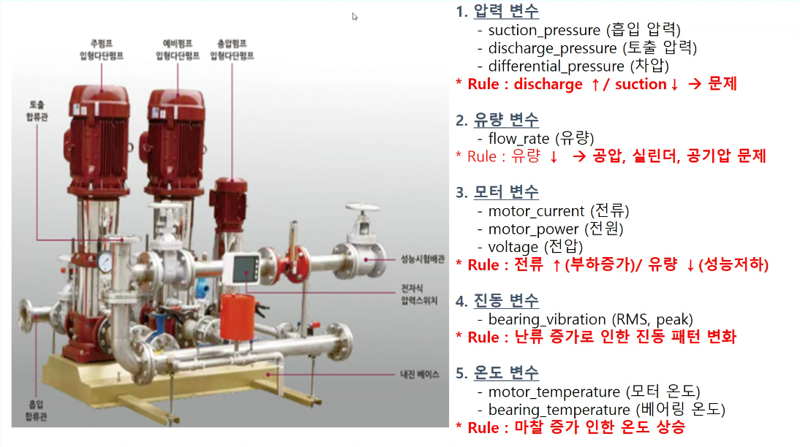
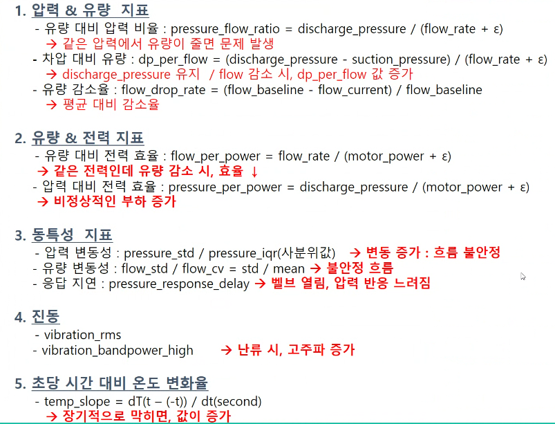
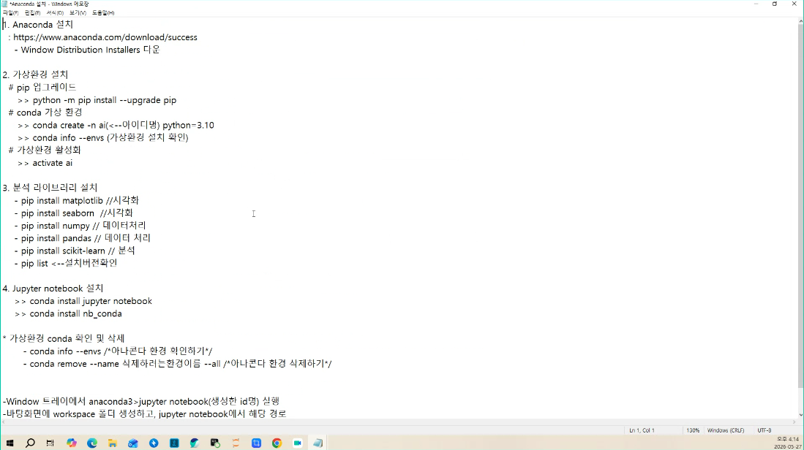

# 2일차 - 5/27(수) #
- 회의 참석: https://whaleon.us/o/CSvuJa/64dffed07c6741c990f69804e3b62d6e

# 이전기수 프로젝트 소개 #
# 안전사고 예방 시스템
- 맡은 역할: 1. 파인튜닝, 2. 도커, ...
- 프로젝트 배경: 어떤 상황에서 안전사고 등등 발생.. -> 안전사고 탐지해서 예방할 거다.
- 우리가 뭐뭐 하면 기존이랑 뭐가 다르다. 실제 제동되는 것까지 연동해서 상용화 가능하게 했다.
- 시스템 아키텍처
- 데이터 구하기?: 사고 발생 시나리오를 유니티로 시뮬레이션 만들어서 영상 제작했다. 직접
- 그걸로 객체 탐지하고 예측하고 리스크 스코어를 올려서 뭐 했다.. 
- ** 데이터 없으니까 유니티로 만듦 3D 시뮬레이션 **
- object detection yoloV11N 모델 사용
- 미래 예측 bot-sort 알고리즘 사용
- 알고리즘 선택하는 과정.. 여러 모델을 가지고 테스트 교차검증 성능 잘나오는거 선택.
- 1STAGE DETECTION 방식
- 욜로는 오픈소스 가져왔는데 파인튜닝 했다. (어케한거지?) / 필드에서는 오픈소스 그냥 못쓰고 튜닝해야 한다. 무조건
- 반드시 모델은 만들어진 것들을 가져와서 커스터마이징 개발을 해야한다고 생각하십쇼.
- 캐글, 논문 등에서 모델 소개하는 사이트 활용 데이터는 깨끗한 데이터를 주로 사용해서 결과잘나옴. 근데 필드에선 깨끗한 데이터가 없다.
- 60~70%는 가비지다. 우리가 분석하고픈 데이터는 20~30%이다. 그래서 데이터를 가지고 파생변수 만들고 헬스인덱스 만들고 변형시켜서
- 의미있는 데이터가 되게 정제하고, 모델도 그에맞게 커스터마이징 개발이 필요하다.
- 순서: 1. 욜로로 박스 객체탐지. 2. 딥소트,소트,바이트소트로 테스트(동적인건 예측하기 어렵지만..) 미래방향을 예측 얘를 선택했다.
- 3. ~~~
- byteTrack 구조.. 뭐 어떤 알고리즘 우리는 봇소트 선택(bot-sort) 그중에 어느어느 부분을 커스터마이징
- 위험도 산출: 진짜 충돌이 일어날지 리스크 스코어를 계산함. 객체들 미래방향 앞으로 어디로 갈지 예측. 
- 그 방향에 대한 거리 계산. a객체 상대객체 부딪히는거 타임 투퀄리? 알고리즘으로 시간을 계산.
- 상대객체 어느방향인지 고려해서 스코어 산출. 거리/충돌시간/방향 고려해서 계산. 0~100 숫자값 나옴
- 50점 이상이면 위험, 0~29 정상 30~59 주의 경고 위험 등등으로 분류..
- 충돌점수프로세스: 객체탐지 욜로. 2. 추적속도추정 봇소트, 3. 충돌예측 ttc. 4. ~~
- 모델 튜닝 전후 영상 비교. 유니티 시뮬레이션 영상으로 보여줬다.
- 대시보드도 만들었다(모니터링 유니티 시스템 cctv 실시간 영상 모니터링 가능하게, 객체 모니터링 동선 감지) -> 알람(리스크 스코어 계산으로)
- 최근알림, 위험추세, 카메라목록(관리), 알림히스토리, 사고이력 등등 볼 수 있다.
- 데모영상 실시간 으로 감지 가능함. [각 객체들탐지 -> 동적객체 과거현재 어케이동했는지 트래킹 -> 
- 미래방향예측 -> 트래잭터리/시간/방향 기반 로직으로 리스크 스코어 계산 -> 등급별로 위험 경고 울리기]
- 암튼 시스템 아키텍처에 의해 그렇게 구현됐다. 
- 결과: 시스템 도입비용 5300만인데, (구축비 4500, 그외 800). 실제 안전사고 발생시 약 2억 뭐 이런식으로 비교

# 말벌 사운드 탐지 및 경보 시스템 (양봉 농장)
- 사운드 분석, 진동 분석 해본사람? 외부 노이즈가 반드시 낌. 불량/고장 특징 외부 노이즈에 가려져서 소리 특징 사라진다.
- 근데 불량/문제는 발생하고 있음. 가려짐. -> 외부 노이즈를 얼마나 제거할 수 있느냐가 제일 중요하다!! (무조건 낀다.)
- 시장: 사회문제 인식(기존문제 파악). 말벌 피해있다 머시기 머시기. (산업적 이슈/문제 도출, ai로 해결 가능한 방법론 생각, 산업적 효과 얼마나 낼수있는지 선별)
- 아키텍처: 엔드 투 엔드까지 나와야 포트폴리오로 쓸 수 있다.
- 이렇게 하세요 다 코칭 가이드 해주실 거라고 한다.
- 우리는 어떤 데이터셋 사용했습니다. (kaggle bee audio, 유튜브)
- 데시벨 분석(소리가 크냐 작냐 특성/외부노이즈가 끼면 커짐.), 
- ** 어그멘테이션을 해서 데이터 증가까지 했다.!!!!!! **
- 시간 베이스 -> 주파스 베이스 머시기를 뭐뭐로 변환
- 주파수 대역대, 어떤특징 나타나는지 분석. 그 걸 다시 스펙트럼으로 표현하면, 주파수 특징이 쉐입의 형태로 나타난다.(하모닉)/ 아니면 연속적인지 분석
- 쉐입의 형태로 나타나면 거기서 특징 정의해서 이미지 분석(레이블링 분류진단) 하면된다.
- 웨이브 파일 -> 데시블 -> 주파수 데이터 -> 스펙트로그램 데이터를 학습 데이터로 만들었다.
- ** mfcc 로 피처를 뽑아내는 것을 했다.. !! **
- [데시벨 데이터 채널로 들어온다. 투채널 데이터를 컨버트해서 주파수 데이터로 변환 -> 원채널로 합성 -> 
- 특징 추출 -> 실제 필터링(말벌배역대,소음특징유형쉐입분석정의,말벌은200-800헤르츠구간에서 발생하더라)
- 나머지는 볼필요 없는거지 -> 그럼 그 배역대를 자름. -> 나머지 구간 외부노이즈 들어와도 자르기 때문에 무시가된다.
- 하이패스필터링? mfcc로 픽처벡터데이터만들고 cnn으로 특징데이터를 이미지로 만들었다. 벡터데이터/이미지데이터를 학습데이터로 만들고 모델학습을 돌림.]
- 파인튜닝을 정확히 해야 값을 잘 뽑을 수 있다. 주요 파라메터 설정값 얘기했다.
- 이게 중요하다. (최적 값 잘 찾는 것) !!!!!!!!!!!!!!!!!
- 증강 전략, 이미지 데이터 제너레이터, cnn~~
- 트랜스가 많은경우 여러 ai 모델 결합해서 앙상블 모델을 적용해야 한다.
- 하나의 모델로는 모든 클래스를 커버할 수 없기 때문이다. 모델마다 ~~클래스는 잘예측하고 다른거 못해 이런식의 경우가 발생하기 때문에
- 모델들 상호보완 효과를 위해 앙상블 적용한다. (여러 클래스인 경우)
- 이번에는 말벌이냐 꿀벌이냐 2진 클래스였다. 그래서 cnn 으로 충분해서 앙상블은 안했다. 분류모델 만들었다.
# < 10분 휴식 > 
- ai 모델로는 cnn 모델을 썼다.
- 수업 듣고 나면 이해 되실거에요?
- 꿀벌의 특징 분석. 말벌의 특징 분석. 특징 뽑아서 정의해야한다. 그걸로 클래스를 구분한다. 클래스를 구분하기 위해 특징..
- 그래서 ai 모델 돌렸을때 loss 값이 학습할수록 손실값은 떨어지고 acc값은 올라간다. 학습을 통해 점점 정확도 올라가고 손실 줄어드는 거.
- 그리고 confusion matrix 로 했을떄 나머지 학습 안한 20% 로 검증 테스트. 80% 는 저렇게 잘나왔어요 그리고 20%로 예측했더니 거의 정확하게 분석했다.
- 몇개 맞췄고 몇개 틀렸고 양호한거 모델성능에 대해 표현했다.
- 벨리데이션 검증. 실제 현장에서 검증한 결과. 다양한 케이스 데이터 뽑아서 그거에 대해서도 예측이 되는지를 테스트 했다.
- 내가 학습한 데이터 머시기 머시기..
- 동적 소음 검증 결과는 현장 다양한 데이터를 수집해서 테스트한거다. (말벌/꿀벌중복,스케일변화(장수말벌),외부노이즈(말벌+음악),유사사운드(청소기))
- 결과는 중복이어도정확도, 스케일변화시 특징쉐입 달라지는거 특징 어떤경우는 일직선 등등 상황에따라 달라지는거 결국엔 말벌이긴함. 그럼 잡아야함.
- 스케일 변화되는 말벌. 그런경우도 정확도 74퍼면 잘잡은편이다.
- 외부노이즈가 낀경우.. 말벌탐지 95%, 청소기---> 말벌인지꿀벌인지->왼쪽이정상이고 우측이말벌인데 말벌이 아니라고 분류했다.(정상87%,말벌13%)
- 현장에서는 이런 테스트를 더 많이 해야한다. (이런 실제 여러가지 데이터로 내 ai 모델이 강건한지를 테스트 해야 한다.)
- UI 구현했다. 실시간 모니터링. 마이크 설치하고 예측 데이터는 실시간 분석 요청 머시기..
- 말벌 탐지에 대한 분석 결과. 양봉현장 작업자가 이앱을 통해 실시간 양봉장 경고. 실시간 화면 볼수있고 결과 볼수있고.
- ***** 여기서도 제어를 적용하면 좋은데 (과제의 마무리는 제어라고 생각한다. 제어가 안되면 반쪽짜리 과제다.) *****
- 항상 현장은 산업담당, ai 담당 등 조직들이 결합돼서 하나의 목표를 가지고 만든다.
- **** 현업담당자 보통 제어를 수정안해줌. 신뢰를 못한단 얘기, 그래서 그냥 기계하고 자동으로 통신으로 자동제어 되는 시스템이 돼야 적용된다. ****
- 말벌 개폐기? 그걸 막으면 꿀벌만 들어갈 수 있음. 그걸로 통신해서 개폐기를 차단시키는 시나리오를 가져가야 한다.
- 기대효과: 피해액 도입전과 후 비용절감 산업적 효과 제시한다.
- 비즈니스 모델 활용방안(소음분석 -> 양봉 뿐만 아니라 농업,축산,산업,설비,재난,안전 에서도 분석 할수 있다 등의 방안 제시)

# 산업 부품 결합시 나사 풀림 감지(설비 고장)
- 설비 진동신호 결함 진단, 사전감지
- 이상데이터가 없어서 어프로치를 비지도학습으로 가서 오토인코더 (정상뎅디터만학습, 차이발생시 이상이라고봄) 모델 활용
- 주파수: 진동이니까 시그널 프로세스로.. 나사가 풀리게되면 진동시그널특징 어느주파수배역대 어떻게 나타나는지 분석.
- 고장 데이터가 존재하지 않는다.... 데이터 인발란스 문제가 생긴다.... (현장이 이렇다. 어떻게 해결 해야할까?)
- 어그멘테이션 시켜야 한다. (소수의 고장데이터 잘 분석해서 비슷한거 생성해야 한다.)
- 이상데이터 분류 등등.. 모델에 대한 오차줄어들고..
- 오토인코더 모델 돌렸을때 이정도 이상 벗어나면 이상이다 라는 기준값을 정함(treshold) 
- 모델 테스트 경과 92개 이상을 잘 탐지(100개 중)
- 뭐 징후를 포착했고, mlops 파이프라인도 구성했다.
- 재학습까지 했다. 5번 재학습 및 모델 교체 판단. (드리프트 감지, 재학습, 재배포 이게 중요하다.) 이게 반영돼야 실제에서 지속적 사용 가능하다.
- 실시간 들어와서 쌓인 데이터 드리프트 비교검증 -> 신규데이터와 기존학습 차이있는지, 다른특징 들어왔는지 등 비교검증 차이여부 판단. 차이없으면 그냥씀.
- 차이발생시 다시 머지하거나 피처를 다시뽑던가 해서 재학습해서 -> 다시 인퍼런스 추론서비스를 해야한다.
- 이걸 mlops 로 자동화 했다. 들어오면 자동비교검증 + 차이나면 재학습 트리거를 걸어서 재학습 + 웹서비스에 재배포 할수있게 배포파이프라인 자동구축했다.
- 이게 돼야 산업에서 지속적으로 사용할 수 있다.
- 보통은 모델검증 까지만 하고끝나는데, 실무에서는 이렇게 한다는 포인트가 있다. -> 추후 과제에 적용 예정.

# 디지털 트윙까지 했다? 풍력발전기 바람속도에 맞게 최적 효율 못내고 있다. 
- 피지컬 ai 관점에서 적용했다. 실제 동역학 관점에서 이상여부 판단, 원인진단, 고정값까지 출력하는 과제 진행했다.
- 디지털 트윈으로 트잉? 까지 가서 분석결과 좋아서 그런식으로 가볍게 던졌는데 하더라고 라고 하면서 깜짝 놀랐다고 한다.
- 1.시스템구축,데이터표준화,2.연결,3.지능화/분석(ai),4,디지털트잉 사무실에서 현장에있는것처럼 시뮬레이션
- 5.사람의공수제로로,스마트팩토리 5단계이다.
- 취업할때까지 디지털 트잉까지 하면 포폴로 좋을거같다고 제안했다.
- 동역학 모델 만들고 풍력발전기 도메인지식 논문 찾아와서 분석했다. 도메인지식 쌓았고 연구까지 헀다.
- 암튼 그래서 풍력발전기가 [실시간 이상발생 -> 감지 -> 이상원인 진단분류 -> 원인/이상 -> 정상으로갈수있는값뽑아서 -> 제어로직에 적용]
- 제조현장에서 중요. 5단계 자율운영에 필요한 자동보정까지 들어가는 기능이 필요하다.
- [이거 배우면 신사업에 써먹을 수 있겠는데 ?]

# 사회적이슈. 우회전 횡단보도 차 지나갈 때 사고 발생 사회이슈. 사고율 매년 증가중. 버스/트럭 사각지대 때문.
- 높은 차는 아래쪽 탐지잘안돼서 사고발생하는부분. 
- 시스템아키텍처, 시스템흐름도, 시스템 주요기술
- 환경구축,상황인지,판단,~
- 객체탐지/추적: 욜로와 딥소트 사용 - 리스크스코어 뽑고 위험예측하는 과제
- 이 기술로 로봇이나 주차관제 활용할 수 있다. 실시간 상황 찍고 이동하면서 객체들 어떤게 움직이는지, 상태판단(위험상태인지아닌지)
- 위험상황인지판단 관점에서 활용할수있다.

# 양액 펌프시스템, 양액 펌프설비. 
- 스마트팩토리 물들어오는배관 자주막힘. 이물질. 설비문제로 배관막히는등의 문제발생. -> 영양소나 물공급 안돼서 작물 품질 문제 발생.
- 펌프배관 막히는지 안막히는지 판단해서 막혔으면 원인 뭔지 진단해서 원인에 따른 조치방법 제어하는 것을 시스템적 구현했다.
- mlops 구현
- 데이터분석: 유량,압력,펌프전류,가동시간 등 여러개 45개센서.... 파라미터에서 로우데이터로 고장탐지에는 한계있다.
- 기본 로우데이터로 헬스인덱스 파생변수 값을 별도로 만들었다.
- 파생변수생성, 다중공선성 제거, 데이터정규화 를 통해 데이터 전처리 및 도메인 기반 보정
- 헬스 인덱스를 여러개 만듦. 실제 학습데이터로 만들어서 자동보정 할수있는 값 만듬.
- **SAHP**: 되게많이쓰임. 익스플레이너블AI, 좋은AI모델은 설명가능한모델이다. 설명력 있으려면 결과나오는인과관계가 명확지표에의해 설명돼야한다. 그게 SAHP이다.
- 상관관계 값들을 자동으로 뽑아주는 것이다.!!!!!!!! 주요지표를 랭킹으로 뽑아준다. 스코어값 높은애들.... 설명할수 있는거다.! 좋네 인과관계 설명하는거 많이 활용된다.
- 필드에서도 SAHP 많이 사용된다. 필드에서 이게 정확도가 잘나왔다. 결과에 대해 원인설명력 변수 설명하는게 이게 되게 잘나왔다.
- 주의깊게 보고 많이 활용하라고 한다.
- AI 과제할떄 먼저해야할것: 데이터수집, XY구성 데이터셋X, Y, Y에대해X뭘로할지치명인자선정해야한다.
- 강사님 현장에서 공정설비에 파라미터가 600개이상이었다. 위치불량 Y를 잡고 X를 600개 다 잡을수 없으니, 영향미치는 치명인자 뽑는거 활용 여기서한다.
- 영향 미치는 변수 선정하는거 정확하게 잘나왔다.
- 펌프배관막히는데 영향주는 주요인자 선정을 아무튼 SAHP 을 이용해서했다. 치명인자 잘선정해야 모델결과도 잘나온다.
- 오토인코더 모델 돌렸고
- 모델학습결과. 스레시홀드 
- 선이3개있죠? 워닝라인, 크리티컬라인 이렇게 사전감지를 위해 걸은거다.
- 위험시그널 사전인지 멈추던지 조치하던지..
- 고장난 다음에 디텍팅 하는건 현장에 의미없다. 반드시 이상은 사전에 얼마나 먼저 감지하냐가 중요하다. 그래서 3라인을 그은거다.
- 설명력을 SAHP 으로 영향력 있었다 없었다 설명.
- 최종 UI: ... 대시보드

# < 더 있는데 여기까지만 맛보기로 보여줌> 
- 이런 수준으로 과제 진행 예정.
- 이번엔 의학 의료계쪽 주제 선정해서 효과 낼수있는 과제 진행해보면 좋겠다.
- 제조 등등 여러가지 주제.. 
- 데이터는 다 찾아서 진행했다. 
- 학교나 기업에서 데이터 활용할수 있으면 베스트인데...
- 부품파손예측. 파손되기 전에 예측을 했어야됨. 치명인자 선정하고 그걸로 사전예측할수있게 분석했는데 조짐이없다가 터짐 = 예측불가.
- 데이터변형많이함. 차원바꿔서 데이터형태바꿔서 분석하고.. 여러개변수조합 로직 파생변수만들고... 헬스인덱스값을뽑음.
- 그데이터를 보니, 인디케이터만든걸로보니, 걔는 조금 위아래로 가는 먼가가 반복적 나타나는걸 발견함. 그러다 뻥튐.
- 헬스인덱스 인디케이터만들어서보니까된거다. 사전감지를할수있었다. 그래서 우리도
- 로우데이터그대로분석하면안된다. 고장/사전감지 못할수있다. (럭키하게 로우에서 나타날수도있지만, 로우기반으로 헬스인덱스인디케이터 파생변수만들어서 그걸로 분석하는것이 좋다.)
- 모터,온도,압력데이터 등 모터전류 온도높아지고압력세지고 이런 관계고려해서 조합해서 로직만드는거다.
- 데이터형태(차원) 바꿔서 특징 나타내는 것도있고 그렇게 분석해야 한다. 아무튼 데이터 확보부터 시작해야 한다.

# 현장에서 AI 하기 힘듬
- 가비지 많고, 머시기 도메인 지식 많이필요.
- 결측치 제거, 전처리 되게 현장에서는 중요하다.
- 데이터상 이상인데 실제론 정상인 경우가 많다.
- EX. 모터멈춤. -> 재가동. 새계산해야함. 이런경우.... 모터의 전류값 재가동 첨에막올라가다 어느시점 정상궤도. 
- 이런경우 막튀는거 데이터상으로는 처음에 튀었다. 이건 이상인거죠? 근데 이거 이상이아니래요. 모터재가동시 처음에 팍끌어올림.

# < 10분 휴식 - 10:52~ > 

# 적응
- 작년 11월부터? 여기오니까 50분-10분쉬고 이런거 규칙적 적응안됨

# 기업 인재
- 1. AI 정체성, 2. 이친구가 성실하고 주도적인 성격인지. 회사에선 주도적인 친구들을 선호한다. 리더십 성향.
- 3. 커뮤니케이션 스킬. AI는 계속 협업해야하고 팀원끼리 대화 해야하는 일 많다.
- 안타까움: 개발자들이 그런거 좀 약함. 개발 잘하고 말/문서로 표현못해서 빛이바람. 표현못함.
- 4. 문서역량스킬. 보고의 일상화. 일한거 어필해야함. 평가할때도 반영됨.
- 5. 기술역량. AI 기술역량 어느정도 있는지 평가. AI는 마지막 결과도출시 데이터관점이면안된다. 해석은도메인관점
- 도메인지식도 어느정도있어야함. 사전도메인지식. 
- 6. 마지막은 조직적응력 악조건시나리오 조직생활 어떻게 견뎌낼지 물어봄.
- 주도적,성실함,커뮤니케이션,문서,AI,사전지식,조직적응력 이런거 보고 점수를매김. 점수로 선발하는거다.
- 회사가 어떤관점에서 인재평가를 하는지 알고 준비.
- 거의 회사들은 이런 항목들로 평가하고 인재를 뽑는다. 회사가원하는 방향, 인재를바라보는방향 잘파악. 

# 수업 진행 # 
# 빅데이터
- 처음엔 데이터 많은게 빅데이터. 근데 최근엔 가치로 개념바뀌는중. '분석과 가치' 
- 대량 데이터 집합 및 데이터로부터 가치를 추출하고 결과를 분석하는 기술
- 통찰과 가치를 창출하는 것. (포괄적. 한국데이터산업진흥원)
- 빅데이터는 방대한 양의 데이터로 가치를 추출하고 결과 분석하는 기술이다.
- 3V: 1. 볼륨(크기). 물리적 데이터양(수십페타/엑사/제타바이트수준), 2. 다양성(정형/반정형/비정형), 
- 3. 속도. 빅데이터를 실시간처리하고 저장하고 분산병렬처리하는거 중요함. 필드에서도제일어렵. 데이터많기때문.
- 데이터 한번 다운로드 받는데 몇일, 심지어한달걸림. 그럼분석을못함 그럼내가일안하는거임. 
- 최대한 기술활용해서 빠르게 처리하도록 로직만들어야함(분산/병렬처리)
- ** 속도 최적화를 위한 기술: 스파크, 카프카, 하둡 등의 프레임워크 활용 ** (분산/병렬/실시간 처리)
- 4v: 가치

# 빅데이터 주요기술(수집>저장>분석>시각화) # 
# 수집
- ETL: 수집/추출,전송,적재 스케줄링 할수있다 반복 수집 매일 자동으로!
- CRAWLING: 수집
- OPEN API: API로 수집
- SQOOP: 하둡의 HDFS에 저장후처리
- KAFKA: 실시간
# 저장
- RDBMS, NOSQL(JSON 형태라 개발편함), 분산파일시스템형태
- 데이터셋 만들때 CSV 파일 많이쓸거다. 그거를 분산파일시스템(GFS, HDFS) 디렉토리형태 관리가 편할때도있다.
# 분석/시각화
- 텍스트마이닝(텍스트의미정보추출), 머신러닝(모델생성), 파이썬
- SPSS(통계분석유료), R(딥러닝분석), SAS(통계분석유료), 태블로(시각화툴유료)
- 시각화라이브러리 시각화그래프뽑기 -> 웹에서 출력하면됨. 
- 굳이 유료 프로그램을 쓸필요는 없다고 생각한다.
- 파이썬에서 유사기능 제공해서 유료를 쓸필요 없다.

# 데이터 사이언티스트 
- IT 전문성: 프로그래밍, 데이터엔지니어링, 데이터웨어하우스, 고성능파워
- 분석 능력: 통계학, 수학, 머신러닝, 분석학
- 비즈니스 능력(컨설팅 능력): 커뮤니케이션, 스토리텔링, 시각화
- 어디로 갈거다. 라는 정체성을 확립하는 것이 좋다. (나는 AI 모델 개발자..)

# 분석 방법론(문제를알고모르고차이) #
- 상향식 접근법(바텁업): 모든데이터뒤짐 -> 문제찾음 (비효율적)
- 하향식 접근법(탑다운): 처음부터 문제를앎 -> 개선방식 찾기
- 보통 회사에선 탑다운. 문제를 이미알고있. 그문제를듣고 개선할수있는방식들 찾아나감.
# 하향식접근법(탑다운): 문제탐색 -> 문제정의 -> 해결방안탐색 -> 타당성검토
- 이런 순서로 진행해야 한다. 기본에 충실해야 한다.
# 상향식 접근법(바텀업): 프로세스 분류 -> 프로세스 흐름 분석 -> 분석요건 식별 -> 분석요건 정의
- 다 뒤집어깜. 최악엔 이렇게 해야한다.
# 빅데이터 분석 방법론 5단계 절차
1. PLANNING 분석기획
2. PREPARING 데이터 준비
3. ALALYZING 데이터 분석: 텍스트분석,탐색적분석,모델링,모델평가검증,모델적용운영방안수립..
4. DEVELOPING 시스템 구현
5. DEPLOYING 평가 및 전개: CI/CD관점.. 계속 배포 운영 자동화 디플로이

# 분석기획 # 
# 마스터플랜
- 과제시작시 이걸 제일먼저수립.
- 개발항목. 먼저선정. 언제부터 언제까지 개발할건지 일정산출.
# 분석 로드맵 수립
- 이것도 일정수립 내용이지만, 구체적 기술항목으로 일정수립 하는거다.
- 테크니컬 로드맵. 구체적.
- 중요하다. 실제 이걸가지고 개발진행하고 이걸가지고 일정준수했는지 쪼기도한다. 
- 암튼 로드맵 되게 중요하다고 한다.
# WBS (세부 이행 계획 예시)
- 실제 개발자들간 커뮤니케이션한 개발일정 수립한 내용이다.
- 엑셀에 머 과제랑 요구사항분석설계~~~순서대로 있는 플랜 기간 종료일 이런거 있음. 그거 중요하다함.
- 이 일정에 대해 이 담당자가 개발했는지 계속 팀장은 체크하고 안됐으면 쪼고 잘했으면 칭찬.
- 매주 중간보고로 WBS 중간보고를 체크하고 쫀다. WBS 작성하는 것도 중요하다 !!!!!!!
- 이런것부터 정의해야 프로젝트 정의잘되고, 각자 뭘해야하는지 할당 딱 돼야함. 역할/기간/방향성제시 등 문서 체계화 관리해야함.
- [ 나의 사업에도 이런거 활용해보기 ]
- 이런거 주로 리더들이 작성하지만 세부적 내용은 개발자가 직접 작성하기도 한다. (사진 찍어놨다 엑셀)
# 조직 목표 달성 인력 구성
- AI는 산업 담당자들과 항상 얘기해야 한다. 
- 비즈니스 현업 담당자들 .. 뭐 인력 구성 협업
- 비즈니스인력, IT기술인력, 분석전문인력(고급통계분석이해,모델링), 비즈니스인력(변화관리), 비즈니스인력(교육담당)
- KPI 조직목표달성. 이렇게 구성되면 공통의 KPI 생겨서 서로 달성하기 위해 시너지 생김. 
# 추진 절차
- 추진계획 -> 액션플랜 -> 기술로드맵으로 개발진행 -> 검증/테스트 -> 운영/배포
- 통용되는 언어, 프로세스, 시스템 으로 표현하고 대화하는게 중요하다. 왜냐면
- 센세이셔널한거 좋아하는게 아니라 얘는 안 배웠다고 생각. = 손해다.

# < 10분 휴식 - 11:50~ > 

# 잡담
- SK 하이닉스 주식..
- 삼전, 현대자동차에서 이직.. LG에너지.. 후회중
- 우리 인생에는 선택의 기로가 있는데 거기에서 잘하셔야 된다.
- 영끌해서 공모주삼. 30만->70만 다팔고나옴. 신입사원들 입사하자마자 2-3억씩 부자됨.
- 시대 흐름 타이밍을 잘잡음.
- 그렇습니다. 오르고 있어서 생각났다.
- 하이닉스에서 LG에너지 솔루션 왔던 걔네들이 생각나. ㅋㅋㅋㅋㅋ

# 오늘부터 이론수업? 빠를거같구..
- 대학생 토익시험준비. 토익문제유형/시험 모름. 한달학원다님.
- 유형파악/ 개인적공부를했었음..
- 그때부터 진도팍팍팍 나감. 
- 오늘은 그런 관점에서 필드에서 ai어떤식으로 관점으로 문제풀고 어떻게 결과산출 하는지 
- ai 업무 흐름 유형에 대해 소개를 드릴거다.
- 필드가 기준. 필드에서 어떻게 ai를 가지고 일을 하는지. (유형을 알아야 활용도 하고 문제를 잘풀수 있다.)

# 최현석 기술위원 - 설비 지능화를 위한 ai 플랫폼 기술 도입 제안 (ai lab) #
- 프레스 공정에 불량 많았다. 설비 공정에 대해 ai 기술 적용해서 생산성 높이는 과제 진행했었다.
- 기획과 제안부터 시작된다. 시작 어떻게 하는지 보여준다.
# ROI(비용대비효과) 산정
- c레벨들은 ai 프로젝트 망설임. 의외로 비용 많이듬. 비용대비 효과 산출 가능한지 명확한 설명되어야 한다.
- 산출 불가능할까? 가능하다. 양산환경에서 업무벨류체인프로세스보면.
- 재료준비 -> 설비세팅 -> 생산시작.
- 생산세팅 -> 생산진행 -> 생산하고 나서 분석결과(정상/불량 판단)
- 이 벨류체인 프로세스 보면 사고들이 많이 발생한다.
- 재료 혼합사고, 설비이상, 조립오류, 생산지연, 검사 누락, 불량 유출, ...
- 이런거 즉시 파악하지 못하면 그게 곧 손실과 비용으로 직결되는 것. (즉시파악이 중요한 요인이다)
# 생산 kpi 지표
- lob잘나오고있는지 수율잘나오고있는지 등등 지표를봄. 떨어지면 각 지표에서 해당문제점찾음.
- 설비문제인지, 무슨무슨 문제인지 원인을찾음. 탑다운방식(문제->분석/목표설정->목표전개->개선과제도출/실행->성과)
- 실시간 분석해서 자동보정까지 제어하는 것.
- (고장조짐) -> 설비고장(수십억비용발생): 사전 자동보정으로 조절하면 고정안나고 수십억 절감시킴.
- 수율 떨어뜨리는 요인(loss) x인자들을 찾고 -> ~~ -> 원인찾고 -> 자동보정/실시간조치 == 품질비용절감 된다는 목표제시.
- 그런식으로 논리를 전개한다. 임원들한테 제안을 잘해야됨.
- 언제나 두괄식 표현이 설득력높다. 
- 기술도입하겠습니다. 자동화시켜서 수집자동화할겁니다. ~~기술기반으로 실시간처리 자동화수집 할겁니다.
- 그걸로 설비와 품질분석을 통해 지능화단계 수준 맞추겠습니다.
- 그리고 플랫폼을 통해 운영방안까지 저희가 수립하겠습니다. 거기까지.
- 품질해석-원인진단-품질예측-모니터링=> ~~
- 고장감지-성능감지-공정이상-생산제어=> ~~
# 경쟁사 스마트팩토리 추진사례 / 도입사례
- 경쟁사들 어케 하고 있는지 현수준 잘된 케이스를 보여주면 좋다.
- bosch .. 가 그랬다. (어나더레벨이다.) 11개 공장 5000개 설비 추진...? ai로 모든공장 다연결 대단.
- 반드시 일부분 타겟라인을 정하고 타겟공정을 정하고 옆공정/옆설비/옆라인 이런식으로 극대화시킨다. 
# 경쟁사 추진사례
- level3부터ai 들어감.
- 0. 미적용. 1. 부분표준화 2. 모니터링 3. 분석제어 4. 시뮬레이션사전대응, 5.모니터링제어최적화까지자율로 
- 우리기업과 경쟁사 수준차이 갭 얼마인지 우린2. bosch는 5이다. 
- 우리도 수준맞추기위해 2027년까지 맞추겠습니다. 비전제시한다. (뻥을 좀 많이 쳐야한다. 비전크게제시=약빨먹힘)
- 임원은 연단위 실적베이스로 계약한다. 비전제시하고 3년단계 경쟁사 수준 이상으로 맞추겠다 비전제시 = 설득
- 그럼 3년동안은 일할수 있게 기회를 줘야돼. 기회가 생기는것임.
- 3년 지났는데 못맞춰? -> 비슷한 수준 다른 프로젝트 또 큰 비전 제시 -> 오 괜찮은데? 이런식으로 연장 ...
- 우리의 큰 효과와 비전을 제시할줄 알아야함. 팀장/임원 윗분들.. 결국엔 효과를본다(과정은 중요하지 않아)
- 모델 뭐 성능 100% 올리고, 객체탐지 잘하고, loss도 낮고 뭐 관심없다. 그래서 효과를 얼마나 내서 비용 얼마나 줄이고 
- 효율 얼마나 줄이는지만 설명하면 된다. 비전과 효과를 어필한다. (과제할때. 제일 중요한 부분이다.)
# 필요한 요소 기술 뭐뭐 있는지 분야 제시
- 필드레이어: 실제설비들있음. 검사기 등등
- 데이터표준화.. 센서파라미터명, 성격/기능, 스케일 => 표준화
- DB 구축. rdbms. 제일먼저한거? => erd/권한/테이블 스키마 정의함. 관계설정.
- 암튼 레이어 알려주셨음 (사진 찍어놓음 - 3. Solution 요소 기술 분야)
- 쭉 다 연결되어서 플랫폼이 구축되어야 한다. (진짜 큰 프로젝트 였어요)
# 여태까지의 흐름..
- 이런 서비스를 할겁니다.
- 경쟁사 동향 (더 좋았다)
- 맞추겠다 비전제시.
- 실제 필요한 기술 정의한 거다.
# 연결해서 구축하려면 시스템 아키텍처 잘짜야한다.
- 분산서버환경구축함(데이터 땡겨올수있도록. 단일서버로는힘듬. 데이터많으면. 반드시분산해서구축해야댐)
- 서버 다운되는 경우도 있을수 있어서 반드시 백업구축해야돼서 2중화 3중화 해야대서 분산서버 형태로 무조건 구성
- 돈 많이 든다... 억단위. 그래서 위에서 ai 개발자 인건비도높음. 환경구축/인건비..... 비용 어마어마 (과제할때=망설임)
- ** 쿠버네티스 클라이언트. 분산처리 해줄수있는 프레임워크다. **
- 여러가지 컨트롤러들..... 레포보안/형상관리/배포관리 오케스트레이션 통합분산처리프레임워크다.
- 무료오픈소스다. 좋다. 대기업에서 많이쓴다. 중소/중견은 많이 안쓴다. (데이터 많으면 유용. 없으면 굳이)
- 큰기업 기준으로 많이쓴다. 중소/중견 에서도 대기업 파견 일하거나 고객사 대기업 관계로 일하면, 대기업활용 프레임워크 툴에맞춰개발.
- 그래도 프레임워크 활용방법 알아두면 반드시 활용할데가 많이 있을 것이다. (쿠버네티스 프레임워크 활용 권장한다고 한다.)
- 쿠버플로우라는 분석 프레임워크가 또 있다고 한다.
# mlops 
- 분석시 데이터읽어옴(원천데이터) -> 분석하기위해전처리 (정형->정형/비정형->비정형에맞게전처리)
- -> 데이터성격파악. (그래야분석가능) EDA를 진행한다. -> 파악내용으로 분석에필요한 주요피쳐들 추출.
- -> 추출 피쳐를 가지고 ai 모델에 적용해서 예측/분류 등의 결과를 뽑음.
- 모델 최적화: 모델 한번에 최적화결과 안나옴. 계속 돌려보면서 튜닝작업이 많이일어난다.
- 튜닝. 끝나서 검증 잘나와 == 운영단에 배포해야함.
- 모델배포. 성능모니터링. [[[DRIFT 감지/재훈련]]] 가장 중요! 암튼 이런 모델운영까지 진행. 이것들이 다 분석과정이다.
- 파이프라인으로 다 되어야한다 자동연결 (KUBE FLOW 기반 MLOPS) / 따로따로되면 유지보수못함
- 자동화될수있게 기능제공하는프레임워크. 쿠버네티스/쿠버플로우 잘활용하는것이좋다.
- 데이터처리/분석/모델결과내는것. = 데이터사이언티스트
- 모니터링단계(관리) = 실시간통신 분석결과. 보여주고 -> **DIGIRAL TWIN** -> 시각화(KPI/품질불량) / 결과 리포트

# < 점심시간 - 12:50~1:40 >
- 기숙사를 이용하시는 훈련생분들께서는 4층 휴게실 냉장고에 비치된 반찬을 수령해주시기 바랍니다.
- 반찬은 매주 월·수·금 제공됩니다.
# 기숙사 이용 인원
구성윤
김지영
박서진
신우영
지우민
박혜림
강정호
윤성수
# 책 수령
- 내용 괜찮으니까 꼭 보세요. 실습 위주로 많이 보세요. 팔지 마시구요.
# 캡쳐: WINDOWS + SHIFT + S

# 데이터 파이프라인 디자인 플랜
- L4
- L3
- L2
- L1 ...
- 하드웨어로 데이터 받는경우 엣지디바이스 형태로 EAP 역할 하는게 필요하다.
- 엣지디바이스: 젯슨, 자비어 등 엔비디아 조그만 컴 디바이스. 실시간 데이터 처리. => 가능하면 거기서 인퍼런스도 할것이다.
- 화살표는 데이터의 흐름 방향 설계한 것임(이미지)
- 장표 하나를 만들기 위해 모든시스템 데이터흐름 다파악했다. 한달이상걸림. => 그리고나서 그린게 이그림 (장표하나 만드는데 한달반)
- 도메인에 대한 이해도(업무내용/환경 파악 제일중요하다.) 그거 파악 없이는 AI를 할수 없다.
- 전처리도 중요하지만 데이터가 어떻게 흘러가는지 파이프라인 구성하는 것도 되게 중요하다.
- 통신을 통해 데이터를 주고받음. 어디서 어떻게 받아와야 되는지 데이터 인터페이스 설계해야 한다. !!!!! 시스템간의 약속 규약 정의.
- 전부다 통신이다.
- AI 쪽이 생각보다 되게 크다. 도메인간의 업무프로세스/환경구성 까지 파악해야 한다.
- 데이터가지고 모델만 개발하면 되겠네 -> 이런 쉬운 생각만 하다가는 큰코다침.
- 업무 프로세스 이런식으로 명확하게 이해해야 한다. 도메인.
- 두달동안 도메인공부한다. AI 과제시작하고. 
- 도메인 파악되면 모델/시스템 설계하고 어떤 결과 도출할지 설계하고 분석.개발.
- 그걸 해야만 결과를 낼수 있기 때문이다.

# PAI-X 제조 현장 분석 프로세스 (6)
- 생산 전 -> 생산 중 -> 생산 후
- 암튼 분석 프로세스도 이렇게 성립해야 한다 (사진)
- 주변 환경을 기반으로 1선 2선 3선을 이해시키기 위해 이렇게 나타냈다. (자료 자체를)
- 아무것도 모르는 사람이 봤을때 감 오게 자료를 구성하고 표현한다.

# 설비효율 저하 AI 개선 과제 도출 (7)
- 이건 PM 이었고 테스크를 구성해줬다. 이후 인원들 전부 인터뷰함. 담당자 전체 인터뷰 -> 설비효율저하/수율저하/생산저하 문제들 찾음
- SMALL Y 여러 관점에서 문제가 발생함 -> 파라미터 관점, 설비관점 어떤 문제들 있는지 -> 세부 VITAL X를 뽑는다.
- 개선 과제: ~~~~ 감지 추론 기술개발, 뭐 이런식으로 
- 제조는 실시간성 즉시 파악이 제일 중요하다. 사전감지. 원인진단 빨리조치. 예지보전 관점의 AI 솔루션

# 프로젝트 수행 방안 로드맵 (8)
- 수집자동화환경 -> 센서설치/수집체계구축 -> 모델개발 -> 자동보정모델 -> 모델최적화
- 플랫폼 구축(MLOPS)
- 다끝나면 대상라인(파일럿라인) 적용해서 검증하는것. => 라인 확대 적용
- 설계/개발 검증 전체적 로드맵을 수립했다. (설계 -> 데이터 수집 -> AI 기반 설비예지보전 플랫폼 개발 -> 파일럿 검증)
- 이거 가지고 WBS 작성해와 -> 그걸가지고 일정관리 및 개발을 한다.

# 기술 경쟁력 검토 및 확보 방향 (9)
- 우리 회사 인원들 역량 안되는 부분들 있을 것이다. 내재화를 중점적으로 하되, 외주를 줄 부분은 또 외주를 줘야 한다.
- 내부 역량 수준 기준을 주고 점수를 매기고, 기술 확장성 점수를 매긴다.
- 점수가 5점 이상이면 자체개발, 이하면 외부 협력을 해야한다. => 기술 MAPPING
- X: 기술 확장성, Y: 내부기준
- 안쪽 파란색이면 내부, 바깥쪽이면 취약한 부분 외주줘야 한다. (이것도 되게 중요해요)
- 역량 없는데 잘 하는 회사 있으면 그 쪽에 맡기는게 맞아요
- 역량 있어도 리소스가 많이 드는경우 돈쓰는일. 윗분 컨펌. 외주 쓰겠습니다 => 안해줌. 논리적으로 설명해야 한다.
- (어디는 강하고 어딘 약하니까 설득) => 그럼 해줄게. (논리적으로 설득을 잘 해야 된다. / 투자)
- 분석이나 AI 잘 아는사람이 많이 없어서 상세하게 잘 설득해야. 아 그렇구나. 한다. 못알아들으면 상대방이 의미없다고 파악한다. (설득 -> 투자)
- 추상적으로 얘기하면 절대 안된다. 싫어한다. 객관적인 결과를 가지고 얘기하는 것을 좋아한다.
- 이쪽세계에 발을 들였으니 이쪽세계 사람들 성향을 따라가야 한다.

# 프로젝트 추진 조직 (10)
- 필요 유관조직들.. PM(최현석 기술위원)이 .. 조직구성함.
- 조직들 굉장히 많다. 그렇게 안하면 각자 KPI들이 다 있다. 그래서 자기네 달성하기 바빠. 근데 이렇게 묶으면 전체조직 KPI가 하나가 된다. (협력)
- 제일 중요한거: pm 을 잘만나야 일이 편하다.
- 산학협력: 대학교 / 외주도 끼고 최대한 다 끼고..
- 큰 기업들은 대학 석사/박사생 프로젝트 경험 쌓는거. 국가 기구 대기업 연계하면 큰 도움되는 이력 쌓을 수 있다.
- 교수님이 대기업에 문을 계속 두드린다. 상황봐서 컨택해서 싸게 데리고 와서 일을 시키는 것이다. (과제)
- [참고] 산학은 결과가 잘 안 나오는 것 같다. 이론베이스. 실무환경 이해해야 되는데, 그냥 환경은 몰라, 나의 알고리즘 부각시키고 싶어.. -> 결과 안나옴
- 가비지데이터 너무많고, 설비특징운영에따른이슈특징이 많이 일어나는걸 분석해야 되는데, 잘모르니까 접근못하고, 공부하려하지도 않는다.
- 데이터만 가지고 연구중인 알고리즘만 주고 -> 필드에서 안맞는 결과다.. 관계구축성격으로 쓰고 결과는 안나와서 실제론 산학에서 해준거 안씀.
- 그래서, 회사에선 조직구성 저렇게 구성되어서 일하는 경우가 많을 것이다. (참고)
- 매일 12시 퇴근, 주말 출근 했다고 한다. 개인시간x 정말 힘들었던 것 같다. 학원 강사하니까 너무 편하고 좋고 천국같다고 한다.
- 대기업에서 일하면 이런 야근/특근 많고 사람 스트레스도 많이 받는다. 
- 대기업 환상 막상 가보면 다 깨질 것이다. 괜히 들어왔어.
- 돈은 적게 받더라도 마음 편하게 스타트업 다닐까? -> 말은 글케 하지만 그러진 않더라고... 암튼 힘들어요
- 대기업은 각오를 하고 가야한다. 쉬운 곳이 아니다. 대신 경력 쌓으면 경력은 높이 평가될 것이다. 경력 쌓기엔 좋다.

# 솔루션 개발 업무 프로세스 (10)
- 업무 프로세스도 수립해야 한다. 일할 수 있는 분위기 만들기. 
- 명확하게 시스템화. 개고생했던게 다시 떠오르네. 이렇게 안하면 일을 안하더라구. 리더가 일할환경 세팅해줘야됨. 프로세스
# 신규 과제 검토 (10-1)
- 프로세스수립
# h/w 설치 및 데이터 수집
- 이런 프로세스테 맞춰서 해야합니다.
# sw/알고리즘 개발 및 시뮬레이션 검증
- 어떻 프로세스 걸쳐서 일을 해야한다~
# 검증 (10-4)
- 검증 어떤프로세스.. ㅇㅇ
# 현장이슈대응 (10-5)
- 운영시 대응방안 업무프로세스...

# 추진 일정 (11)
- ~~

# 프로젝트 추진 조직 - 운영회의 보고계획 (12)
- 회사에서 큰이슈, 기대를 갖고 프로젝트 추진하게 된다. 주요 메인이슈를 다룰때 주로 프로젝트/테스크를 구성한다.
- 중요도 있는 테스크는 상시보고를 해야한다. 이슈/진행상황 등
- 보고의보고.. CEO

# 비즈니스 모델 (13)
- 내부솔루션이지만 법인하나 만들어서 외부서비스 해도 될거같다? -> 스핀오프 서비스모델 만들어봄.

# < 휴식시간 - 1:50~2:40 >

# 비즈니스 모델
- 내부용, 외부용
- 우리 1,2차 과제 진행할거다. !!!!!비즈니스 모델까지 제안해 달라고 한다.!!!!!
- ai는 여러도메인 활용가능성 높아서 비즈니스 모델 활용가능성까지 제시해주면 너무좋다고 한다.

# 시장 진입 전략 (14)
- 기획, 개발, 마케팅... 이렇게 해야한다.
- 시장 진입 프로세스: poc 대상업체 선정 -> 수요기반 솔루션 기획 -> 개발및수행 -> 마케팅/영업 -> ...
- 컨설팅 수준으로 뽑으셔야 한다.

# 과제2 과제정의서 이런포맷이다.
- 한장 과제정의서 만들기. 위쪽에다 제출.
- 과제명, 적용대상, 목표, 선정배경, 현수준/gap 분석, 달성실행방안(gap극복), 리소스투입계획, 기대효과, 액션플랜
- 이걸기반으로 구체화하는 작업을 진행한다.

# 과제8 클러치브레이크 마모도
- 43명이서 8개 과제를 진행했었다....

# 인터뷰.. (개선과제 도출할때 인터뷰 해서 문제정의 한것)
- 한달 조금 안되게 인터뷰들을 한명당 2시간씩 해서 최대한 다 빼냈다. 이들이 얘기를 안해준다.
- 유도해야 한다. 이럴때 문제있지 않아요? 문제점 얘기해 주세요. 문제없어요~. -> 끝나면 안됨.
- 유압 안나오고 온도 올라가고 떨어지는데 이럼 실린더 동작안하고 모터성능안나오고, 프레스속도안나올거고
- 그럼 결국 금영 안찍힐텐데 문제없어요 ?? -> 그제서야 그런경우에 이런문제가 있어요 하나하나 꺼낸다.
- 인터뷰도 도메인공부 하고 대화해야 한다(유도/이해해야함) 그래야 대화가 된다.
- 도메인 잘알아 그니까 문제 얘기해줘봐 해결해줄게 자신감을 가지고 신뢰쌓고 얘기해야함. 모든도메인 통용.

# appendix 영역 구성도
- 시스템 아키텍처 가지고 그 아래서 모델개발프로세스/ 검증 / 배포 프로세스 별도로있다.
- 그 구조 내에서 개발영역에 대한 구성도 세부적 표현했다. / 검증영역 구성도 / 배포영역 구성도
- 세부적으로 나눔. 
- 이런 것들 실습할 거다. 필드에서 활용했던 내용 기반으로 실습. 
- ai 추진 사례

# ai 추진사례 -1
- 설비 수율 왜 차이나는지 아시는분? 제조에서는 모든문제 발생원인은 포앰원인(멤 머신)... 5가지
- 1. 사람문제 2. 세팅값누가변경공정메소드 3. 설비상태문제 4. 생산재료문제 5. 환경적문제(전기공급 등)
- 정상범위 이상범위 비교 값 뽑아서 자동 적용 / 3개월 내 수율 97 -> 99% 올림. 가성불량 0.1 줄임
- 97% -> 99%: 거의 완벽한데 더 완벽하게 해야하는 과제 정말 어려움 (환경적 고질문제일 가능성 높다.)
    - 이러면 품질비용 절감이 1000억단위다. 스케일이 되게 크다. 그레서 과제들이 미션임파서블. 가치높음.
    - 임팩트 있는 것들 중심으로 과제를 해야한다. 쉽게 풀수없는것들.
- 70% -> 99%: 차라리 이게 더 쉬움.
- [나중에 ai 실제로 할때 이 강사님께 도움 많이 받을수 있을듯..]

# 추진사례 2 - 소음 진단 플랫폼
- 완도 기계과 1순위 기업이다. 요즘은 모비스가 1순위. 기계과 출신들..
- 주요제품: 자동차 브레이크
- steering 안에 부품들 엄청 많다. 근데 핸들조작시 소음발생한다. 
- 품질검사: 이정도정상이야 불량이야..
- 보통 소음분석 전문가가 거의없다. 소음발생해도 원인분석 할수 있는사람 없었다.
- 다시 개발해와 빠꾸. 베어링만 바꾸면 될거를 전체 새로납품 = 비용손실
- 소음과의 전쟁을 선포했다. 소음분석 스킬 만드는게 중요했다. 그래서 ai로 소음분석 해줄게요!
- 전문가 없으니까 한두명이 다 분석못함. 새제품 납품.
- 무양실에서 소음측정. 외부노이즈 낌. 그럼 분석못함. 고가 계측장비로 소음계측 분석해야하는상황.
- 소음분석 해서 스마트폰계측 -> 베어링/모터/벨트/스크류에서 소음발생했다. 
- 12개 클래스 중 어느클래스 에서 발생했는지 정확 진단하는 시스템 만들었다.
- 4개의 앙상블 모델을 적용해서 최적으로 했다. 마지막엔 소음계측, 안드로이드 앱으로도 서비스.
- 현대자동차,bmw,벤츠에 적용. 검사진단.
- [어려운거 했었네]

# 빅데이터 활용한 caliper 비전검사시스템 개발
- 앞바퀴 잡아주는 브레이크장치 결함발생 (결합,표면불량 등)
- 검사장치로 안됨. 사람이 육안으로 검사.. 휴먼에러발생. 검출 거의못함.
- 결국엔 불량제품나옴. -> 비전시스템 구축했다. 카메라/조명/컨트롤러/ai판정/온디바이스/모니터링/알람
- 실시간 품질불량 자동탐지 시스템 만들었다.
- 이미지분석/영상분석에 ai 제일 많이 활용된다. 이미지/영상에선 특징이 명확하다.
- 수치화된 데이터 분석결과 맞는특징인지 애매. 근데 이미지/영상은 모양이나패턴 쉐입 뚜렷. 정확도높음.
- 양산에서도 실제 많이 활용된다. 비전처리/영상처리. ai모델 실제 수치화된 데이터 이미지형태 변환 이미지 분류예측 하기도함.

# 추진사례4. 롤컬링 부품파손 사전조짐 안보임.
# 추진사례5. phm 시스템. 차량 조기결함 감지 고장예측
- 여러 알고리즘 이용해서 추론하고 .. 부품 관리하기 위해 진행된 과제.
# 추진사례6. 단조프레스 펌프 사전 이상탐지 솔루션
- 로우데이터에선 안나타나는데
- 여러 인디케이터 중에서 최적 인디케이터 자동으로 나게..
- 진동데이터 고장특징 안나타남 -> 변환 (평균,편차,맥스,조합값,파생변수 들만듬) 
- 거기서 고장특징 찾는 인디케이터 찾는 과제 였다. => 그걸 가지고 이상탐지.
- 대표 인디케이터 뽑아내는게 중요하다. 그래서 항상 헬스인덱스,파생변수 이런걸 만들어서 같이분석해야한다.
# 추진사례8. ~~

# appendix > algorithm process
- 설비 메커니즘 관점에서 동역할 모델 관점에서 해석한 것이다.
- 센서임베딩 -> 파생변수 -> 최적 인디케이터 값 뽑음(이렇게 일 해야함 반복되는중) -> 헬스 모니터링/이상감지
- -> 보통 단일변수 ㄴㄴ 문제는 복합적 요인에 의해 발생한다. (이것은 진리이다.) 
- -> 여러 변수들간에 러닝 그래프 스트럭처를 뽑아서 -> 그래프 관계 파악하고 -> 원인 진단.
- 동역학 모델 관점에서 맞는 수치인지 파악. 최종 분석결과.
    - 동역학 : 어떤 시스템이 시간에 따라 어떻게 진화하는지를 연구하는 것
- 센서하나 이상. 센서의 문제일 수 있다. 이런 식으로 파악.
- 전체적으로 그래. 그러면 부품의 문제이다. 뭐 이런식으로 동역학 관점 해석을 했었다고 한다.
- *모든 문제는 복합적 요인에 의해 발생한다.* / 단일은 드물다. 단별 분석은 자제하세요.
- 단일 센서 데이터로 분석하는 것은 하지 않는것이 좋다.
- 여러 변수들 간에 관계를 보는것도 중요하다고 한다.

# < 여기까지 현업 필드 ai 관점으로 일의 유형을 말씀해 주셨다. >
- ai는 도메인이 자주 바뀐다.
- 전사(전체회사)를 대상으로 인사이트 뽑는 개발 하는 성격이 많다.
- 품질팀해결과제, r&d ai 연구과제, 생산운영팀 과제 이런식 도메인 다다른거 바뀜.
- 매번 도메인공부를 해야한다. 그게 좀 힘든거 같다고 한다. (대기업 ai엔지니어)

# 교수님
- 학사: 전자공학, 석사: 컴공/머신러닝 전공
- 취약: 기계베이스 동역학 논리구조
- 동역학 배웠다. 도메인을 잘 아시는 현업 담당자를 잘 만나세요. 저처럼 무식하게 하지 마시고. ㅎㅎ

# 막연하게 생각나는 과제 있나 ?
- 4명씩 4개 조로 구성
- 주제 생각, 조구성 후 브레인스토밍 채택되게 어필

# 내일부터의 강의 계획
- 내일부터 데이터 전처리 부분 실습할 것이다. pandas, numpy, 넷플라잉, 시본 등으로 시각화
- 지루할 수 있지만 사실 제일 중요한 부분이다.
- 데이터 성격 파악 제일 중요.
- 전체 프로젝트 개발시 피처엔지니어링 제일 많은 공수.
- 시그널 프로세싱 등으로 피쳐를 뽑아내는 것..
- 암튼 그런 실습들 내일부터 할 것이다.
- 코랩으로 해도 되지만 노트북으로 할거라 한다.
- ide는 암거나 해도 된다 비주얼스튜디오/코랩/~~
- 가능하면 주피터나 코랩으로 하는게 좋을거 같다고 한다. 라인단위 코딩하고 결과보고
- 비주얼도 가능하죠 암튼 그렇게 할거라고 한다. jupiter notbook 이걸로 ?

# < 휴식시간 - 3:40~3:50 >

# 배관 막히는지 안막히는지 했던 과제..

- 학생들이 변수 수집함: 압력/유량/모터/진동/온도 변수 데이터 수집
- 각 변수는 실제 배관막힘 파악시 치명인자가 맞다. 근데, 이것만 보면 부족하다.
- 파생변수를 보고 디테일한 분석하길 요구했다. 기본변수 -> 실제배관 막히는지 안막히는지 최적화된 인디케이터 헬스인덱스를 뽑길 원했다. => 학생들이 잘 못했다.
- 이런 파생변수 지표를 뽑아서 하기를 원했다.

- 유량 대비 압력 비율, ~~비율 등에 대하여 파생변수 만드는 것을 가이드 드렸다.
- 유량 감소시 효율 떨어짐. 유량/압력대비 전력효율 뽑을수 있는 파생변수..
- 동특성 지표: 이런 확인할 수 있는 3가지 지표 제시.
- 진동: 진동도 단순진동 데이터만 보는게 아니라, 유량 물들어올떄 안에 막히면 난류가 발생한다. 난류발생시 난류 크기 때문에 진동크기가 더커진다. 밴드파워하이를 뽑아 볼 수 있게 지표를 제시했다.
- 초당 시간대비 온도변화율 등등 뽑을 수 있게 파생변수 지표 가이드를 주셨다고 한다.
- 도메인 관점에서 효과 볼수 있는 파생변수 찾아서 이상감지 하면 좋을 것 같다.
- 로우데이터 -> 파생변수, 헬스 인덱스 뽑아내는 연습을 해야 한다.
- 여러 조합을 고려해서 지표 뽑아서 저런식 분석한다. 그래야 의미있는 결과를 도출할 수 있다. (해석)
- 같은 전력인데 유량 감소+난류발생+초당대비 일시적현상이다 이런 해석도 가능하게 된다.
- 아무튼 파생변수 만드는거 권장한다.

# 통신 인터페이스 설계 관련
- 어떤 센서데이터 사용할것이고, ai request 실시간 분석 요청 전송
- 어떤 파라미터 줄 것인지 컬럼명,타입,필수여부,설명,데이터값 들을 정의해놓는다.
- 결과도 마찬가지 ai 이상감지 결과 전송한다.
- threshold: 임계값
- 원인분류 결과 데이터 어떤 형태로 줄건지, 어떤 프로토콜 통신, 주고받을 것인지 설계해야 함.
- 그러려면 데이터 흐름 먼저 정리해 놓아야 한다.
- 필드에서는 더 복잡하고 탭도 많게 인터페이스들이 짜여진다. 그러나 주요 포맷은 비슷하다.
- 요청아이디,응답아이디,결과시간,공장아이디,라인아이디,설비아이디,원인변수,........
- 아무튼 체계적으로 일을 해야 한다는 것을 강조. 나는 프로다. == 체계적으로 일 하는 모습을 보여야 한다. 그래서 계속 말씀해 주시는 것이다.
- 나중에 취직할 때, 이 회사 업무/개발 체계 잘 잡혀있는지, 개발 중심 회사인지 등등.. 잘 봐야함.
- 체계 없는 회사에서 하면 잘못 배울 수 있다. (역효과) 그런 부분 블라인드 보면 나와있다. 
- 블라인드/잡코리아.. 

# https://github.com/ilovejwoo1004-bit/AI_advanced
- 앞으로 여기에 자료를 올릴 것이다.

# 내일부터
- 실제 실습, 아나콘다 설치.

- 주피터 노트북 관리자 권한으로 실행하기..
- d드라이브에 아나콘다3_2 이렇게 설치했다.

# 그 외
- lg cns si 계열사 it 지원해주는 계열사.
- 직원들이 파견와서 을의업무 해줌.. + 협력업체 데려와서 일함.
- 전자사람이 cns 부장님 일못한다고갈굼 -> 담당자 -> 협력업체 갈굼
- 협력업체 기분 나빠서 술마시고 취한상태에서 집 전철 기다림.
- 전철 플랫폼 문이 없었다. 술취한상태에서 있다가 갑자기 떨어졌다. => 전철이 쑥 지나가서 협력업체 분 팔 잘리는 대형사고가 났었다고 한다...
- 이번엔 술로 안끝나고 칼질(?)을 하셨네..... (lg 칼부림)
- https://www.chosun.com/national/national_general/2026/05/27/J6RGSLIXM5FBVJ3LLUWB6Z5YSY/

# 설치..
## 아나콘다 설치 (d드라이브)
- url: https://www.anaconda.com/download-success
- 확인: d/anaconda3_2/envs/ai/lib/site-packages
- 참고: d/anaconda3_2/scripts
## 가상환경 설치 (아나콘다 프롬프트 관리자 권한으로 실행 후 명령어 입력)
- python -m pip install --upgrade pip
- conda create -n ai python=3.10
- conda info --envs
- activate ai
## 분석 라이브러리 설치
- pip install matplotlib
- pip install seaborn
- pip install numpy
- pip install pandas
- pip install scikit-learn
- pip list
## 주피터 노트북 설치
- conda install jupyter notebook
- conda install nb_conda
- [참고|정보확인] conda info --envs
- [참고|삭제] conda remove --name 이름 --all

# < 휴식시간 - 4:40~4:50 >

# # 할 것
- WINDOW 트레이에서 ANACONDA3>JUPYTER NOTEBOOK (아이디명) 실행
- workspace 폴더 생성하고 해당 경로에서 파이썬 파일 생성.

