# 3일차 - 5/28(목) #
- 회의 참석: https://whaleon.us/o/CSvuJa/64dffed07c6741c990f69804e3b62d6e

# EDA - 데이터를 탐색하는 일
- 다음 시간에 EDA 탐색 방법론에 대하여 알아볼 것임
- 내 데이터의 특징 파악 (구조/성격/내용)
- 판다스, 넘파이, 시각화 진행
- 제일 중요한 부분
- <다른 사람들 설치하는 동안 https://github.com/wikibook/pymlrev2/blob/main/10%EC%9E%A5/Visualization_Seaborn.ipynb 코드 구경중>

# < 휴식시간 - 9:40~9:50 >

# 실습 진행 - EDA
- 수집한 데이터 탐색하는 과정 (패턴, 유형, 성격 분석 및 판단)
- 맷플롯, 시본 시각화 등
- 판다스: 분석 유용, 넘파이: 숫자 특화 툴 => 둘다 많이 활용
- 문자와 숫자 같이 봐야하는 경우 많기 때문에 판다스
- 넘파이는 숫자분석. ai 학습데이터 생성시 보통 array 형태로 셋을 만든다.
- 넘파이로 데이터 셋 만들어서 활용해서, 나중에 머신러닝시 더 수월할 수 있다
- 데이터를 파악해야 어떤 분석을 할 수 있을지 감을 잡을 수 있다.

# 파일 데이터 로드
- 워크스페이스에 [1-01)파일 데이터 로드] 파일 만들어서 진행.
- 여기에 있는 파일 다운받음. https://github.com/ilovejwoo1004-bit/AI_advanced/blob/main/data.zip
    - NationalNames.csv
    - ratings.dat
    - movies.dat
- 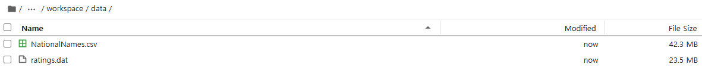
- 위와 같이 workspace 폴더 안에 data 폴더를 만들고 그 안에 파일들을 업로드함.
- 이후 실습 코드 작성.
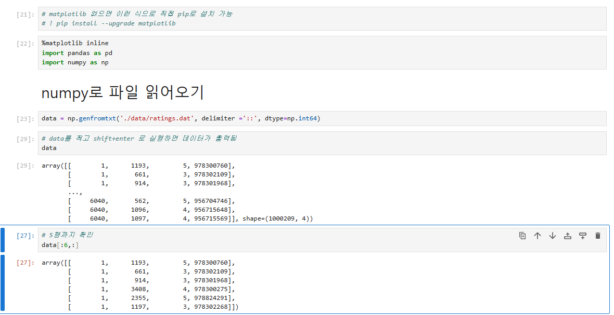
- matplotlib 없으면 이런 식으로 직접 pip로 설치 가능
    - `! pip install --upgrade matplotlib`
- %matplotlib inline: 시각화 라이브러리, inline: 주피터 안에서 시각화 그래프 실행/출력하는 매직 명령어
- import pandas as pd
- import numpy as np
- numpy로 파일 읽어오기
    - data = np.genfromtxt('./data/ratings.dat', delimiter ='::', dtype=np.int64)
    - data
    - data[:6,:]
    - `data.shape` -> (1000209, 4)
## pandas로 파일 읽어오기 (code로 입력후 shift+enter로 계속 실행)
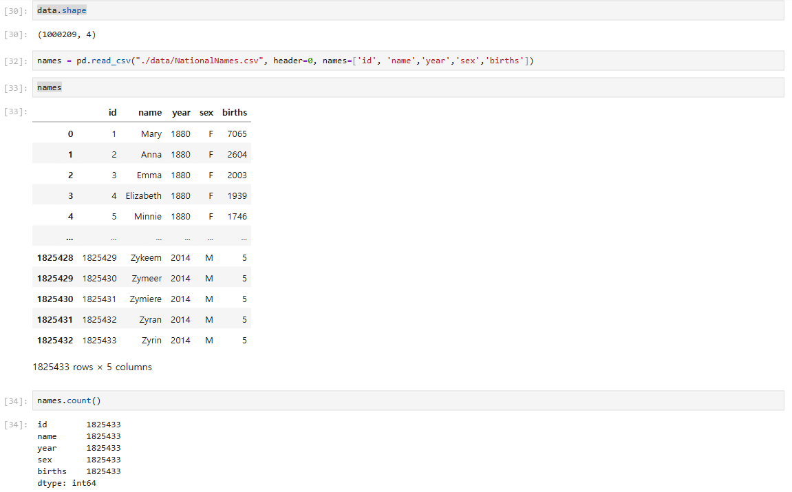
    - names = pd.read_csv("./data/NationalNames.csv", header=0, names=['id', 'name','year','sex','births'])
    - names
    - names.count()
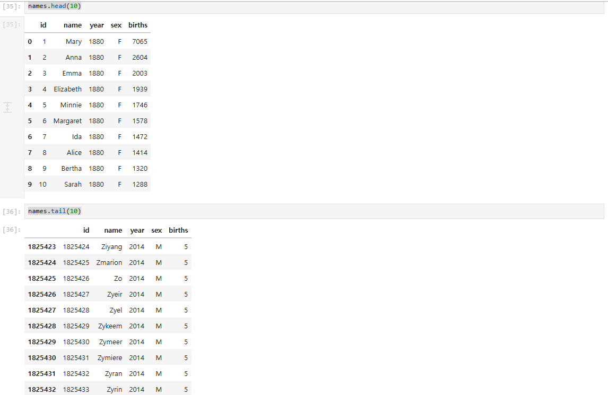
    - `names.head(10)`: 처음부터 10개 행에 대해서 데이터 봄
    - `names.tail(10)`: 끝에서 10개 행에 대해서 데이터 봄

# 데이터 간단 분석 및 시각화 - pandas
## 년도 별 남자와 여자의 총 합 구하기 - pandas 피벗 테이블 지정
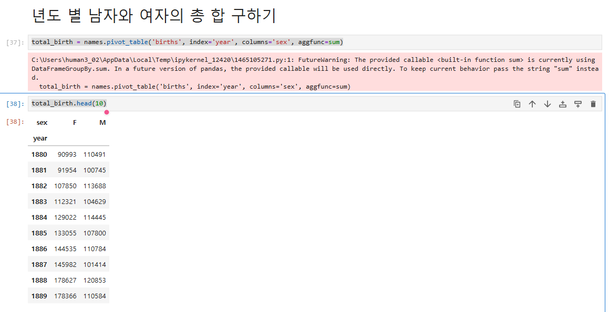
- total_birth = names.pivot_table('births', index='year', columns='sex', aggfunc=sum)
- total_birth.head(10)
## pandas 피봇 테이블 -> 시각화 (plot)
- total_birth.plot(title='Total births by sex and year')
    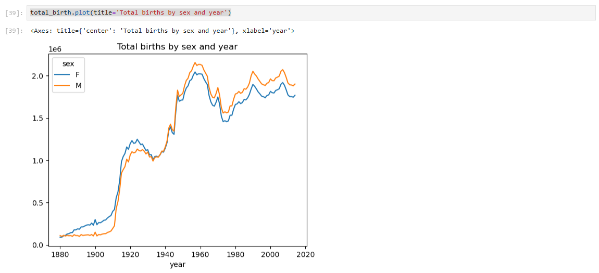
## 설명
- 네셔널 csv 가져와서 data에 넣었고, 컬럼 봤고, 컬럼 10개 봤고, 데이터 가지고 가볍게 피벗 테이블으로 연도별 남자와 여자 총 합 분석했다. 
- 남자인지 여자인지 등 각각의 개인정보들을 가지고 연도별로 남자 총합, 여자 총합을 계산한 것이다. 
- total_birth.head(10)로 데이터만 보면 인사이트 안느껴져서 .plot 으로 시각화 한거다. => 가독성 있게 느껴짐.
- 수치만 들이밀면 이해를 못하기 때문에 설득하기 위해 시각화로 표현해야 설득에 효과적이다. (교수님이 실제 회사에서 인사이트 뽑음 -> 수치로 설명 했는데 의미있는 내용이어도 모른다고 함. 데이터로 얘기하지 말라고. -> 그래서 다음에 시각화해서 설명하니까 듣고 대화가 되었었다.)

# EDA 할때는 주로 numpy, pandas, visualization(matplotlib, seaborn)을 쓸 것이다.
- numpy: 벡터, 행렬 연산에 편의성을 제공하는 라이브러리
- pandas: 데이터 프레임 형태의 구조로 데이터 분석에 편의성을 제공하는 라이브러리
- visualization(matplotlib, seaborn): 데이터 시각화를 위한 라이브러리
- 위 3가지를 가지고 EDA 탐색을 진행할 예정. (다음 수업)

# < 휴식시간 - 10:50~11:00 >

# 커리큘럼 다시 말씀해 주심 (실습)
1. numpy, pandas, visualization EDA 분석 실습
2. 데이터 저장, 병렬/분산 처리 실습
3. 통신 실습
4. 머신러닝 실습
5. 딥러닝 실습
6. ML/DL 실무 응용 실습
7. 도커컨테이너 기반 MLOps 실습

# 실습2
- 워크스페이스에서 [2-01) numpy ndarray] python3 새 파일 다시 만듦
- `import numpy as np` 를 처음에 해주어야 함.

# numpy ndarray
- numpy는 특히 벡터 및 행렬 연산에 있어 편의성을 제공하는 라이브러리
- numpy에서는 기본적으로 array라는 단위로 데이터를 관리하고, 이에 대한 연산을 수행한다. -> array에 대한 이해가 필요
## 1차원 array
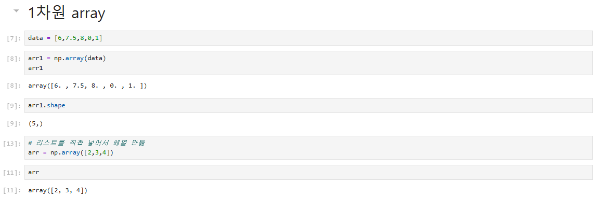
    - 기본적 array 생성
## 2차원 array
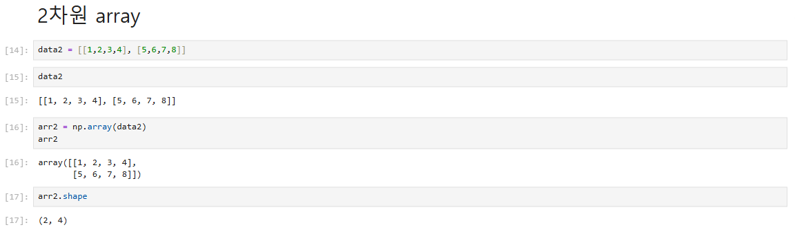
    - 리스트를 배열로 변환
## numpy 제공 함수 - zeros, ones, arange 함수
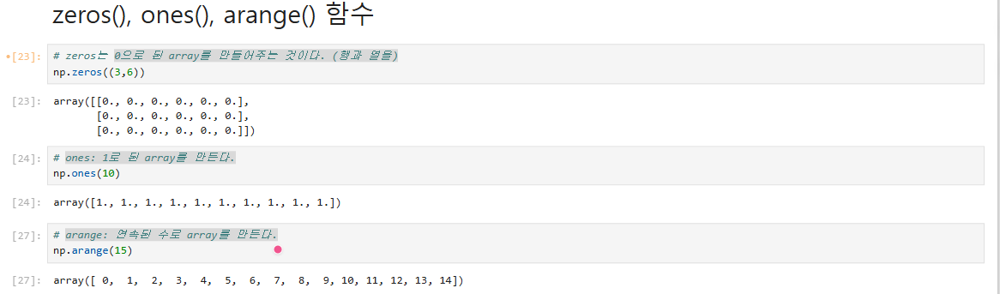
- zeros: 0으로 된 array를 만들어주는 것이다. (행과 열을)
- ones: 1로 된 array를 만든다.
- arange: 연속된 수로 array를 만든다.
## 데이터 타입 참고
- 데이터 타입 -> 이 중에서, NUMPY에서 주로 쓰는것: INT FLOAT, BOOL 이다.
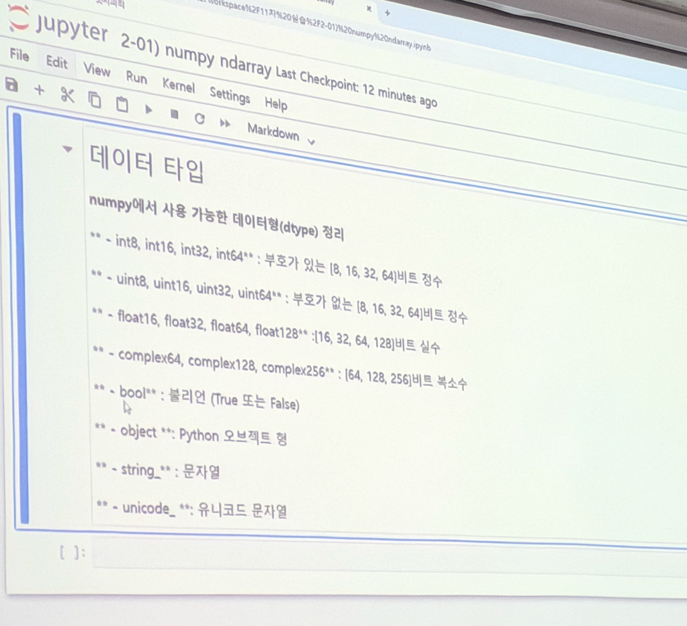
## 데이터 타입 실습
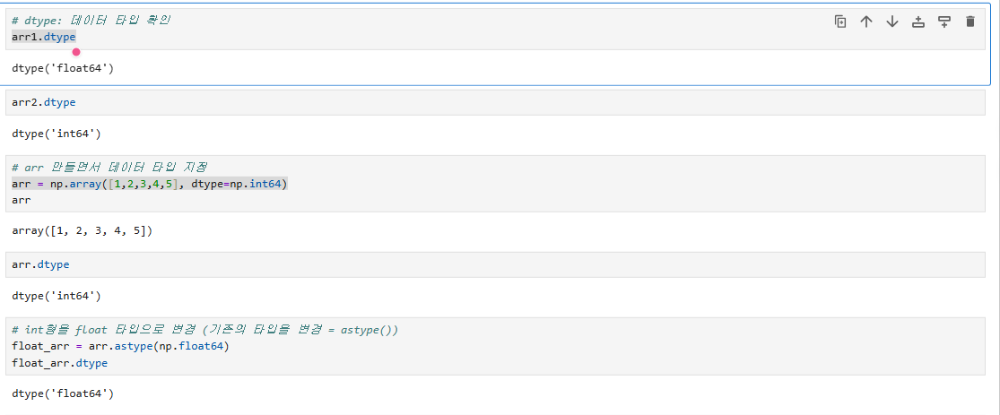
- 데이터 타입 확인: arr1.dtype
- 데이터 타입 지정: arr = np.array([1,2,3,4,5], dtype=np.int64)
- 데이터 타입 변경: float_arr = arr.astype(np.float64)
## array 관련 연산
- 두 array 간에는 더하기, 빼기, 곱하기, 나누기 등의 연산을 수행할 수 있다. '+', '-', '*', '/' 등과 같이 일반 숫자에 대해 사용하는 연산자를 사용. 이 때, 이러한 더하기, 빼기, 곱하기, 나누기 등의 연산은 두 array 상의 동일한 위치의 성분끼리 이루어지게 되므로, 당연히 두 array의 모양이 같아야 계산이 가능하다.
- 요약: 같은 모양 배열이어야 하고, 같은 행/열에 있는 넘들이랑 연산됨.
- 연산 결과 확인
    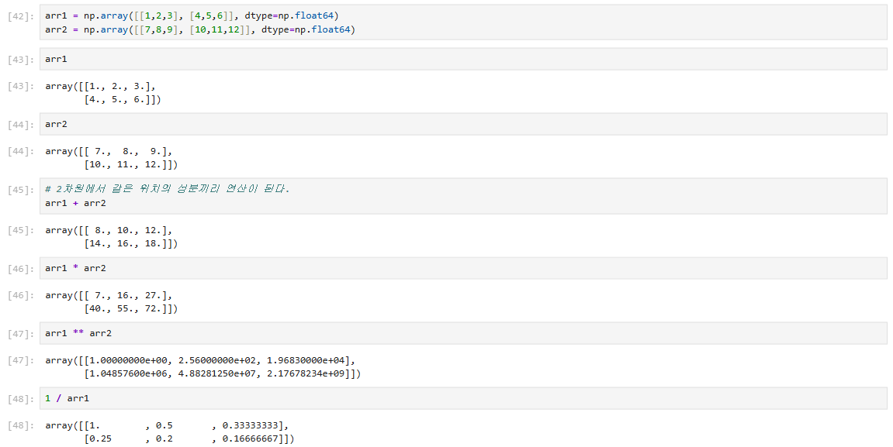
- 나중에 머신러닝/딥러닝 분석시 필드에서는 물베이스 연산 로직을 만들어서 활용하는 경우도 굉장히 많다. 넘파이로 만들어서 활용. 
- 피지컬 인폼드 동역학 모델 만들때 동역학 방적식을 이런 식으로 연산 처리해서 계산 했었다.
- 지금은 더하기 곱하기 나누기 지만 동역학 모델 방정식 만들고 여러가지로 응용 가능하다.

# numpy 인덱싱 실습
- 새 python3 파일 생성: [array 인덱싱 이해]
- import numpy as np
## 1차원 array 인덱싱
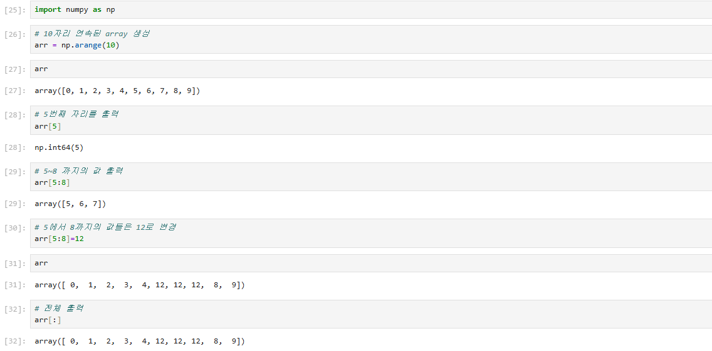
- `arr = np.arange(10)`: 10자리 연속된 array 생성
- `arr[5]`: 5번째 자리를 출력
- `arr[5:8]`: 5~8 까지의 값 출력
- `arr[5:8]=12`: 5에서 8까지의 값들은 12로 변경
- `arr[:]`: 전체 출력
## 2차원 array 인덱싱
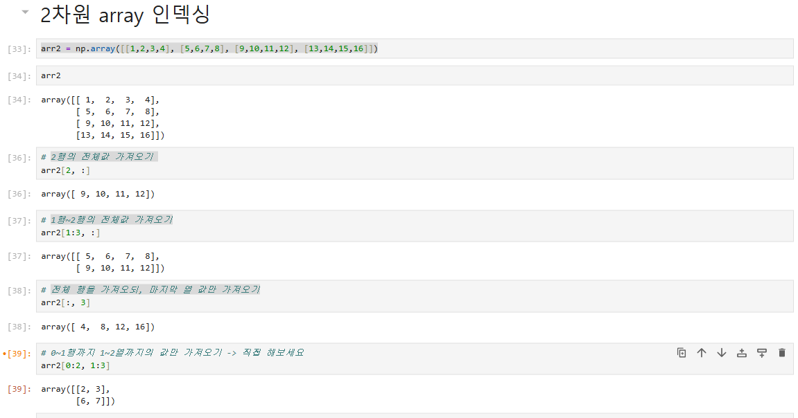
- `arr2 = np.array([[1,2,3,4], [5,6,7,8], [9,10,11,12], [13,14,15,16]])`: 2차원 array 생성
- `arr2[2, :]`: 2행의 전체값 가져오기 
- `arr2[1:3, :]`: 1행~2행의 전체값 가져오기(3 앞까지 가져옴)
- `arr2[:, 3]`: 전체 행을 가져오되, 마지막 열 값만 가져오기
- `arr2[0:2, 1:3]`: 0~1행까지 1~2열까지의 값만 가져오기
- 엄한 값을 잘못 가져오지 않게 0부터 시작한다는 것을 잘 기억하고 인덱싱 해야함
- 이미 잘 알아도 너무 중요하기 때문에 다시 언급.
- 집가서 실습코드 꼭 복습 한 번 해봤으면 좋겠다. [OK]
# < 휴식시간 - 11:50~12:00 >
- 연봉, 복지, 워라밸(사람들이 요즘 연봉보다 중요하게 봄)
- 네임밸류, 대기업 - 그만큼 많이 일을 시켜요. 고생많이해요.
- 적당히 타협 - 중견기업 정도
- 젊을 때는 이런 것도 따져야 한다: 커리어 얼마만큼 잘 쌓을 수 있느냐. 커리어를 잘 쌓을 수 있는 회사를 무조건 선택하세요.
- 우선순위: 커리어. 기술 중심인 회사를 잘 선별해서 가는 것이 좋다. 그런 곳이 커리어 쌓기 좋다. 스타트업은 시리즈 A, B 처럼 투자를 받은 곳. 기술적 일을 할 수 있다.
## boolean 인덱싱
- true/false 확인
    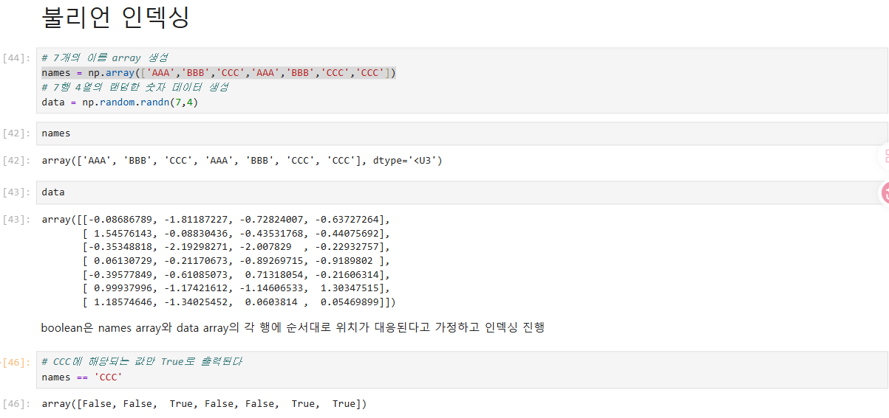
    - `names = np.array(['AAA','BBB','CCC','AAA','BBB','CCC','CCC'])`: 
    - `names == 'CCC'`: 값이 CCC인 성분의 위치에는 True, 그 외의 위치에는 False로 확인
- 검색
    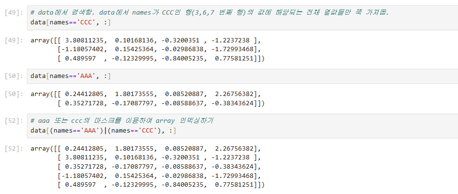
- 조건부 마스크 (다시 확인해보기)
    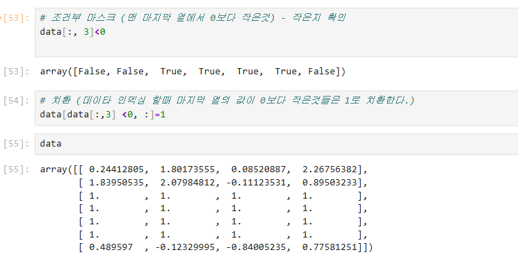

# array 관련 함수 사용
- 새 python3 파일 생성 [2-03) array 관련 함수 사용]
- 로직을 일일히 알코딩 할 필요없이 함수들 이용해서 편하게 연산 가능하다.
- import numpy as np
## 연산 함수 실습
- [각 함수들 종류는 추후 끝나고 깃허브에 강의 자료 남겨두심]
    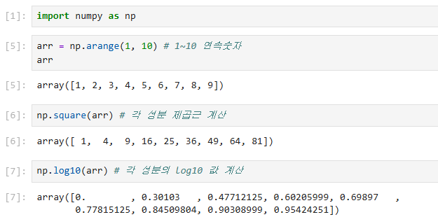
- numpy에서 두 개의 array의 각 성분에 적용되는 함수: add, subtract, multiply, divide, maximum, minimum
    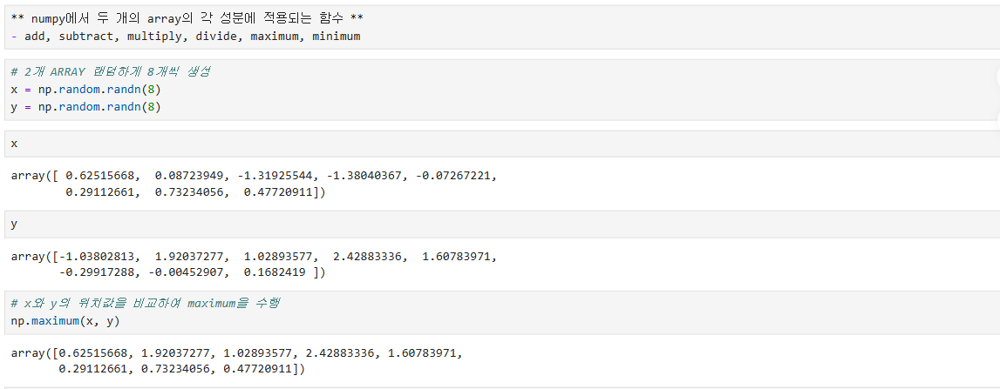
- 통계 함수: sum, mean, std/var, min/max, argmin/argmax, cumsum, cumprod
    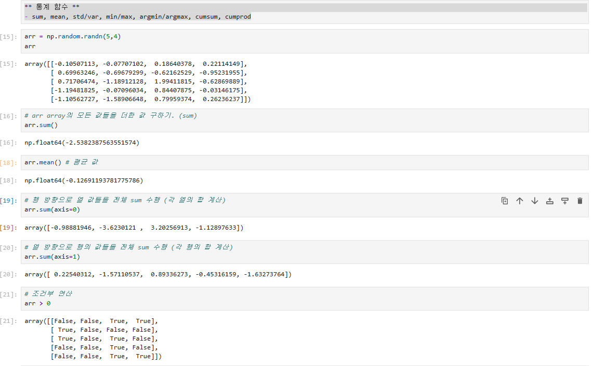
    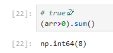
    - axis=0, axis=1 이거 중요함. 0은 행을 남기고, 1은 열을 남기는것.
- 정렬 함수 및 기타 함수
    - 1차원
        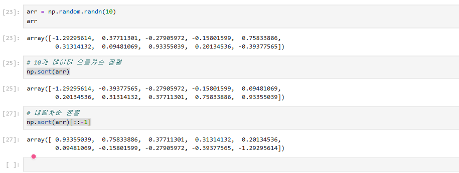
        - 오름차순: np.sort(arr)
        - 내림차순: np.sort(arr)[::-1]
    - 2차원 (axis=0, axis=1)
        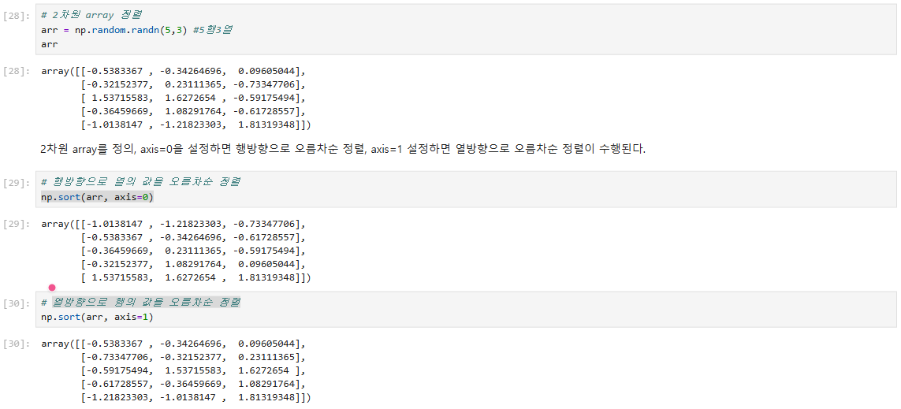
        - np.sort(arr, axis=0)
        - np.sort(arr, axis=1)

# < 점심시간 - 12:50~1:50 >

## 정렬하고 상위 5% 값 출력하기
- large_arr = np.random.randn(150)
- np.sort(large_arr)[::-1][int(0.05*len(large_arr))]
## 중복된 값 제거하기
- names = np.array(['aaa','aaa','aaa','fff','fff','ddd', 'eee'])
- ints = np.array([3,3,3,4,4,1,1,2,2,5,5,6,8,8])
- np.unique(names)
- np.unique(ints)

# 2-04) numpy 활용한 데이터 분석
- 새 파일 생성 [2-04) numpy 활용한 데이터 분석]
- import numpy as np
## 데이터 가져오기
```
import numpy as np
data = np.genfromtxt('./data/ratings.dat', delimiter='::', dtype=np.int64)
data
data[:5,:]
data.shape ==> (1000209, 4) 1,000,209행, 4열
```
## 문제: 전체 평균 평점 계산하기
- mean_rating_total = data[:, 2].mean()
- mean_rating_total
## 문제: 사용자 별 평균 평점 계산하기 - 나의 풀이
```
user = 1
data[data[:,0]==user,2].mean() # 1번 열이 해당 유저인 모든 스코어를 가져옴. + mean으로 평균화함 => 해당 유저의 평균점수
```
- 특정 유저의 평균점수는 구했는데 각 사용자 별 평균 평점은 어떻게 출력해야 하지? for문 돌려야 하나?
## 교수님 풀이
```
user_id_arr = np.unique(data[:,0])
user_id_arr
user_id_arr.shape
mean_rating_by_user_list = []
for user_id in user_id_arr:
    data_for_user = data[data[:,0]==user_id, :] # 해당 유저의 데이터. 특정 USER_ID 값들의 ARRAY를 저장한 변수 (unique 값 별로 저장될것이다.)
    mean_rating_for_user = data_for_user[:, 2].mean() # 해당 id 에 대한 평균 평점을 계산한다.
    mean_rating_by_user_list.append([user_id, mean_rating_for_user]) # 빈 리스트에 결과를 넣는다.
data_for_user[:10]
mean_rating_by_user_list[:10]
```
- 위처럼 for문 돌려서 배열 안에 배열로 순서대로 [[유저아이디, 평점], [유저아이디2, 평점]] 이렇게 출력 하라는 거였음!
## csv 파일에 결과 저장
- 리스트 => array 타입으로 변환: 
    - mean_rating_by_user_list_array = np.array(mean_rating_by_user_list, dtype=np.float64) # array 타입으로 변환
    - mean_rating_by_user_list_array.shape
- 파일에 저장 .savetxt("저장경로", 저장할array, 포맷, delimiter=구분인자)
    - np.savetxt("./data/2-04) mean_rating_by_user.csv", mean_rating_by_user_list_array, fmt="%.3f", delimiter=',')

# pandas 자료 구조
- 새 파일 만들기 [3-01) pandas 자료 구조]
import pandas as pd
import numpy as np
- pandas에서는 고유하게 정의한 자료 구조인 Series와 DataFrame을 사용하여 빅데이터 분석을 할 수 있다.
## Series
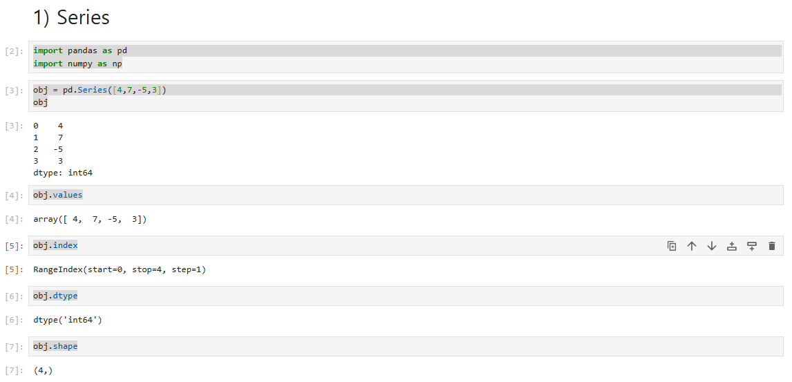
```
    obj = pd.Series([4,7,-5,3])
    obj.values
    obj.index
    obj.dtype
    obj.shape
```
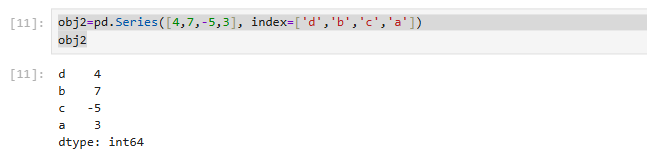
- obj2=pd.Series([4,7,-5,3], index=['d','b','c','a'])
## DataFrame
- DataFrame은 pd.DataFrame() 함수를 사용하여 정의한다. (엑셀처럼) DataFrame에 입력할 데이터는 Python 딕셔너리 혹은 numpy의 2차원 array 등의 형태가 될 수 있다.
- 이건 넘파이처럼 자릿수 인덱싱도 할수 있지만, 컬럼 정보를 가지고 인덱싱 가능하다(디비 셀렉팅 같은 느낌!)
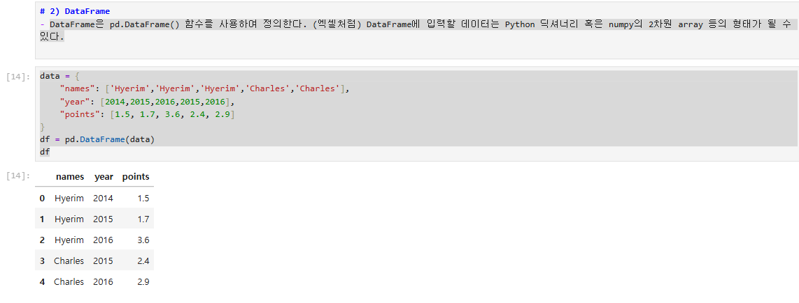
```
    data = {
        "names": ['Hyerim','Hyerim','Hyerim','Charles','Charles'],
        "year": [2014,2015,2016,2015,2016],
        "points": [1.5, 1.7, 3.6, 2.4, 2.9]
    }
```
- 엑셀처럼 행열에 컬럼과 인덱스가 있게 표시된다.
### df
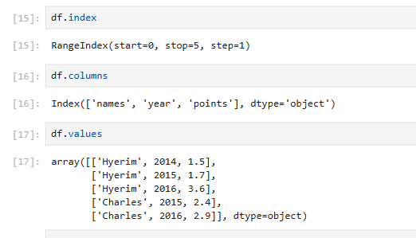
- 값들에 컬럼과 인덱스를 지정해 준다.
- 그러면 이와 같은 구조가 됨.: df = pd.DataFrame(data)
- 인덱스, 컬럼, 값을 뽑아볼 수 있다.
    - df.index
    - df.columns
    - df.values
### describe 함수: 각 컬럼 평균, 분산, 최소/최대값 등 기본 통계량을 산출한 결과를 보여준다. (좋네!-!)
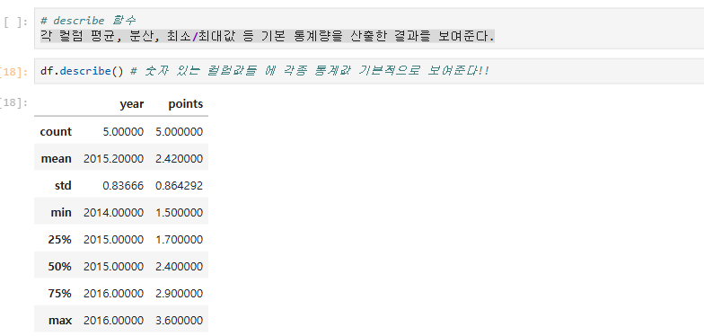
- `df.describe()` 로 하면 됨

### df2
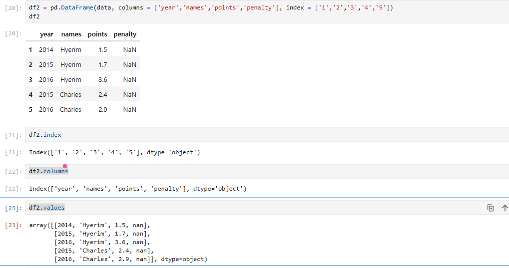

# < 휴식시간 - 3:30~3:40 >

# pandas - DataFrame 을 활용한 분석
- [3-02) DaraFrame 인덱싱] 신규 파일 생성.
import pandas as pd
import numpy as np

## 데이터 프레임 만들어둠
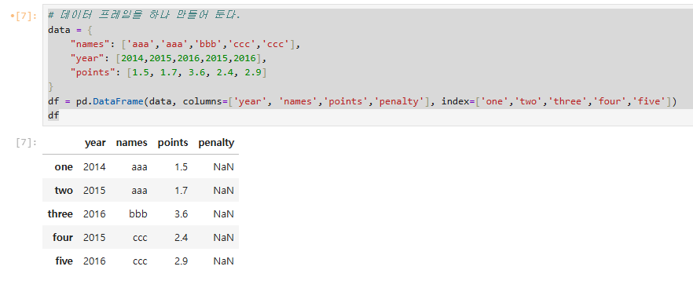
```
    # 데이터 프레임을 하나 만들어 둔다.
    data = {
        "names": ['aaa','aaa','bbb','ccc','ccc'],
        "year": [2014,2015,2016,2015,2016],
        "points": [1.5, 1.7, 3.6, 2.4, 2.9]
    }
    df = pd.DataFrame(data, columns=['year', 'names','points','penalty'], index=['one','two','three','four','five'])
    df
```
## year 열에 대한 값만 가져오기
- `df.year`
## 두 개 이상의 열을 가져올 때는 이중 배열 형태
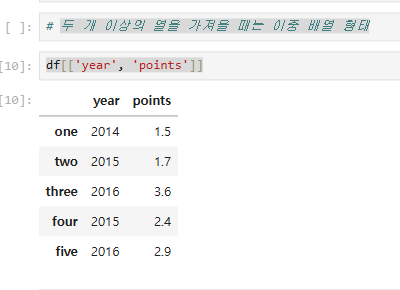
- `df[['year', 'points']]`
## 값 넣기
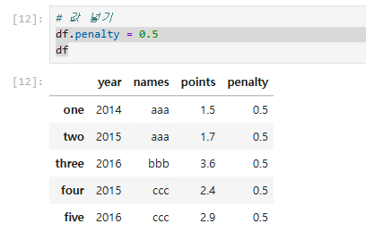
- `df.penalty = 0.5`
## 행마다 다른 값 넣기
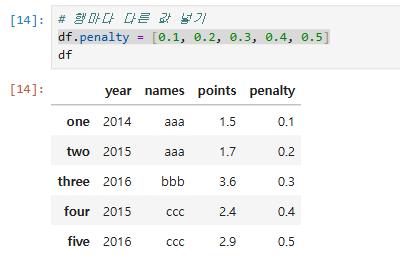
- df.penalty = [0.1, 0.2, 0.3, 0.4, 0.5]
## 컬럼 하나 더 추가하고 값 넣어보기 이건 .으로 접근하면 안되고 [''] 로 해야됨.
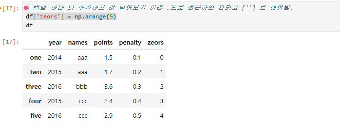
- df['zeors'] = np.arange(5)
## 시리즈 데이터 만들기
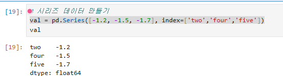
- val = pd.Series([-1.2, -1.5, -1.7], index=['two','four','five'])
## 컬럼 추가하고 거기에 val(시리즈 데이터) 넣기
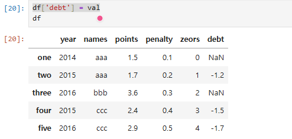
- df['debt'] = val
## 연산을 통해 연산 결과를 새로운 컬럼에 넣기
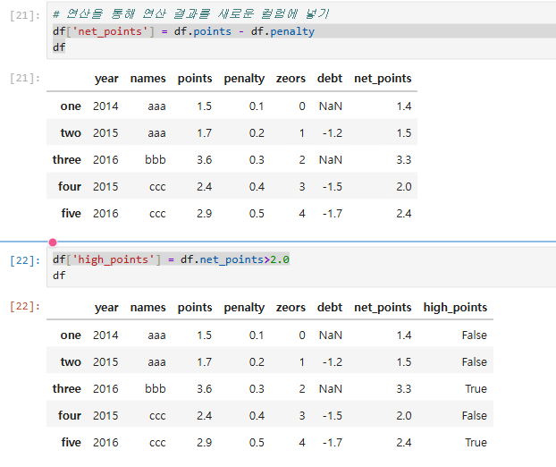
- df['net_points'] = df.points - df.penalty
- df['high_points'] = df.net_points>2.0      # 조건문을 넣으면 True, False 값으로 알아서 계산돼서 들어간다.
## 기존의 열 삭제하기 - 이것도 [''] 로 접근해야됨.
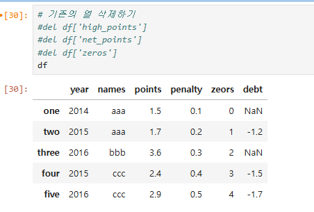
- del df['high_points']
- del df['net_points']
- del df['zeros']
## index와 column의 대표 이름 변경하기
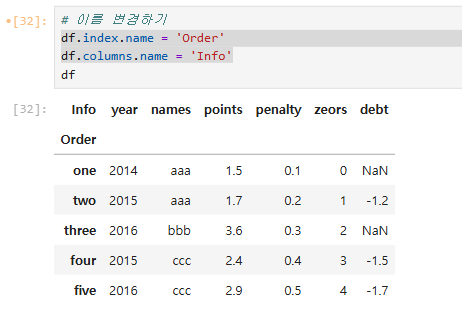
- df.index.name = 'Order'
- df.columns.name = 'Info'
## 행 제어하기
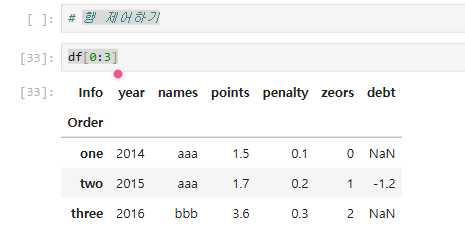
- 0,1,2 3개에 대해서 인덱싱 했다.: df[0:3]
## 문자로 '범위' 인덱싱도 가능하다.
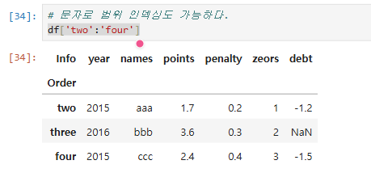
- df['two':'four']
- 근데 보통은 df.loc? 이런걸로 한다고 한다.
## 행 선택하는 권장 방법: .loc(), .iloc()
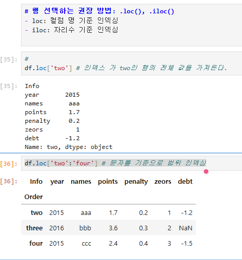
- loc: 컬럼 명 기준 인덱싱
- iloc: 자리수 기준 인덱싱
## df.loc['two'] # 인덱스 가 two인 행의 전체 값을 가져온다.
## df.loc['two':'four'] # 문자를 기준으로 범위 인덱싱
## points 컬럼의 특정 값만 가져오기
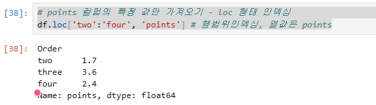
- df.loc['two':'four', 'points'] # 행범위인덱싱, 열값은 points!!
##  전체 행 값 가져오고, 거기에서 year컬럼의 값만 가져오기!!
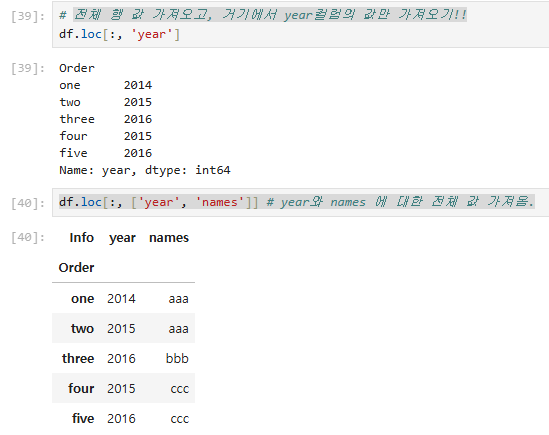
- df.loc[:, 'year']
- df.loc[:, ['year', 'names']] # year와 names 에 대한 전체 값 가져옴.
## 2~3행에 대해 year, names 가져옴.
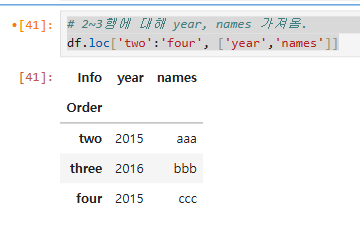
- df.loc['two':'four', ['year','names']]
## .iloc는 numpy 방식으로 (행/열 자리값으로)
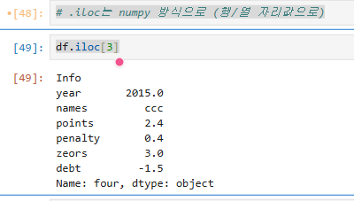
- 0,1,2,3 이렇게 3번째 자리값을 가져온것이다.: df.iloc[3]
## 0,1,2까지 0~3행값(3개), 0,1까지 0~2열값(2개) 가져온다.
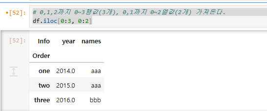
- df.iloc[0:3, 0:2]
- 순서 잘 외우기. 마지막 숫자까지 가져오면 안된다. 쓰는것-1 개수만큼 가져온다.
## 가끔 0,1,3행 이렇게 가져오고 싶을 때, 행과 열의 범위를 별도 지정해서 인덱싱
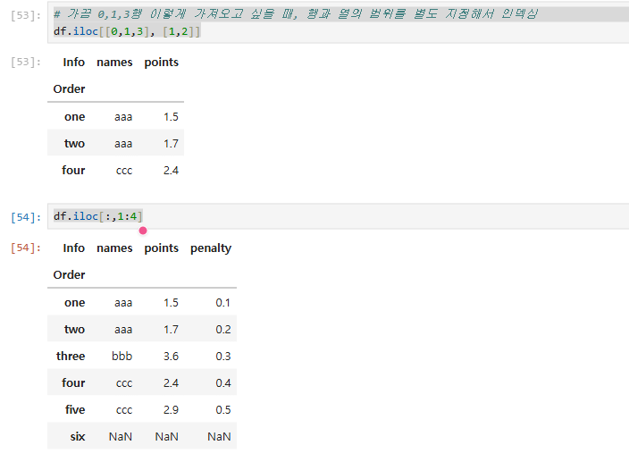
- df.iloc[[0,1,3], [1,2]]
- df.iloc[:,1:4]
## 값 하나만 가져오기
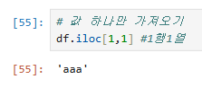
- df.iloc[1,1] #1행1열

# pandas - 불리언 인덱싱
## year의 2014년보다 큰 값 찾기 (연도에서 2014년보다 큰값) -> true/false
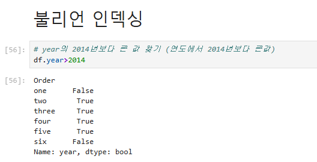
- df.year>2014
## add컬럼 만들고 거기에 2014보다 크면 true를 넣음
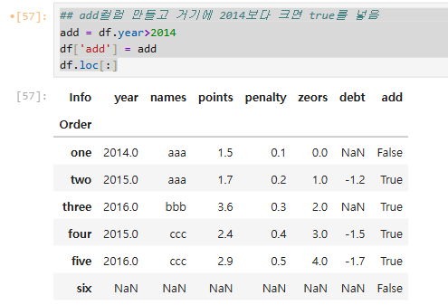
- add = df.year>2014
- df['add'] = add
- df.loc[:]
## 불리언 값에 의해 인덱싱
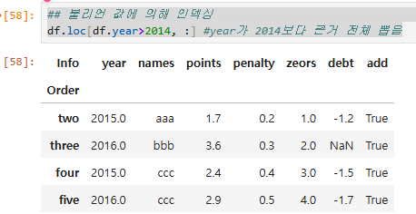
- df.loc[df.year>2014, :] #year가 2014보다 큰거 전체 뽑음
## names가 ccc에 해당되는 names와 points정보 뽑아오기
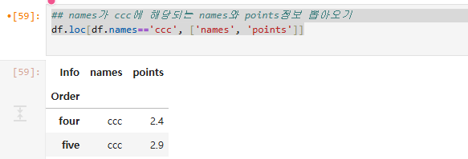
- df.loc[df.names=='ccc', ['names', 'points']]
- 불리언 인덱싱 많이 활용되는 코드니까 보라고 함.
## points 값 2보다 크고 3보다 작은 값 인덱싱
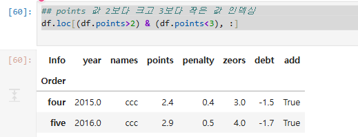
- df.loc[(df.points>2) & (df.points<3), :]
## 포인트값이 3보다 큰것은 penalty 값을 0으로 대입
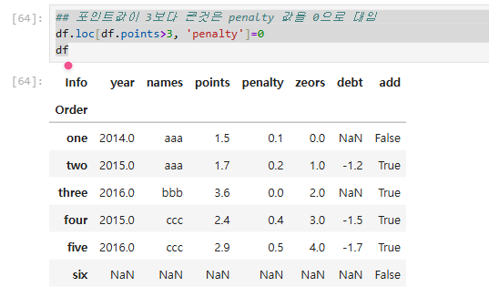
- df.loc[df.points>3, 'penalty']=0
## 불리언 인덱스 실습 코드들은 정말 많이 쓰이는 코드니까 꼭 보라고 한다.

# < 휴식시간 - 4:30~4:40 >
- TCP/IP 통신 프로토콜, fastAPI 로 통신하는거, 가벼운 ai 모델 이용해서 통신로직 활용 실습

# pandas - dataframe 조작하기
- 새로운 파일 만들기 [3-03) dataframe 조작하기]
import pandas as pd
import numpy as np
## numpy타입으로 6행 4열 랜덤 데이터 만들고 데이터 프레임으로 변환
- df = pd.DataFrame(np.random.randn(6,4))
## 6일간의 데이터를 인덱스 값으로 만들어서 뽑아본다.
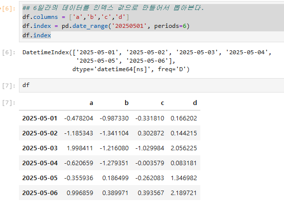
```
df.columns = ['a','b','c','d']
df.index = pd.date_range('20250501', periods=6)
df.index
df
```
## f컬럼에 여러가지 값들 추가
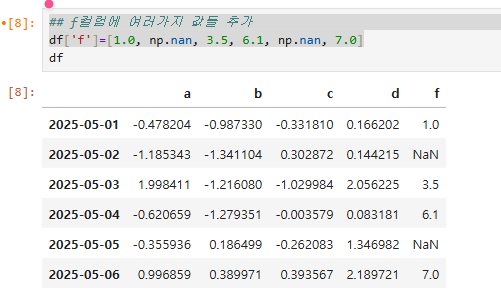
- df['f']=[1.0, np.nan, 3.5, 6.1, np.nan, 7.0]
## NAN 값만 제거하기 - dropna (how='any'는 nan이 하나라도 포함되어 있으면 그 행을 다 지우는 것이다.)
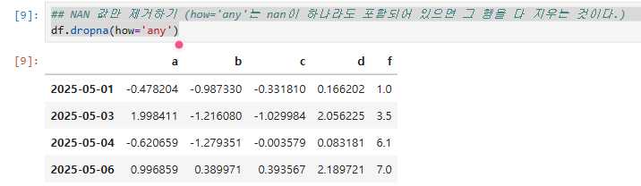
- df.dropna(how='any')
## nan이 행 전체에 있을 경우 해당 행을 삭제하기 - dropna -  (how='all') 
- df.dropna(how='all') 
## nan 값을 대체하기 (5로 대체한다.)
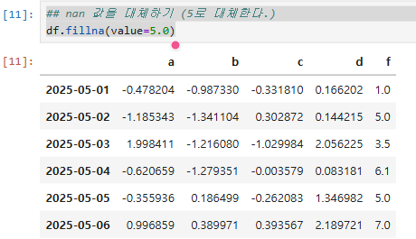
- df.fillna(value=5.0)
## isnull : nan값 있는지 없는지 확인.
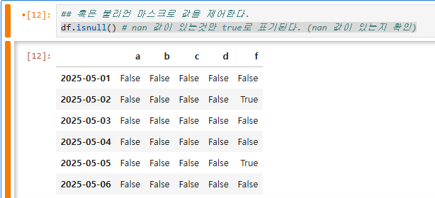
- df.isnull() # nan 값이 있는것만 true로 표기된다. (nan 값이 있는지 확인)
## f열에서 NAN 값이 있는 모든 행을 가져온다.
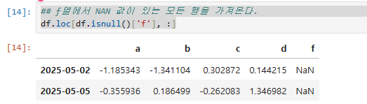
- df.loc[df.isnull()['f'], :]
## 인덱스(현재는 날짜로 되어있음) 기준으로 행을 삭제한다.
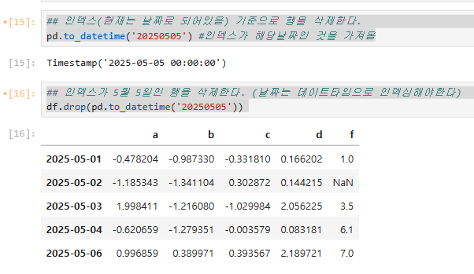
pd.to_datetime('20250505') #인덱스가 해당날짜인 것을 가져옴
- 인덱스가 5월 5일인 행을 삭제한다. (날짜는 데이트타임으로 인덱싱해야한다)
df.drop(pd.to_datetime('20250505')) 
## 인덱스 기준으로 두개 이상의 행(5/4, 5/6일)을 삭제한다.
- df.drop([pd.to_datetime('20250504'), pd.to_datetime('20250506')])
## f열 전체 삭제하기
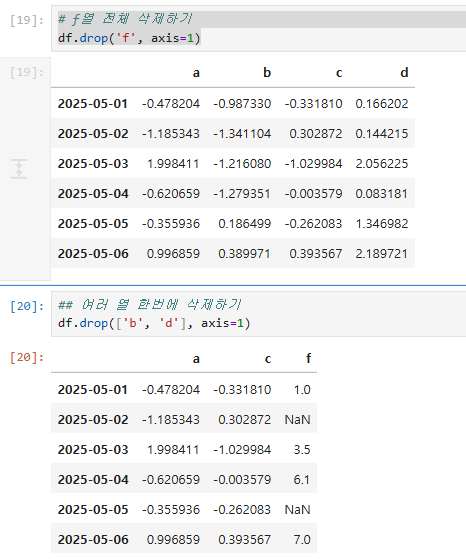
- df.drop('f', axis=1)
## 여러 열 한번에 삭제하기
- df.drop(['b', 'd'], axis=1)

# pandas - dataframe 분석하기
## 데이터 만들기
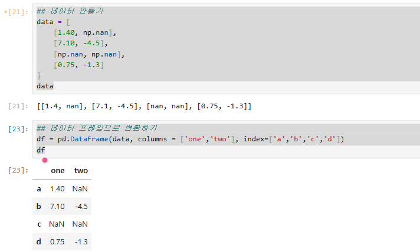
```
    data = [
        [1.40, np.nan],
        [7.10, -4.5],
        [np.nan, np.nan],
        [0.75, -1.3]
    ]
```
## 데이터 프레임으로 변환하기
- df = pd.DataFrame(data, columns = ['one','two'], index=['a','b','c','d'])
## [중요] 행방향으로 열의 합을 계산한다 ==> nan값은 배제하고 계산된다.
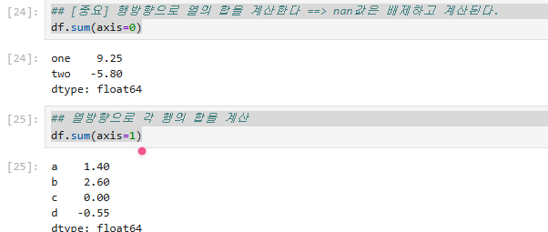
- df.sum(axis=0)
- one에 대한 sum값, two에 대한 sum 값이 나온다.
## 열방향으로 각 행의 합을 계산
- df.sum(axis=1)
## 특정 열 또는 행의 값 계산 (one 컬럼에 대해 sum)
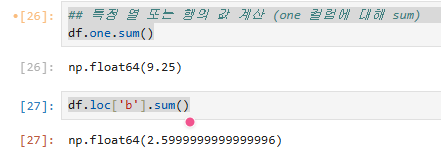
- df.one.sum()
- df.loc['b'].sum() # b에 대해 계산
## two 행에 대해 값 있는것들 평균 계산
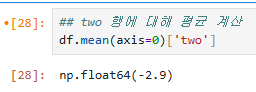
- df.mean(axis=0)['two']
## 열에 대해 평균 내는데, nan값이 있으면 그 행은 스킵하고 계산하기
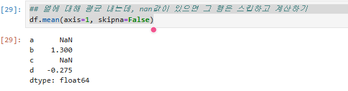
- df.mean(axis=1, skipna=False)
## one_mean 변수에 'one' 행의 평균값을 넣는다.
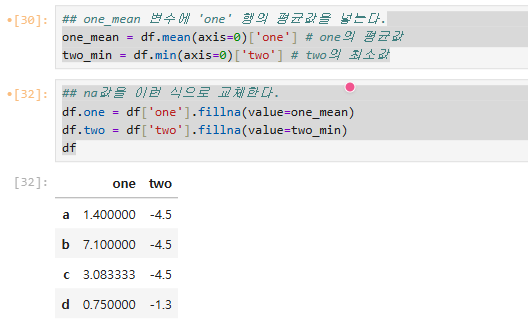
- one_mean = df.mean(axis=0)['one'] # one의 평균값
- two_min = df.min(axis=0)['two'] # two의 최소값
## na값을 이런 식으로 교체한다.
- df.one = df['one'].fillna(value=one_mean)
- df.two = df['two'].fillna(value=two_min)

# pandas - dataframe 상관계수 구하기
## 상관계수 구하기 - 데이터 프레임 준비
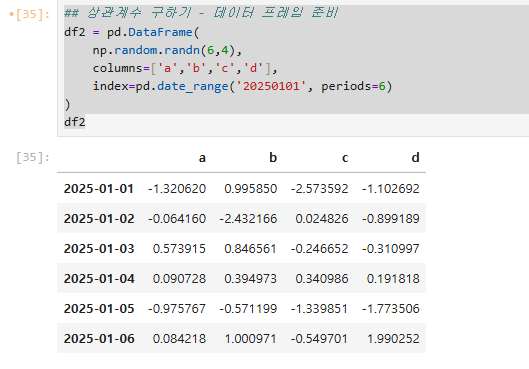
```
df2 = pd.DataFrame(
    np.random.randn(6,4), 
    columns=['a','b','c','d'], 
    index=pd.date_range('20250101', periods=6)
)
```
## [중요] df2 데이터프레임의 a열과 b열의 상관계수 산출하기 (피어슨 상관계수로 계산 -> 나중엔 이거 안씀.)
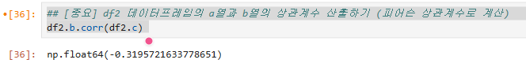
- df2.b.corr(df2.c) # 0.8이면 상관관계 높은 것임..
## 전체를 상관관계로 표현 - 이처럼, 각 변수별로 상관관계를 분석해서 => 이걸로 히트맵 표현하면 시각적으로 확 와닿을 수 있게 된다.
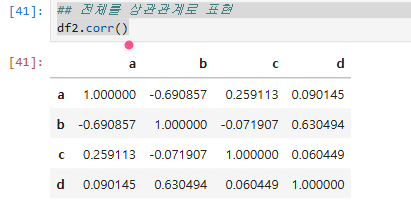
- df2.corr()
- 각 변수간에 상관관계 있는지 계산. 지금은 피어슨으로 간단하게 뽑았지만 나중엔 샵이나 피처인포턴스로 y에 영향미치는 치명인자 선정을 할 예정이다. 근데 일단 이렇게 하셔도 된다.
- a가 내려가면 b도 내려가겠네~ 이런 관계가 정의된 것이다.

# pandas - dataframe 정렬 및 기타 함수.
## 불규칙하게 데이터를 섞는다.
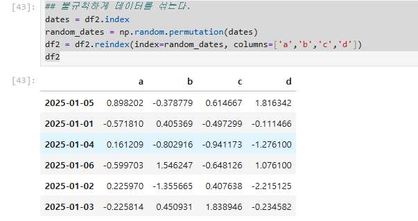
- dates = df2.index
- random_dates = np.random.permutation(dates)
- df2 = df2.reindex(index=random_dates, columns=['a','b','c','d'])
## 인덱스 기준으로 오름차순 정렬 - sort_index
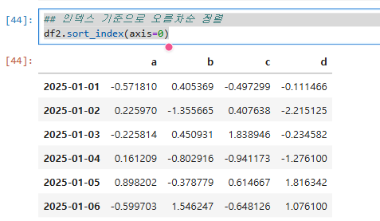
- df2.sort_index(axis=0)
## 컬럼 기준으로 오름차순 정렬 - sort_index
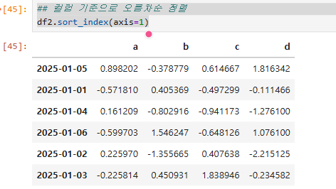
- df2.sort_index(axis=1)
## 컬럼 기준으로 내림차순 정렬 (두번째 인자에 ascending=False 를 주어야 한다.) - sort_index
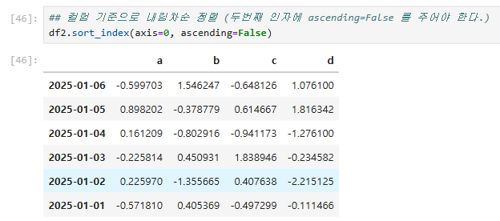
- df2.sort_index(axis=0, ascending=False)
## a 값을 기준으로 오름차순 정렬 - sort_values
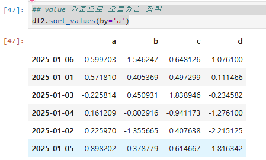
df2.sort_values(by='a')
## b값을 기준으로 내림차순 정렬 - sort_values, ascending=False
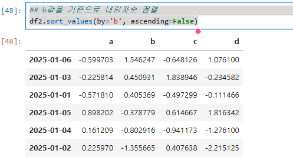
- df2.sort_values(by='b', ascending=False)

## 랜덤 값 채움
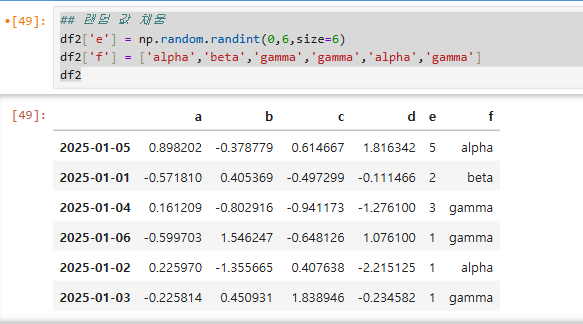
- df2['e'] = np.random.randint(0,6,size=6)
- df2['f'] = ['alpha','beta','gamma','gamma','alpha','gamma']
## 값 뽑기
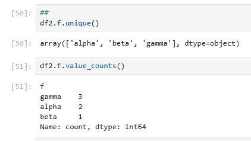
## f열에 특정 값 있는지 검색 -> true/false
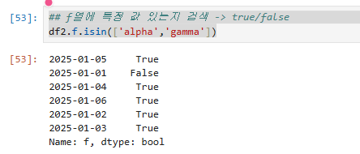
- df2.f.isin(['alpha','gamma'])
## f열에서 알파 감마가 있는 행의 모든 값을 뽑는다.
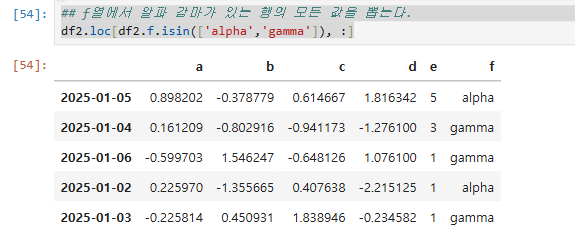
- df2.loc[df2.f.isin(['alpha','gamma']), :]

# 수업 끝
- 파이썬에서 람다를 사용하면 되게 짧게 코드를 짤 수 있다고 한다.