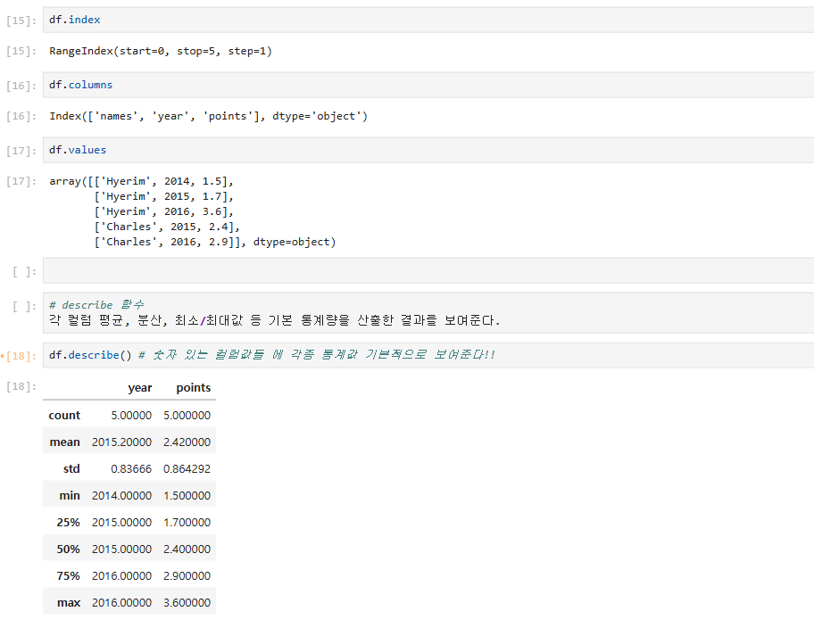

# 3일차 - 5/28(목) #
- 회의 참석: https://whaleon.us/o/CSvuJa/64dffed07c6741c990f69804e3b62d6e

# EDA - 데이터를 탐색하는 일
- 다음 시간에 EDA 탐색 방법론에 대하여 알아볼 것임
- 내 데이터의 특징 파악 (구조/성격/내용)
- 판다스, 넘파이, 시각화 진행
- 제일 중요한 부분
- <다른 사람들 설치하는 동안 https://github.com/wikibook/pymlrev2/blob/main/10%EC%9E%A5/Visualization_Seaborn.ipynb 코드 구경중>

# < 휴식시간 - 9:40~9:50 >

# 실습 진행 - EDA
- 수집한 데이터 탐색하는 과정 (패턴, 유형, 성격 분석 및 판단)
- 맷플롯, 시본 시각화 등
- 판다스: 분석 유용, 넘파이: 숫자 특화 툴 => 둘다 많이 활용
- 문자와 숫자 같이 봐야하는 경우 많기 때문에 판다스
- 넘파이는 숫자분석. ai 학습데이터 생성시 보통 array 형태로 셋을 만든다.
- 넘파이로 데이터 셋 만들어서 활용해서, 나중에 머신러닝시 더 수월할 수 있다
- 데이터를 파악해야 어떤 분석을 할 수 있을지 감을 잡을 수 있다.

# 파일 데이터 로드
- 워크스페이스에 [1-01)파일 데이터 로드] 파일 만들어서 진행.
- 여기에 있는 파일 다운받음. https://github.com/ilovejwoo1004-bit/AI_advanced/blob/main/data.zip
    - NationalNames.csv
    - ratings.dat
    - movies.dat
- 
- 위와 같이 workspace 폴더 안에 data 폴더를 만들고 그 안에 파일들을 업로드함.
- 이후 실습 코드 작성.

- matplotlib 없으면 이런 식으로 직접 pip로 설치 가능
    - `! pip install --upgrade matplotlib`
- %matplotlib inline: 시각화 라이브러리, inline: 주피터 안에서 시각화 그래프 실행/출력하는 매직 명령어
- import pandas as pd
- import numpy as np
- numpy로 파일 읽어오기
    - data = np.genfromtxt('./data/ratings.dat', delimiter ='::', dtype=np.int64)
    - data
    - data[:6,:]
    - `data.shape` -> (1000209, 4)
## pandas로 파일 읽어오기 (code로 입력후 shift+enter로 계속 실행)

    - names = pd.read_csv("./data/NationalNames.csv", header=0, names=['id', 'name','year','sex','births'])
    - names
    - names.count()

    - `names.head(10)`: 처음부터 10개 행에 대해서 데이터 봄
    - `names.tail(10)`: 끝에서 10개 행에 대해서 데이터 봄

# 데이터 간단 분석 및 시각화
## 년도 별 남자와 여자의 총 합 구하기

- total_birth = names.pivot_table('births', index='year', columns='sex', aggfunc=sum)
- total_birth.head(10)
## 시각화
- total_birth.plot(title='Total births by sex and year')
    
## 설명
- 네셔널 csv 가져와서 data에 넣었고, 컬럼 봤고, 컬럼 10개 봤고, 데이터 가지고 가볍게 피벗 테이블으로 연도별 남자와 여자 총 합 분석했다. 
- 남자인지 여자인지 등 각각의 개인정보들을 가지고 연도별로 남자 총합, 여자 총합을 계산한 것이다. 
- total_birth.head(10)로 데이터만 보면 인사이트 안느껴져서 .plot 으로 시각화 한거다. => 가독성 있게 느껴짐.
- 수치만 들이밀면 이해를 못하기 때문에 설득하기 위해 시각화로 표현해야 설득에 효과적이다. (교수님이 실제 회사에서 인사이트 뽑음 -> 수치로 설명 했는데 의미있는 내용이어도 모른다고 함. 데이터로 얘기하지 말라고. -> 그래서 다음에 시각화해서 설명하니까 듣고 대화가 되었었다.)

# EDA 할때는 주로 numpy, pandas, visualization(matplotlib, seaborn)을 쓸 것이다.
- numpy: 벡터, 행렬 연산에 편의성을 제공하는 라이브러리
- pandas: 데이터 프레임 형태의 구조로 데이터 분석에 편의성을 제공하는 라이브러리
- visualization(matplotlib, seaborn): 데이터 시각화를 위한 라이브러리
- 위 3가지를 가지고 EDA 탐색을 진행할 예정. (다음 수업)

# < 휴식시간 - 10:50~11:00 >

# 커리큘럼 다시 말씀해 주심 (실습)
1. numpy, pandas, visualization EDA 분석 실습
2. 데이터 저장, 병렬/분산 처리 실습
3. 통신 실습
4. 머신러닝 실습
5. 딥러닝 실습
6. ML/DL 실무 응용 실습
7. 도커컨테이너 기반 MLOps 실습

# 실습2
- 워크스페이스에서 [2-01) numpy ndarray] python3 새 파일 다시 만듦
- `import numpy as np` 를 처음에 해주어야 함.

# numpy ndarray
- numpy는 특히 벡터 및 행렬 연산에 있어 편의성을 제공하는 라이브러리
- numpy에서는 기본적으로 array라는 단위로 데이터를 관리하고, 이에 대한 연산을 수행한다. -> array에 대한 이해가 필요
## 1차원 array

    - 기본적 array 생성
## 2차원 array

    - 리스트를 배열로 변환
## numpy 제공 함수 - zeros, ones, arange 함수

- zeros: 0으로 된 array를 만들어주는 것이다. (행과 열을)
- ones: 1로 된 array를 만든다.
- arange: 연속된 수로 array를 만든다.
## 데이터 타입 참고
- NUMPY에서 주로 쓰는거: INT FLOAT, BOOL

- 데이터 타입 확인: arr1.dtype
- 데이터 타입 지정: arr = np.array([1,2,3,4,5], dtype=np.int64)
- 데이터 타입 변경: float_arr = arr.astype(np.float64)
## array 관련 연산
- 두 array 간에는 더하기, 빼기, 곱하기, 나누기 등의 연산을 수행할 수 있다. '+', '-', '*', '/' 등과 같이 일반 숫자에 대해 사용하는 연산자를 사용. 이 때, 이러한 더하기, 빼기, 곱하기, 나누기 등의 연산은 두 array 상의 동일한 위치의 성분끼리 이루어지게 되므로, 당연히 두 array의 모양이 같아야 계산이 가능하다.
- 요약: 같은 모양 배열이어야 하고, 같은 행/열에 있는 넘들이랑 연산됨.
- 연산 결과 확인
    
- 나중에 머신러닝/딥러닝 분석시 필드에서는 물베이스 연산 로직을 만들어서 활용하는 경우도 굉장히 많다. 넘파이로 만들어서 활용. 
- 피지컬 인폼드 동역학 모델 만들때 동역학 방적식을 이런 식으로 연산 처리해서 계산 했었다.
- 지금은 더하기 곱하기 나누기 지만 동역학 모델 방정식 만들고 여러가지로 응용 가능하다.

# numpy 인덱싱 실습
- 새 python3 파일 생성: [array 인덱싱 이해]
- import numpy as np
## 1차원 array 인덱싱

    - `arr = np.arange(10)`: 10자리 연속된 array 생성
    - `arr[5]`: 5번째 자리를 출력
    - `arr[5:8]`: 5~8 까지의 값 출력
    - `arr[5:8]=12`: 5에서 8까지의 값들은 12로 변경
    - `arr[:]`: 전체 출력
## 2차원 array 인덱싱

    - `arr2 = np.array([[1,2,3,4], [5,6,7,8], [9,10,11,12], [13,14,15,16]])`: 2차원 array 생성
    - `arr2[2, :]`: 2행의 전체값 가져오기 
    - `arr2[1:3, :]`: 1행~2행의 전체값 가져오기(3 앞까지 가져옴)
    - `arr2[:, 3]`: 전체 행을 가져오되, 마지막 열 값만 가져오기
    - `arr2[0:2, 1:3]`: 0~1행까지 1~2열까지의 값만 가져오기
    - 엄한 값을 잘못 가져오지 않게 0부터 시작한다는 것을 잘 기억하고 인덱싱 해야함
    - 이미 잘 알아도 너무 중요하기 때문에 다시 언급.
    - 집가서 실습코드 꼭 복습 한 번 해봤으면 좋겠다. [OK]
# < 휴식시간 - 11:50~12:00 >
- 연봉, 복지, 워라밸(사람들이 요즘 연봉보다 중요하게 봄)
- 네임밸류, 대기업 - 그만큼 많이 일을 시켜요. 고생많이해요.
- 적당히 타협 - 중견기업 정도
- 젊을 때는 이런 것도 따져야 한다: 커리어 얼마만큼 잘 쌓을 수 있느냐. 커리어를 잘 쌓을 수 있는 회사를 무조건 선택하세요.
- 우선순위: 커리어. 기술 중심인 회사를 잘 선별해서 가는 것이 좋다. 그런 곳이 커리어 쌓기 좋다. 스타트업은 시리즈 A, B 처럼 투자를 받은 곳. 기술적 일을 할 수 있다.
## boolean 인덱싱
- true/false 확인
    
    - `names = np.array(['AAA','BBB','CCC','AAA','BBB','CCC','CCC'])`: 
    - `names == 'CCC'`: 값이 CCC인 성분의 위치에는 True, 그 외의 위치에는 False로 확인
- 검색
    
- 조건부 마스크 (다시 확인해보기)
    

# array 관련 함수 사용
- 새 python3 파일 생성 [2-03) array 관련 함수 사용]
- 로직을 일일히 알코딩 할 필요없이 함수들 이용해서 편하게 연산 가능하다.
- import numpy as np
## 연산 함수 실습
- [각 함수들 종류는 추후 끝나고 깃허브에 강의 자료 남겨두심]
    
- numpy에서 두 개의 array의 각 성분에 적용되는 함수: add, subtract, multiply, divide, maximum, minimum
    
- 통계 함수: sum, mean, std/var, min/max, argmin/argmax, cumsum, cumprod
    
    
    - axis=0, axis=1 이거 중요함. 0은 행을 남기고, 1은 열을 남기는것.
- 정렬 함수 및 기타 함수
    - 1차원
        
        - 오름차순: np.sort(arr)
        - 내림차순: np.sort(arr)[::-1]
    - 2차원 (axis=0, axis=1)
        
        - np.sort(arr, axis=0)
        - np.sort(arr, axis=1)

# < 점심시간 - 12:50~1:50 >

## 정렬하고 상위 5% 값 출력하기
large_arr = np.random.randn(150)
large_arr
np.sort(large_arr)[::-1][int(0.05*len(large_arr))]
## 중복된 값 제거하기
names = np.array(['aaa','aaa','aaa','fff','fff','ddd', 'eee'])
ints = np.array([3,3,3,4,4,1,1,2,2,5,5,6,8,8])
np.unique(names)
np.unique(ints)

# 2-04) numpy 활용한 데이터 분석
- 새 파일 생성 [2-04) numpy 활용한 데이터 분석]
- import numpy as np
## 데이터 가져오기
import numpy as np
data = np.genfromtxt('./data/ratings.dat', delimiter='::', dtype=np.int64)
data
data[:5,:]
data.shape ==> (1000209, 4) 1,000,209행, 4열
## 문제: 전체 평균 평점 계산하기
mean_rating_total = data[:, 2].mean()
mean_rating_total
## 문제: 사용자 별 평균 평점 계산하기 - 중복제거도?? 
## 정답
user_id_arr = np.unique(data[:,0])
user_id_arr
user_id_arr.shape
mean_rating_by_user_list = []
for user_id in user_id_arr:
    data_for_user = data[data[:,0]==user_id, :] # 해당 유저의 데이터. 특정 USER_ID 값들의 ARRAY를 저장한 변수 (unique 값 별로 저장될것이다.)
    mean_rating_for_user = data_for_user[:, 2].mean() # 해당 id 에 대한 평균 평점을 계산한다.
    mean_rating_by_user_list.append([user_id, mean_rating_for_user]) # 빈 리스트에 결과를 넣는다.
data_for_user[:10]
mean_rating_by_user_list[:10]
## csv 파일에 결과 저장
- 리스트 => array 타입으로 변환: `mean_rating_by_user_list_array = np.array(mean_rating_by_user_list, dtype=np.float64) # array 타입으로 변환
mean_rating_by_user_list_array.shape`
- 파일에 저장 .savetxt("저장경로", 저장할array, 포맷, delimiter=구분인자): `np.savetxt("./data/2-04) mean_rating_by_user.csv", mean_rating_by_user_list_array, fmt="%.3f", delimiter=',')`

# pandas 자료 구조
- 새 파일 만들기 [3-01) pandas 자료 구조]
import pandas as pd
import numpy as np
- pandas에서는 고유하게 정의한 자료 구조인 Series와 DataFrame을 사용하여 빅데이터 분석을 할 수 있다.
## Series

obj = pd.Series([4,7,-5,3])
obj.values
obj.index
obj.dtype
obj.shape

obj2=pd.Series([4,7,-5,3], index=['d','b','c','a'])
## DataFrame
- DataFrame은 pd.DataFrame() 함수를 사용하여 정의한다. (엑셀처럼) DataFrame에 입력할 데이터는 Python 딕셔너리 혹은 numpy의 2차원 array 등의 형태가 될 수 있다.
- 이건 넘파이처럼 자릿수 인덱싱도 할수 있지만, 컬럼 정보를 가지고 인덱싱 가능하다(디비 셀렉팅 같은 느낌!)

data = {
    "names": ['Hyerim','Hyerim','Hyerim','Charles','Charles'],
    "year": [2014,2015,2016,2015,2016],
    "points": [1.5, 1.7, 3.6, 2.4, 2.9]
}
- df

df = pd.DataFrame(data)
df.index
df.columns
df.values
- df2

## DataFrame 을 활용한 분석
