# 4일차 - 5/29(금) #
- 회의 참석: https://whaleon.us/o/CSvuJa/64dffed07c6741c990f69804e3b62d6e

# 3-03) pandas 데이터프레임 조작하기 이어서 실습 진행 
- 이름없는 익명의 함수 간단하게 만들때 사용하는데 유용하게 사용 가능하다. 사용 예시를 보여줄거다.

## 파이썬 람다함수 간단 생성 및 덧셈 연산
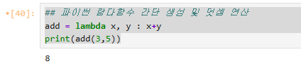
- add = lambda x, y : x+y
- print(add(3,5))

## 데이터프레임 하나 생성
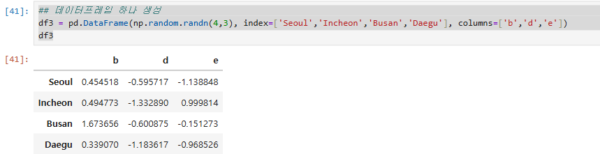
- df3 = pd.DataFrame(np.random.randn(4,3), index=['Seoul','Incheon','Busan','Daegu'], columns=['b','d','e'])

## 람다함수를 활용하여 연산 진행 (x.max: 행 또는 열의 최대값, x.min: 행 또는 열의 최소값)
- func = lambda x: x.max()-x.min()

## 행 방향으로 해당 함수 열 값이 계산된다 (위의 람다함수: 해당 열에서 가장 높은 값, 가장 낮은 값 찾아서 마이너스 연산 진행) - 데이터프레임.apply(람다함수, axis=0)
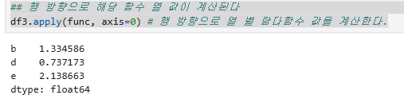
- df3.apply(func, axis=0) # 행 방향으로 열 별 람다함수 값을 계산한다.

## 열 방향으로 행 별로 값을 계산한다.
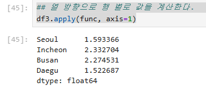
- df3.apply(func, axis=1)

# pandas를 활용한 데이터 분석 실습 - 데이터 로드
- 새로운 파일 생성 [3-05) pandas를 활용한 데이터 분석 실습]
## kaggle -> 데이터 csv 파일 가져오기
- csv 파일 찾으시는 중
    - data 폴더에 네셔널 네임즈 파일 읽어와서 분석을 진행할 것이다.
    - 이거 아니라고 한다..
    - loan csv download 검색해서 케글에 있는 것 다운: https://www.kaggle.com/datasets/tanishaj225/loancsv
    - zip 파일로 다운로드한다. -> 그 안에 loan.csv 있음.
    - 이것도 아니라고 한다.. (찾고 계시는 중-)
- csv 파일 찾음 -> 가져다 놓기.
    - https://www.kaggle.com/datasets/adarshsng/lending-club-loan-data-csv?utm_source=chatgpt.com&select=loan.csv
    - 다운로드 받기 -> zip -> loan.csv 파일 있음.
    - workspace/data 폴더로 업로드하기
    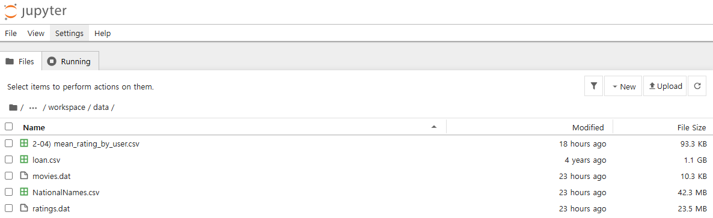
    - 용량이 엄청 크다.. (!)

## Lending Club Loan dataset 분석하기 - 데이터 필드 설명
- 사용자들이 은행에서 대출을 하고 잘 갚았는지 등급은 어떤지 신용등급을 평가하는 데이터이다. 이 데이터로 인사이트를 뽑아보는 분석을 해볼 것이다.
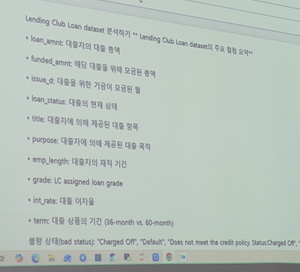
- loan_amnt: 대출자의 대출 총액
- funded_amnt: 해당 대출을 위해 모금된 총액
- issue_d: 대출을 위한 기금이 모금된 월
- loan_status: 대출의 현재 상태
- title: 대출자에 의해 제공된 대출 항목
- purpose: 대출자에 의해 제공된 대출 목적
- emp_length: 대출자의 재직 기간
- grade: LC assigned loan grade
- int_rate: 대출 이자율
- term: 대출 상품의 기간(36-month vs 60-month)
- 그 외 불량 상태 등등

# < 휴식시간 - 9:50~10:00 >

# pandas를 활용한 데이터 분석 실습
import pandas as pd
import numpy as np


## DF로 데이터를 읽어온다.
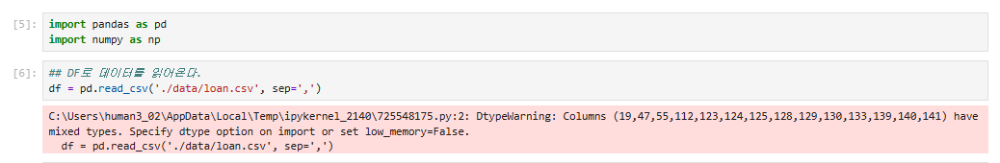
- df = pd.read_csv('./data/loan.csv', sep=',')
- 오류처럼 보이지만 읽어와 지고 있는 것이다.

## 10개를 확인해 본다
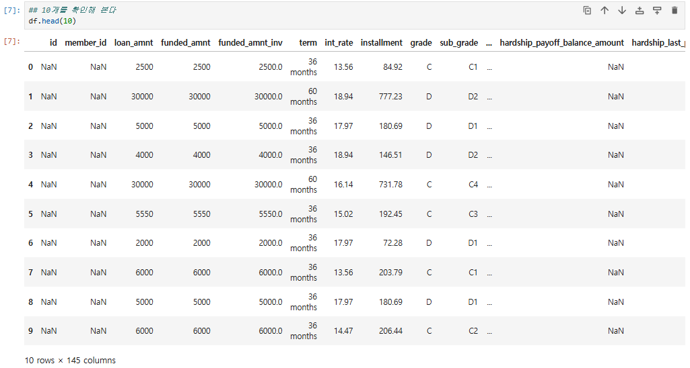
- df.head(10)
- 데이터가 커서 오래 걸렸지만 가지고 왔다.

## df의 상태 확인(행 몇개인지, 열 몇개인지)
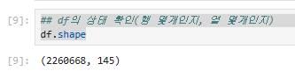
- df.shape
- 확인해 보니 2,260,668행, 145열이 있다. (2260668, 145)

## 컬럼 어떤 것 있는지 확인
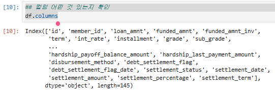
- df.columns

## 뒤에서 5번째 행까지 데이터 확인
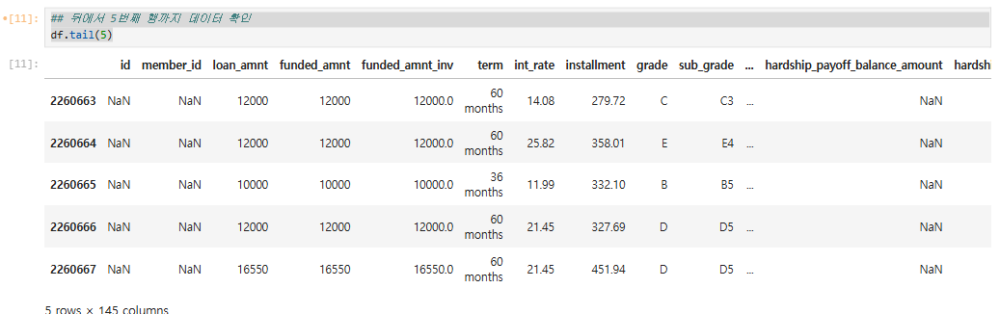
- df.tail(5)

## 필요한 컬럼만 가져오기 df[['가져올필드','2','3']]
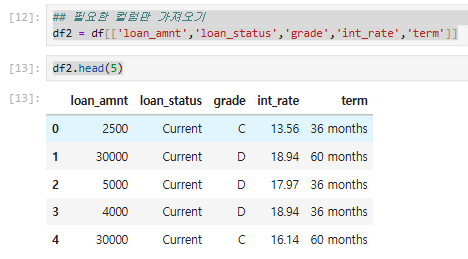
- df2 = df[['loan_amnt','loan_status','grade','int_rate','term']]
- df2.head(5)

## 데이터 중복값 없는지 확인해보기
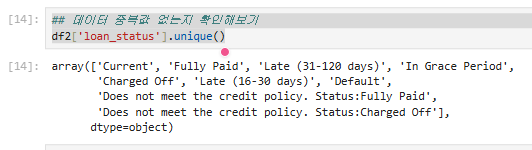
- df2['loan_status'].unique()
- 어떤 값들이 있는지 확인 가능하다.

## grade, term엔 어떤 값들 있는지 확인
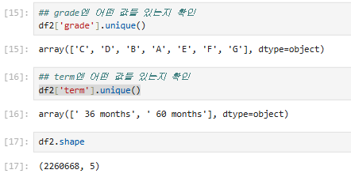
- df2['grade'].unique()
- df2['term'].unique()

## pandas df - nan 제거하기(dropna). how를 any로 두면 nan이 있는 그 행은 모두 삭제된다!!! / 반면 how를 all로 두면 그 행 전체가 nan인 경우에만 삭제된다.
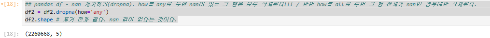
- df2 = df2.dropna(how='any')
- df2.shape # 제거 전과 같다. nan 값이 없는 데이터라는 것이다.

## df2 데이터를 가지고 세부 분석 할 예정 (어제 실습 내용 토대로)
- 문제 내줄건데 직접 풀어 보라고 함. 다음 시간에 풀이..

# pandas df 문제. 30개월/60개월 두 가지 대출 상품을 운영한다고 가정하고 풀기.
-  loan_amnt, loan_status, grade, int_rate, term 이걸 기반으로 인사이트 도출해보기

## 문제1-나의 풀이) '36개월 대출'과 '60개월 대출'의 대출 총액 계산
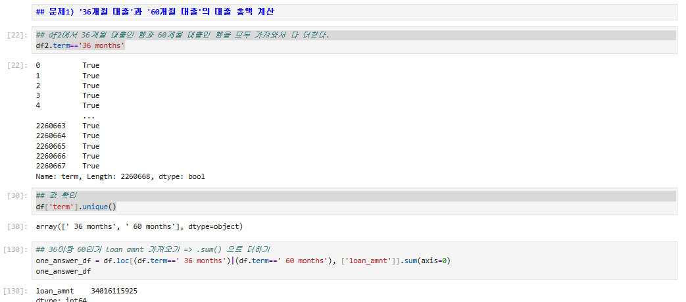
```python
## df2에서 36개월 대출인 행과 60개월 대출인 행을 모두 가져와서 다 더한다.
df2.term=='36 months'

## 값 확인
df['term'].unique()

## 36이랑 60인거 loan amnt 가져오기 => .sum() 으로 더하기
df.loc[(df.term==' 36 months')|(df.term==' 60 months'), ['loan_amnt']].sum() # loan_amnt    34016115925
```
## 문제1-교수님풀이) '36개월 대출'과 '60개월 대출'의 대출 총액 계산
```
## 결과를 저장할 딕셔너리 생성
term_to_loan_amnt_dict = {}
## term 컬럼의 고유값 추출
uniq_terms = df2.term.unique()

## 각 대출기간(term)에 대해 반복 계산을 수행 -> 해당 행들의 loan_amnt(대출금액) 컬럼의 합계를 계산한다.
for term in uniq_terms:
    # df2.loc[df2.term] 값이 uniq_term의 term과 같으면, loan_amnt의 열을 갖고 와서 sum을 수행한다.
    loan_amnt_sum = df2.loc[df2.term==term, 'loan_amnt'].sum()
    # 계산된 합계를 딕셔너리에 저장한다.
    term_to_loan_amnt_dict[term] = loan_amnt_sum

term_to_loan_amnt_dict

import matplotlib.pyplot as plt

plt.figure(figsize(8,5))
plt.bar(
    term_to_loan_amnt_dict.keys(),
    term_to_loan_amnt_dict.values(),
)

plt.title('Total Loan Amount by Term') # 그래프 타이틀
plt.xlabel('Loan Term') # x축 레이블
plt.ylabel('Total Loan Amount') # y축 레이블

plt.show()
```

## 문제2-나의 풀이) '각 대출 상태(불량/우량)에 따른 대출 등급 분포 파악
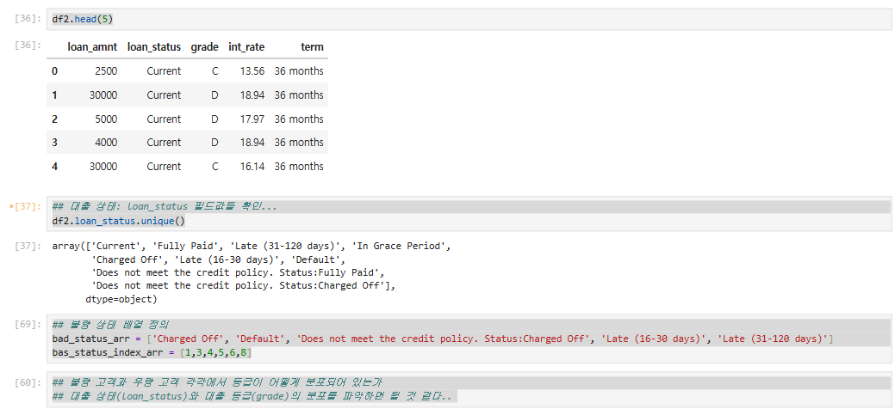
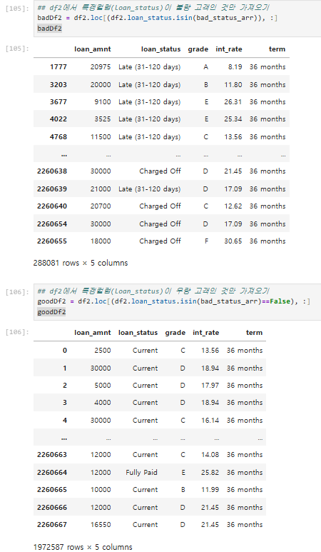
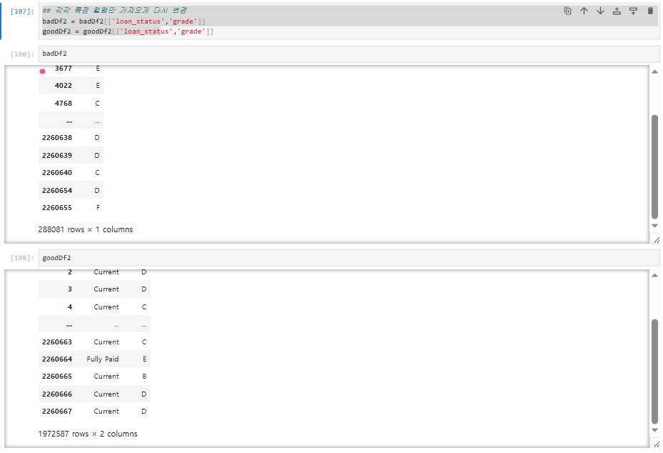
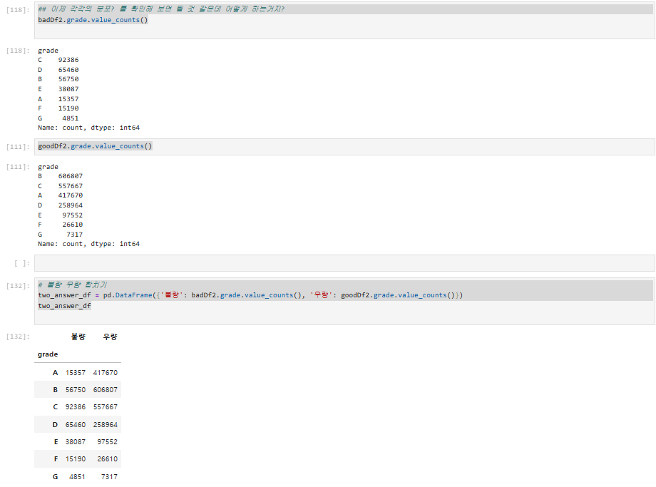
```
## 데이터 확인
df2.head(5)

## 대출 상태: loan_status 필드값들 확인...
df2.loan_status.unique()

## 불량 상태 배열 정의
bad_status_arr = ['Charged Off', 'Default', 'Does not meet the credit policy. Status:Charged Off', 'Late (16-30 days)', 'Late (31-120 days)']
bas_status_index_arr = [1,3,4,5,6,8]

## 불량 고객과 우량 고객 각각에서 등급이 어떻게 분포되어 있는가
## 대출 상태(loan_status)와 대출 등급(grade)의 분포를 파악하면 될 것 같다

## df2에서 특정컬럼(loan_status)이 불량 고객인 것만 가져오기
badDf2 = df2.loc[(df2.loan_status.isin(bad_status_arr)), :]
badDf2

## df2에서 특정컬럼(loan_status)이 우량 고객인 것만 가져오기
goodDf2 = df2.loc[(df2.loan_status.isin(bad_status_arr)==False), :]
goodDf2

## 각각 특정 컬럼만 가져오게 다시 변경
badDf2 = badDf2[['loan_status','grade']]
goodDf2 = goodDf2[['loan_status','grade']]
badDf2
goodDf2

## 이제 각각의 분포? 를 확인해 보면 될 것 같은데 어떻게 하는거지?
badDf2.grade.value_counts()
goodDf2.grade.value_counts()

# 불량 우량 합치기
two_answer_df = pd.DataFrame({'불량': badDf2.grade.value_counts(), '우량': goodDf2.grade.value_counts()})
two_answer_df
```

## 문제2-교수님 풀이) '각 대출 상태(불량/우량)에 따른 대출 등급 분포 파악
```
df2.loan_status.unique()

## loan_status 고유값 추출 및 저장
total_status_category = df2['loan_status'].unique()

## 불량 등급만 모으기 (인덱스로 정의)
bad_status_category = total_status_category[[1,3,4,5,6,8]] # 불량 등급들 정의
bad_status_category # 이런 상태이면 불량인 것이다.

## 컬럼을 추가해 loan_status가 bad_status에 속하면 true, 아니면 false 표시 => 그럼 이제 풀량과 우량의 등급이 구분됐다.
df2['bad_loan_status'] = df2.loan_status.isin(bad_status_category)
df2.head(2)

## bad_loan_status의 값이 true인 행의 grade 값에 대한 분포 확인
## --> 불량 대출 행만 선택해서, 해당 grade의 빈도수(count)를 계산
bad_loan_status_to_grades = df2.loc[df2.bad_loan_status==True, 'grade'].value_counts()  ## true인 것의 grade 값을 가져옴 + 카운트 계산
bad_loan_status_to_grades

## 불량상태 보기좋게 등급수 정렬
bad_loan_status_to_grades.sort_index(ascending=True)

## 우량등급 분포 확인
good_loan_status_to_grades = df2.loc[df2.bad_loan_status==False, 'grade'].value_counts()
good_loan_status_to_grades

## 등급순 정렬
good_loan_status_to_grades.sort_index(ascending=True)

## 가볍게 시각화 - 불량 대출 등급 분포
plt.figure(figsize=(8,5))
bad_loan_status_to_grades.sort_index().plot(
    kind='bar'
)

plt.title('Bad Loan Grade Distribution') # 그래프 타이틀
plt.xlabel('Grade') # x축 레이블
plt.ylabel('Count') # y축 레이블

plt.show()

## 한번에 같이 표현
good_grade_counts = good_loan_status_to_grades.sort_index()
bad_grade_counts = bad_loan_status_to_grades.sort_index()

## 두 개 series를 하나의 데이터 프레임으로 결합 - pd concat
compare_df = pd.concat(
    [good_grade_counts, bad_grade_counts],
    axis=1
)

## 컬럼명 지정
compare_df.columns = ['Good Loan','Bad Loan']
## 결측값이 있으면 0으로 대체
compare_df = compare_df.fillna(0) 

## 시각화
compare_df.plot(
    kind = 'bar',
    figsize = (10,6)
)

plt.title('Good Loan vs Bad Loan by Grade') # 그래프 타이틀
plt.xlabel('Grade') # x축 레이블
plt.ylabel('Count') # y축 레이블
plt.xticks(rotation=0)

plt.show()

## 비율로 표현
grade_status = pd.crosstab(
    df2.grade,
    df2.bad_loan_status,
    normalize = 'index'
)
grade_status

## 비율 다시 시각화
grade_status.plot(
    kind='bar',
    stacked=True,
    figsize = (10,6)
)

plt.title('Good Loan vs Bad Loan by Grade') # 그래프 타이틀
plt.xlabel('Grade') # x축 레이블
plt.ylabel('Count') # y축 레이블
plt.xticks(rotation=0)

plt.show()
```
- 이렇게 분석해서 불량 상태에 대한 위험 판단 로직을 만들어서 효과를 내야한다. ai모델 실시간 이상탐지 모델 만들면된다. 위험판단 -> 이상탐지 -> 거기에대한 어떤현상/원인 분석 -> 경고/알람

## 문제3-나의풀이) 대출 총액과 대출 이자율 간의 상관관계 파악 (상관관계 파악하는 함수 쓰면 될듯)
```py
## 대출 금액과 대출 이자율 상관관계 파악 
three_answer = df2.loan_amnt.corr(df2.int_rate)
three_answer
```

## 문제3-교수님풀이) 대출 총액과 대출 이자
```
df2.head()
df2.loan_amnt.corr(df2.int_rate) # 상관관계 크지않다.
```

## [중요] 상관계수
- +1: 완벽한 양의 상관관계
- 0: 관계 없음
- -1: 완벽한 음의 상관관계
## [중요] 상관 관계 해석 방법
- 0.0~0.1: 거의 관계 없음
- 0.1~0.3: 약한 상관관계
- 0.3~0.5: 보통 상관관계
- 0.5~0.7: 강한 상관관계
- 0.7~1.0: 매우 강한 상관관계
- --> 0.098 나왔으니 거의 양의 상관관계 이긴 하지만 거의 상관없다고 해석 가능하다.

## 문제4-나의풀이) 결과를 csv 파일로 저장하기.
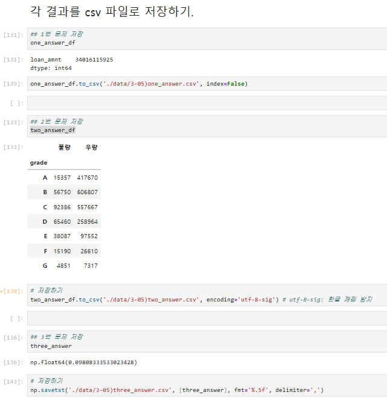
```
one_answer_df.to_csv('./result/3-05)one_answer.csv', index=False)
two_answer_df.to_csv('./result/3-05)two_answer.csv', encoding='utf-8-sig') # utf-8-sig: 한글 깨짐 방지
np.savetxt('./result/3-05)three_answer.csv', [three_answer], fmt='%.5f', delimiter=',')
```

## 문제4-교수님풀이) 결과를 csv 파일로 저장하기.
```
bad_loan_status_to_grades.sort_index().to_csv('./result/3-05)bad_loan_status_교수님.csv', sep=',')
```

# < 점심시간 - 12:50~1:50 >
- 오후에는 비주얼라이징 시각화 실습을 진행할 것이다.


# 데이터 시각화 - python_visualization
## 데이터 유형 기반 선택
- 수치형: 분포 확인 목적 - 히스토그램, 박스플롯, KDE
- 범주형: 그룹별 비교
- 시간/순서: 추세 확인
- 두 변수: 관계 확인 - 선그래프, 영역그래프
- 여러 변수: 상관관계
### 설명
- 내가 표현하고자 하는 목적에 맞게 선택하는게 굉장히 중요하다.
- 데이터사이언티스트들은 그래프 어떤거 썼는지 되게 예민하다고 한다.
- 목적에 맞지 않게 그래프 활용하면 안된다.
## 분석 접근법
1. 단일 변수 탐색
- 분포,이상치,결측치->히스토그램/박스플롯
2. 변수간 관계탐색
- 산점도,
...

# 4-01) python_visualization - 데이터 시각화 실습
- 파일 생성: [4-01) python_visualization]
- 시각화는 matplotlib, seaborn을 많이 사용한다.
- `! pip install seaborn` 으로 바로 설치 가능하다.
```py
import numpy as np
import pandas as pd
import matplotlib.pyplot as plt
import seaborn as sns
```
## 랜덤 시드 고정 (재현성 보장)
- np.random.seed(42)
## 날짜 생성 (2025년 1~12월)
- dates = pd.date_range('2025-01-01','2025-12-31') 
## 지역과 제품 카테고리 정의
```py
regions = ['서울','부산','대구','광주','인천']
products = ['A','B','C','D']
```
## 가상의 매출 데이터 생성
```py
data = {
    'date': np.random.choice(dates, 1000),
    'region': np.random.choice(regions, 1000),
    'product': np.random.choice(products, 1000), 
    'sales': np.random.randint(100, 1000, 1000), # 매출 100~1000만원
    'profit': np.random.randint(10, 200, 1000), # 이익 10~200만원
}
```
## DataFrame 생성
```py
df = pd.DataFrame(data)
print(df.head())
```
## csv 저장
```py
df.to_csv('./result/4-01)sales_data.csv', index=False, encoding='utf-8-sig')
print("4-01)sales_data.csv 파일이 생성됐습니다.")
print(df.head())
```
## csv 파일 읽어오기 - read_csv
```py
df = pd.read_csv('./result/4-01)sales_data.csv')
df['date'] = pd.to_datetime(df.date)
df.head()
```

## [중요] 시각화 - 총매출액 분포(단일 변수 분포 확인)
- 폰트매니저는 텍스트로 표현시 한글 라이브러리 안쓰면 깨지기 때문에 꼭 설치
## 폰트 설정
```py
from matplotlib import font_manager, rc

plt.rcParams['font.family'] = 'Malgun Gothic' # 한글 폰트 지정
plt.rcParams['axes.unicode_minus'] = False # 마이너스 부호 깨짐 방지

plt.figure(figsize=(8,5))
sns.histplot(df.sales, bins=20, kde=True, color='royalblue')
plt.title('매출액 분포 (histogram)')
plt.xlabel('매출액(만원)')
plt.ylabel('빈도수')

plt.figure(figsize=(6,4))
sns.boxplot(y='sales', data=df, color='lightgreen')
plt.title('매출액 분포 (boxplot)')
plt.show()
```
- 실행시 그래프 출력됨.
- 위에거가 matplotlib, 아래거가 seaborn으로 출력한 그래프이다.

# [중요] matplotlib, seaborn 그래프 사용법
- 구글에서 matplotlib 검색하면 홈페이지가 있다. 거기 들어가면 기본 사용 가능한 튜토리얼 있다.
    - https://matplotlib.org/
    - 튜토리얼: https://matplotlib.org/stable/tutorials/index
    - 예시: https://matplotlib.org/stable/gallery/index.html
- 특정 그래프 표현 가능한 코드도 제공한다. 그래프 잘 찾아서 여러 그래프 표현 가능하다. 
    - 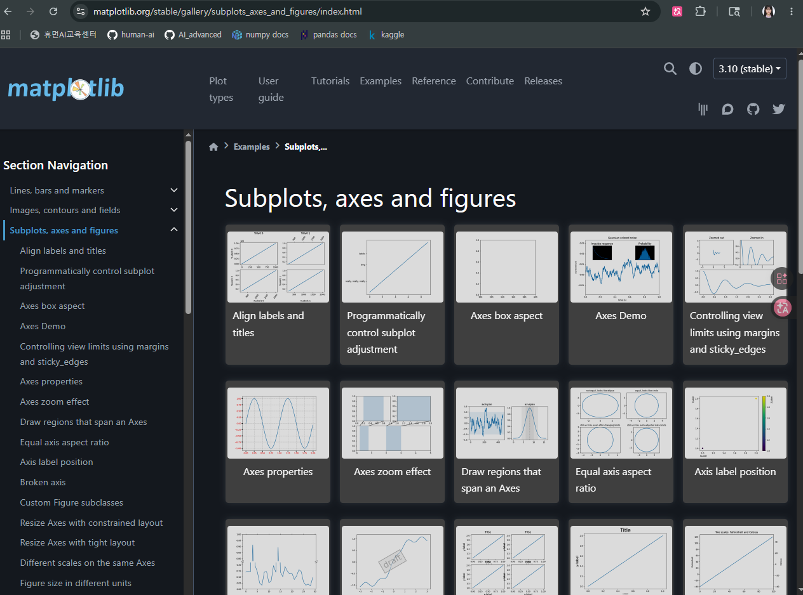
- seaborn도 마찬가지다.
    - https://seaborn.pydata.org/examples/different_scatter_variables.html
- 교수님은 seaborn 그래프가 조금더 예쁘고 세련된 것 같아서 주로 이걸 사용한다고 한다. 자주 들어가서 잘 보라고 한다.

# (이어서) 월별 총 매출 추세 시각화 (시간 순서)
## date를 datetime 형식으로 변환
df['date'] = pd.to_datetime(df.date)
## 월 단위 매출 집계 - 데이터타임이기 때문에 M 가능
```py
df_month = df.groupby(
    df['date'].dt.to_period('M')
).sum(numeric_only = True)
df_month.index = df_month.index.astype(str)
```
# < 휴식시간 - 2:40~2:50 > - 이어서
## 그래프 스타일 설정
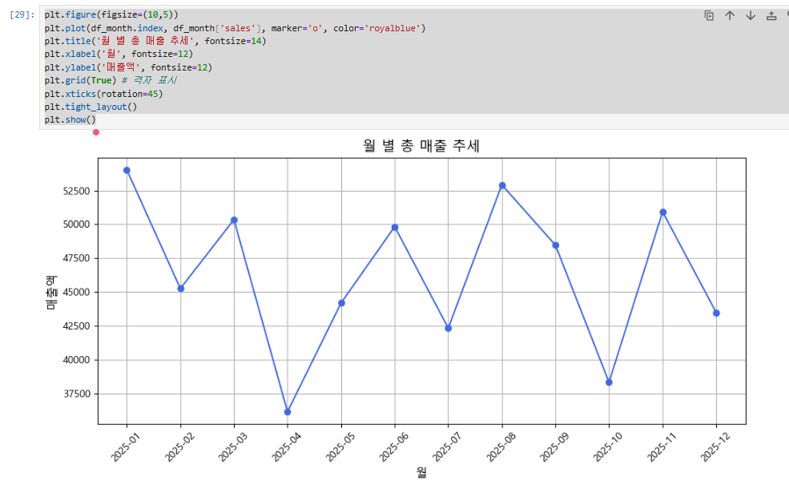
```py
## 그래프 크기 및 스타일 설정
plt.figure(figsize=(10,5))

## 선 그래프 생성
plt.plot(df_month.index, df_month['sales'], marker='o', color='royalblue')

## 그래프 제목, 축이름, 격자 설정
plt.title('월 별 총 매출 추세', fontsize=14)
plt.xlabel('월', fontsize=12)
plt.ylabel('매출액', fontsize=12)
plt.grid(True) # 격자 표시

## x축 눈금 라벨 회전
plt.xticks(rotation=45)
plt.tight_layout()
plt.show()
```
- 이러면 출력된다.
- [여기 위까지 코드 다시 로드하기 + 정리]

## 지역별 평균 매출 비교 (범주형 비교)
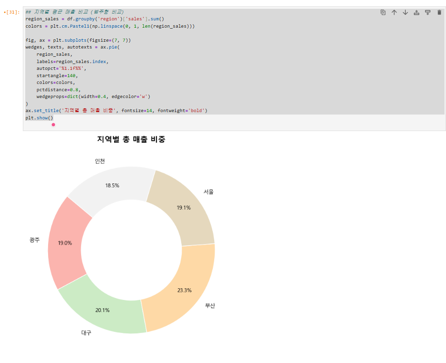
```py
region_sales = df.groupby('region')['sales'].sum()
colors = plt.cm.Pastel1(np.linspace(0, 1, len(region_sales)))

fig, ax = plt.subplots(figsize=(7, 7))
wedges, texts, autotexts = ax.pie(
    region_sales,
    labels=region_sales.index,
    autopct='%1.1f%%',
    startangle=140,
    colors=colors,
    pctdistance=0.8,
    wedgeprops=dict(width=0.4, edgecolor='w')
)
ax.set_title('지역별 총 매출 비중', fontsize=14, fontweight='bold')
plt.show()
```

## 제품 별 매출 - 이익 상관관계 (두 변수 관계) - 산점도 그래프 뽑아보기
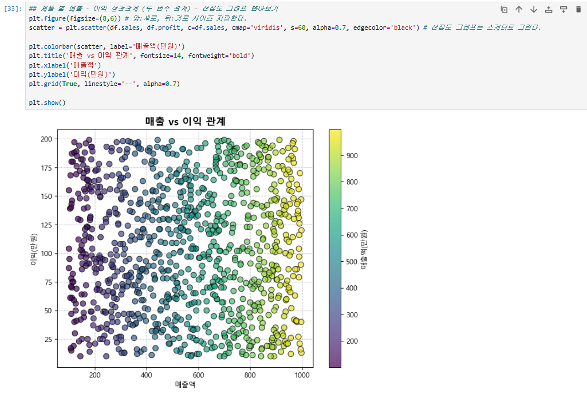
```py
plt.figure(figsize=(8,6)) # 앞:세로, 뒤:가로 사이즈 지정한다.
scatter = plt.scatter(df.sales, df.profit, c=df.sales, cmap='viridis', s=60, alpha=0.7, edgecolor='black') # 산점도 그래프는 스캐터로 그린다.

plt.colorbar(scatter, label='매출액(만원)')
plt.title('매출 vs 이익 관계', fontsize=14, fontweight='bold')
plt.xlabel('매출액')
plt.ylabel('이익(만원)')
plt.grid(True, linestyle='--', alpha=0.7)

plt.show()
```
- 투명도 0.7. 근데 데이터가 의미없게 나왔다.
- 산점도는 관계 확인할때 의미있다. 이걸 보고 분석한다면, 산점도 보면서 어떤 분석 해야할까? -> 좋은 데이터는 아닌데 이런 그래프가 있을 때, 성격 비슷한 애들끼리 군집일거다. 군집 클러스터링 해서 성향 비슷한 애들끼리 묶어서 분류/분석 해보면 딱 좋다고 한다.
- 40대 아저씨들은 어떤 것들을 샀더라, 20대 여자들은 화장품을 샀더라 이런 쪽으로 묶여있게 되니까 그걸 가지고 분류를 해서 -> 분류예측을 하면 좋다.
- 클러스터링, 군집분류 할때 이와같이 산점도 그래프를 많이 사용한다.
# 위에 했던 상관관계가 의미없어서 히트맵으로 변환하는 것을 추가
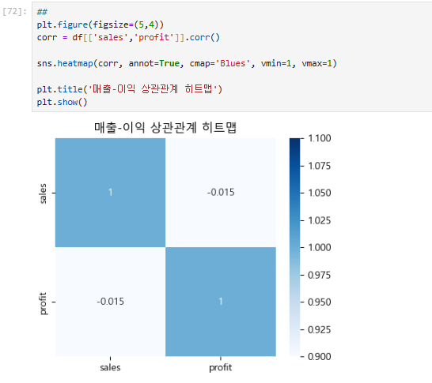
```py
## 제품 별 매출 - 이익 상관관계 (두 변수 관계) - 산점도 그래프 뽑아보기
plt.figure(figsize=(8,6)) # 앞:세로, 뒤:가로 사이즈 지정한다.
scatter = plt.scatter(df.sales, df.profit, c=df.sales, cmap='viridis', s=60, alpha=0.7, edgecolor='black') # 산점도 그래프는 스캐터로 그린다.

plt.colorbar(scatter, label='매출액(만원)')
plt.title('매출 vs 이익 관계', fontsize=14, fontweight='bold')
plt.xlabel('매출액')
plt.ylabel('이익(만원)')
plt.grid(True, linestyle='--', alpha=0.7)

plt.show()
```
## 번외 - 히트맵
- 예측한값, 실제값 몇번 맞췄는지 확인하는 식으로 히트맵도 많이 쓴다.
- 나중에 이걸로 모델 검증 테스트를 많이 할 것이다.


# 지역별 월간 매출 추세 (plotly 대화형 그래프 - 추세, 트렌드 비교)
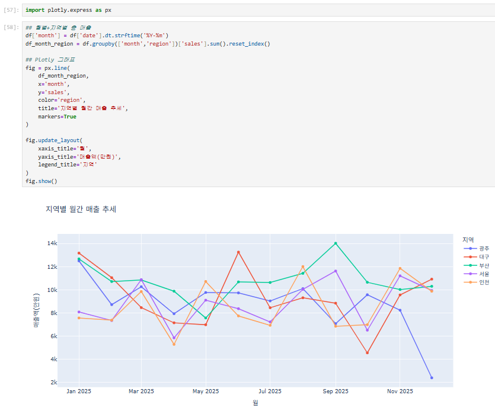
- 미리 다운로드
```
! pip install plotly
! pip install folium
```
- 임포트
    - import plotly.express as px
- 임포트 안되면 이거 실행하고 진행.
```py
%matplotlib inline

import plotly.io as pio
pio.renderers.default = 'notebook'
```
- 그래도 안되면 `print(pio.renderers.default)` 로 찍어서 확인해 보기.
- 차트 띄우기
```py
## 월별+지역별 총 매출
df['month'] = df['date'].dt.strftime('%Y-%m')
df_month_region = df.groupby(['month','region'])['sales'].sum().reset_index()

## Plotly 그래프
fig = px.line(
    df_month_region,
    x='month',
    y='sales',
    color='region',
    title='지역별 월간 매출 추세',
    markers=True
)

fig.update_layout(
    xaxis_title = '월',
    yaxis_title='매출액(만원)',
    legend_title='지역'
)
fig.show()
```

# 지역별 평균 매출 지도 시각화(Folium) - 맵/지도로 표현할 것이다. (folium 활용)
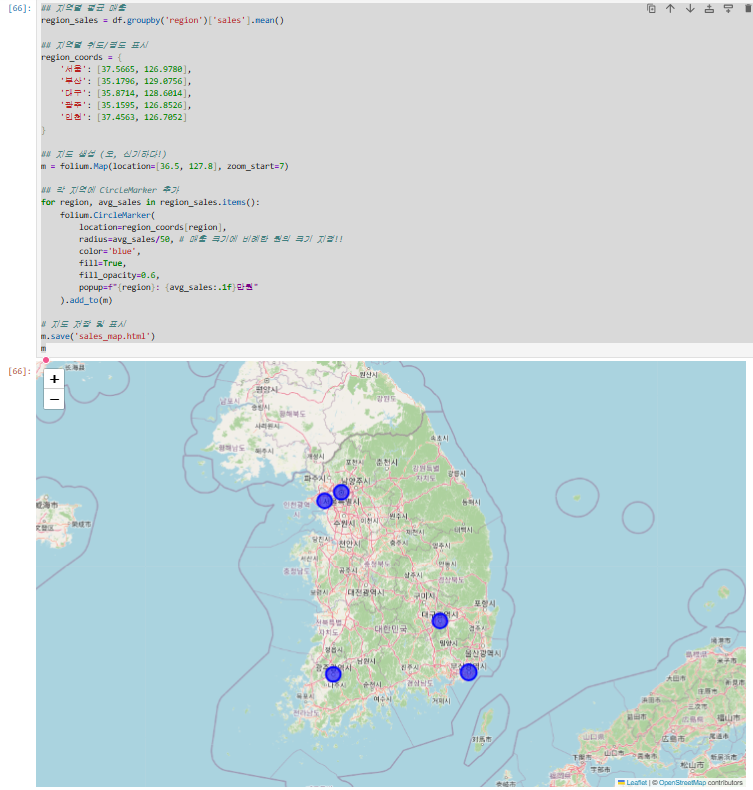
## 지역별 평균 매출을 맵으로 표현해서 지역 매출의 양에 의해 시각적 표현을 할 것이다.
- import folium 
- 위 코드 먼저 실행 후 아래 코드 실행
```py
## 지역별 평균 매출
region_sales = df.groupby('region')['sales'].mean()

## 지역별 위도/경도 표시
region_coords = {
    '서울': [37.5665, 126.9780],
    '부산': [35.1796, 129.0756],
    '대구': [35.8714, 128.6014],
    '광주': [35.1595, 126.8526],
    '인천': [37.4563, 126.7052]
}

## 지도 생성 (오, 신기하다!)
m = folium.Map(location=[36.5, 127.8], zoom_start=7)

## 각 지역에 CircleMarker 추가
for region, avg_sales in region_sales.items():
    folium.CircleMarker(
        location=region_coords[region], 
        radius=avg_sales/50, # 매출 크기에 비례한 원의 크기 지정!!
        color='blue',
        fill=True,
        fill_opacity=0.6,
        popup=f"{region}: {avg_sales:.1f}만원"
    ).add_to(m)

# 지도 저장 및 표시
m.save('sales_map.html')
m
```
- 공장이 글로벌하게 다 있었다. 전 세계 공장들 다 깔려 있었다. 그 각각 공장의 생산성 지표가 어떻게 나타나는지 실시간 모니터링. 그 때 적용했던 게 folium ui map 전세계 글로벌 맵을 띄우고 생산성 ui 모니터링에 사용했었다.
- [중요] 그래서 이 맵에 실시간성 데이터를 계속 표시할 수도 있다. 

# 이어서 - 여러개 그래프 동시에 비교해서 보고 싶을때
## 각 조합 별 산점도를 자동으로 그려주고, 데이터 간 상관 경향 및 분포를 빠르게 비교 확인 가능하다.
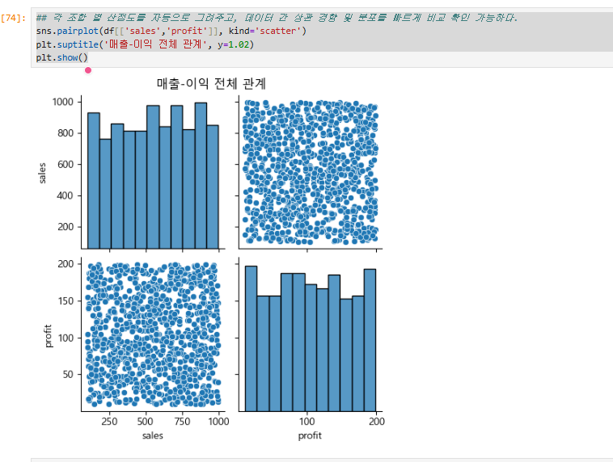
```py
sns.pairplot(df[['sales','profit']], kind='scatter')
plt.suptitle('매출-이익 전체 관계', y=1.02)
plt.show()
```

# 시각화 실습 끝
- matplotlib, seaborn 직접 들어가 보고 코드 레퍼런스 삼아서 많이 활용해 보기.
- matplotlib(BMW): https://matplotlib.org/stable/gallery/subplots_axes_and_figures/axes_demo.html
- seaborn(벤츠): https://seaborn.pydata.org/examples/different_scatter_variables.html
- 남은 시간 실습 코드 쭉 보고, 두 사이트 들어가서 쭉 보기.
- 시각화는 중요하기 때문에 잘 하셔야 하고, 자주 해야 한다.
- ai는 데이터로 대화하는 것이 아니라 시각화로 대화하는 것이다.
- 실습 코드는 이 곳에 올려두셨다: https://github.com/ilovejwoo1004-bit/AI_advanced/blob/main/EDA_%EC%8B%A4%EC%8A%B5.zip

# 직접 시각화 해보기
- 여기에 data.zip 이 있다(subjects): https://github.com/ilovejwoo1004-bit/AI_advanced/blob/main/data.zip
- 이 데이터를 가지고 해보세요.
## 그래프 만들기
- 1.1) Subjects.csv 파일 읽어와서 df 변수에 저장하기
- 1.2) df DataFrame에 '총점'과 '평균' 열을 추가하여, 각 학생 별 총점, 평균 점수를 입력
- 1.3) Class 1반과 Class 2반의 평균 점수를 각각 출력
- 1.4) Class 1반과 Class 2반 두 집단의 차이가 유의한지 p value 값 계산하기
- 1.5) Class 별 과목 분석
    - 과목 별 패턴 분석: 국어를 잘하면 영어도 잘한다. 수학을 잘하면 과학도 잘한다.. 이런 패턴여부가 성립하는지 분석 => 시각화 하기.
## 참고
- 시각화는 자유롭게 (matplotlib, seaborn)
- 지금은 초급으로 간단하게 분석 중이지만 머신러닝 들어가면 고급 분석 할 것이니까 책이나 공부 더 해야함. 머신러닝 딥러닝 들어갈 땐 이런 기초적인 분석 하지 않을 것이라 함.

