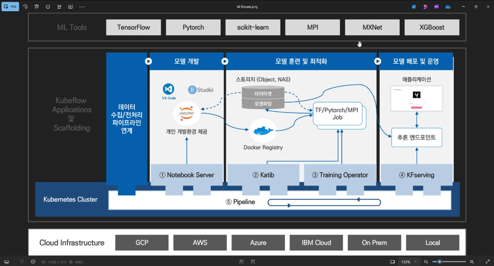
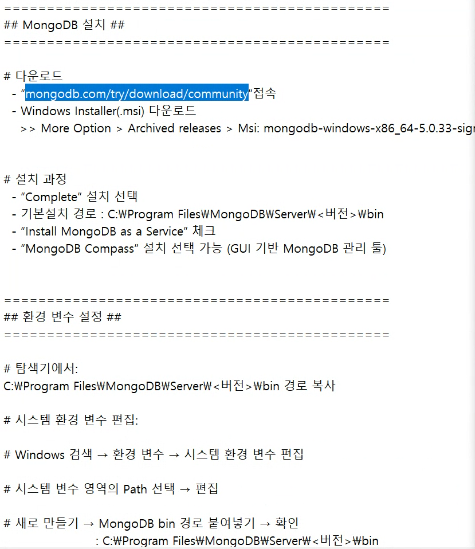
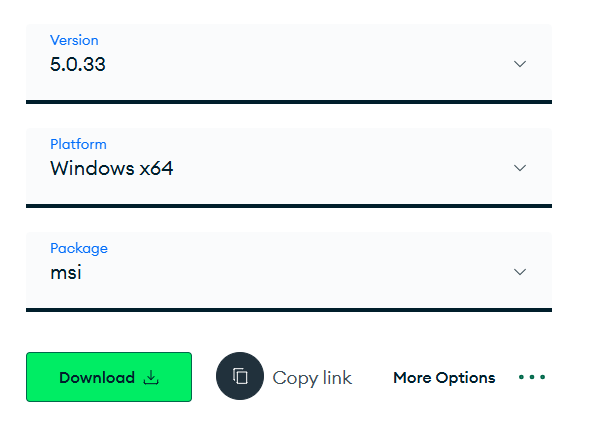
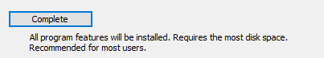
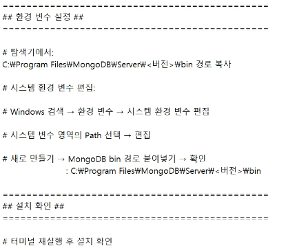
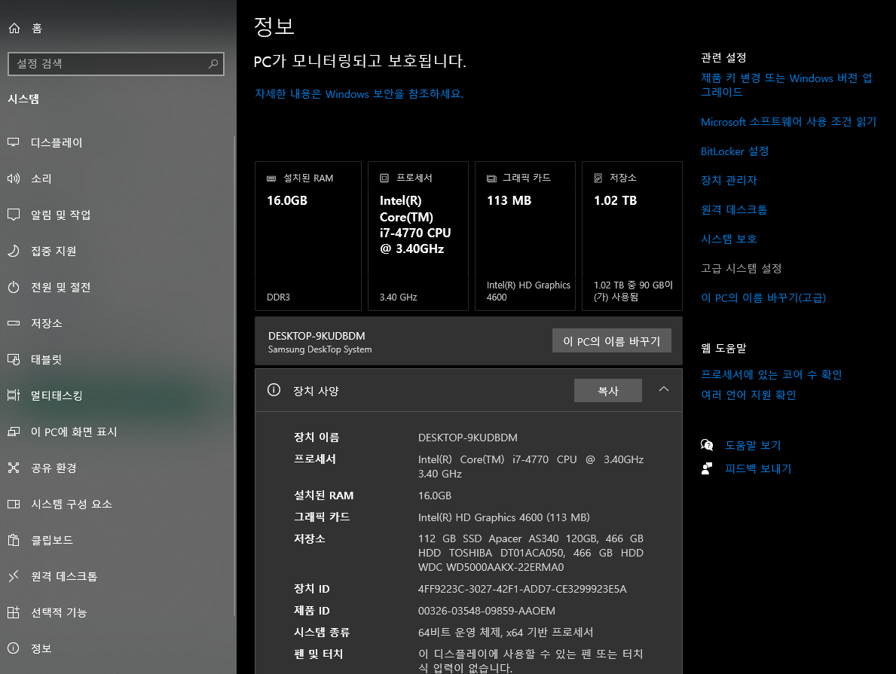
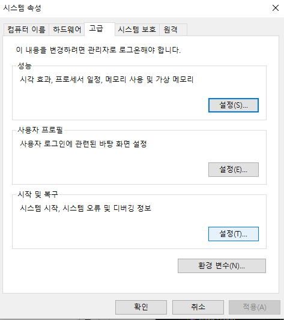
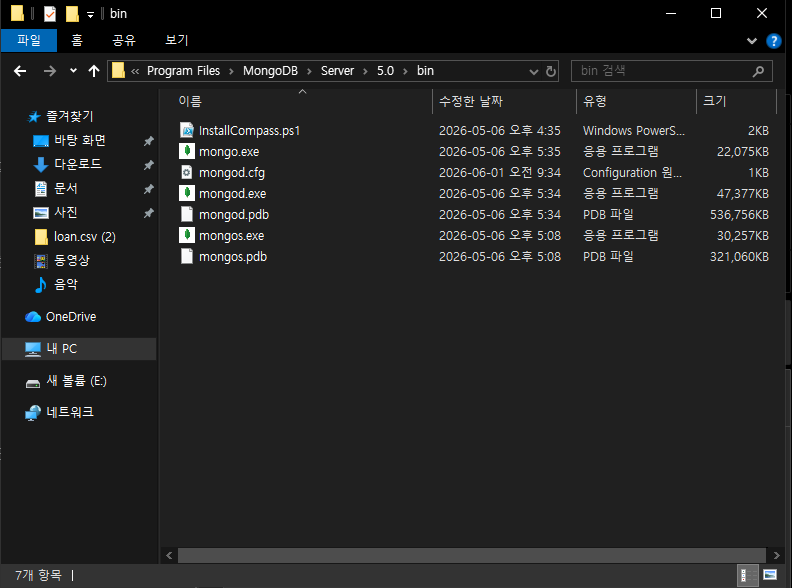
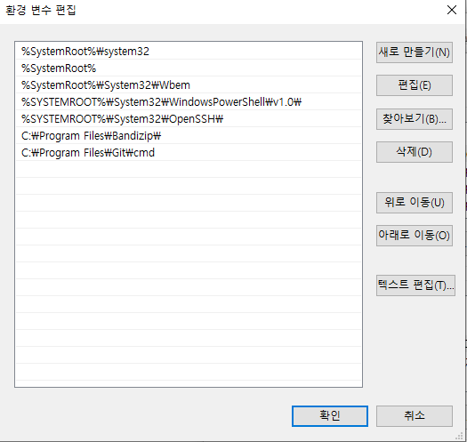
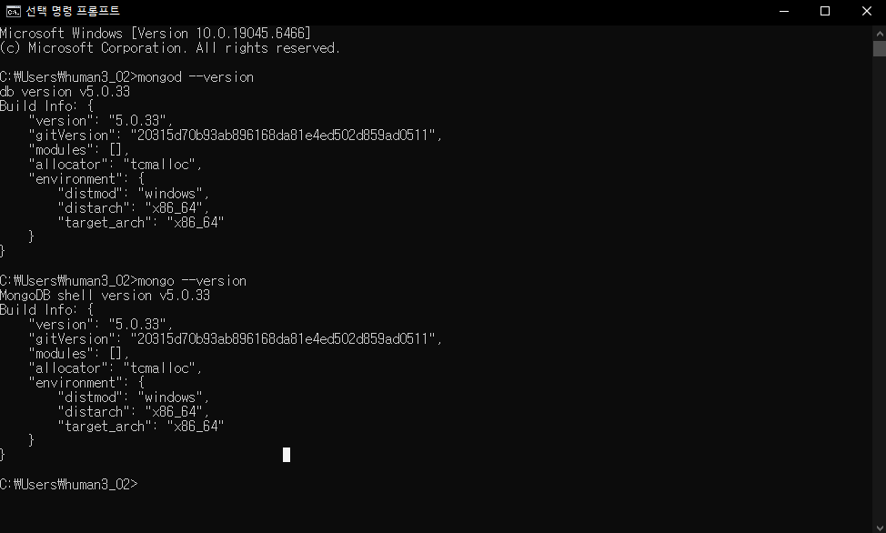

# 5일차 - 6/1(월) #
- 회의 참석: https://whaleon.us/o/CSvuJa/64dffed07c6741c990f69804e3b62d6e

# 그래프 만들기
- 1.1) Subjects.csv 파일 읽어와서 df 변수에 저장하기
- 1.2) df DataFrame에 '총점'과 '평균' 열을 추가하여, 각 학생 별 총점, 평균 점수를 입력
- 1.3) Class 1반과 Class 2반의 평균 점수를 각각 출력
- 1.4) Class 1반과 Class 2반 두 집단의 차이가 유의한지 p value 값 계산하기
- 1.5) Class 별 과목 분석
    - 과목 별 패턴 분석: 국어를 잘하면 영어도 잘한다. 수학을 잘하면 과학도 잘한다.. 이런 패턴여부가 성립하는지 분석 => 시각화 하기.

# 몽고디비 + 파이썬 실습 (윈도우)
- 몽고디비에 저장하고 가져오는 실습 진행

# 기본적인 머신러닝/딥러닝/ai 전체적 분석 프로세스

- 실시간으로 데이터수집-전처리-모델개발/훈련/최적화-배포/최적화
- EDA는 맨 처음 앞단계에서 분석한 것이다.
- 오늘은 실시간으로 시스템/하드웨어/장비에서 발생한 데이터를 -> 통신프로토콜에 의해 디비에 실시간 저장한다. -> 데이터 읽어와서 머신러닝 프로세스에서 분석을 한다. -> 분석/추론 결과를 다시 디비에 저장한다.
- AI 쪽에서는 NoSQL과 파일시스템을 자주 사용한다.
- 몽고디비에 실시간 저장하고 - 분석/결과를 다시 저장하는 것을 할것이다. (CRUD) - 이후 간단한 머신러닝 모델 만들어서 읽어오고 분석하고 다시 저장하는 것을 해볼 것이다.
- AI 비정형 데이터 처리에 MySQL 같은 관계형 데이터베이스는 적합하지 않아서 잘 안쓴다.

# 몽고디비 설치

- https://www.mongodb.com/try/download/community

- 5.0.33 버전 (안정화된 버전) msi 다운로드

- 이곳에 설치될 것이다. (경로 확인) -> Next
    - C:\Program Files\MongoDB\Server\5.0\data\
    - C:\Program Files\MongoDB\Server\5.0\log\
- Install MongoDB Compass -> 체크
- Install. 다 기본으로 설치했다. 설치되면 MongoDB Compass GUI가 오픈된다.
## 환경변수 설정

- 윈도우 검색창 -> 시스템 -> 고급 시스템 설정
    
- 환경변수 설정
    
- 실제 경로에 실행파일들 깔려 있는지 확인 (C:\Program Files\MongoDB\Server\5.0\bin) -> 이걸 환경변수에 설정해 주어야 한다.
    
    - C:\Program Files\MongoDB\Server\5.0\bin
- 환경변수 - 시스템 변수(S) 부분에 Path 더블클릭
- 오른쪽 새로만들기 버튼 클릭 + 복사 경로 붙여넣기 -> 확인/확인 으로 저장.
    
## 설치 확인
- cmd 열어서 설치 확인

    - `mongod --version`
    - `mongo --version`

