# 5일차 - 6/1(월) #
- 회의 참석: https://whaleon.us/o/CSvuJa/64dffed07c6741c990f69804e3b62d6e

# 그래프 만들기
- 1.1) Subjects.csv 파일 읽어와서 df 변수에 저장하기
- 1.2) df DataFrame에 '총점'과 '평균' 열을 추가하여, 각 학생 별 총점, 평균 점수를 입력
- 1.3) Class 1반과 Class 2반의 평균 점수를 각각 출력
- 1.4) Class 1반과 Class 2반 두 집단의 차이가 유의한지 p value 값 계산하기
- 1.5) Class 별 과목 분석
    - 과목 별 패턴 분석: 국어를 잘하면 영어도 잘한다. 수학을 잘하면 과학도 잘한다.. 이런 패턴여부가 성립하는지 분석 => 시각화 하기.

# 몽고디비 + 파이썬 실습 (윈도우)
- 몽고디비에 저장하고 가져오는 실습 진행

# 기본적인 머신러닝/딥러닝/ai 전체적 분석 프로세스

- 실시간으로 데이터수집-전처리-모델개발/훈련/최적화-배포/최적화
- EDA는 맨 처음 앞단계에서 분석한 것이다.
- 오늘은 실시간으로 시스템/하드웨어/장비에서 발생한 데이터를 -> 통신프로토콜에 의해 디비에 실시간 저장한다. -> 데이터 읽어와서 머신러닝 프로세스에서 분석을 한다. -> 분석/추론 결과를 다시 디비에 저장한다.
- AI 쪽에서는 NoSQL과 파일시스템을 자주 사용한다.
- 몽고디비에 실시간 저장하고 - 분석/결과를 다시 저장하는 것을 할것이다. (CRUD) - 이후 간단한 머신러닝 모델 만들어서 읽어오고 분석하고 다시 저장하는 것을 해볼 것이다.
- AI 비정형 데이터 처리에 MySQL 같은 관계형 데이터베이스는 적합하지 않아서 잘 안쓴다.

# 몽고디비 설치

- 다운로드 URL: https://www.mongodb.com/try/download/community
- 
    - 5.0.33 버전 (안정화된 버전) msi 다운로드
- 
    - Complete 를 눌러 상세 설치 경로 확인
- 이곳에 설치될 것이다. (경로 확인) -> Next
    - C:\Program Files\MongoDB\Server\5.0\data\
    - C:\Program Files\MongoDB\Server\5.0\log\
- Install MongoDB Compass -> 체크
- Install. 다 기본으로 설치했다. 설치되면 MongoDB Compass GUI가 오픈된다.
## 환경변수 설정


    - 윈도우 검색창 -> 시스템 -> 고급 시스템 설정

    - 환경변수 설정
- 실제 경로에 실행파일들 깔려 있는지 확인 (C:\Program Files\MongoDB\Server\5.0\bin) -> 이걸 환경변수에 설정해 주어야 한다.
    
    - C:\Program Files\MongoDB\Server\5.0\bin
- 환경변수 - 시스템 변수(S) 부분에 Path 더블클릭
- 오른쪽 새로만들기 버튼 클릭 + 복사 경로 붙여넣기 -> 확인/확인 으로 저장.
    
## 설치 확인
- cmd 열어서 설치 확인

    - `mongod --version`
    - `mongo --version`

# < 휴식시간 - 9:50~10:00 >

# 몽고디비 마저 세팅 (cmd) -> compass
- `mkdir C:\data\db`
    - 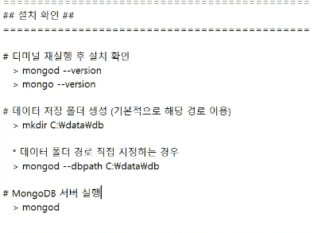
    - 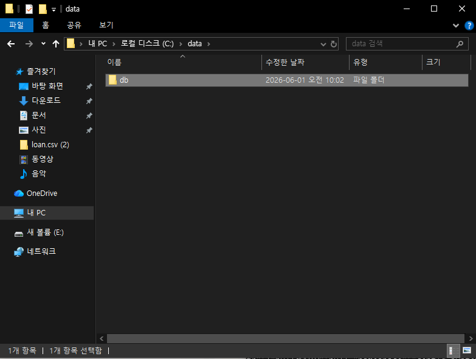
- `mongod`
    - 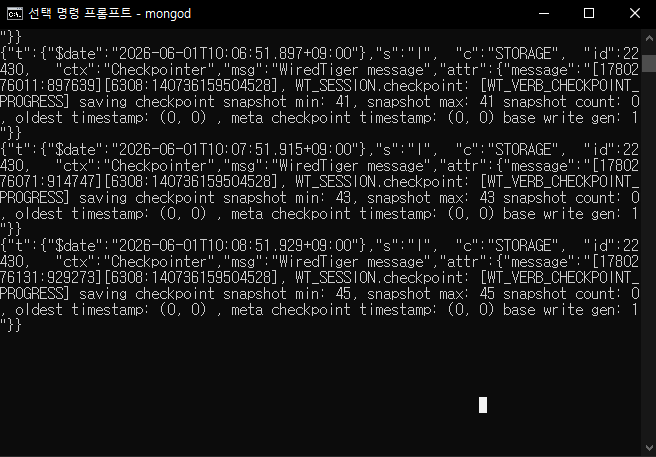
- mongodb compass에 들어와서 로컬 커넥션 접속
    - 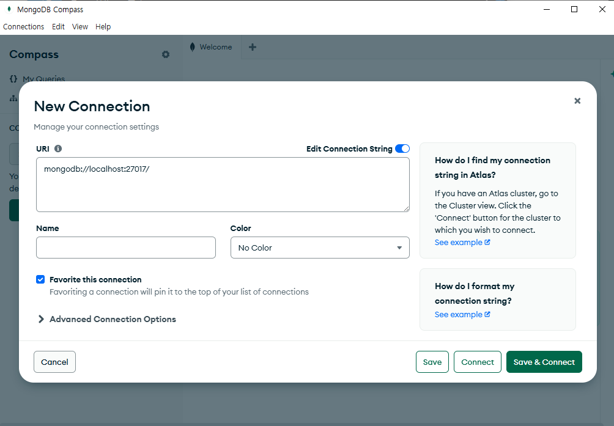
    - 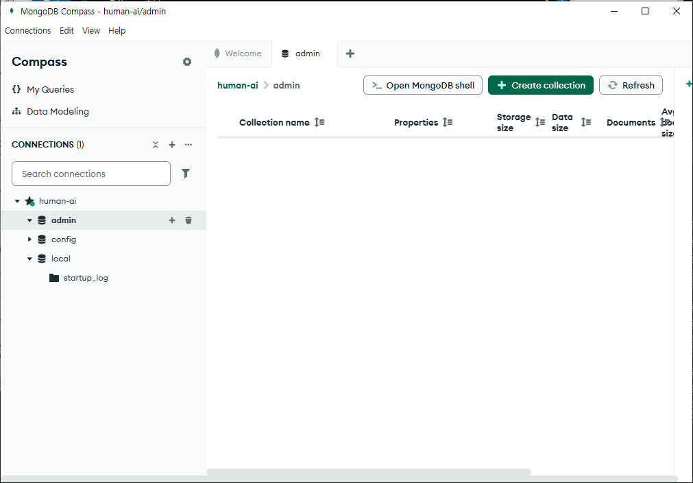
- 이제 몽고디비를 파이썬에서 연결헤서 데이터 

# 파이썬 아나콘다 프롬프트 -> 몽고디비 라이브러리 설치
- 아나콘다 프롬프트 관리자 권한 실행.
- 가상환경 접속: activate ai
    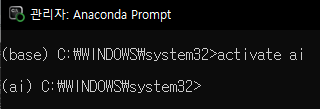
- 몽고디비 라이브러리 설치
    - pymongo: `pip install pymongo`

# Jupiter Notebook 에서 새로운 파일 생성
- 주피터 노트북 안에서 shift+enter로 설치: `! pip install pymongo`
- pymongo 설치 확인: `pip list`
    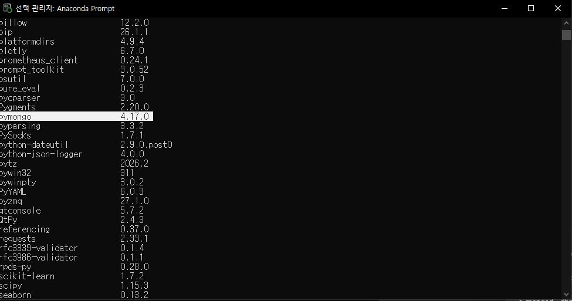
- 여기에 설치 되었는지 확인 
    D:\anaconda3\envs\ai

## 라이브러리 잘 읽어오는지 확인
- `from pymongo import MongoClient`

# 그 외 RDBMS, NoSQL 차이 설명해주심.
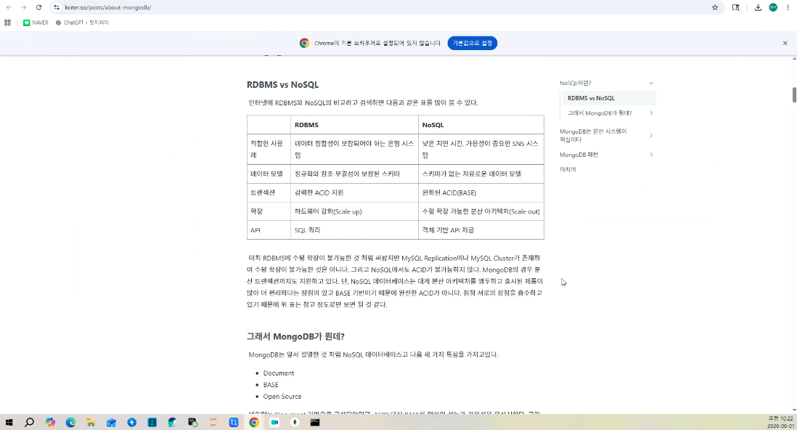
- rdbms: 스키마 먼저 설정, 관계, 인덱스들 연결시켜서 짬
    - sql 쿼리로 조회
- nosql: 관계 연결시킬 필요 없음
    - 객체기반 api로 검색
- 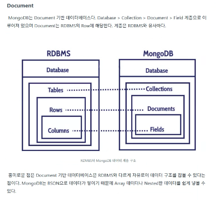
    - 이렇게 개념 이름 차이 있고 성격은 비슷

# 번외
- 항상 가장 최신 버전은 받지 말고 최신 버전의 전버전을 받는게 좋다. (안정화)
- Jupyter Notebook 실행 잘 안되면 커널 재시작
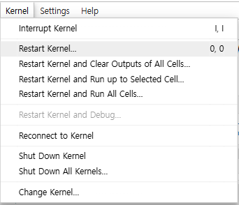

# 연결 실습
## 라이브러리 잘 읽어오는지 확인
- `from pymongo import MongoClient`
# MongoDB 로컬 서버 연결 및 데이터 삽입 테스트
## mongodb 접속 포트 : 27017
client = MongoClient("mongodb://localhost:27017/")
## MongoDB 데이터베이스 생성
db = client["testdb"]
## 컬렉션 생성 (>>RDBMS table)
collection = db["students"]
## 데이터 삽입
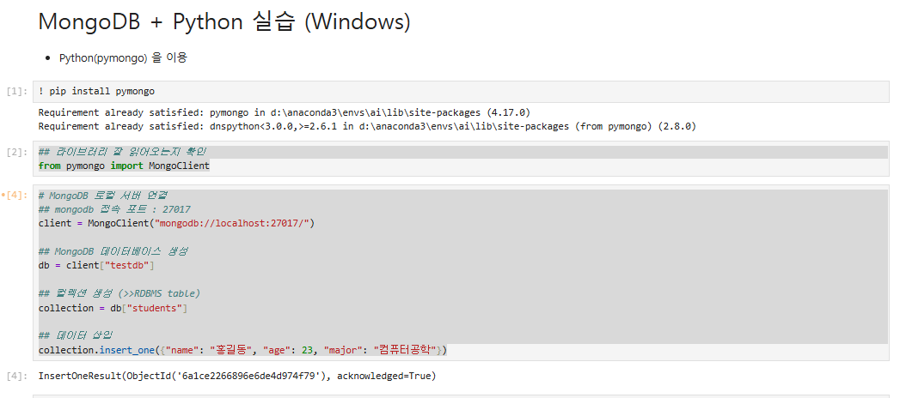
collection.insert_one({"name": "홍길동", "age": 23, "major": "컴퓨터공학"})
## 데이터 조회
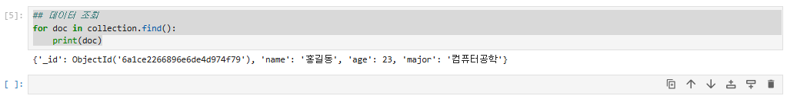
```py
for doc in collection.find():
    print(doc)
```

# < 휴식시간 - 10:50~11:00 >

# CRUD 실습
## Create
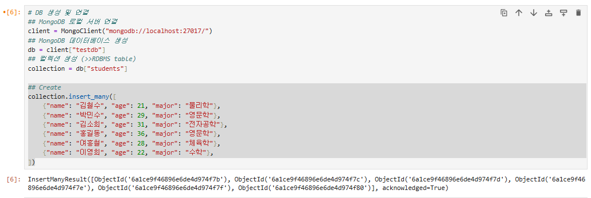
```py
collection.insert_many([
    {"name": "김철수", "age": 21, "major": "물리학"},
    {"name": "박민수", "age": 29, "major": "영문학"},
    {"name": "김소희", "age": 31, "major": "전자공학"},
    {"name": "홍길동", "age": 36, "major": "영문학"},
    {"name": "여흥철", "age": 28, "major": "체육학"},
    {"name": "이영희", "age": 22, "major": "수학"},
])
```
- 저장 확인
    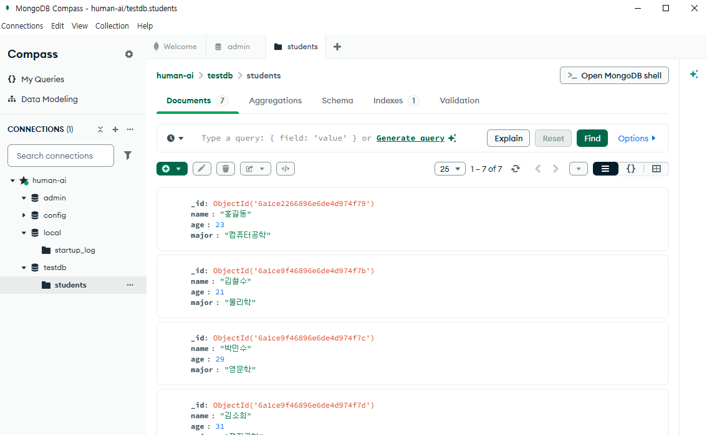
- 보통 일일히 인서트 하는 경우는 csv 파일을 읽어와서 저장한다.

## Update
- 김철수의 나이를 45로 변경
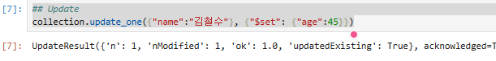
collection.update_one({"name":"김철수"}, {"$set": {"age":45}})

## Delete
- 이름 이영희인 사람 하나 지움
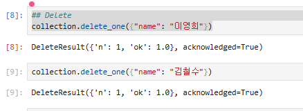
collection.delete_one({"name": "이영희"})

## Read (읽어서 분석해야 함/여러 데이터 한번에)
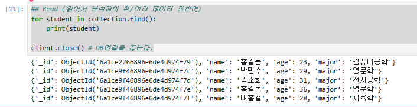
```py
for student in collection.find():
    print(student)

client.close() # DB연결을 끊는다.
```
- 데이터 여러개를 for문으로 읽어왔다.

# csv 파일 읽어서 -> MongoDB 저장
## 파일 읽어옴
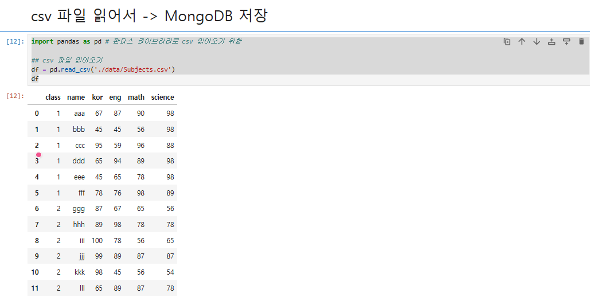
```py
import pandas as pd  # 판다스 라이브러리로 csv 읽어오기 위함

## csv 파일 읽어오기
df = pd.read_csv('./data/Subjects.csv')
df
```
## DB 생성 및 연결
```py
client = MongoClient("mongodb://localhost:27017/")
db = client["testdb"]
collection = db["students_csv"]
```
## DataFrame을 딕셔너리 리스트로 변환 후 MongoDB에 저장 (DataFrame을 그대로 넣으면 안된다.)
- collection.insert_many(df.to_dict("records")) # df(dataframe)를 딕셔너리로 변경 ex. [{},{},{}] 형태의 리스트로 변환
- print("csv 데이터가 mongodb에 저장되었습니다.")
## Read
```py
for students_csv in collection.find():
    print(students_csv)

client.close()
```
## 저장 확인
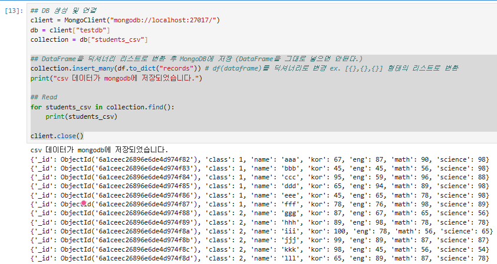
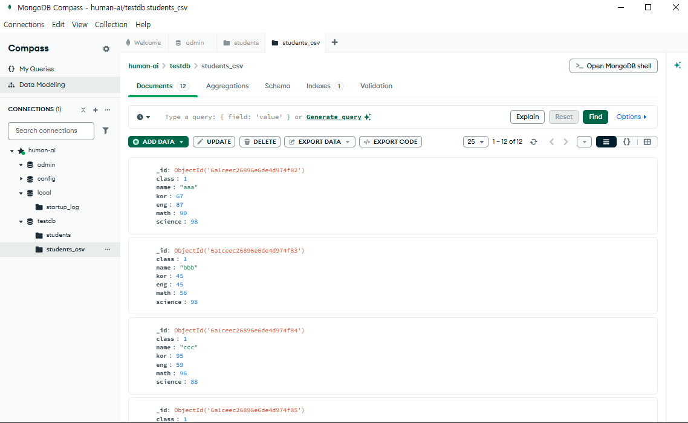
- 나중에 데이터 읽어서 피쳐 뽑고 가공한 데이터를 학습 데이터 형태로 변환해서 파일시스템 형태로 저장하거나 몽고디비에 학습데이터를 저장하게 된다. 이후 학습데이터 읽어서 학습을 수행한다.
- 가공한 데이터로 학습 데이터셋 만들기 -> 몽고디비/파일시스템 이용
- 학습 데이터는 이제 이쪽에서 관리하면 된다.

# 이미지 아무거나 다운받아서 data 폴더에 넣기
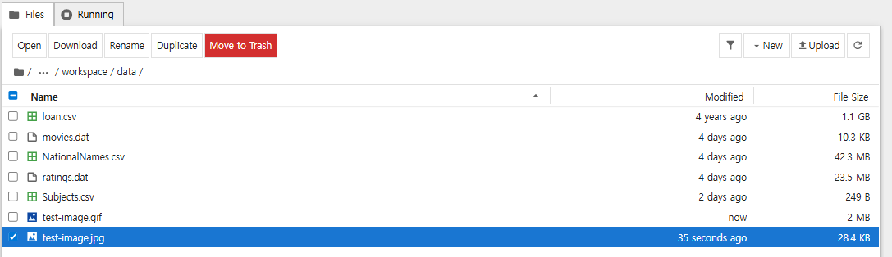
- 나는 센죠가하라 이미지 넣었음. ㅎㅎ

# 이미지 --> MongoDB에 저장 (이미지 저장: 이미지 -> base64 -> 바이너리로 변환(encode) -> 저장)
- 이미지는 몽고디비에 어떻게 저장할까? -> 몽고디비는 이미지/영상을 바이트로 변환해준다. 변환 한 오브젝트(객체)정보를 저장해서 읽어온 후 디코딩해서 이미지를 출력한다.
- 단순히 그대로 저장하는게 아니라 인코딩/디코딩 과정이 필요하다.
## 이미지를 바이트스트링으로 변환하기 위한 라이브러리 임포트 (오호 그냥 이렇게 저장하는군.. 원래는 이미지 다른곳에 저장해서 가져다 썼는데...)
import base64
from io import BytesIO
## 이미지 읽어와서 인코딩한 바이트스트링을 디비에 저장
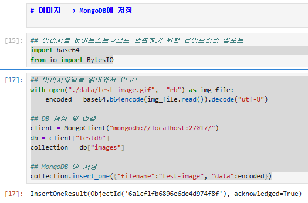
```py
## 이미지파일을 읽어와서 인코드
with open("./data/test-image.gif",  "rb") as img_file:
    encoded = base64.b64encode(img_file.read()).decode("utf-8")

## DB 생성 및 연결
client = MongoClient("mongodb://localhost:27017/")
db = client["testdb"]
collection = db["images"]

## MongoDB 에 저장
collection.insert_one({"filename":"test-image", "data":encoded})
```
## 저장 결과
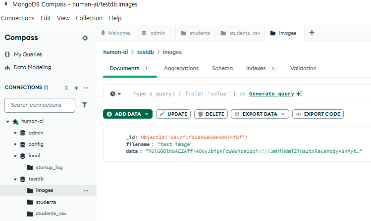

# 번외
- <10분 휴식. 다음시간에 진행..>
- 최근 관심 많은 분야: 주식
- ai 10몇년 분석 하다보니까 데이터 파악 잘하신다 함.
- 매수 타이밍 잘 보고 있다. 학생들한테 종목 알려줌. 3개 추천.
- 셋다 많이오름. 학생들 돈이 적어서 큰 재미는 못봄. ㅎ
- 좋은 종목 이쓰면 알려드릴께요

# MongoDB이미지 --> python 출력 (이미지 불러오기: base64 -> 바이너리 -> 이미지 객체로 변환(decode)하여 출력)
## MongoDB에서 이미지 데이터 가져오기 + 출력
```py
from PIL import Image

document = collection.find_one({"filename": "test-image"}) # MongoDB에서 이미지 데이터 가져오기
if document:
    img_data = document["data"]
    img_binary = base64.b64decode(img_data) # base64 바이너리로 변환
    img = Image.open(BytesIO(img_binary)) # 메모리에서 바로 이미지 객체 생성
    print("MongoDB에서 이미지를 읽어왔습니다.")
    display(img)
else:
    print("test-image 이미지를 찾을 수 없습니다.")
```
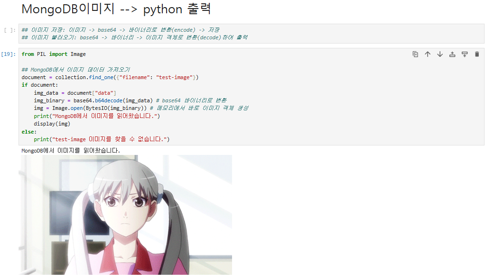
- 영상도 이런 식으로 읽어오면 된다.

# 퀴즈1) MongoDB student_csv 콜렉션에 있는 데이터를 읽어와 막대 그래프를 출력하기 (영어 점수만 뽑아와서 막대 그래프 출력)
## 나의 풀이
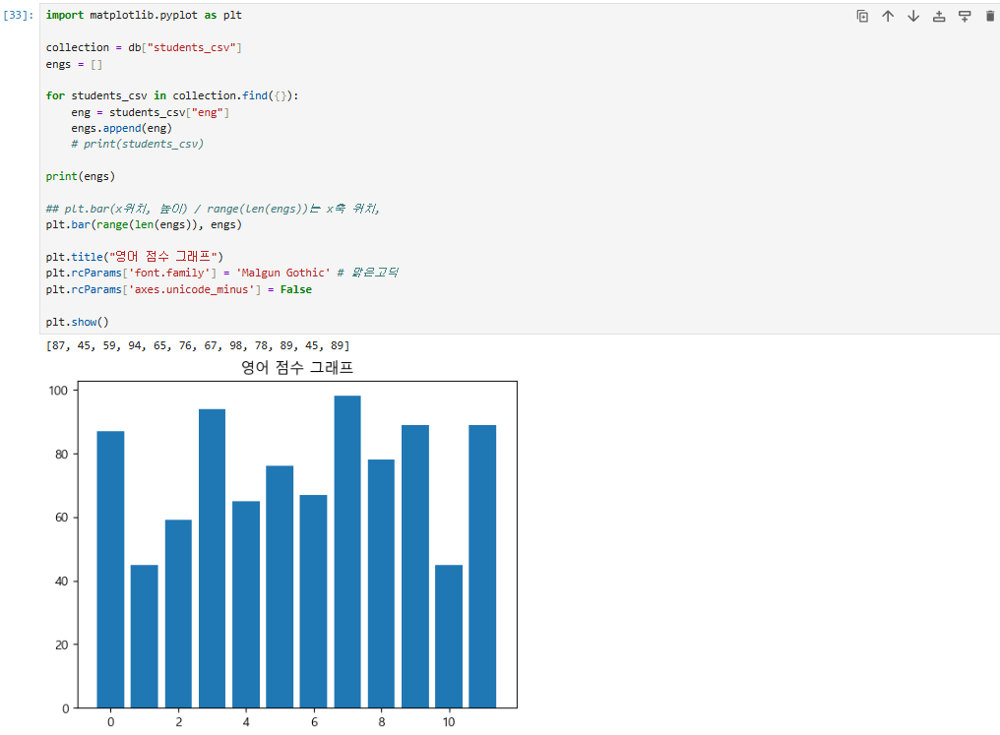
```py
import matplotlib.pyplot as plt

collection = db["students_csv"]
engs = []

for students_csv in collection.find({}):
    eng = students_csv["eng"]
    engs.append(eng)
    # print(students_csv)

print(engs)

## plt.bar(x위치, 높이) / range(len(engs))는 x축 위치,
plt.bar(range(len(engs)), engs)

plt.title("영어 점수 그래프")
plt.rcParams['font.family'] = 'Malgun Gothic' # 맑은고딕
plt.rcParams['axes.unicode_minus'] = False

plt.show()
```
## 교수님 풀이
- [github 확인]

# 점심시간
https://www.hani.co.kr/arti/area/chungcheong/1261326.html
- 한화에어로스페이스폭발... 폭발방지...
- 폭발이상감지..... 사전진단 하십쇼 AI 생명을 구할수 있어요 생명을
- 수업에는 순서가 있고 단계가 있다. 뒤에서 인프라 구축할겁니다. mlops
- 모델 만들기 위해서 전처리, 피쳐뽑기 선수로 되어있어야 뒷부분의 결과가 잘나온다. 앞부분 모르는데 고급 모델을 돌리는건 효과가 없다.

# 나이 분포 히스토그램, 전공별 학생 수 막대그래프, 전공별 나이 분포 박스플롯
```py
import pandas as pd
import seaborn as sns
import matplotlib.pyplot as plt
from matplotlib import font_manager, rc
from pymongo import MongoClient

# 한글 폰트 설정 (Windows 기준, Mac은 "AppleGothic")
rc("font", family="Malgun Gothic")
plt.rcParams["axes.unicode_minus"] = False  # 마이너스 깨짐 방지

## DB 연결 및 데이터 불러오기
client = MongoClient("mongodb://localhost:27017/")
db = client["testdb"]
collection = db["students"]

# MongoDB --> DataFrame
cursor = collection.find({})
df = pd.DataFrame(list(cursor))
client.close()

## _id 컬럼 제거
if "_id" in df.columns:
    df = df.drop("_id", axis=1)
print(df)

## 나이 분포 히스토그램: 분포 비교에 많이 사용 (봉우리 위치, 중심 차이 비교)
plt.figure(figsize=(8, 5))
sns.histplot(df.age, bins=5, kde=True, color="skyblue")
plt.title("학생 나이 분포")
plt.xlabel("나이")
plt.ylabel("학생 수")
plt.show()

## 전공별 학생 수 막대그래프
plt.figure(figsize=(8, 5))
sns.countplot(x="major", data=df, hue="major", palette="pastel", legend=False)
plt.title("전공 별 학생 수")
plt.xlabel("전공")
plt.ylabel("학생 수")
plt.show()

## 전공별 나이 분포 박스플롯
plt.figure(figsize=(8, 5))
sns.boxplot(x="major", y="age", data=df, hue="major", palette="Set2", legend=False)
plt.title("전공 별 나이 분포")
plt.xlabel("전공")
plt.ylabel("나이")
plt.show()
```
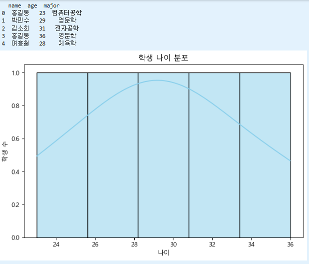
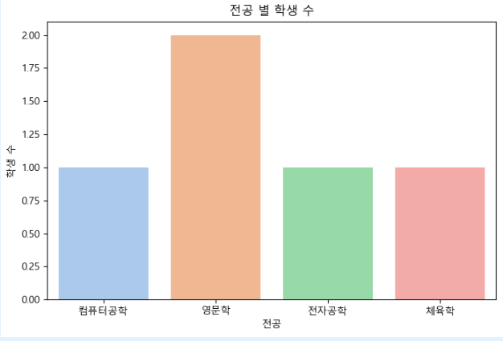
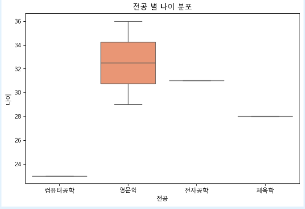
- 파이썬 pyplot, py큐티, ...

# 새창 띄우기 (canvas/tkinter)
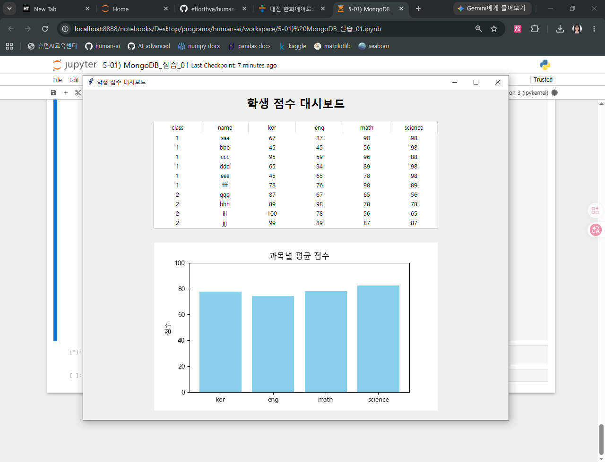
```py
import tkinter as tk
from tkinter import ttk
from pymongo import MongoClient
import pandas as pd
import matplotlib.pyplot as plt
from matplotlib.backends.backend_tkagg import FigureCanvasTkAgg
from matplotlib import font_manager, rc

# 한글 폰트 설정 (Windows용)
font_path = "C:/Windows/Fonts/malgun.ttf"
font_name = font_manager.FontProperties(fname=font_path).get_name()
rc('font', family=font_name)

# MongoDB 연결
client = MongoClient("mongodb://localhost:27017/")
db = client["testdb"]
collection = db["students_csv"]

# 데이터 불러오기
data = list(collection.find({}, {"_id": 0}))
df = pd.DataFrame(data)
client.close()

# Tkinter 메인 윈도우
root = tk.Tk()
root.title("학생 점수 대시보드")
root.geometry("900x700")

# === 제목 ===
title_label = tk.Label(root, text="학생 점수 대시보드", font=("Malgun Gothic", 18, "bold"))
title_label.pack(pady=10)

# === Treeview 테이블 ===
frame_table = tk.Frame(root)
frame_table.pack(pady=10)

columns = list(df.columns)
tree = ttk.Treeview(frame_table, columns=columns, show="headings", height=10)

# 컬럼 헤더 설정
for col in columns:
    tree.heading(col, text=col)
    tree.column(col, width=100, anchor="center")

# 데이터 삽입
for _, row in df.iterrows():
    tree.insert("", "end", values=list(row))
tree.pack()

# === Matplotlib 그래프 표시 ===
frame_graph = tk.Frame(root)
frame_graph.pack(pady=20)

# 과목별 평균 계산
mean_scores = df[["kor", "eng", "math", "science"]].mean()

fig, ax = plt.subplots(figsize=(6, 4))
ax.bar(mean_scores.index, mean_scores.values, color="skyblue")
ax.set_title("과목별 평균 점수")
ax.set_ylabel("점수")
ax.set_ylim(0, 100)

# Tkinter에 matplotlib 그래프 추가
canvas = FigureCanvasTkAgg(fig, master=frame_graph)
canvas.draw()
canvas.get_tk_widget().pack()

# === 종료 버튼 ===
exit_button = tk.Button(root, text="닫기", command=root.destroy, font=("Malgun Gothic", 12))
exit_button.pack(pady=10)

# Tkinter 실행
root.mainloop()
```
# db 종료
- `client.close()`
- close 안하면 메모리가 계속 사용되면서 발열이 생긴다.
- 발열 지속적으로 생기면 고장난다. 습관처럼 열었으면 반드시 닫아야 한다.
    - LG전자 맨처음 개발. 스마트폰쪽 했었다. 안드로이드 프레임워크 자바로.
    - 서비스/UI 단에서 어플리케이션 실행할때 메모리 close를 안했었다. 
    - 근데 그상태로 출시가 됐었다. -> 핸드폰 발열문제 그당시 심했다.
    - 원인 찾다 보니까 소프트웨어 프로그램 단에서 메모리 계속 실행중이었다.
    - 휴대폰 꺼놨는데도.. 백엔드에서 계속돌고 발열이 생기면서 클레임 들어오고 난리났었다. close 처리 하나 안되었을 뿐인건데 그런 일이 일어났다.
- 파이썬에서 디비 접속해서 읽어왔었는데, 파이썬에서 몽고디비 커넥션하기위한 커넥션을 클로즈한 것이다. 이거 한다고 디비가 꺼지진 않는다. 파이썬과 몽고디비의 연결만 끊는 것이다.

# 머신러닝 모델 연결 -> 몽고디비 활용 실습
- 신규 파일 생성: [5-02) MongoDB_실습_02.ipynb]
- 사이킷런(머신러닝 분석모델 읽어오기 위한 라이브러리) 설치해주기: ! pip install scikit-learn
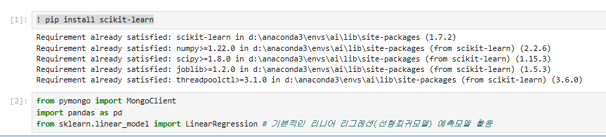
- 기본 임포트
```py
from pymongo import MongoClient
import pandas as pd
from sklearn.linear_model import LinearRegression # 기본적인 리니어 리그레션(선형회귀모델) 예측모델 활용
```

## MongoDB 연결
- client = MongoClient("mongodb://localhost:27017/")
- db = client["ai_test"]

## 신규 컬렉션 생성
- train_collection = db["train_data"]
- predict_collection = db["prediction_result"]

## 샘플 데이터 저장
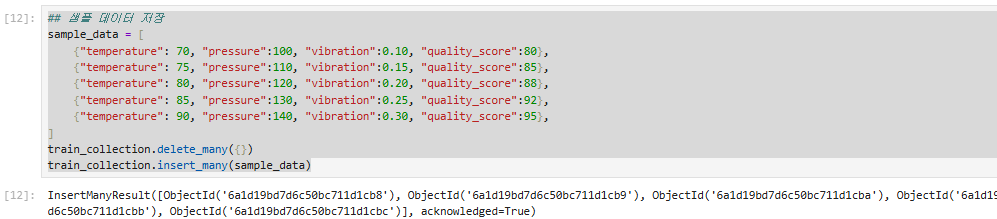
```PY
sample_data = [
    {"temperature": 70, "pressure":100, "vibration":0.10, "quality_score":80},
    {"temperature": 75, "pressure":110, "vibration":0.15, "quality_score":85},
    {"temperature": 80, "pressure":120, "vibration":0.20, "quality_score":88},
    {"temperature": 85, "pressure":130, "vibration":0.25, "quality_score":92},
    {"temperature": 90, "pressure":140, "vibration":0.30, "quality_score":95},
]
train_collection.delete_many({})
train_collection.insert_many(sample_data)
```
- 데이터 생성됨: 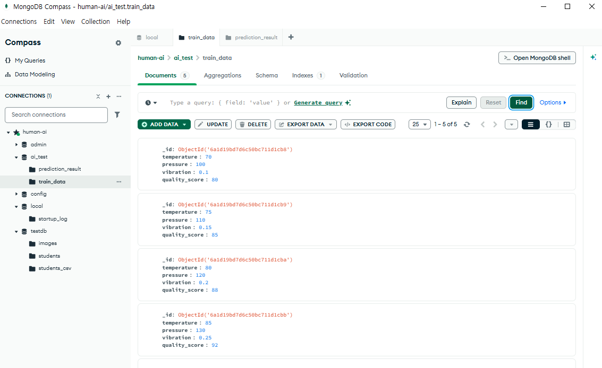

## 만들 예정
- temperature, pressure, vibration 3가지 변수를 X값, 퀄리티 스코어를 Y값으로 사용할것이다.
- 3개 변수가 들어왔을때 quality_score 예측하는 모델을 만들 것이다.

## 구조
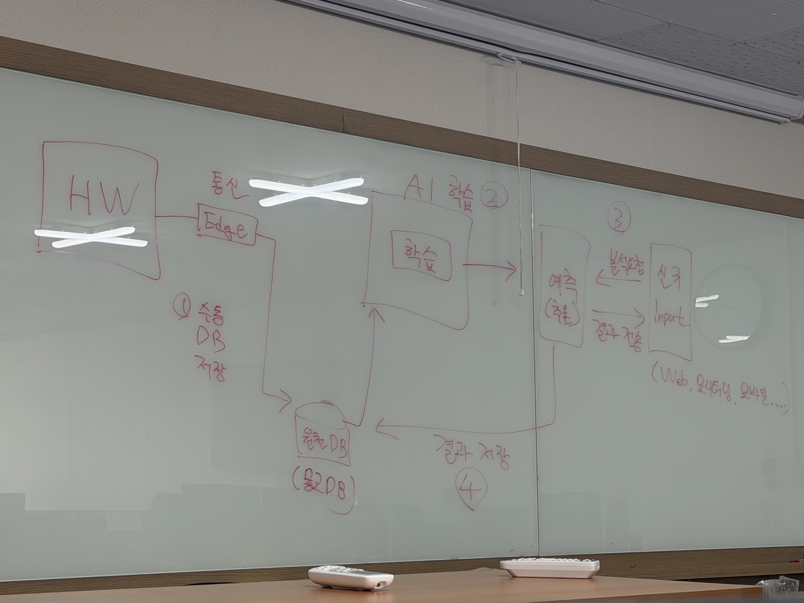
- 원래는 자동으로 뽑아와서 원천 DB에 넣는데 지금은 수동으로 DB에 저장했다. -> AI학습(해당 데이터 읽어와서 학습) -> 학습 결과 기반으로 예측(추론). 예측은 웹이나 모바일, 모니터링 시스템에서 분석요청 했을때 진행된다. -> 그리고 결과를 다시 원천디비에 저장하는 프로세스로 진행될 예정이다.
- 여기서 데이터 읽어오면 학습 전에 원천디비에서 데이터 가져와서 전처리/피쳐추출 -> 학습 데이터셋 구성 부터 해야함. 그걸로 학습 해야함. 현 실습은 디비가 메인이기 때문에 그건 안하고 진행.. (읽어와서 바로 추론)

## MongoDB 데이터 읽어오기
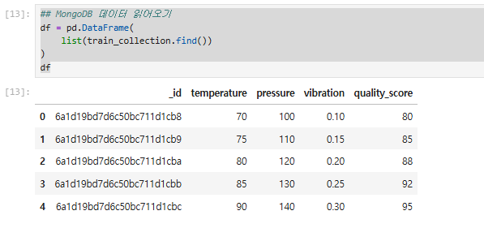
```py
df = pd.DataFrame(
    list(train_collection.find())
)
df
```

## 모델 학습 (패턴(x)에 대한 지도학습 가능)
```py
x = df[["temperature", "pressure", "vibration"]] # 온도, 압력, 진동
y = df.quality_score
```
- x값 패턴을 기반으로 y값 출력

## LinearRegression 모델 학습 실행
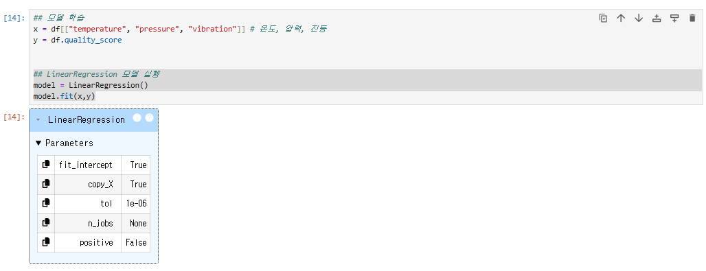
```py
model = LinearRegression()
model.fit(x,y)
```
- 이미 구현돼 있는 리니어 리그렉션(선형회귀) 모델 사용해서 x,y 값 넣고 학습

## 신규 x 데이터에 대한 y 퀄리티 스코어 뽑는 분포함수 만들기 (Inference=추론)
```py
new_data = pd.DataFrame(
    [
        {"temperature":82, "pressure":125, "vibration":0.22}, # 분석요청 데이터
    ]
)
```

## 추론(결과전송) 결과값 뽑기
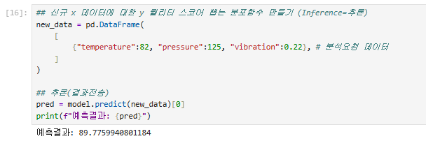
```py
pred = model.predict(new_data)[0]
print(f"예측결과: {pred}")
```
- 기존에 학습했었던 패턴을 기반으로 예측값을 뽑았다.

## 결과 저장
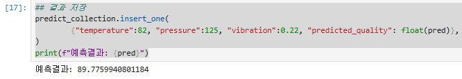
```py
predict_collection.insert_one(
        {"temperature":82, "pressure":125, "vibration":0.22, "predicted_quality": float(pred)},
)
print(f"예측결과: {pred}")
```
- 이와 같이 저장됨: 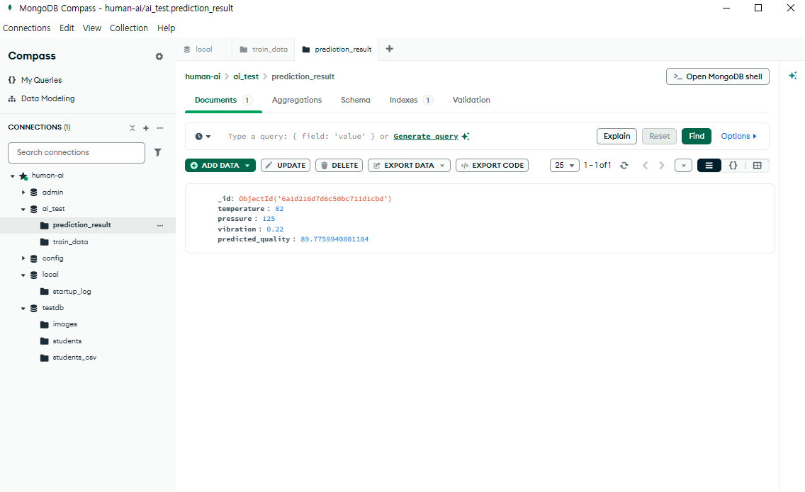

# 그 외
## 번외 - 학습/추론 데이터 스케일
- 예측 결과는 운영 데이터인 거죠, 나중에 이 둘 차이가 없는지 학습데이터와 결과데이터 드리프트 검증을 하게 된다.
- 나중에 운영하다 이런 문제가 발생한다.: 트레인 데이터 스케일 프레셔는 100~130, 바이브레이션 0.1~0.3이게 정상. 근데 나중에 템퍼레처: 150, 프레셔 60, 바이브: 0.7 이런식으로 완전다른게 들어옴. 
- 이 스케일 안에서 유형과 패턴 찾아서 예측해야 하는데 신규데이터에서 완전 스케일 다른게 들어오면 기존 학습한 데이터로 예측하면 안맞는다. 이걸 드리프트 감출 해야되는 거다.
- 신규데이터가 스케일 비슷하게 들어오고 있는지.
- 도메인을 파악해야 한다. 담당자가 스케일 조정한경우, 센서고장, 센서 바꿨더니 단위가 달라진 경우, 설계 레시피(공정방법) 달라진 경우 등.. 기존 학습데이터와 스케일이 달라지는 경우 = 허다하다 => ai 예측도 떨어짐 => 드랍하게됨..
- [중요] 해결 방안
    - 스케일 차이나는지 1차적으로 검증, 단위/공정/스케일 달라진 경우 => 신규데이터로 새로학습, 조금 차이나면 머지해서 학습.
    - 드리프트 감지 이후에 -> 모델을 바꿀것인지, 머지해서 학습할 건지, 신규 데이터로 학습할 건지 판단해서 진행해야 한다.
- 학습(머신러닝/딥러닝) -> 실시간 신규 운영서버 데이터 리얼타임으로 상황분석 -> 인퍼런스모델 추론/분석결과 전송 -> 다시 원천디비에 저장 [크게 이런 구조로 돌아가야 한다.]

## 번외 - 통신 및 서버 구성 
- 다음 시간에 통신 실습을 진행할 것이다.
    - 하드웨어 -> 원천디비(batch) 부분
    - 신규input 분석요청 -> 피드백(추론) 부분
- 보통은 학습서버, 추론서버 분리해서 사용한다.
- 별도 서버를 구축하거나 클라우드를 사용한다.
- 하이브리드 형태의 서버 구성
    - 학습서버=온프레미스(현장), 
    - 추론서버=온프레미스/클라우드
- 통신 실습
    - 1) TCP/IP -> 서버, 클라이언트 구성 (실시간 데이터 주고받는 테스트)
    - 2) FAST-API -> 서버구성, AI 모델 통신 시나리오 실습
    - 3) [중요] `MQTT 통신 프로토콜`(하드웨어->원천데이터저장시) -> 서버/클라이언트 브릿지 미들웨어 중계역할. 최근에는 표준화됨. 서버와 클라이언트 가운데 브릿지를 거쳐간다. 실제 운영관리는 브릿지만 하면 된다.

## 데이터 사이언티스트 / 데이터 엔지니어 구직활동 관련
- 이런 작업 누가?
    - 데이터 사이언티스트: 데이터 분석해서 인사이트 찾아서 의사결정 내리는
    - 데이터 엔지니어: 데이터 분석하고 ~~하고 인프라구축/파이프라인 구축
- 최근 트렌드
    - 분석: 챗지피티가함. 데이터 사이언티스트 희소가치가 떨어짐.
    - 데이터엔지니어 가치가 계속 더 올라가고 있다. 직접 구축해야 하기 때문이다. (환경 정확히 이해해야함 + 그에 맞는 시스템 구축/설계 -> 일일이 설치/테스트/동작테스트 다해야됨==사람이 해야해서 지피티가 하기가 힘든 영역이다.)
    - 지피티는 어디 한곳이 안되어서 솔루션 해결책 듣는 정도는 가능하지만 요즘은 데이터 사이언티스트 줄어들고, 데이터 엔지니어 찾는 회사들 늘어나고 있다. 대신 힘들다. 
    - 땅 파는 작업을 많이 해야한다. 업무를 딱 알고 일하는게 아니라 일단 해보고 테스트를 하는 것.. 그래서 힘들어요. 힘들지만 희소가치는 높다.
    - 데이터사이언티스트 -> 결국엔 도메인 관점 해석이 나와야함 == 도메인에서 활용/효과 낼수있는 해석(인사이트)을 뽑아야됨. 근데 도메인 관련 지식을 데이터사이언티스트가 갖기 쉽지않아서 보통 협업해서 한다. 근데 요즘 지피티가 모델을 잘만듦. -> 도메인 전문가들이 효과낼수있는 방향 생각해서 지피티한테 분석 모델 만들어줘. 이런다.
        - 그래서 데이터사이언티스트 별도로 뽑을일이 없어졌다.
- 도메인 담당자가 데이터 분석 잘하면 진짜 전문가되겠다. 근데 그걸 요즘은 지피티가 채워주고 있다. 요즘은 데이터 사이언티스트만 뽑는기업 별로없다.
- 도메인지식 + 데이터분석이 있으면 경쟁력 있는 것이다.
- [중요] 도메인에 대한 경험 많이 쌓는게 중요하다. -> 빨리 취직해서 도메인업무 경험 쌓는게 먼저 필요하다. 
    - 도메인 업무 -> AI로 효과 낼 수 있는 방안을 계속 생각해야 한다.
- 작은 기업이든 큰 기업이든 도메인 업무 지식 잘 쌓을 수 있는 곳으로 가야한다.
- 피쳐/파생변수 잘 뽑아야함 도메인 관점에서.
## 제조 AI
- 제조 분야 도메인 지식 있는 사람 중 AI 잘 하는 사람을 뽑으려 했다. 도메인지식 경험 있고 잘 알아 -> AI 질문 / AI 역량 판단. -> 충족되면 뽑았다.

