# 6일차 - 6/2(화) #
- 회의 참석: https://whaleon.us/o/CSvuJa/64dffed07c6741c990f69804e3b62d6e

# 정규화
- 모든 클래스의 데이터를 정규화할 필요가 있다.
- 다변량 변수 분석하는 경우 변수들 간의 스케일 맞추는 게 중요한데, 그 때 정규화를 하는 것이다.

# 간단 AI 모델 개발 및 통신 (tensorflow)
- 파이참에서 [aiclient.py] 파일 생성
- cnn 모델을 통해 이미지 학습 객체 가져와서 신규 이미지 분류하는 모델 간단하게 사용. cpa10? 을 사용해서 모델 통신 실습할 예정.
- [학습] 이미지 분류 AI 모델 -> 추론 서버에 학습 결과 저장 -> [추론] 모듈
- [서비스] 신규 이미지 -> 추론서버 -> AI 분류 결과
- TCP/IP로 리얼타임 통신 / FAST API 로도 실시간 통신 실습
- 데이터 로드 → 정규화(0~1) → CNN 구성(Conv2D + MaxPooling 반복 후 Flatten, Dense) → 컴파일 → 10 epoch 학습 → 테스트 평가 → 모델 저장 순서

## AI 모델 개발 - [0] 실습 준비
- workspace/PythonProject에 model 폴더 생성 -> 저장될 예정
- workspace/PythonProject에 jpg/png 이미지 올려놓기.
    - 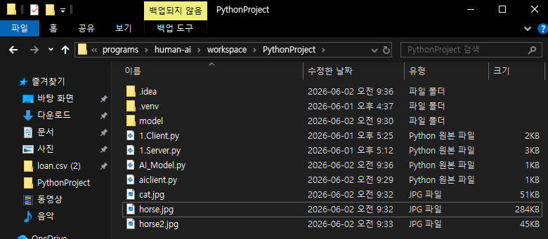
    - horse.jpg, horse2.jpg, cat.jpg
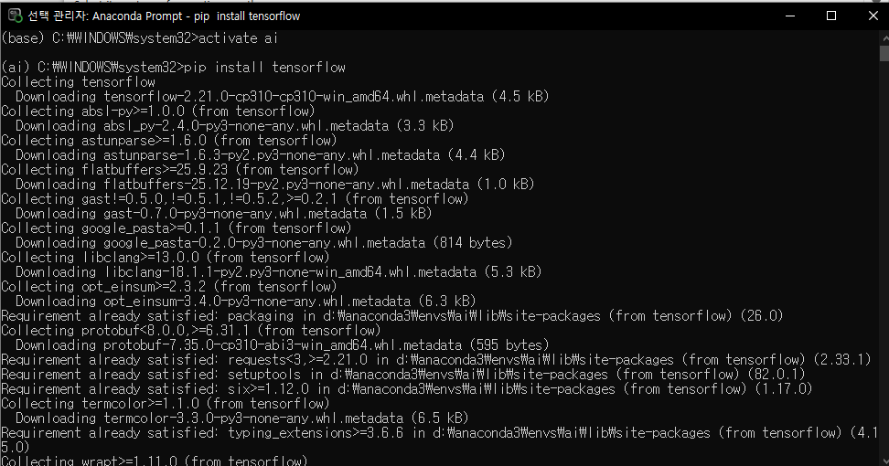
    - 아나콘다 프롬프트에서 가상환경 접속: `activate ai`
    - 딥러닝 프레임워크 다운로드: `pip install tensorflow`
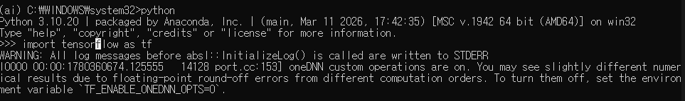
    - `python`
    - `import tensorflow as tf`
- 파이참에서 파이썬 파일 생성: [AI_Model.py]
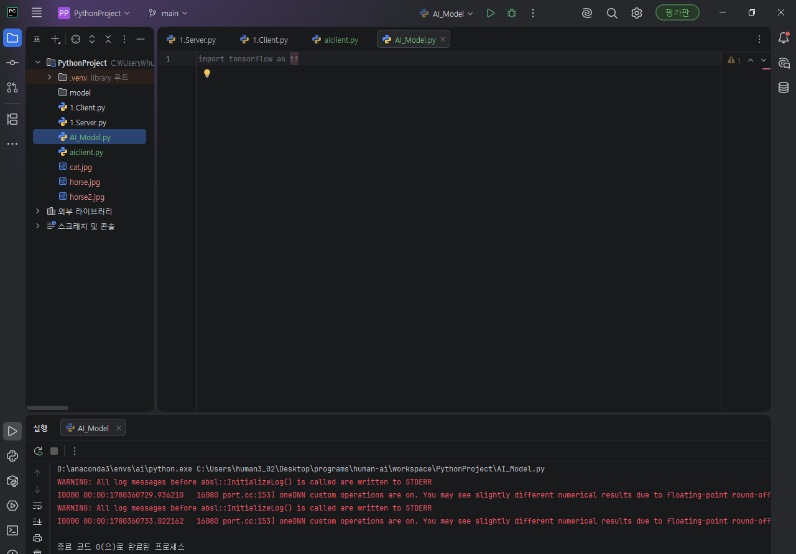
- `import tensorflow as tf` 입력 후 실행

## AI 모델 개발 - [1] 데이터셋 로드 및 데이터 확인
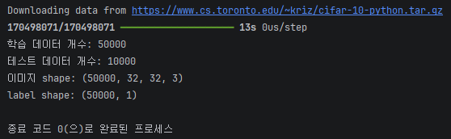
```py
import tensorflow as tf # 딥러닝 프레임워크 import
from keras.datasets import cifar10
from tensorflow.keras import layers
from tensorflow.keras import models

# ====================================================
# CIFAR 10 데이터셋 로드
# ====================================================
'''
CIFAR10 이미지는 32x32 크기의 컬러 이미지이며,
총 10개 클래스로 구성된 데이터셋이다.
--> airplane, automobile, bird, cat, deer, dog, frog, horse, ship, truck
'''

(x_train, y_train), (x_test, y_test) = cifar10.load_data()
'''
x_train : 학습 이미지
y_train : 학습 정답 (label)
x_test : 테스트 이미지
y_test : 테스트 정답
'''
x_train = x_train.astype('float32')
x_test = x_test.astype('float32')

# ====================================================
# 데이터 확인
# ====================================================
# 학습 데이터 개수 출력
print(f"학습 데이터 개수: {len(x_train)}")
# 테스트 데이터 개수 출력
print(f"테스트 데이터 개수: {len(x_test)}")
# 이미지 크기 출력
print(f"이미지 shape: {x_train.shape}")
# label shape 출력
print(f"label shape: {y_train.shape}")
```

## < 휴식시간 - 9:50~10:00 >

## AI 모델 개발 - [2-중요] 정규화, CNN 모델 생성
```py
# ====================================================
# 정규화
# ====================================================
'''
이미지 픽셀값은 0~255 범위의 데이터를 가지고 있다.
-> 딥러닝 학습 안정성을 위해 0~1 범위로 스케일 정규화를 진행한다.
'''
x_train = x_train / 255.0
x_test = x_test / 255.0

# ====================================================
# CNN 모델 생성 | 모델 레이어 구성
# ====================================================
model = models.Sequential([
    layers.Conv2D(32, (3, 3), activation='relu', input_shape=(32, 32, 3)),
    layers.MaxPooling2D(pool_size=(2, 2)),
    layers.Conv2D(64, (3, 3), activation='relu'),
    layers.MaxPooling2D(pool_size=(2, 2)),

    layers.Conv2D(128, (3, 3), activation='relu'),
    layers.Flatten(),
    layers.Dense(128, activation='relu'),

    layers.Dense(10, activation='softmax'),
])
```
- 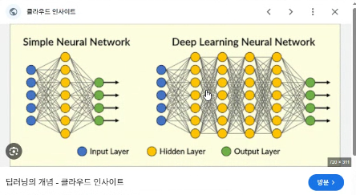
- 심층 신경망 뉴런 학습. 레이어를 여러개 만들고 뉴런을 만들어서 심층 신경망 학습을 위해 레이어 구성을 진행한 것이다.

## AI 모델 개발 - [3] CNN 모델 구조 출력
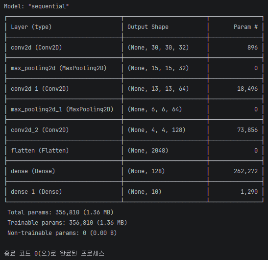
```
# ====================================================
# CNN 모델 구조 출력
# ====================================================
model.summary()
```

## AI 모델 개발 - [4] 모델 컴파일 설정
```
# ====================================================
# 모델 컴파일 설정
# ====================================================
model.compile(
    optimizer='adam',
    loss='sparse_categorical_crossentropy',
    metrics=['accuracy']
)
```

## AI 모델 개발 - [5] 학습 시작
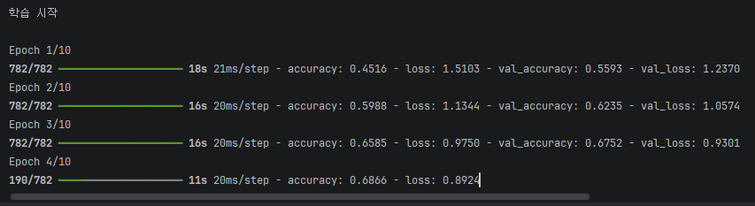
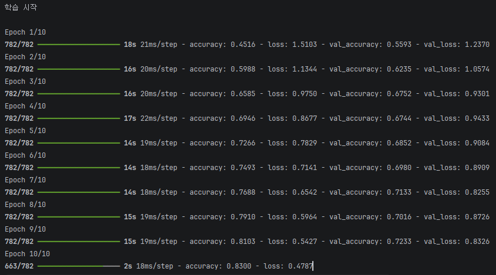
```py
# ====================================================
# 학습 시작
# ====================================================
print("\n학습 시작\n")
history = model.fit(
    x_train,
    y_train,
    epochs=10,
    batch_size=64,
    validation_data=(x_test, y_test),
)
```
- accuracy가 학습하면서 올라가고, loss도 점점 낮아진다. 근데 잘 나온 편은 아니라 더 학습시켜야 한다.

## AI 모델 개발 - [6] 모델 테스트 성능 평가
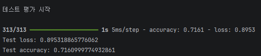
```py
# ====================================================
# 모델 테스트 성능 평가
# ====================================================
print("\n테스트 평가 시작\n")

# 테스트 데이터로 평가
test_loss, test_acc = model.evaluate(x_test, y_test)

# 손실값 출력
print(f"Test loss: {test_loss}")
# 정확도 출력
print(f"Test accuracy: {test_acc}")
```
- accuracy 71퍼, 그렇게 잘 나온 편은 아니다. 

## AI 모델 개발 - [7] 모델 학습 결과 저장
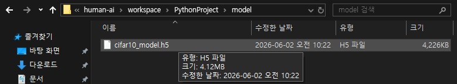
```
# ====================================================
# 모델 학습 결과 저장 (아까 만들었던 모델 폴더에 저장됨)
# ====================================================
model.save("./model/cifar10_model.h5")
```
- 나중에 학습 결과 파일 이것을 서비스 운영할 때 배포하는 것이라 중요하다. 이 것을 계속 업데이트 하는 것이다.

## AI 모델 개발 - [8] 클래스 정보 출력
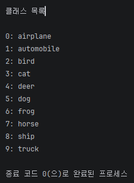
```
# ====================================================
# 클래스 정보 출력
# ====================================================
CLASS_NAMES = [
    'airplane',
    'automobile',
    'bird',
    'cat',
    'deer',
    'dog',
    'frog',
    'horse',
    'ship',
    'truck',
]
print("\n클래스 목록\n")

for idx, name in enumerate(CLASS_NAMES):
    print(f"{idx}: {name}")
```

# 간단 AI 모델 통신
- 파이썬 파일 2개를 만든다. : [AI_Client], [AI_Server]

## Server (AI_Server.py) - [1] 추론 모듈
```
# ====================================================
# TCP/IP 서버 실습
'''
클라이언트가 이미지를 보내면 Tensorflow 모델로 분류 후
결과를 클라이언트에 반환하는 AI 서버 구현
'''
# ====================================================
import socket
import struct
import json
import numpy as np
import tensorflow as tf
from PIL import Image   # 이미지 처리
from io import BytesIO  # 메모리 상의 이미지 처리

## 인퍼런스 추론 모듈 만들기 (AI 추론 모듈 개발 -> 서버 역할)

# ====================================================
# CIFAR10 클래스 정의
# ====================================================
CLASS_NAMES = [
    "airplane",
    "automobile",
    "bird",
    "cat",
    "deer",
    "dog",
    "frog",
    "horse",
    "ship",
    "truck",
]

# ====================================================
# 학습 모델 결과 로드
# ====================================================
print("AI 모델 로딩 시작")

# 모델 읽어오기
model = tf.keras.models.load_model("./model/cifar10_model.h5")
print(f"AI 모델 로딩 완료")

# ====================================================
# 지정 크기만큼 데이터 수신 함수 (데이터 받아오기)
# (클라이언트에서 이미지 데이터를 주면 이미지를 처리한 후
# 해당 이미지를 가지고 분류 -> receive 데이터에 대해 처리)
# ====================================================
def recv_all(sock, size):
    data = b''
    # 이미지는 데이터 바이트스트링으로 보내주는데 5000바이트이면 2000바이트
    # 이런 식으로 순서대로 주기 때문에 계속 순차적으로 받아서 처리하기 위해 while 문을 사용
    while len(data) < size:
        packet = sock.recv(size - len(data))
        if not packet:
            return None
        data += packet

    return data

# ====================================================
# [인퍼런스 추론 모듈]
# 이미지 데이터에 대해 추론을 하는 함수 구현
# - 서버는 이미지를 바이트로 받아서 이미지로 변환하고
# 변환된 이미지를 기반으로 추론을 진행한다.
# ====================================================
def predict_image(image_bytes):
    # 바이트를 이미지로 오픈
    image = Image.open(BytesIO(image_bytes))
    # RGB 형태로 변환
    image = image.convert("RGB")
    # CIFAR10(32x32 컬러 이미지) 사이즈에 맞춤
    image = image.resize((32, 32))
    # 추론을 위해 numpy 배열로 변환
    image = np.array(image)
    # numpy 배열로 변환한 것을 정규화
    image = image / 255.0
    # 배치 차원 추가
    image = np.expand_dims(image, axis=0)
    print(f"입력 shape: {image.shape}")

    # [중요] 모델 추론
    # 추론을 위해서는 추론을 하기 위해서 신규 데이터를 받으면
    # 학습 했었던 전처리와 피쳐 뽑는 것을 동일하게 진행 후 해야한다.

    # 모델 추론 결과를 pred 변수에 저장
    # pred = model.predict(image, verbose=0)
    pred = model.predict(image, verbose=0)[0]

    # 예측 결과 출력
    print(f"예측 확률")
    print(pred)

    # 10개에 대한 모든 클래스에 대해 예측 확률값을 계산한다.
    # 거기에 대해 가장 높은 확률을 결과로 리턴한다.

    # 가장 높은 확률 결과 리턴
    # argmax 방식 = 소프트맥스 기반. 가장높은 확률값을 1로 치환하고 나머지를 0으로 치환함.
    class_idx = np.argmax(pred)
    confidence = pred[class_idx]
    print(f"예측 클래스: {class_idx}")
    print(f"신뢰도: {confidence}({confidence * 100}%)")

    # 결과 생성
    result = {
        "class_id": int(class_idx),
        "class_name": CLASS_NAMES[class_idx],
        "confidence": float(confidence),
    }

    return result
```

## Server (AI_Server.py) - [2] 통신 서버
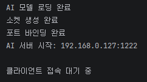
```
# ====================================================
# 서버 설정
# ====================================================
# 서버 ip/port 설정
HOST = "192.168.0.127" # 서버 IP 주소
PORT = 1222 # 사용할 포트 번호 (0~65545 중 하나, 다른 서비스와 중복 금지(고유포트지정))

# ====================================================
# socket() TCP 소켓 설정
# ====================================================
server_socket = socket.socket(
    socket.AF_INET,
    socket.SOCK_STREAM
)
print("소켓 생성 완료")

# ====================================================
# bind() 포트 바인딩
# ====================================================
server_socket.bind((HOST, PORT))
print("포트 바인딩 완료")

# ====================================================
# listen() 클라이언트 접속 대기
# ====================================================
server_socket.listen(5)
print(f"AI 서버 시작: {HOST}:{PORT}")

# ====================================================
# 데이터 송수신 무한 루프
# ====================================================
while True:
    print("\n클라이언트 접속 대기 중\n")

    # 클라이언트 접속
    client_socket, addr = server_socket.accept()
    print(f"클라이언트 접속: {addr}")

    try:
        # 이미지 크기 수신 (<-- 클라이언트가 먼저 이미지를 보냄. ex) 125000 byte)
        header = recv_all(client_socket, size=4)

        if header is None:
            continue

        # 4byte --> 정수 변환
        image_size = struct.unpack(">I", header)[0]
        print(f"이미지 크기: {image_size}")

        # 이미지 수신
        image_bytes = recv_all(client_socket, image_size)
        print(f"이미지 수신 완료")

        # AI 추론
        result = predict_image(image_bytes)
        print("추론 결과: ", result)

        # json 변환
        result_json = json.dumps(result, ensure_ascii=False).encode()

        # 결과 길이 전송
        client_socket.sendall(
            struct.pack(">I", len(result_json))
        )

        # 결과 데이터 전송
        client_socket.sendall(result_json)
        print("결과 전송 완료")
    except Exception as e:
        print("오류 발생: ", e)
    finally:
        # 연결 종료
        client_socket.close()
        print("클라이언트 연결 종료")
```

## Client (AI_Client.py) 
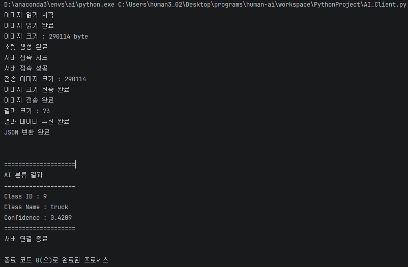
```
# =====================================================
# TCP/IP Client 실습
# -이미지 파일을 읽어서 AI 서버로 전송
# -AI 서버가 반환한 분류 결과를 출력
# =====================================================

# TCP/IP 통신을 위한 라이브러리
import socket
# 정수 ↔ Byte 변환
import struct
# JSON 처리
import json

# =====================================================
# 서버 정보
# =====================================================

# 서버 IP
HOST = "192.168.0.127"
# 서버 포트
PORT = 1222

# =====================================================
# 테스트 이미지
# =====================================================
# 전송할 이미지 파일
IMAGE_PATH = "./horse.jpg"

# =====================================================
# 지정 크기만큼 데이터 수신
# =====================================================
def recv_all(sock, size):
    data = b''
    while len(data) < size:
        packet = sock.recv(
            size - len(data)
        )

        if not packet:
            return None

        data += packet
    return data

# =====================================================
# 이미지 읽기
# =====================================================
print("이미지 읽기 시작")
with open(
    IMAGE_PATH,
    "rb"
) as f:
    image_data = f.read()
print("이미지 읽기 완료")

print(
    "이미지 크기 :",
    len(image_data),
    "byte"
)

# =====================================================
# 소켓 생성
# =====================================================
client_socket = socket.socket(
    socket.AF_INET,
    socket.SOCK_STREAM
)
print("소켓 생성 완료")

# =====================================================
# 서버 접속
# =====================================================
print("서버 접속 시도")
client_socket.connect(
    (HOST, PORT)
)
print("서버 접속 성공")

# =====================================================
# 이미지 크기 전송
# =====================================================
image_size = len(image_data)

print(
    "전송 이미지 크기 :",
    image_size
)

client_socket.sendall(
    struct.pack(
        ">I",
        image_size
    )
)
print("이미지 크기 전송 완료")

# =====================================================
# 이미지 데이터 전송
# =====================================================
client_socket.sendall(
    image_data
)
print("이미지 전송 완료")

# =====================================================
# 결과 길이 수신
# =====================================================
header = recv_all(
    client_socket,
    4
)
result_size = struct.unpack(
    ">I",
    header
)[0]
print(
    "결과 크기 :",
    result_size
)

# =====================================================
# 결과 데이터 수신
# =====================================================
result_bytes = recv_all(
    client_socket,
    result_size
)
print(
    "결과 데이터 수신 완료"
)

# =====================================================
# JSON → Python Dictionary
# =====================================================
result = json.loads(
    result_bytes.decode()
)

print(
    "JSON 변환 완료"
)

# =====================================================
# 결과 출력
# =====================================================
print("\n")
print("====================")
print("AI 분류 결과")
print("====================")
print(
    "Class ID :",
    result["class_id"]
)
print(
    "Class Name :",
    result["class_name"]
)

print(
    "Confidence :",
    round(
        result["confidence"],
        4
    )
)
print("====================")

# =====================================================
# 연결 종료
# =====================================================
client_socket.close()
print(
    "서버 연결 종료"
)
```
- 해당 클라이언트 요청에 대한 서버 응답 과정: 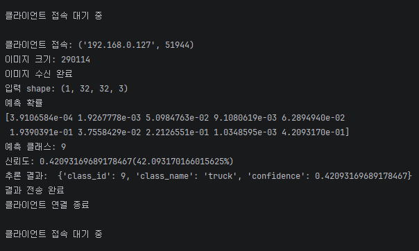
- 하지만 제대로 분류하진 못하고 있다.
    - 말사진1
        - 입력: 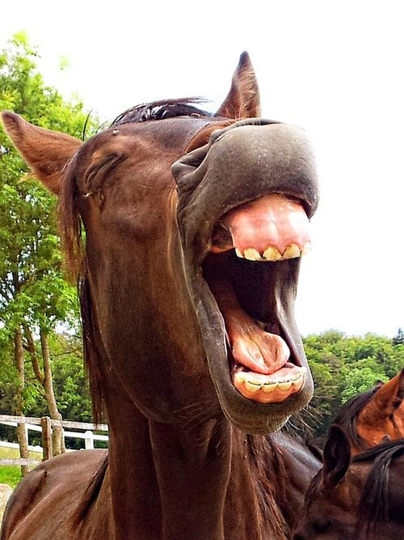
        - 결과: 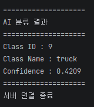
    - 말사진2
        - 입력: 
        - 결과: 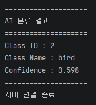
    - 고양이사진:
        - 입력: 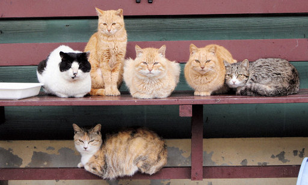
        - 결과: 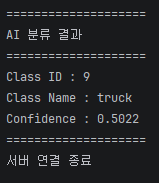
    - 고양이사진2:
        - 입력: 
        - 결과: 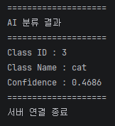
- 깔끔한 고양이 사진 넣으면 고양이로 분류 되는듯

## < 휴식시간 - 11:50~12:00 >

