# 7일차 - 6/4(목) #
- 회의 참석: https://whaleon.us/o/CSvuJa/64dffed07c6741c990f69804e3b62d6e

# 카프카 개념 설명
- AI 처리할때 실시간 데이터 처리 되게 중요, 데이터가 파이프라인으로 구성되어 실시간으로 자동으로 흘러가야 한다.
- 데이터가 단일변수만 있는 게 아니라 굉장히 많고 데이터 양도 많아서 실시간 처리하는게 어려운 점이 어느 기업에 가던 난제이다.
- 카프카 데이터 스트리밍 처리를 사용한다. 프레임워크.
- 오늘은 카프카 배워보고 실제 구현 실습 진행할 것이다.
- 설명을 잘 해둔 페이지: https://ifuwanna.tistory.com/487
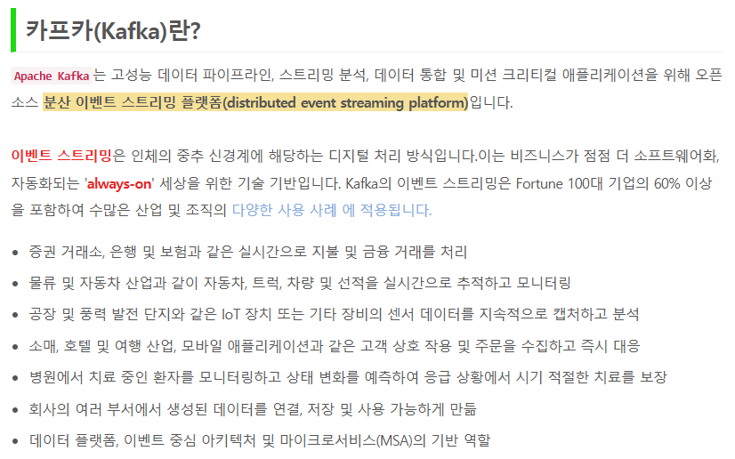
- 각 도메인마다 산업에서 실시간으로 처리하는 부분들에 카프카를 많이 사용한다.
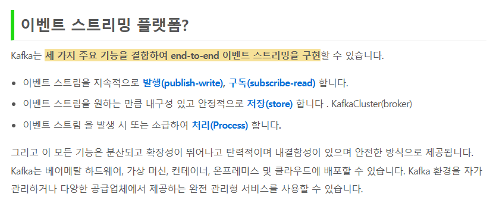
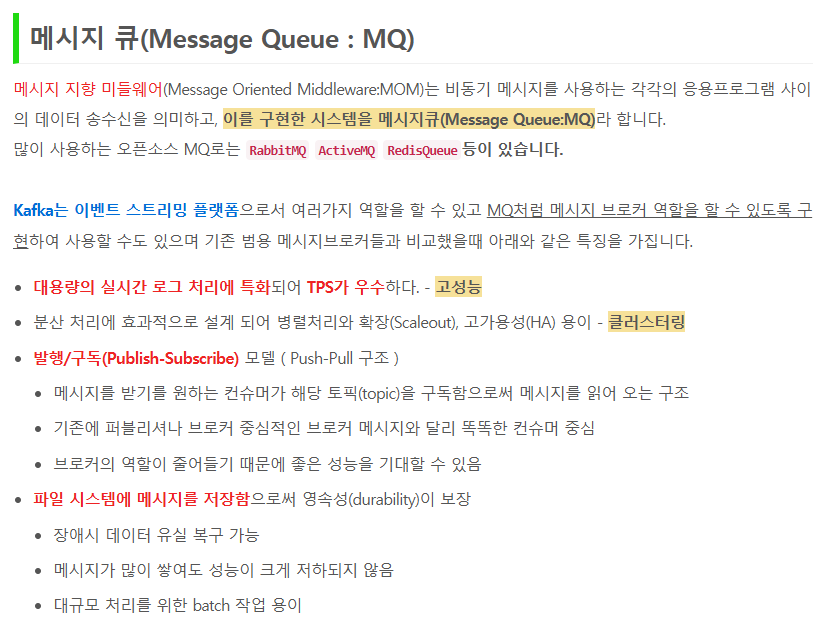
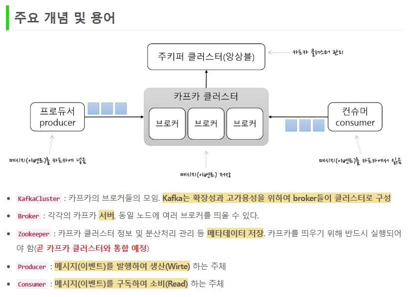
- 위와 같이 구성된다.
- 브로커:  각각의 클러스터 서버이다. 브로커(각각 클러스터)에 보낸 내용을 저장한다. 서버가 끊겨도 이쪽에서 데이터를 다시 가져올 수 있다. 실제 통신서버 운영시 끊어지는 경우가 많은데 얘는 끊어져도 브로커에서 다 저장하고 관리하기 때문에 이어서 연결해서 다시 실행할 수 있다.
- 주키퍼 클러스터: 브로커를 관리해주는 오케스트레이션 역할을 한다. 스케줄링 등 운영 관리. 서버가 끊기는 부하를 계산해서 오케스트레이션을 해주기 때문에 서버 운영관리 측면에서 효율적이다.
- 프로튜서: 데이터 보내는 역할. 데이터를 카프카 클러스터에 저장. 센서1 토픽에 데이터 넣어서 전달한다.
- 컨슈머: 데이터를 받는 역할. 센서1이라는 토픽정보 프로듀서/컨슈머 간에 토픽이 맞아야 함.
- 파란 네모: 토픽, 데이터 이동 경로. 
- 구조가 설비단 실시간 데이터 갖고와서 보내주는 통신인 MQTT 통신과 비슷하다.
- TCP/IP, FastAPI는 엔드유저 사용할때 많이 사용하는 거라고 보면 되고, 카프카도 엔드유저에 사용되기도 하지만 데이터가 실시간으로 발생하는 그 쪽에서 센서로 땡겨와서 AI서버나 디비에 실제로 저장해주는 단계에서 조금 더 많이 사용된다.
## 실제 제조 현장 예시
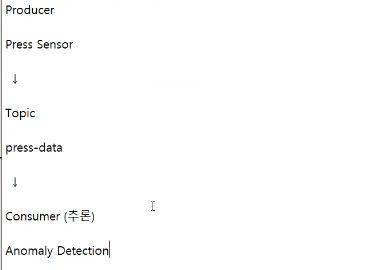
- 프로듀서: 설비
    - Press Sensor: 여러가지 센서정보
- 토픽정보를 
    - 압력 데이터 라고 정의
- 데이터를 실시간으로 가져와 컨슈머에서 추론
    - 센서 데이터를 읽어와 상태값 기반으로 추론한다.
    - 현재 상태는 ~이다. 라고 판단하는 서비스 구현 가능하다.
## 카프카 기본구조
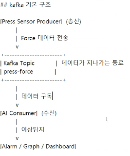
- 센서가 데이터 발생시킴. 프로듀서 역할로 데이터를 전송함.
- 프레스 포스라는 이름으로 데이터 지나가는 통로를 정의한다. (토픽)
- 컨슈머에서는 프레스 포스라는 토픽정보로 데이터를 수신하고,
- 수신한 데이터 기반으로 ai 추론 및 판단을 진행하고,
- 판단 결과를 기반으로 대시보드에 노출 가능하다.
## 카프카 개념 
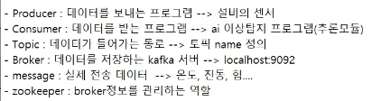
- 카프카에서 프로듀서: 데이터를 보내는 프로그램 --> 설비의 센서 데이터가 프로듀셔에 해당된다.
- 컨슈머: 데이터를 받는 프로그램 --> AI 이상 탐지 프로그램(추론모듈)
- 토픽: 데이터가 들어가는 통로 --> 토픽 name 정의
- 브로커: 데이터를 저장하는 kafka 서버 --> localhost:9092
    - 카프카는 포트가 9092로 정의되어 있다.
- 메시지: 실제 전송하는 데이터 --> 센서 온도/진동/힘 등등..
- 주키퍼: 브로커 정보를 관리하는 역할.

## 카프카 되게 중요하다
- AI의 꽃이다. 실시간이 되게 중요하다. 문제가 나타나고 나서 분석하는 것은 의미없다. 실시간 분석해서 어떻게 조치해야 하는지가 중요하다. 그 떄 실시간으로 처리할때 카프카를 많이 사용한다.
- 분석 끝나면 mlops -> git/jenkins 인프라 구축 진행할 예정이다.
## 경력자들 면접볼때
- 역량 파악 기술질문 꼭 물어 봤었다. 데이터 실시간 처리 어떻게 하셨는지
- 거기서 올바른 대답을 한 사람들은 좋은 점수. 제대로 못하면 마이너스 점수를 줬었다.

# 카프카 실습
## 0. 카프가 설치 및 환경 설정
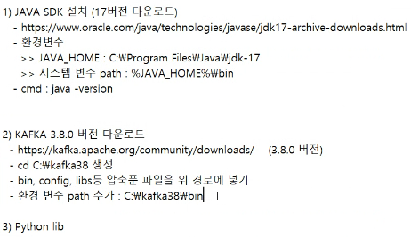
- 카프카는 자바 베이스이다. JVM을 깔아야 한다.
### [1] `JAVA SDK` 설치 - `17버전(17.0.10-Windows x64 Installer)`(안정)
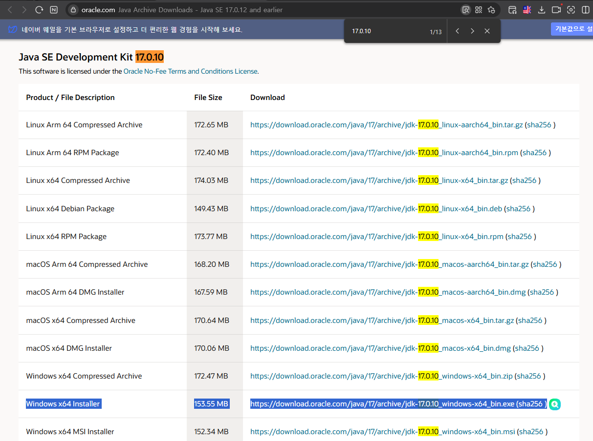
- https://www.oracle.com/java/technologiesjavase/jdk17-archive-downloads.html
- 설치 경로는 바꾸지 않고 기본으로 진행한다.(C:\Program Files\Java\jdk-17\)
    - 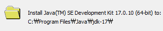
### [2] 아파치 사이트 `KAFKA 3.8.0 버전(Scala 2.13)` 다운로드
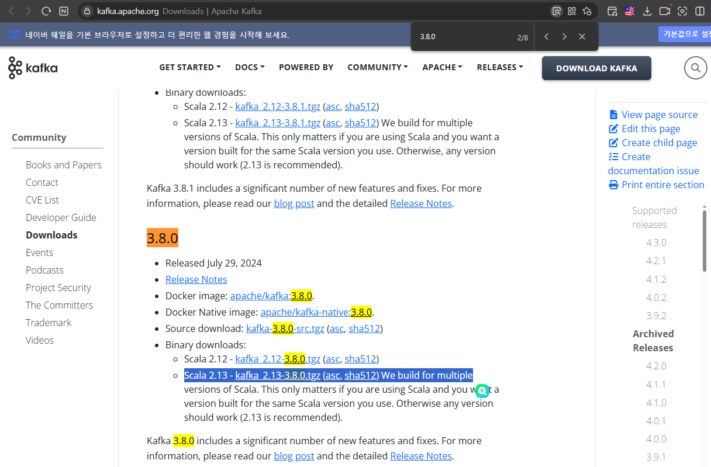
- https://kafka.apache.org/community/downloads/
- 3.8.0 버전 - Scala 2.13
- 설치 파일이 아니므로 다운로드만 받는다.
- 압축풀기 진행: 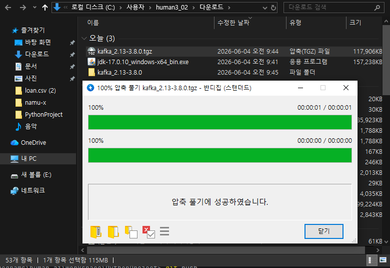
- 다운로드 받은 폴더에서 /config/kraft 에 들어가서properties 3가지가 있는지 확인: ![alt text(image-253.png)
    - C:\Users\human3_02\Downloads\kafka_2.13-3.8.0\kafka_2.13-3.8.0\config\kraft
### [3] 자바 환경변수(사용자 변수) 설정 (C:\Program Files\Java\jdk-17)
- 사용자 변수 추가: 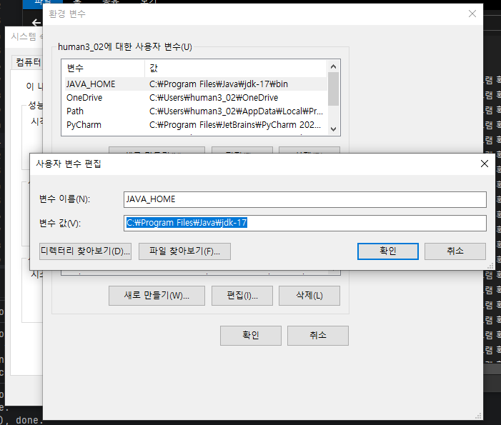
    - JAVA_HOME
    - C:\Program Files\Java\jdk-17
- 시스템 변수에서 `path 더블클릭` 후 환경 변수편집에서 `새로 만들기` ->` %JAVA_HOME%bin` 추가: [alt text](image-260.png)
- 자바 버전 확인: 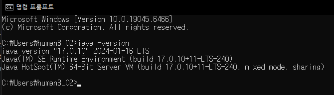
    - cmd에서 `java -version` 명령어로 확인
### [4] 카프카는 c드라이브에 있어야 함.
- c드라이브에 kafka38 이라는 폴더 만들어준다.
- 카프카 압축 푼 내용을 C:\kafka38 에 옮기기
    - 다운로드에 있던 것: 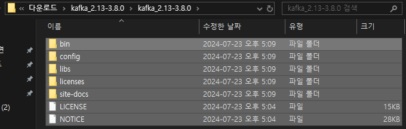
    - C:\kafka38 에 옮기기(복붙): 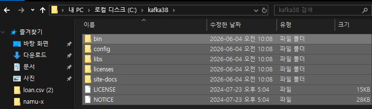
- 환경 변수(시스템 변수)
    - Path 더블클릭 후 추가(`C:\kafka38\bin`): 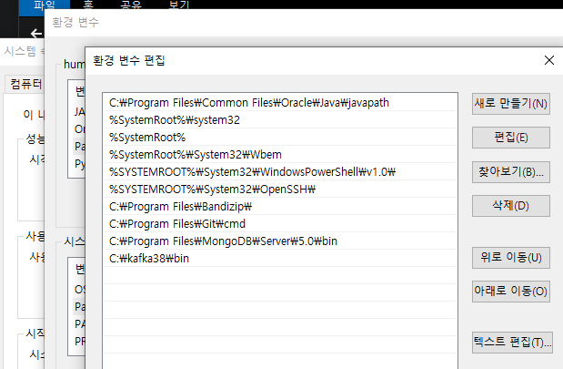
## 1. 주키퍼, 카프카 브로커 실행 및 토픽 생성
### [1] ZooKeeper 실행 (cmd창 1)
- cmd -> `cd C:\kafka38`
- 주키퍼 실행(cmd) ->`bin\windows\zookeeper-server-start.batconfig\zookeeper.properties`: 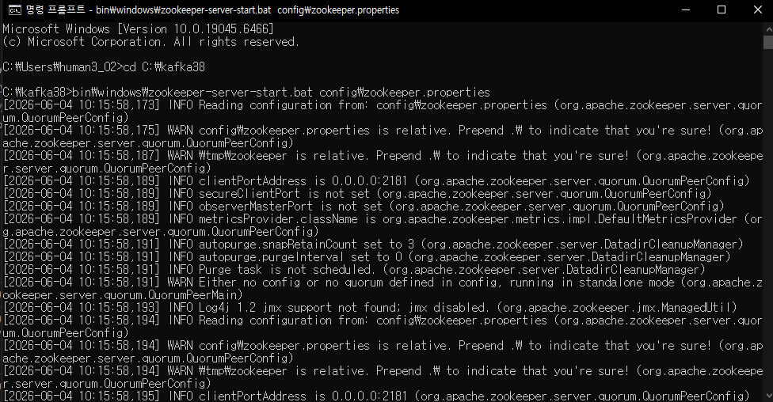
### [2] kafka broker 실행 (cmd창 2)
    - cmd2 -> `cd C:\kafka38`
    - 카프카 브로커 실행(cmd) -> `bin\windows\kafka-server-start.bat config\server.properties`: 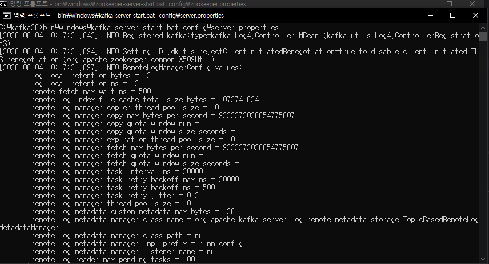
### [3] Topic 생성 (cmd창 3)
- cmd3 -> `cd C:\kafka38`
- press-force 라는 이름의 카프카 토픽 생성(cmd) -> `bin\windows\kafka-topics.bat --create --topic press-force --bootstrap-server localhost:9092`: 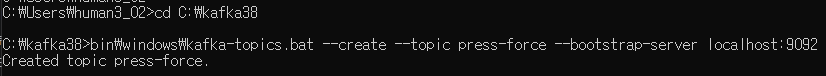
- topic 확인(cmd) -> `bin\windows\kafka-topics.bat --list --bootstrap-server localhost:9092`: 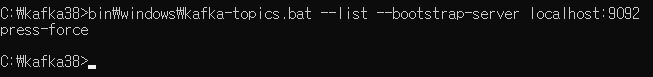

## 2. 카프카 프로듀서<->컨슈머 데이터 통신 테스트 진행 (송/수신 테스트)
### [0] 위 항목들 실행 후 새로운 cmd 창 2개 더 띄우기.
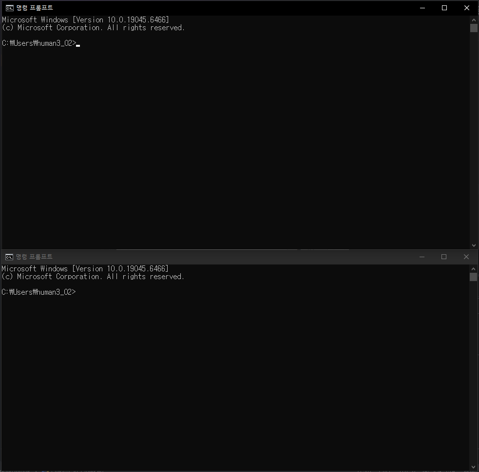
### [1] new cmd (4번) - kafka producer
- cmd4 -> `cd C:\kafka38`
- 프로듀서 테스트 -> `bin\windows\kafka-console-producer.bat --topic press-force --bootstrap-server localhost:9092`
- 입력: 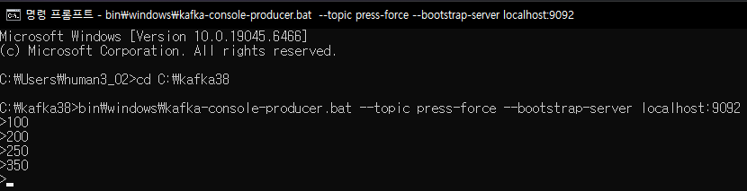
    - >100
    - >200
    - >250
    - >350
### [2] new cmd2 (5번) - kafka consumer
- cmd5 -> `cd C:\kafka38`
- 프로듀서 테스트 -> `bin\windows\kafka-console-consumer.bat --topic press-force --from-beginning --bootstrap-server localhost:9092`: 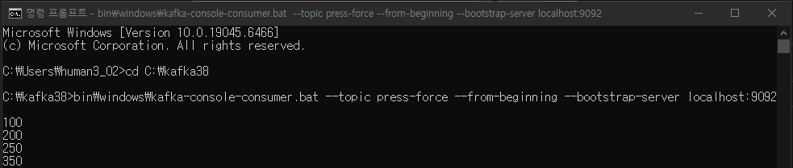
### [결과] producer -> consumer 데이터 수신 확인
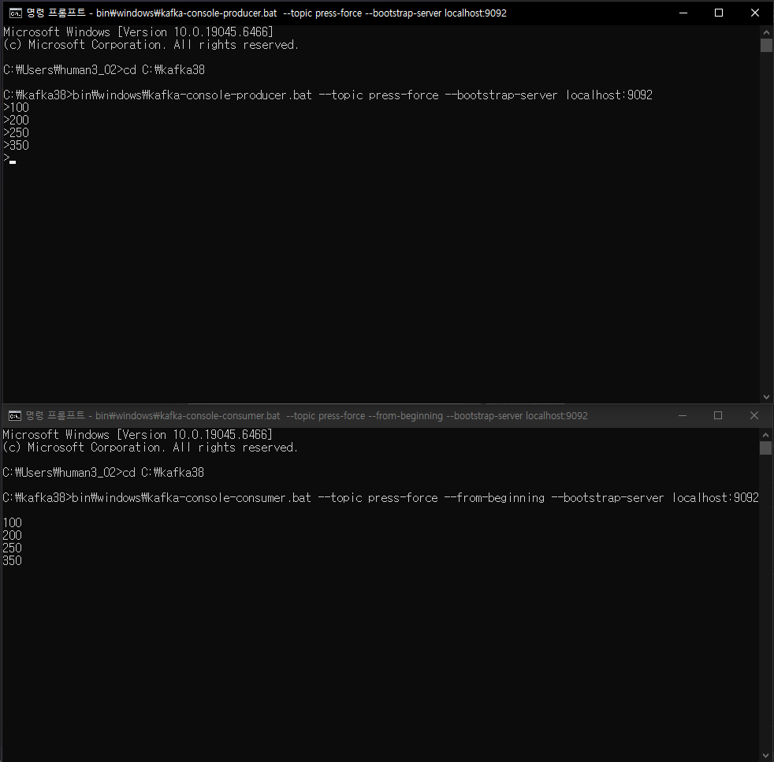

## 3. Python 카프카 라이브러리: `Python lib` 설치
## 4. 파이참에서 실습 진행 (kafka-python)
### [0] 가상환경에 kafka-python 설치
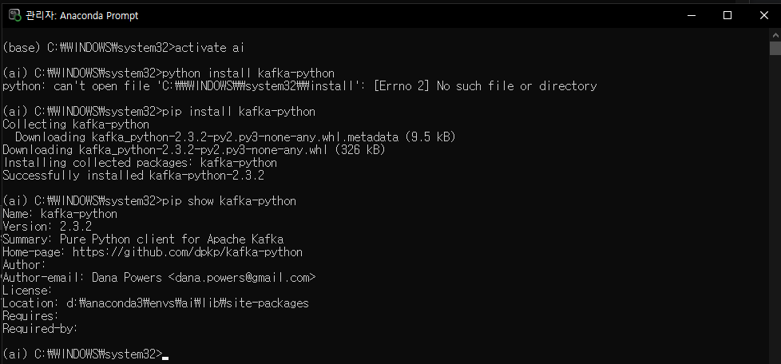
- 아나콘다 프롬프트 관리자 모드 실행
- 가상환경 실행: `activate ai`
- 카프카(파이썬) 설치: `pip install kafka-python`
- 설치 확인: `pip show kafka-python`
### [0-2] 파일 - 파이썬 - 인터프리터 가상환경으로 설정
- 여기서 인터프리터 추가 버튼 클릭: 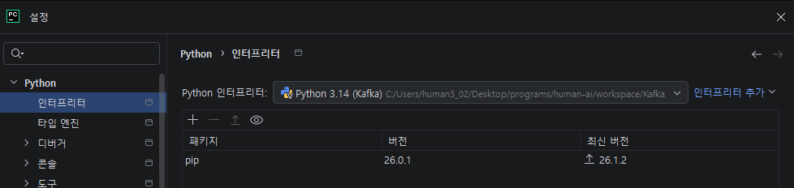
- -> 로컬 인터프리터 추가
- -> 기존 항목 선택 및 가상환경 지정: 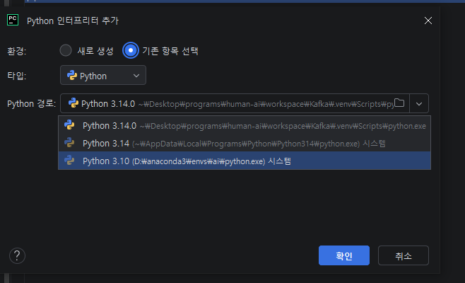

### [0-3] pycharm producer&consumer 테스트
- 파이참-new project-[Kafka] 생성: 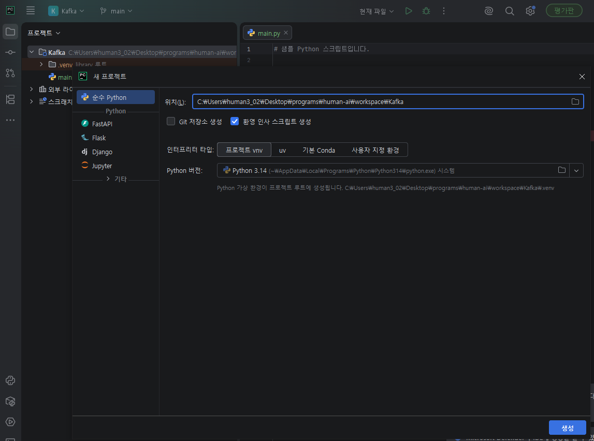
- 파이썬 파일 2개 생성: [part1_producer_basic], [part1_consumer_basic] 

### [1] part1_producer_basic.py - 컨슈머가 1초마다 데이터를 보냄.
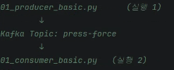
```py
'''
Producer가 Kafka Topic으로 데이터를 보내고,
Consumer가 같은 Topic에서 데이터를 받는 것을 확인
'''
#=========================================================
# kafka로 데이터를 보내는 producer 객체를 만들기 위한 클래스 
from kafka import KafkaProducer

import json
import random # 데이터 생성

import time   # 일정 시간마다 데이터를 보내기 위해 사용

# kafka 객체 생성
producer = KafkaProducer(
    bootstrap_servers=['localhost:9092'], # 주소 지정 (kafka 기본 포트 9092)
    value_serializer=lambda data: json.dumps(data).encode('utf-8') # python dict -> json 문자열 -> utf-8 bytes 변환
)

# 데이터를 보낼 kafka Topic 이름 지정
topic_name = 'press-force'
print(f"Producer 시작: 1초마다 Force 데이터를 전송합니다.")

# 데이터가 강제 종료될 때까지 계속 반복하여 데이터 전송
while True:
    force = round(random.uniform(130, 150), 2)
    message = {
        "machine_id": "press_01",
        "force": force
    }

    # kafka의 press-force Topic으로 message 데이터를 전송
    producer.send(topic_name, value=message)

    # producer 내부 버퍼에 남아 있는 데이터를 즉시 전송
    producer.flush()
    print("전송: ", message)

    # 1초마다 전송
    time.sleep(1)
```
- 실제로 밀리세컨 단위로 데이터가 쌓이긴 하지만, 보통 10분 등등으로 기간을 어느정도 할지 정해서 그때마다 윈도우를 합쳐서 데이터 분석을 진행한다.
- 밀리세컨 단위로 분석 진행하면 거의 상수값처럼 변하지 않는 것처럼 보일 거라서 그런 분석은 의미가 없다.
- 1초마다 전송 진행중: 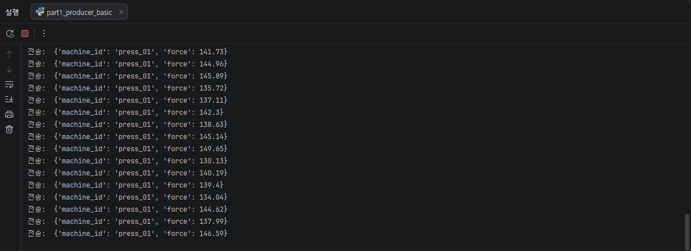
### [2] part1_consumer_basic.py
- 토픽 명령으로 프로듀서에서 보낸 데이터를 받는다.
```py
# kafka로 데이터를 보내는 consumer 객체를 만들기 위한 클래스
from kafka import KafkaConsumer

import json

consumer = KafkaConsumer(
    'press-force', # 구독할 데이터를 받아올 topic 이름을 정의
    bootstrap_servers=['localhost:9092'], # broker 주소 지정
    auto_offset_reset='latest', # consumer가 처음 실행될 때 최신 데이터로부터 읽도록 설정
    group_id='basic-consumer-group', # consumer 그룹 id 지정 (같은 그룹 id를 가진 consumer는 데이터 나눠서 읽음)
    # Kafka에서 받은 bytes 데이터를 UTF-8 문자열로 바꾸고 JSON을 dict로 변환
    value_deserializer=lambda data: json.loads(data.decode('utf-8'))
)

# consumer가 정상적으로 시작되었음을 출력
print(f"consumer_basic 시작: press-force Topic 데이터를 수신합니다.")

# kafka topic에 메시지가 들어올 떄마다 반복 실행
for message in consumer:
    data = message.value
    print("수신: ", data)
```
### [결과] 실시간 데이터 송/수신됨 확인
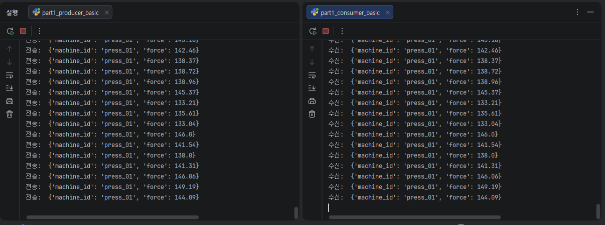

## 5. 구간 헤르츠 데이터 실시간 송/수신 실습
- 파이썬 파일 2개 생성: [part1_consumer_10kz_tps], [part1_producer_10kz]
### [0] 실습할 내용 설명 (10kz)
- 윈도우 구간을 설정해 통계량을 본다.
- 프로듀서에서 밀리세컨 단위로 데이터를 계속 보내준다.
- 컨슈머에서 밀리세컨 단위로 받는건 의미가 없어서 윈도우 단위로 전체를 다 받아서 max/min/mean 등 한포인트를 찍을 것이다. 그 구간의 맥스값 한포인트, 다음 구간의 맥스값 통계량 한포인트 를 받아서
- 컨슈머는 그 데이터만 읽어와서 분석을 진행한다.
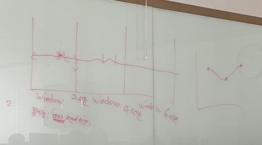
- 실제 형태: 2,4,6시간
    - 각 2시간 동안 쌓인 데이터들 특징이 거의 이런식으로 상수값처럼 주욱 나오고, 어느 시점에 살짝 튀고 그렇기 때문에 통계를 내서 한포인트씩 뽑는 것이다.
    - 로우데이터 엄청 많으면 저장할 수도 없다. 하루에 몇백테라바이트다. => 그래서 윈도우를 10분으로 잡고 통계량 한포인트씩 잡아서 연결한 다음 데이터 분석을 진행했다.
### [1] 10kz 데이터 프로듀서 part1_producer_10kz.py
```py
#=====================================================
'''
producer가 0.1초마다 데이터 전송
consumer가 초당 약 10건 수신 => tps 출력

순서: consumer 실행 --> producer 실행
'''
#=====================================================

from kafka import KafkaProducer
import json
import random
import time
from datetime import datetime

# kafka 객체 생성
producer = KafkaProducer(
    bootstrap_servers=['localhost:9092'],
    value_serializer=lambda data: json.dumps(data).encode('utf-8'),
)

# 데이터를 전송할 topic 지정
topic_name = 'press-force'

# 메시지 순번을 저장하기 위한 변수
seq = 0

# producer 시작 메시지 출력
print("producer 시작: 0.1초마다 1건, 초당 약 10건을 전송합니다.")

# 데이터 강제 종료까지 무한 전송
while True:
    seq += 1 # 메시지 순번을 1씩 계속 증가시킴
    force = random.uniform(130, 150) # 정상: 130~150

    # 5% 확률로 이상 force 데이터 생성
    if random.random() < 0.05:
        # 이상 상황에서는 force가 175~210 사이로 크게 정가한다고 가정
        force = random.uniform(175, 210) # 이상: 175~210

    # 메시지 구성
    message = {
        # 메시지 순번
        "seq": seq,
        # 현재 시간을 밀리초 단위까지 문자열로 저장
        "timestamp": datetime.now().strftime("%Y-%m-%d %H:%M:%S.%f")[:-3],
        # 설비 id
        "machine_id": "press_01",
        # force 값을 소수점 둘 째 자리까지 반올림
        "force": round(force, 2),
    }

    # kafka topic으로 메시지 전송
    producer.send(topic_name, value=message)
    # producer 내부 버퍼를 즉시 비워 전송 지연을 줄임
    producer.flush()
    print(f"전송 seq: {message['seq']}, force: {message['force']}")

    # 0.1초 마다 데이터 전송 (1초에 약 10개)
    time.sleep(1)
```
- 실행 결과: 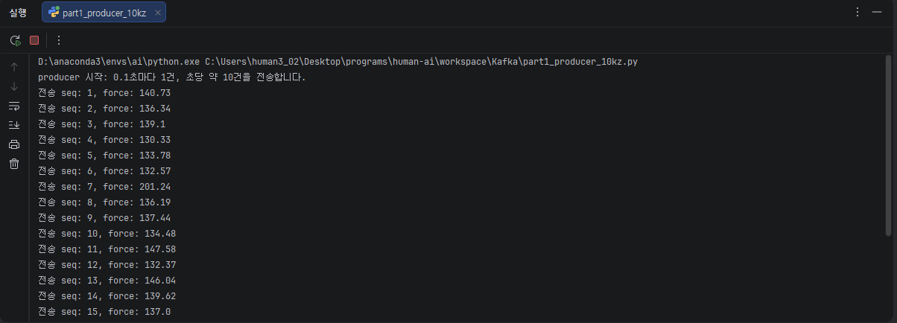
### [2] 10kz 데이터 컨슈머 - part1_consumer_10kz_tps.py
```py
#=====================================================
'''
producer가 0.1초마다 데이터 전송
consumer가 초당 약 10건 수신 => tps 출력

순서: consumer 실행 --> producer 실행
'''
#=====================================================

from kafka import KafkaConsumer
import json
import time

# kafka consumer 객체 생성
consumer = KafkaConsumer(
    'press-force', # 토픽 네임 producer와 맞춰야 함
    bootstrap_servers=['localhost:9092'], # broker 주소
    auto_offset_reset='latest', # 최근 데이터
    group_id='tps-consumer-group', # consumer 그룹 id 지정 (같은 그룹 id를 가진 consumer는 데이터 나눠서 읽음)
    # Kafka에서 받은 bytes 데이터를 UTF-8 문자열로 바꾸고 JSON을 dict로 변환
    value_deserializer=lambda data: json.loads(data.decode('utf-8'))
)

# 1초 동안 수신한 메시지 개수를 저장
count_per_second = 0

# 프로그램 시작 후 전체 수신한 메시지 개수를 저장
total_count = 0

# TPS 측정 시작 시간을 저장
start_time = time.time()

# consumer 시작 메시지 출력
print(f"TPS Consumer 시작: 초당 수신 건수를 계산합니다.")

# kafka topic 에서 메시지를 계속 읽어오기
for message in consumer:
    data = message.value
    count_per_second += 1 # 1초 단위 카운터 1씩 증가
    total_count += 1 # 전체 누적 카운터 1씩 증가
    current_time = time.time() # 현재 시간 가져옴

    if current_time - start_time > 1.0:
        # 최근 1초동안 수신한 메시지 개수를 tps로 출력
        print(
            f"현재 TPS: {count_per_second} 건/초, ",
            f"누적 수신: {total_count} 건, "
            f"최근 force: {data['force']}"
        )
        count_per_second = 0 # 1초 단위 카운터 초기화
        start_time = current_time # TPS 측정 시작 시간 현재 시간으로 갱신
```
- 결과 확인: 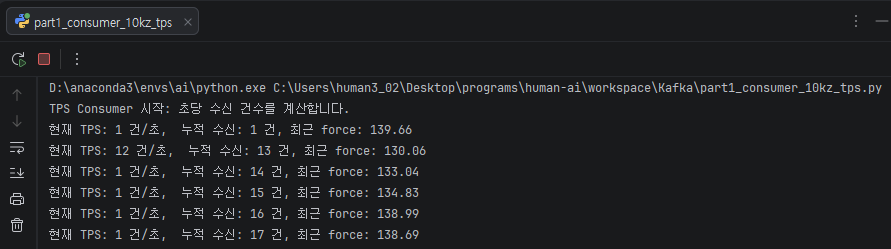
### [결과] 구간 통계량 송수신
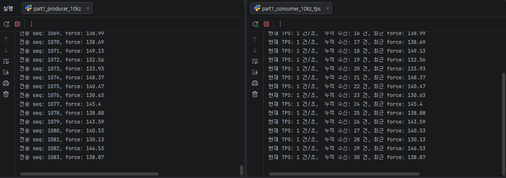
- 추후 위와 같이 분석을 진행했다고 얘기할 때 => 값은 어떤 걸 썼고, 윈도우는 10분, 통계량은 min 썼다. 뭐 이런 식으로 얘기할 수 있어야 한다.

# 실시간 모니터링(kafka) 및 시각화 실습 
- ai모델 연결 -> 실시간 데이터 이상 감지 추론 -> 이상 여부 판단 및 알람 울리기
- 설비로부터 데이터 받고 전송(producer) -> 실시간으로 받음(consumer)
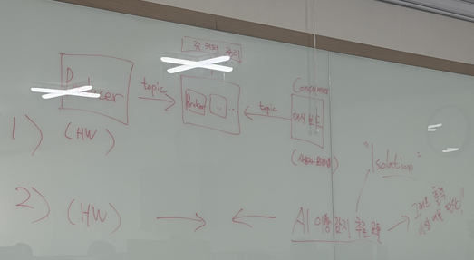
- [1] 실시간으로 받아와서 설비 출력(그래프)
- 현장에서 현업담당자들 원하는것: 변수/라인도 많고 내가 확인할게 너무 많은데 방대하고 크니까 확인을 못함 -> 고급분석도 좋아하지만 가장 기본적으로 설비의 상태, 크리티컬 파라미터 상태, 고장의 상태 등을 보여주는게 너무 땡큐이다.
- 이런 부분 대시보드 디지털라이징. 실시간 처리 = kafka
- [2] AI 이상감지 추론 모듈 실시간 상태 데이터를 보고 모듈이 데이터를 받아서 그래프로 출력 후 -> 이상 여부 판단을 진행
    - `Isolation` 모델로 실습 예정. 정확도는 떨어질 것임. 들어온 만큼 조금씩 학습 -> 추론 구조이기 때문(학습 데이터가 적어서)
- `FDC 시스템`. 실시간 설비 이상 감지 시스템 -> 그래프 출력해서 이상 있으면 알람.

## EAP 설명
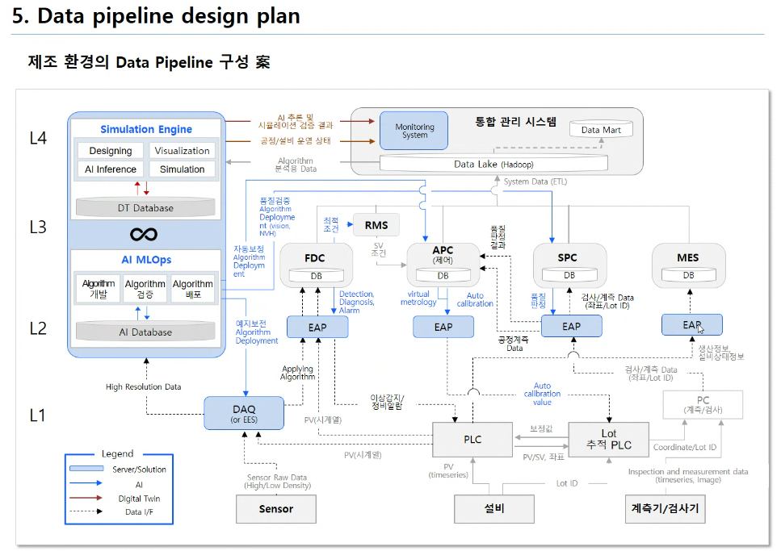
- 하드웨어와 상위시스템 통신하는 것: EAP (Equipment Automation Program, 장비 자동화 프로그램.) 상위와 통신하는 미들웨어 프로그램이다.
- 카프카, 스카프, 하둡 등으로 EAP 구축가능.
- 중간에서 중계 역할을 해준다.
- FDC 이상감지: 실시간으로 데이터 읽어와서 이상감지 모델으로 실시간 데이터에 고장 등의 사전조짐 발생시 담당자에게 알람울리고 -> 조치 -> 설비를 멈춤 등의 컨트롤. 
- EAP가 있어야만 원천데이터 발생 부분과 연결 가능하다.

## kafka(producer/consumer) -> dashboard(matplotlib) 실습 
### 0. dashboard 실습 - 세팅
- 기존에 만든 [part1_producer_10kz.py] producer는 원천데이터 발생 용도로, 실행 시켜둔 상태로 진행한다.
- 파이썬 파일 2개 생성: [part2_consumer_forces_5second_dashboard], [part3_consumer_isolation_anomaly]

### 1. part2_consumer_forces_5second_dashboard
```py
#========================================================
'''
kafka topic으로 들어오는 센서 데이터를
대시보드(consumer)가 실시간으로 받아서 그래프 시각화 처리한다.

실행 순서
1. part1_producer_10kz.py
2. part2_consumer_force_5second_dashboard.py
'''
#========================================================

from kafka import KafkaConsumer
import json
import matplotlib
matplotlib.use("TkAgg")
import matplotlib.pyplot as plt # 시각화 라이브러리
import time
from collections import deque # 데이터 저장

# Consumer 객체 생성
consumer = KafkaConsumer(
    'press-force', # 구독할 데이터를 받아올 topic 이름
    bootstrap_servers=['localhost:9092'], # broker 주소 지정
    auto_offset_reset='latest', # consumer가 처음 실행될 때 최신 데이터로부터 읽도록 설정
    group_id='graph-consumer-group', # consumer 그룹 id 지정 (같은 그룹 id를 가진 consumer는 데이터 나눠서 읽음)
    # Kafka에서 받은 bytes 데이터를 UTF-8 문자열로 바꾸고 JSON을 dict로 변환
    value_deserializer=lambda data: json.loads(data.decode('utf-8'))
)

# 최근 1000개 데이터를 저장 (그래프 5초 단위 실시간 갱신)
MAX_POINTS = 1000
x_data = deque(maxlen=MAX_POINTS)
force_data = deque(maxlen=MAX_POINTS)

# 실시간 모드로 계속 업데이트
plt.ion()
fig, ax = plt.subplots(figsize=(12,6))
line, = ax.plot([], [], linewidth=2)
ax.set_title("Real-Time Press Force Monitoring")
ax.set_xlabel("Sample")
ax.set_ylabel("Press Force")
ax.grid(True)

# 샘플 번호
sample_no = 0
# 마지막 그래프 갱신 시각
last_update = time.time()
# 그래프 갱신 시간 설정 (5초마다 그래프 갱신)
UPDATE_INTERVAL = 5
print(f"5초 단위 그래프 업데이트 시작")

# 그래프 그리기
for message in consumer:
    data = message.value
    sample_no += 1
    force = data['force']

    # 데이터 저장
    x_data.append(sample_no)
    force_data.append(force)
    print(
        f"수신 Sample: {sample_no}, ",
        f"Force: {force}, ",
    )

    # 현재 시간
    current_time = time.time()
    # 5초가 지났는지 확인
    if current_time-last_update >= UPDATE_INTERVAL:
        print("\n=============================\n")
        print(f"{UPDATE_INTERVAL}초 데이터 수집 완료")
        print(f"총 데이터 수: {len(force_data)}")
        print("그래프 업데이트")
        print("\n=============================\n")

        # 그래프 갱신
        line.set_data(
            list(x_data),
            list(force_data)
        )

        # x축 범위 (x축에 출력되는 숫자의 범위 지정)
        ax.set_xlim(min(x_data), max(x_data))
        # y축 범위
        ax.set_ylim(min(force_data)-10, max(force_data)+10)

        # 그래프 다시 그림 (re draw)
        fig.canvas.draw()
        fig.canvas.flush_events()

        # 다음 5초를 측정
        last_update = current_time
```
- 시계열 그래프로 5초마다 표현하고 계속 갱신하는 그래프 -> 웹이나 앱에 연동하면 됨.
- 결과(5초마다 데이터 받아와짐): 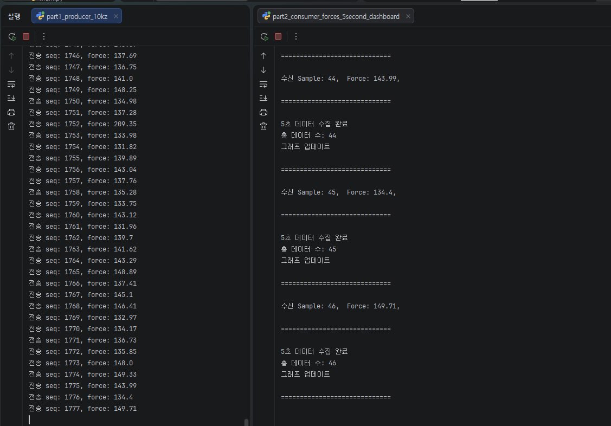
- 결과(대시보드): 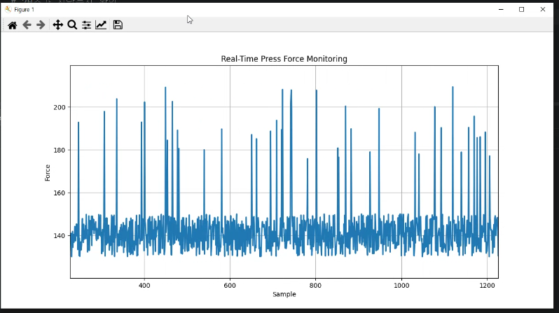
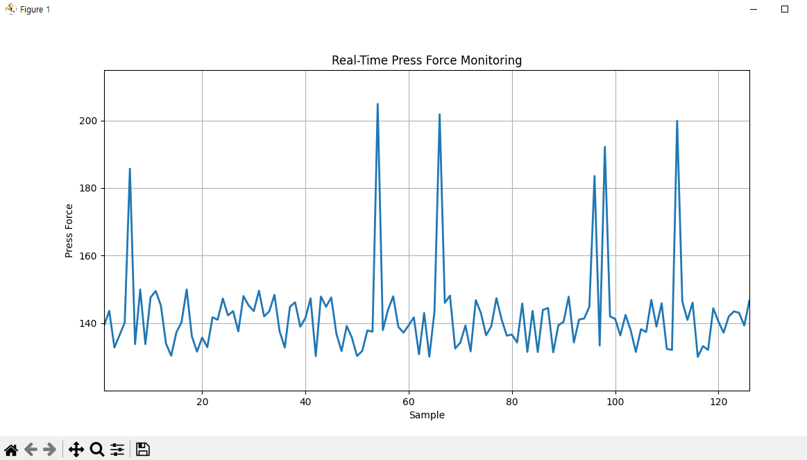