# 8일차 - 6/5(금) #
- 회의 참석: https://whaleon.us/o/CSvuJa/64dffed07c6741c990f69804e3b62d6e

# AI/ML/DL 관계
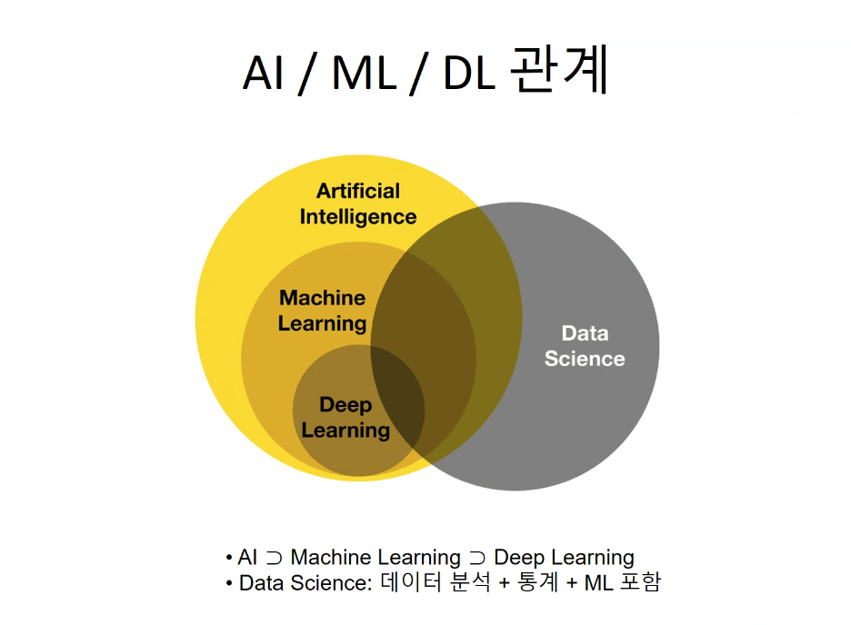
- 데이터 처리, 수집, EDA 실습 했었다. 기본적인 건 다 한 것 같다. (데이터수집/저장/실시간처리/간단데이터특성파악) 데이터 분석 전단계까지 웬만한 건 실습 됨.
- 데이터가 준비 되었으니 이제는 분석 단계이다.
## 개념 구조
- AI, 머신러닝, 데이터사이언티스트 완전 다른 부분은 아니다. 겹치고 포함되는 관계다.
- AI 즉 인공지능: 인간의 지능 모방하는 모든 기술. 규칙기반/검색/최적화 알고리즘 등 여러가지 알고리즘들이 포함됨.
- 그 안에 머신러닝이 있다.: 데이터를 통해 규칙을 학습하는 방법이다. EX) 온도80도 넘으면 이상이다. 라는걸 사람이 직접 코딩한다. 피쳐를 직접 뽑고 기준을 정해서 학습하는 방법이다.
- 산업 현장에서는 문제가 단순하지 않다. 온도/압력/속도/진동/시간 등 수많은 변수들 복합적 작용한다. 고장나도 단일변수에 의하지 않고 여러 복합적 요인이 동시다발로 나타나 고장이 나타난다. -> 사람이 정의 불가능 => 데이터로부터 학습하는게 필요해졌다.
- 딥러닝: 머신러닝 안에 딥러닝 있다. 딥러닝은 알아서 피쳐를 추출하고 학습을 진행하는 인공지능 학습 방법론이다.

# 지도vs비지도vs강화학습
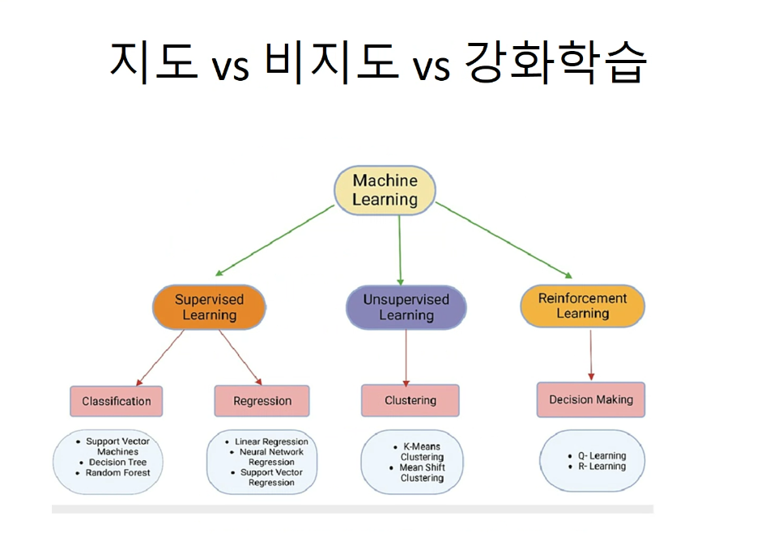
- 강화학습은 많이 사용되지 않아서 이 수업에선 뺀다.
- 머신러닝에 크게 2가지 있다. 지도학습, 비지도학습.
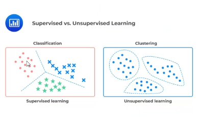
- 지도학습: 슈퍼바이즈드 러닝. 정답이 함께 주어진다. x가 y를 찾는 과정이다.
- 비지도학습: 언슈퍼바이즈드 러닝. 정답이 안주어진다. 별표인지 네모인지 세모인지 정답이 주어지지 않는다. 입력 데이터 x만 주어지고, 그 내부에서 구조나 패턴을 찾는 것이다. ex) 클러스터링/클래시피케이션, 비슷한고객 세그멘테이션/클러스터링 하는 것들이 있다.
- 지도 학습: x/y 주어진 것 학습 -> 정답 맞추는 문제
- 비지도 학습: 데이터의 구조를 이해하는 문제이다.

# 회귀vs분류vs군집
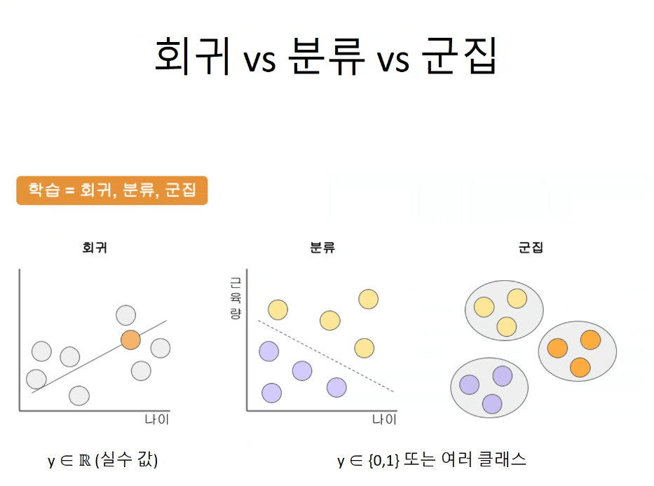
- 지도학습은 회귀와 분류로 크게 나뉘어진다.
- 회귀: 어떤 연속적인 값을 예측하는 것이다. EX) 집값예측/매출예측/온도예측/제품생산량예측 -> 회귀모델로 어프로치를 가져갈 수 있다. 출력이 실수값 숫자가된다.
- 분류: 숫자예측이 아니라 범주를 예측하는 것이다. 이중에 어떤것이냐.. EX) 제품의불량정상여부/합격불합격여부 분석. 
- [중요] 이 차이를 명확하게 이해하는게 중요하다. 그래야 나중에 모델 개발후 모델별 평가방식 서로 달라서 분류모델에 대해 회귀 평가 메트릭 적용하면 안되기 때문이다.
- 나중에 실습하는것도 회귀 아니면 분류이다.

# 머신러닝
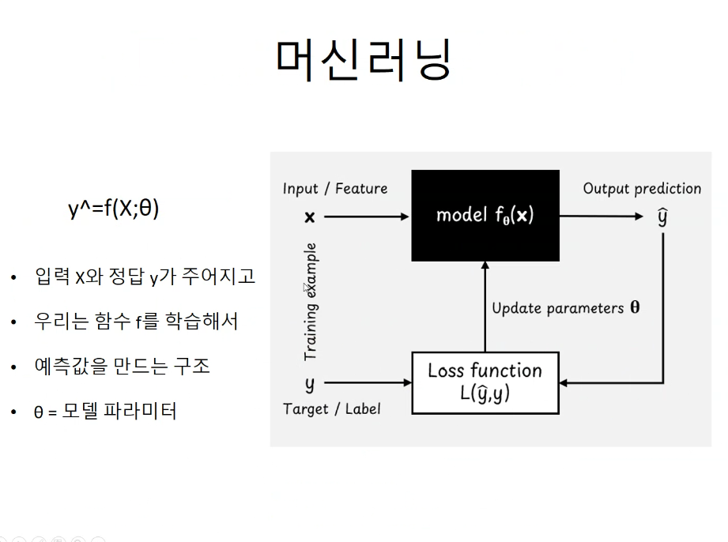
- 머신러닝의 본질은 하나의 함수이다. X를 넣으면 출력Y가 나온다. 세타는 모델의 파라미터를 의미하고, 세타는 사람이 정하는게 아니라 데이터를 통해 학습되는 것이다.
- 머신러닝은 이 세타가 얼마만큼 정확하냐를 찾는 문제이다.
- 어떤 세타가 좋은 세타일까?: 그 기준은 손실 함수에 의해서 정해진다.

# 손실함수
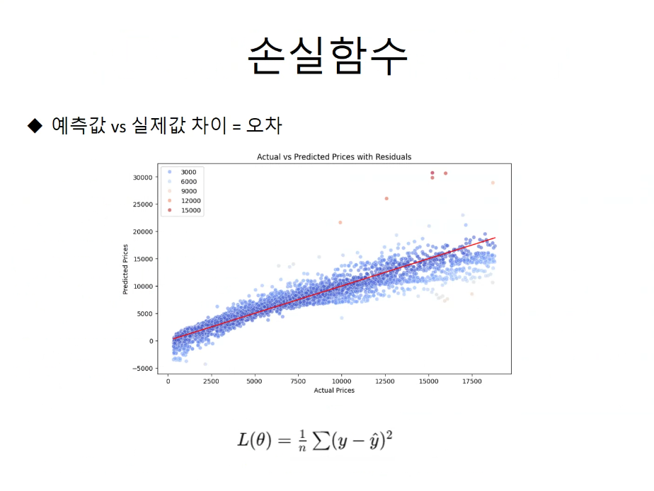
- 이는 모델이 예측한 값과 실제 값과의 차이를 계산하는 수식이다.
- 각 데이터에 대해 오차를 구하고 이를 평균낸다. 
- 여기서 중요한 것은 `제곱`이다. 손실함수에서 왜 제곱을 할까? -> 예측값과 실제값 비교시 오차가 커지는 경우에 대해 좀더 큰 패널티를 주기 위해 제곱하는 것이다. 큰 오차를 더 강하게 나타내기 위해 제곱을 쓰는 것이다. 차이가 미묘하면 크게 차이난다고 볼 수 없기 때문이다. 차이 적게나는 부분은 적게, 크게나는 부분은 더 크게 표현된다.
- 이 손실함수에 의해 머신러닝의 세타값을 찾아나가는 것이다. 이게 머신러닝인 것이다.

# 학습 과정
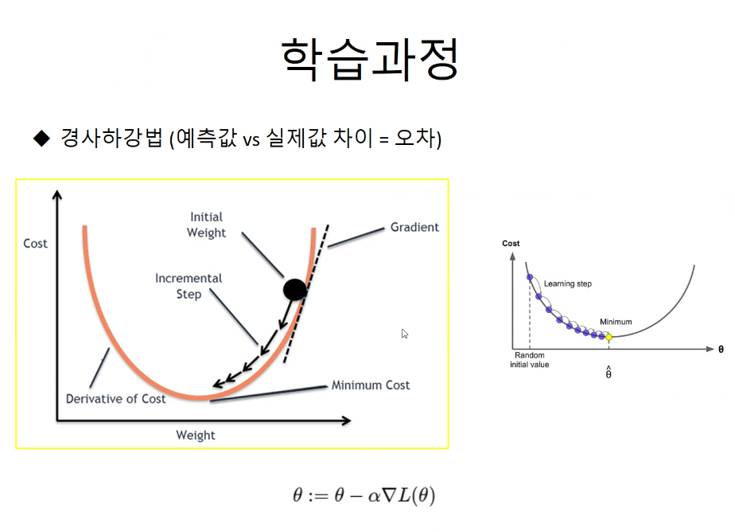
- 이건 딥러닝이랑도 좀 동일하다. 경사하강법.
- 이 과정들이 경사하강법을 통해 최적의 가중치를 찾아가는게 경사하강법이다.
- 딥러닝/머신러닝의 핵심적 알고리즘은 학습이다. 많이쓰는건 그레디언트 디센트 알고리즘(경사하강법)
- 손실함수를 최소화시키는 문제이다.
- 손실함수를 보통 3차원으로 보면 그릇모양으로 나타낸다. 그래서 이 함수에서 가장 낮은 지점이 최소값이 되는 지점이 학습이 되어서 찾아나가는 과정이다.
- 중요한 것은 기울기(그래디언트)이다. 이게 함수가 가장 빠르게 증가하는게 나타나는 과정이고. 미니멈 코스트가 최소값을 찾아나가는 것이다.
- 러닝레이트는 학습률이다. 한번에 얼마만큼 이동을 할지 결정하는 것이다.
- 기울기를 통해 학습러닝레이트를 통해 학습공간만큼 내려가고 타고타고 내려가서 최저점이 될 때까지 학습을 진행하게 되는 것이다.
- 기울기를 통해 가장 정확한 세타. 최소세타값을 찾는것. => 예측값/실제값 가장 차이(오차)가 없는 부분이다.
- 이 손실함수를 차이가 나지않는 수준까지 학습해서 최적의 세타값을 찾아나가는 것이다.
- 기울기를 따라 러닝레이트만큼 타고 내려와 찾아 나가는 방법이 경사하강법이고, 이걸 하다보면 최적의 세타 Weight 값을 찾아갈 수 있게 된다. 그게 학습 과정이다.
- 그레서 결국엔 예측값과 실제값과의 오차를 최소화하는 것이다. 코딩할때도 이런 식으로 코딩할 것이다. 경사하강법 알고리즘 등등 코딩 (개념을 알고 있어야 코드를 짜는데 이해가 됨)

# 다시 머신러닝

- 앞의 함수가 머신러닝이다. 인풋 주어졌을때 데이터에 대해 특징이나 피쳐는 우리가 직접 추출해야 한다. 딥러닝은 이걸 자동으로 해주지만 머신러닝은 직접 추출해야 한다. 
- 예측값과 실제값 차이가 있는지 없는지 손실함수로 구하는데 -> 차이가 나지않는 최적의 세타값 찾아서 -> 실제값과 동일한 y값을 찾는 과정이다.

# 학습과정
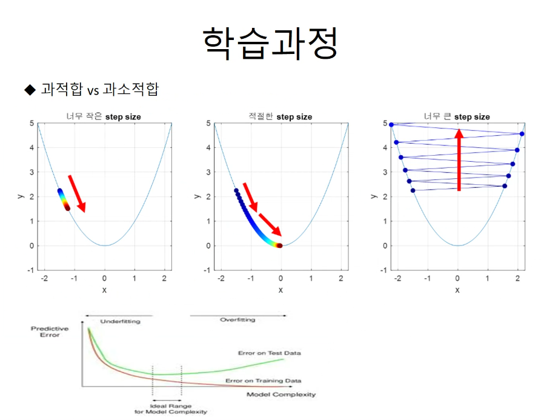
- 모델 개발하고 학습 돌리고 나면, 성능 좋냐 나쁘냐 성능 검증을 하게된다.
- 이런 부분을 보는 것이다. 모델 성능이 좋을때/나쁠때
- 적절한 스텝사이즈는 모델이 학습을 잘했다. 모델 성능이 좋다고 할 수 있다.
- 모델 학습시 발생하는 문제: 과적합/과소적합. 학습할때 반드시 발생하는 문제이다. 이런 문제가 발생하면 예측의 정확도가 떨어질 수밖에 없다.
- 최적 세타값 찾아야 하는데 맨아래까지 못내려간다. 실제값/예측값 오차를 못줄여서 못내려간다. 학습을 하다가 멈춰버리는 것이다. (로컬미니멈에 빠짐)
- 너무 큰 스텝사이즈 이런 경우는 학습을통해 점점 내려가다가 다시 올라가는 것이다.
## 과소적합은 왜 발생?
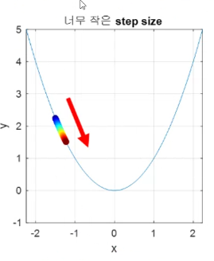
- 데이터가 너무 적거나, 모델이 너무 단순해서 데이터의 패턴을 파악하지 못하는 것이다. -> 모델 성능 떨어짐. -> 로컬미니멈에 빠짐 
- 해결방법: 데이터를 많이 써야한다. 그래야 문제의 유형/패턴/특징을 알아낼 수 있다. (더 많이 데이터를 넣기, 모델 단순한거 조금더 튜닝하기.)
## 과적합은 왜 발생?: 성격이 다르다. 
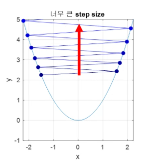
- 너무큰스텝사이즈 -> 내려오다가 다시 올라간다. 이건 모델이 너무 복잡해서 훈련데이터의 노이즈, 학습 안해도 되는 것까지 학습해서 오버피팅이 발생한 것이다.
- 이 경우에 성능이 잘 나올순 있지만, 새로운 데이터 나오면 성능이 떨어진다.
- 가장 중요한 것은 이러한 균형을 맞추는게 매우 중요하다.
- 불필요한 데이터까지 보고 있는지, 학습알고리즘 적정하게 선택했는지
    - 경사하강법 말고도 여러 알고리즘이 있다. 실습할때는 여러 알고리즘을 가지고 실습할 것이다.
## 파라미터 튜닝
- 학습 과정에 대한 세타, 파라미터 등 여러가지 파라미터를 정하게 된다.
- 학습의 수. 학습을 몇법 할것인지. 이만큼 단위로 학습하고 내려올지, 러닝레이트 크기 얼마나 줄지 등에따라 결과가 다르게 나오는데. 그런 부분도 잘 튜닝이 되었는지 잘 확인해 보아야 한다.
- 앞으로 언더피팅, 오버피팅 굉장히 많이 일어날 것이다. 튜닝하는 법에 대하여도 실습해볼 것이다.

# 평가지표 - 회귀모델
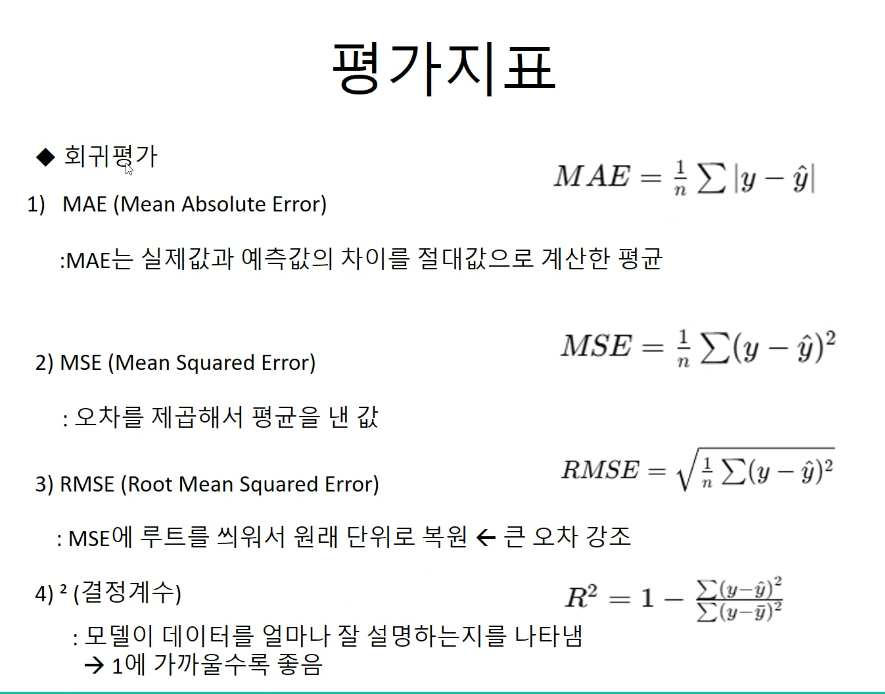
- 모델을 만들고 학습을 시켰다. 이후 모델 성능 좋은지 안좋은지 모델검증을 해야한다.
- 모델검증 방법(두 모델은 평가방법 다름)
    - 회귀모델(집값/매출/판매량 등 숫자예측):
    - 분류모델(y가0또는1 등 범주예측):
- 회귀모델
    - MAE, MSE, 결정 계수 등의 평가 메트릭이 있다.
- [중요] 면접볼때, 이런문제 풀기위해 이런거 했습니다. 했을때, => 면접관이 메트릭 뭘썼습니까? 라고 질문하면 MAE 썼습니다, MSE 썼습니다 등 바로바로 나와야 한다.
- MAE: 실제값과 예측값의 차이를 절대값으로 계산한 평균. 값이 얼마나 나오는지
- MSE: 오차를 제곱해서 평균을 낸 값.
- RMSE: MSE에 루트를 쒸워서 원래 단위로 복원 (큰 오차 강조)
- 결정계수: 신뢰도 평가. 신뢰도 계수를 얘기한다. 
- 이런 값들은 0에 가까울수록 좋은 것이다. 오차값이 적어질 수록 좋음.
- 앞으로 실습 시, 이 부분 굉장히 실습 코드에 많이 들어갈 것이다. 나중에 MAE가 뭔지, MSE가 뭔지 헷갈려하면 안된다.

## < 10분 휴식 >
- 교수님은 선임연구원으로 최신기술 스터디한 연구조직..
- 머신러닝은 해봤지만 딥러닝 해본사람 거의없음(2016년)
- 이제 우리도 활용해보자! -> 막 공부함. (강의/책 등)
- 전부 다 수식이었다. 공부하는데 수식/정리 이해안됨. 
- 회사에서 돈받고 일하는데 모른다고 포기하면 안됨. -> 공부해서 우리라인에 적용해야해서 코드반복짜고/실습하고.. -> 처음에 막연했는데 어느순간 이해가 되셨다.
- 코드보고 디버깅 -> 라인 보고 결과나옴 -> 수학적 공식 이해됨.. 
- 집에 가서 계속 반복하고 또 보고 내것으로 만들어야 한다.
- [참고] 석사에서 머신러닝 전공했었다. 졸업하고 데이터분석 알고리즘 일한 상황에서 딥러닝 공부를 했는데도 불구하고 이해가 잘 안되었다고 한다.

# 평가지표 - 분류모델
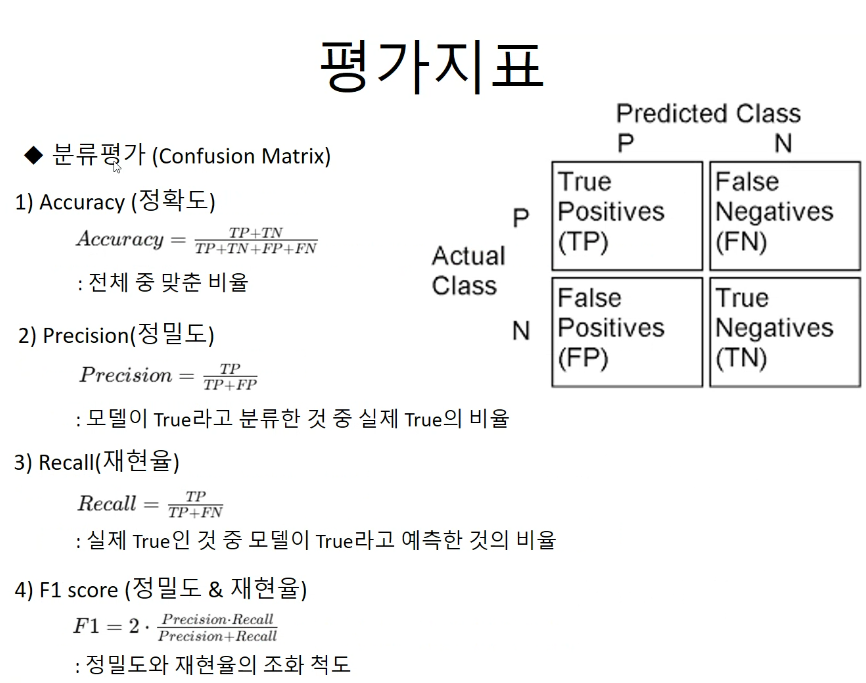
- 분류는 회귀와 평가방법이 다르다. 컨퓨전 매트릭스.
- 모델 개발후 모델 성능평가. 모델에 맞는 평가지표로 검증.
- 회귀모델은 mse 등등 오차검증으로 평가했는데, 분류모델은 컨퓨전 메트릭스라는 메트릭을 사용한다.
- 정확도/정밀도/재현율/정밀도&재현율 - 
- 
- 어큐리시(정확도): 범주예측(분류), 강아지 사진 -> 이것은 강아지입니다. 맞는지 평가. 10개중 9개 맞추면 90%정확도, 10개 다 맞추면 100% 정확도라서 높을수록 좋다.
- precision(정밀도): 모델이 true라고 분류한 것 중 실제 true의 비율(맞다고 평가한 것중 실제 잘 맞춘것)
- recall(재현율): true를 true라고 했느냐 false라고 했느냐 이런것을 계산.
- f1 score(정확도/정밀도): 정밀도화 재현율의 조화
- 정밀도/재현율/정밀도&재현율 ==> 10개중 10개를 맞춤: 0~1 -> 다맞추면 1, 다틀리면 0값.. 셋다 1에 가까울 수록 좋은 점수다.
- 모델 만들고 나서 모델 검증할때 이 평가지표들은 실습 할때마다 나올 것이므로 잘 이해하고 가면 된다.

# 학습 데이터 분할
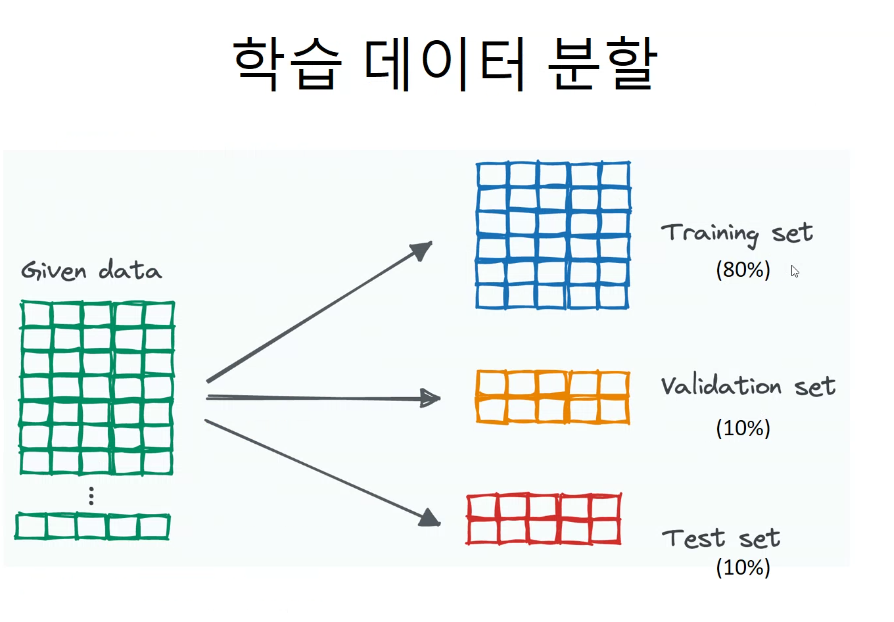
- 전체 데이터: 트레이닝 셋 80%, 검증 셋 10%, 테스트 셋 10% 로 분할 => 학습 테스트
- 머신러닝 모델은 학습 데이터에만 맞춰진다. 하지만 우리가 원하는건 새로운 데이터 잘 예측하는지 보기 위함이다. 그래서 데이터를 나누는 것이다.
- training set: 모델 학습하는 데 사용 (공부)
- validation set: 모델 튜닝하는데 사용 (모의고사)
- test set: 모델 평가할 때 사용 (수능)
- 학습 전 데이터셋 정할때, 비율 어떻게 가져갈지 설정을 해준다.

# 머신러닝vs딥러닝 실무에서 많이 쓰는 것
- 머신러닝 알고리즘엔 고전 알고리즘 많이 사용된다. 이유: 정확하게 잘나오기 때문이다. 결과가 중요하다. 아직까지도 이 고전적인 알고리즘들이 결과가 잘나와서 실무에서도 많이 쓰인다.
- 솔직히 실무에서는 통계 많이쓴다. 결과가 정확하기 때문.
- 솔직히 필드에서는 딥러닝을 상용화/양산에 적용하는 경우 극히드물다.
- 통계/머신러닝을 양산에 적용하는 경우는 꽤 있다.
- 통계/머신러닝 알고리즘 고전적인 방식 쓰는 경우도 여전히 많다.
- 머신러닝은 피쳐 뽑는걸 사람이 직접한다. 딥러닝은 그걸 자동으로 하는 차이이다. 근데, 실무에서는 피쳐들이 불규칙하고 피쳐의 배리언트도 많아서 -> 모델한데 믿고 맡기기엔 정확도 떨어진다. => 이런 부분은 사람이 직접 커스터마이징 해서 좀 잡아줘야 한다. 기준과 피쳐를 사람이 좀 잡아주고 그걸 분석하는 건 머신러닝이 조금 더 정확도 잘나오고 더 활용된다(필드에서는)
- 딥러닝이 활용되는 경우: 이미지/영상 이건 결과가 명확하기 때문에 양산에서도 활용됨. 사람이냐 차냐 객체 명확한 피쳐라서 사람이 굳이 직접 할 필요가 없는 것이다. 하지만 수치 예측 쪽에서는 정확도가 떨어져서 잘 안쓴다.
- 오늘 실습할 때 구체적 동작 메커니즘 코드로 설명할 것이다.

# 머신러닝 알고리즘
- 많이 사용하는 것 위주
## 선형 관계 학습 (Linear Regression, 리그렉션)
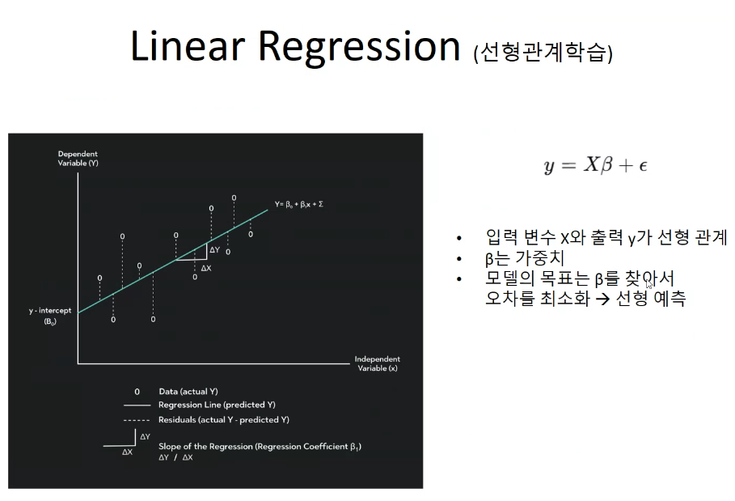
- 입력과 출력이 선형적으로 나타나는 관계이다. (리니어:선형)
- x:입력데이터, 베타: 가중치
- 가중치가 가장 실제값과 정확하게 나올 수 있는 값을 학습을 통해 최적 베타값을 찾아 -> 실제값과 동일한 예측을 할수 있는 모델이다.
- 쉽게 설명: x/y 선형단계 나타나는 데이터가 있는경우, 이 선형관계를 학습해서 -> 다음단계 어떤 값이 나올지 예측할 수 있도록 한다.
- 실제 현장에서는 이런 선형적 형태보단 비선형적 형태(물결?)가 좀더 많이있다. 그러면 선형관계학습을 쓰면 안맞고 비선형리그렉션, 폴리리그렉션? 등의 모델을 쓰는게 좀더 맞을 수 있다.
- 이것도 손실함수 찾는 것처럼 최적의 베타값을 찾아내는 것이다.

## 확률관계 분류 (Logistic Regression, 로지스틱 리그렉션) - 분류모델
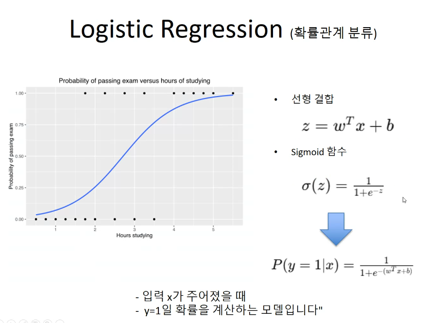
- 로지스틱 리그렉션이 왜 필요한가? 앞의 선형관계학습은 출력값이 마이너스 무한대에서 플러스 무한대까지 나올수 있다.
    - 근데 분류값/분류모델은 결과가 확률값으로 나와야 한다. 개 이미지 -> 확률값으로 나와야 한다.
- 반드시 값이 0~1 사이여야만 한다. 그래서 등장한 것이 로지스틱 리그렉션이다.
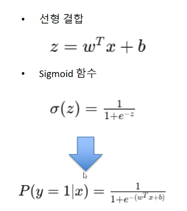
- 핵심 아이디어: 선형 모델의 결과를 확률값으로 변환하자.
- 입력 데이터를 선형 데이터로 변환하고, -> 각 피쳐의 가중치 값들을 곱하고 더하게 된다. ==> 이 부분은 선형 리그렉션과 거의 동일하게 된다.
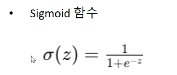
- 리그렉션에서는 이게 중요하다. 시그모이드 함수
- z값을 시그모이드 함수에 넣게되면 0또는 1 사이로 무조건 변환된다.
- 시그모이드 함수에 의해 선형값을 확률값으로 변환시기는 것이다.
- x가 주어졌을 때 y가 0과 1일 확률을 계산하는 모델이 로지스틱 리그렉션 모델이다(이진 분류 모델)
- 합/불여부, 개/고양이 등 이진 분류를 진행할 때 사용한다.

## 의사결정트리 (Decision Tree, 디시전 트리)
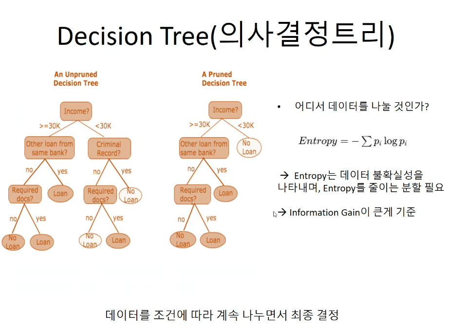
- 트리(나무)구조를 가지고 있는 모델이다. 데이터를 조건에 따라 계속 나누게 된다. -> 마지막에 최종 결과 결정하게 되는 트리모델이다. ex) 온도높냐/앞력높냐/속도 빠르다 ox 이런 식으로 질문들을 반복하며 데이터를 분류/분리하고 최종적으로 결과를 결정하는 모델이다.
- 데이터를 조건에 따라 계속 나누면서 최종 결정하는 모델이다.
- 어디서 데이터를 나눌지 기준? -> 엔트로피 수식을 기준으로 나눈다.
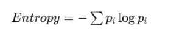
- 엔트로피: 데이터의 불확실성을 의미한다. ex) 정상50%/불량50% 인 경우 뭘 선택할지 의미가 애매하고 불확실. 이런경우 엔트로피 값이 높게나온다. 반대로 정상100%/불량0% 이면 확실하니까 엔트로피 값이 0이나온다. 엔트로피 값이 낮을수록 불확실성이 해소되고, 높을수록 불확실하기 때문에 분류하기 애매하다. 이걸로 데이터를 나눈다.
- 인포메션 게인은 분할 전과 분할 후의 엔트로피 차이를 본다. 그 분할 전과 후에 얼마나 불확실성이 줄었는지를 보는게 인포메이션이고 클 수록 분할이 잘 되었다는 지표이다.
- 디시전 트리 정리: 어떤 데이터를 어떤 기준값에 의해 분할함 -> 엔트로피로 분류 불확실성 계산해서 -> 분류 잘 됐는지를 본다. -> 인포메이션 게인으로 분류 전과 후의 불확실성을 다시한번 판단한다. (최종결정)
- 가장 기본적인 트리 모델이다. 다른 트리들은 이 트리를 기반으로 고도화된 모델 들인 것이다.

## 여러 트리 평균 (Random Forest, 랜덤 포레스트)
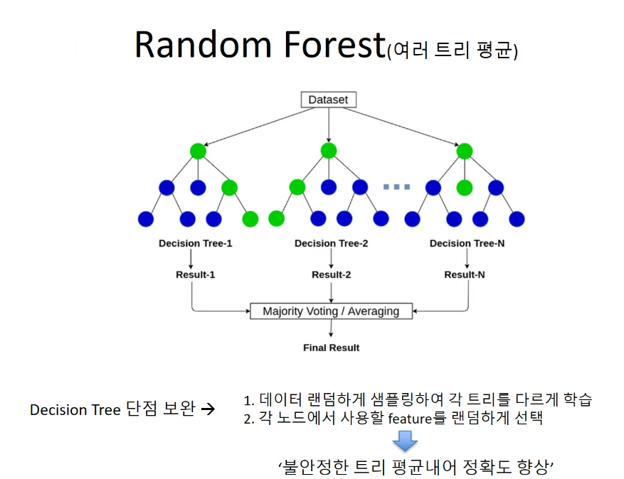
- 랜덤 포레스트: 디시전 트리와 구조가 비슷하다. 그런데 이는 디시전 트리의 단점을 보완한 모델이다.
- 랜덤 포레스트는 트리모델이 여러개의 트리가 있다. 
- 디시전 트리는 데이터에 너무 민감해서 과적합이 많이 발생한다.
- 랜덤 포레스트: 여러개의 트리 만들어서 평균을 내볼까? 해서 만들어진 게 랜덤 포레스트다. 디지선 트리는 단일트리라서 과적합 정확도 떨어짐.
- 중요한 2가지 개념:
    - 1. 부트스트랩 샘플링: 데이터를 랜덤하게 샘플링해서 학습시킨다. 랜덤한 트리를 만들어서 그 데이터로 학습시킨다.
    - 2. 피쳐 랜덤니스: 각 트리에서 사용할 노드(간선)들에서 사용할 각각의 피쳐들을 랜덤하게 선택해서 학습을 시킨다. 피쳐들을 랜덤 배치해 선택한다. ==> 트리들이 각각 다르게 학습하여 다 다른 결과값이 나올 것이다.
    - ==> 베리어스를 줄이는 효과가 있다. 
- 불안정한 트리를 평균내어서 정확도를 향상시키는 모델이다. 그래서 디시전 트리보다 정확도가 훨씬 더 높다고 한다.
- 앙상블식 구성인 것이다. 트리도 샘플링 랜덤, 노드도 샘플링 랜덤 -> 각각 학습 -> 평균 -> 결과 도출 하는 메커니즘으로 동작한다.

## 오차 보완 (Gradient Boosting, 그래디언트 부스팅)
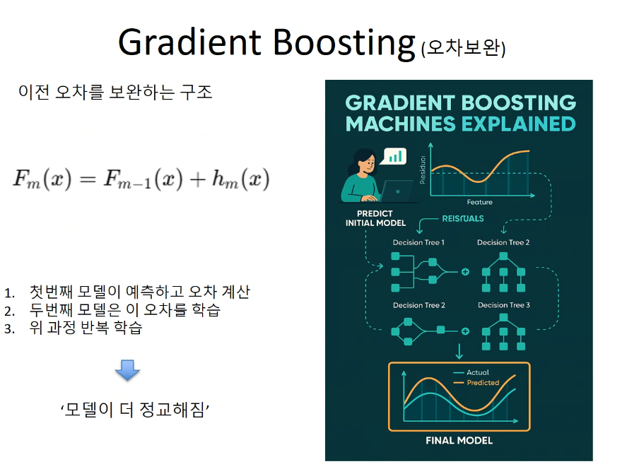
- 이건 동작 메커니즘 철학이 좀 다르다. 랜덤포레스트는 여러트리모델 병렬로 학습하고 처리하는 반면, 그래디언트 부스팅은 실행 순서를 순차적으로 실행하는 모델이다.
- 왜 이렇게 하느냐? -> 이것 때문이다: 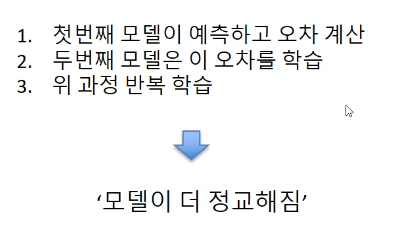
- 첫 모델이 정확하면 다행이지만 정확하지 못한 경우 -> 다음 모델이 보완하는 것이다. 모델이 잘못한 부분을 다음에서 보완,보완,보완하면서 정교해지는 것이 그래디언트 부스팅인 것이다.
- 앞 모델이 잘못한 것을 뒷 모델이 보완한다.

## XGBoost 모델 (정규화 + 고속화)
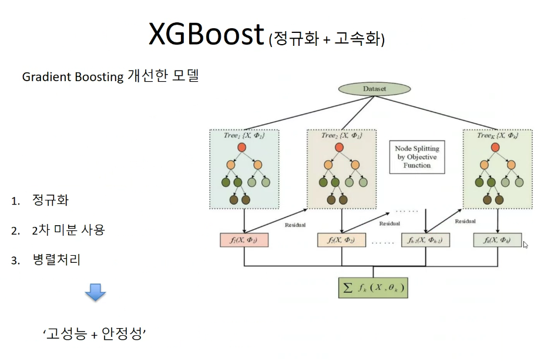
- 많이 쓰이고 정확하니까 여전히 많이 쓰이는 모델들이다.
- 다시 또 그래디언트 부스팅을 개선한 모델이다. (계속 고도화 되어서 새로 나옴/비슷함)
- 차이점 3가지
    - 1. 정규화: 목표함수에 대해 패널티 점수를 추가해서, 모델 복잡도를 제어한다.
    - 2. 2차 미분 사용: 그래디언트 뿐만 아니라 2차미분 까지 사용해서 더 빠르고 정확하게 수행
    - 3. 병렬처리: 그래디언트 부스팅은 정확도는 괜찮아도 순차처리라 느려서 성능은 떨어지는데, XGBoost는 정확하기도 한데 병렬처리까지 하니까 성능도 개선되었다.
- 그래서 많이 활용된다. 정확도 높고 성능도 좋고 안정성 동시에 잡은 모델이다.

## LightGBM (고속화)
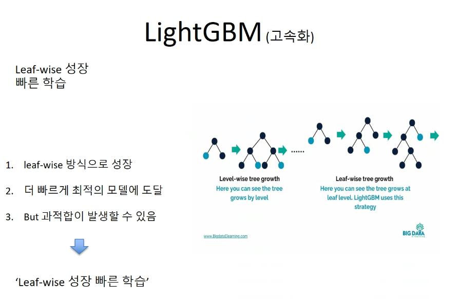
- <10분 휴식>