# 9일차 - 6/8(원) #
- 회의 참석: https://whaleon.us/o/CSvuJa/64dffed07c6741c990f69804e3b62d6e

# 머신러닝 실습 - 이어서
## 5. x 변수의 특성 기호도 측정 (SHAP) - 캘리포니아 집값 / lightGBM - 이어서
- 새로운 파일 생성: [7-05) SHAP]
- 아나콘다 프롬프트에서 가상환경 접속(`activate ai`)후 shap 설치: `pip install shap`

### [1] 라이브러리 임포트
```py
# import 
import numpy as np
import pandas as pd
import matplotlib.pyplot as plt

from sklearn.datasets import fetch_california_housing
from sklearn.model_selection import train_test_split
from lightgbm import LGBMRegressor

import shap
```

### [2] 데이터 불러오기
```py
# 데이터 불러오기
housing = fetch_california_housing()

# 입력 변수(feature)
X = pd.DataFrame(housing.data, columns=housing.feature_names)

# 타겟 변수(집값)
y = pd.Series(housing.target, name='target')
```


### [3] 데이터 분할
```py
# 데이터 분할
X_train, X_test, y_train, y_test = train_test_split(
    X, y,
    test_size=0.2,
    random_state=42,
)
```

### [4] 모델 생성 및 학습
```py
# 모델 생성 및 학습
model = LGBMRegressor(
    n_estimators = 300,
    learning_rate=0.05,
    num_leaves=31,
    random_state=42
)
model.fit(X_train, y_train)
```


### [5] SHAP Explainer 생성
```py
# SHAP Explainer 생성
explainer = shap.TreeExplainer(model)

# shap value 계산 (학습 데이터가 아니라, 테스트 데이터 기준으로 계산)
shap_values = explainer.shap_values(X_test) # 각 feature가 얼마나 예측 했는지의 기여도를 스코어로 계산
```

# [월] 여기서 부터 다시 진행
### [6] 영향도 시각화 - 이어서
```py
# 매직 코드: 그래프가 한번에 쫙 보여지는 것이다.
%matplotlib inline

# 영향도 시각화
shap.summary_plot(shap_values, X_test) # 점 위치: 영향 방향(+/-), 색: feature 값 크기
# shap bar plot(방향성)
shap.summary_plot(shap_values, X_test, plot_type='bar')
# shap dependence plot
shap.dependence_plot("MedInc", shap_values, X_test)

# shap waterfall plot
sample_index = 0
# 개별 샘플 shap 값
shap.initjs() # 시각화 초기화
# 
shap.waterfall_plot()
```

- 그래프 뽑고 해석하는 건 다음 주 월요일 예정. (오후에 진행 예정)


# 머신러닝 응용 실습 (난이도 조금 높임)
- 내일은 딥러닝 실습 진행 예정
- 최대한 실제처럼 데이터 생성해서 진행 예정

## 1. 설비 이상 감지 + 원인 분류 실습
- jupyter notbook 파일 생성: [8-01) 머신러닝 응용실습_1]
- 설치(치명인자 그래프 연결도 표현 라이브러리): `pip install networkx`
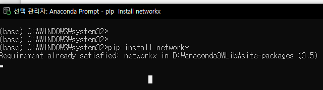

### [0] 실습 진행 예정 사항
- 실습은 아래와 같은 순서로 진행 예정: 
    ```py
    # 1) 정상/이상 설비 데이터 생성
    # 2) 주요 영향인자 선정
    # 3) 설비 특성 기반 파생변수(치명인자) 생성
    # 4) 최적 Indicator 선정
    # 5) 치명인자 관계 영향도 그래프 확인
    # 6) 머신러닝 기반의 Warning / Critical Threshold 기준 정의
    # 7) 이상 원인 진단 분류
    # 8) 신규 데이터 이상감지 및 원인분류 테스트
    # 9) 도메인 기반 결과 해석
    ```
- 순서: 카프카 실시간 처리, 통신, NoSQL 저장 등 실시간 수집 -> EDA 탐색 -> 고장의 레이블 3가지 정의 -> 실제 고장에 영향 미치는 주요 인자 선정 -> ... -> 파생변수 치명인자 만들기 -> 최적의 Indicator 선정 -> 치명인지 치명 인자가 아닌지 히트맵이나 그래프 등을 통하여 관계 확인 -> ... -> 머신러닝 기반 실시간 이상감지(비지도 학습 모델/딥러닝:오토인코더,머신러닝:아이솔레이션주로사용) 알고리즘 개발 -> 이상에 대한 원인을 분류 -> 실시간 신규 데이터 기반으로 새로운 데이터 이상/정상 여부 및 이상 원인 파악 -> 그로 인해 도메인적으로 어떤 해석 결과를 도출할 것인지 분석 진행
- 로우 데이터에서 변수들 너무 많다. 타겟, y의 특징이 명확하지 않는 경우도 많다. 도메인 기반의 파생변수 생성을 직접 해야한다.
- 다른 도메인에서도 이상 탐지, 원인 찾을 때 위와 같은 방식이 흔하게 사용된다.
- 정상 데이터 5000개 생성
- 고장 유형 별 이상 데이터 1000개씩 생성
- --> 총 8,000 개 로우 데이터 생성

### [1] 라이브러리 임포트 (numpy/pandas/matplotlib/seaborn/networkx/sklearn/warnings)
```py
# 기본 라이브러리 
import numpy as np # 수치 계산
import pandas as pd # 표 형태 데이터 처리
import matplotlib.pyplot as plt # 그래프 시각화 처리
import seaborn as sns # 그래프 시각화
import networkx as nx # 변수 간 관계 그래프 그리기

# 머신러닝 라이브러리 
from sklearn.model_selection import train_test_split # 학습/검증 데이터 분리 함수
from sklearn.preprocessing import StandardScaler # 변수 스케일 표준화를 위한 클래스
from sklearn.ensemble import RandomForestClassifier # 랜덤포레스트(원인분류 모델로 사용 예정)
from sklearn.ensemble import IsolationForest # 비지도 이상감지 모델
from sklearn.metrics import classification_report # 분류 성능 리포트 출력
from sklearn.metrics import confusion_matrix # 혼동행렬 계산 함수
from sklearn.metrics import roc_curve # ROC 기반 threshold 탐색
from sklearn.metrics import roc_auc_score # 이상 감지 성능 AUC 계산 함수
from sklearn.inspection import permutation_importance # 변수 중요도 검증 함수
from sklearn.feature_selection import mutual_info_classif # 변수와 이상 여부 간 비선형 관련성 계산

# 경고 라이브러리 (불필요한 경고 제거)
import warnings 
warnings.filterwarnings("ignore")

np.random.seed(42)
```
### [2-0] 도메인 지식 
1. bearing_wear
    - 부품과 부품 간의 연결 해주는 부품이다. 돌다 보면 마모가 자주발생한다.
    - 원인: 부적절한 윤활, 먼지, 금속입자 등 오염물질 유입, 과도한하중, 부식 등
    - 증상: 기계 작동 시 평소와 다른 소음 발생, 과도한 진동, 부품의발열 및 효율 저하
    - 증상들은 다 비슷하다.
    - 윤활이 부족하면 뻑뻑하게 돌아가 마찰이 생기고 진동 등 성능 저하가 생긴다.
2. lubrication_fault 
    - 원인: 누유, 씰 또는 오링의 노상 마모 및 파손으로 인해 오일이외부로 새어 나가는 경우 또는 이물질 혼입
    - 증상: 마찰에 의한 이상 소음 및 진동, 발열, 마모 및 분진 발생
3. hydraulic_leak
    - 원인: 마모 및 노후화 - 고압의 기름을 전달하는 호스가 찢어지거나연결 부위의 고무 씰이 닳았을 때 발생
    - 증상: 진동 및 과열, 실린더/프레스 등 성능 저하, 모터 과부하,설비 소음 및 진동 발생, 발열 발생
    - 부품들 제대로 동작 못함 -> 성능 저하.
- 위 3가지 현상은 비슷한 인자다... 탐지 못하고 잘못된 상태로 운영하면 설비는 뻥 터진다.
- 생산 라인이 멈추는 순간 천문학적 피해가 나타난다. 설비 터지면 큰일..
- 사전에 이상 감지하고 원인 즉각 찾아내고 조치하는게 중요하다.
- 도메인의 환경, 프로세스, 메커니즘을 잘 파악해야 분석도 가능한 것이다.

### [2-0-2] 도메인 관점
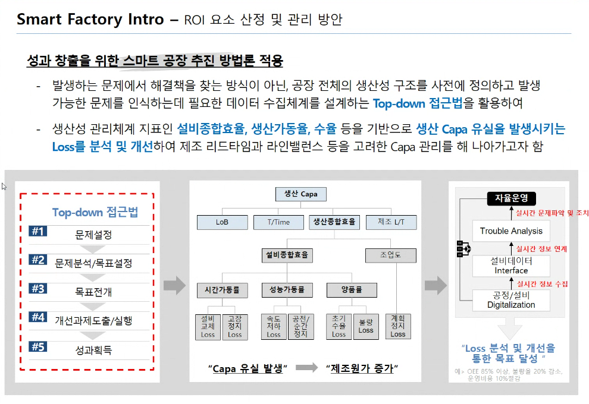
- 문제 정의 - 목표를 잡기
- MES 를 통해 어떤 로스가 제일 많이 발생했는지 개선한 Loss 선정
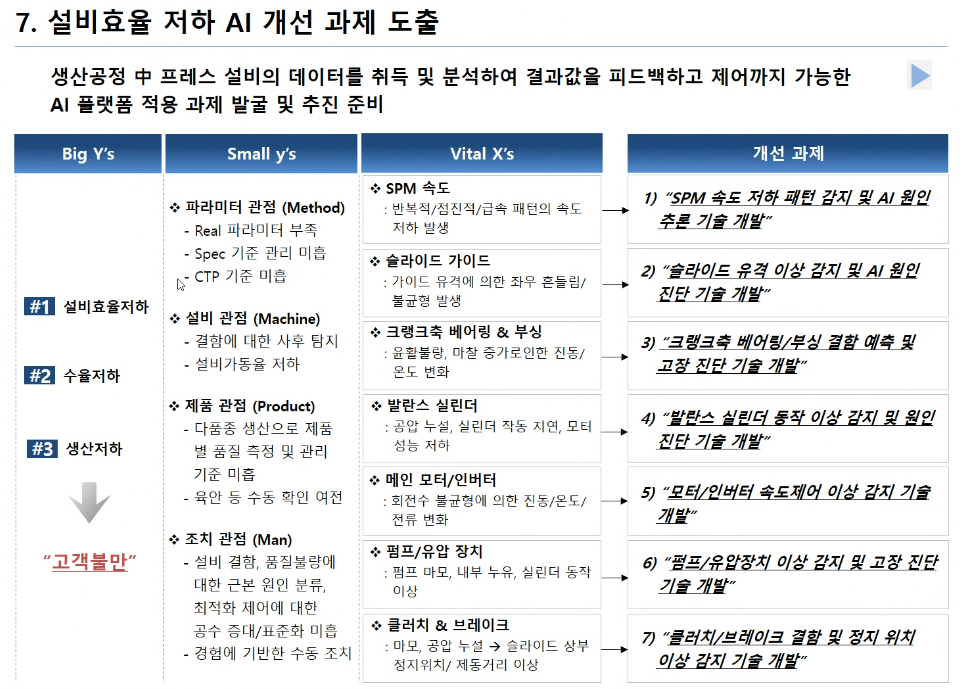
- 어떤 것을 목표로 잡을 것이냐(Big Y) -> 세부 문제(Small y) -> 어떤 현상 나타나는지 -> 현상 개선할 수 있는 가제들 선정
- 위 3가지 도메인 지식은 vital x를 정한 것임. 이제 그걸 분석할 것을 만들 예정

### [2-1] 설비 데이터 생성 함수 구현
- 실제로는 이런 센서들이 600몇개가 있다.
- 여기 나오는 파라미터는 웬만하면 어떤 현장에서도 크리티컬 파라미터들이다.
```py
# ===================================================
# 2. 설비 데이터 생성 함수
# ===================================================

# 정상 데이터 5000개 생성
# 고장 유형 별 이상 데이터 1000개씩 생성
def generate_machine_data(n_normal=5000, n_abnormal_each=1000):
    # 생성된 데이터를 저장할 빈 리스트
    rows = [] 
    
    # 기본(정상), 마모(bearing_wear), 윤활부족(lubrication_fault), 유압누설(hydraulic_leak)
    fault_type = ["normal","bearing_wear","lubrication_fault","hydraulic_leak"] 

    # 정상과 고장 유형의 이름 데이터 범위 정의 - (EDA 분석을 진행 했다는 가정 하에)
    for fault in fault_type:
        if fault == "normal":
            n = n_normal # 정상 데이터 개수
        else:
            n = n_abnormal_each # 이상 데이터 개수

        for i in range(n): # 각 센서를 하나씩 생성
            # 설비 모터의 회전 수(rpm) 생성: 정상 기준 평균 1,500rpm, 표준편차 40 정상 데이터 생성
            rpm = np.random.normal(1500,40)
            # 설비 부하율(load) 생성: 정상 기준 평균 65, 표준편차 8
            load = np.random.normal(65,8)
            # 유압 압력(pressure) 생성: 정상 기준 평균 120bar, 표준편차 5 (압력의 단위:bar)
            pressure = np.random.normal(120,5)
            # 베어링 또는 구동부 온도 생성: 정상 기준 평균 55도, 표준편차 3
            temp = np.random.normal(55,4)
            # 진동(vibration) RMS 생성: 정상 기준 평균 1.2, 표준편차 0.2
            vibration = np.random.normal(1.2,0.2)
            # 모터 전류(current): 정산 기준 평균 22A(암페어), 표준편차 2
            current = np.random.normal(22,2)
            # 윤활유 점도(oil_viscosity) 생성: 정상 기준 평균 42cSt, 표준편차 3
            oil_viscosity = np.random.normal(42, 3)
            # 유량(flow_rate) 생성: 정상 기준 평균 80L/min, 표준편차 5 
            flow_rate = np.random.normal(80,5)
            # 의미 없는 랜덤 변수-1 생성
            noise_1 = np.random.normal(0,1)
            # 의미 없는 랜덤 변수-2 생성
            noise_2 = np.random.normal(10,5)
            # 의미 없는 랜덤 변수-3 생성
            noise_3 = np.random.normal(0,100)

            #  도메인 고장 메커니즘 정의 - [고장 -> 현상 -> 원인 -> 개선방법]
            if fault == "bearing_wear": # 베어링 마모 고장
                vibration += np.random.normal(1.2,0.25) # 베어링 마모 -> 진동 증가
                temp += np.random.normal(8,2) # 베어링 마모 -> 마찰열 -> 온도 증가
                current += np.random.normal(3,1) # 마찰 증가 -> 모터 전류 증가
            elif fault == "lubrication_fault": # 윤활 불량 고장
                oil_viscosity -= np.random.normal(12,2) # 윤활 불량 - 윤활유 점도 감소
                temp += np.random.normal(10,2) # 윤활 불량 -> 온도 증가
                vibration += np.random.normal(0.7,0.2) # 윤활 불량 -> 진동 증가
                current += np.random.normal(2,0.8) # 마찰 증가 -> 모터 전류 증가
            elif fault == "hydraulic_leak": # 유압 누설 고장
                pressure -= np.random.normal(25,4) # 누설 -> 압력 감소
                flow_rate -= np.random.normal(18,4) # 누설 or 효율 저하 -> 유량 감소
                current += np.random.normal(1.5,0.6) # 보상 운전 -> 전류증가
                load -= np.random.normal(5,2) # 유압 효율 저하 -> 부하 전달력 감소

            # 정상/이상 데이터 구분
            if fault == "normal":
                is_abnormal = 0 # 정상: 0
            else:
                is_abnormal = 1 # 이상: 1

            # 하나의 샘플을 리스트에 추가
            rows.append([rpm, load, pressure, temp, vibration, current, oil_viscosity, flow_rate, noise_1, noise_2, noise_3, is_abnormal, fault])
    
    # 데이터 프레임의 컬럼명 정의
    columns = ["rpm", "load", "pressure", "temp", "vibration", "current", "oil_viscosity", "flow_rate", "noise_1", "noise_2", "noise_3", "is_abnormal", "fault_type"]
    # 리스트 데이터를 DataFrame 으로 변환
    df = pd.DataFrame(rows, columns=columns)

    return df
```

### [3] 데이터 생성
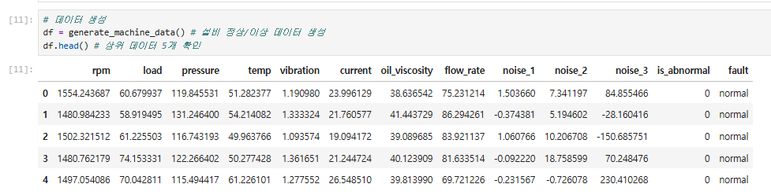
```py
df = generate_machine_data() # 설비 정상/이상 데이터 생성
df.head() # 상위 데이터 5개 확인
```

### [3-2] 생성된 고장 유형별 데이터 개수 확인
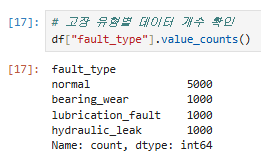
```py
df["fault_type"].value_counts()
```

### [4] [중요] 주요 영향인자 선정 (치명인자가 아닌 잠재인자 확인 -> 추후 파생변수 생성)
```py
# ===================================================
# 4. 주요 영향인자 선정
# ===================================================

# row 데이터 변수 목록 정의
sensor_cols = ["rpm", "load", "pressure", "temp", "vibration", "current", "oil_viscosity", "flow_rate", "noise_1", "noise_2", "noise_3"]

# x와 y 정의
X_sensor = df[sensor_cols] # 센서 변수만 입력 데이터로 선택
y_abnormal = df["is_abnormal"] # 정상/이상 라벨 선택 (y값)

# 영향 인자 판단 방법
# 1) 상관 계수
# 2) mutual information
# 3) 랜덤 포레스트 
# 위와 같은 3가지 중요도로 판단

# 1) x/y 간의 상관관계 판단
# - 각 센서 변수와 이상 여부 간 상관계수 절대값 계산 
# --> 고장과의 선형관계(영향도) 확인 가능. ex) 온도 상승 -> 고장
corr_result = df[sensor_cols+["is_abnormal"]].corr()["is_abnormal"].abs().sort_values(ascending=False)

# 2) x/y 간의 비선형 관계 판단
# - 각 센서 변수와 이상 여부 간 비선형 정보량 계산.
# - 비선형으로 확인하는 이유: 고장은 상승, 급감소의 상태도 있기 때문에 비선형으로 확인해야 한다. 
# - --> ex) 온도 상승 -> 고장 / 온도 급감소 -> 고장
mi_scores = mutual_info_classif(X_sensor, y_abnormal, random_state=42)
# 결과를 Series 형태로 변환 (보기 좋게)
mi_result = pd.Series(mi_scores, index=sensor_cols).sort_values(ascending=False)

# 3) rf 모델 예측 기여도 판단
# 변수 중요도 계산을 위한 RF 모델 생성
rf_for_importance = RandomForestClassifier(n_estimators=300, random_state=42)
# 랜덤 포레스트 기반 row 센서 정상/이상 분류 모델 학습
rf_for_importance.fit(X_sensor, y_abnormal)
# 점수 계산 -> 랜덤 포레스트 모델 기반 변수 중요도 계산 (잘 예측했다면 변수들은 중요도가 높다고 판단)
rf_importance = pd.Series(rf_for_importance.feature_importances_, index=sensor_cols).sort_values(ascending=False)

# 결과를 보기 위해 하나의 표로 만듦
# 상관계수, mutual information, 랜덤포레스트 중요도 결과를 dataframe 으로 통합
importance_df = pd.DataFrame({
    "corr_abs": corr_result.drop("is_abnormal"),
    "mutual_info": mi_result,
    "rf_importance": rf_importance,
})
# 세가지 기준의 순위를 합산하여 종합 점수 계산 (토탈 점수를 매긴 컬럼 추가)
importance_df["total_score"] = (
    importance_df["corr_abs"].rank(ascending=True) +
    importance_df["mutual_info"].rank(ascending=True) +
    importance_df["rf_importance"].rank(ascending=True)
)
# 종합 점수가 높은 순서대로 정렬
importance_df = importance_df.sort_values("total_score", ascending=False) 
importance_df
```
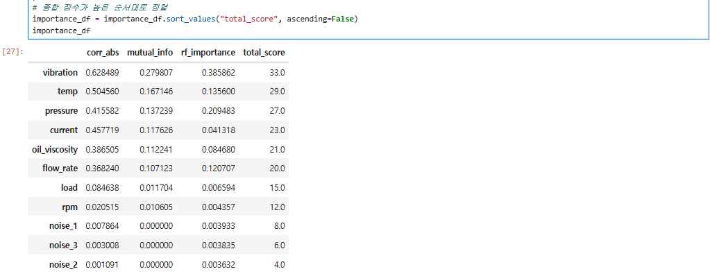
- 히트맵으로 표현하기 전에 3가지 기준 -> 각 중요도를 뽑음 -> 토탈 스코어로 중요인자 선정
- 나머지는 잠재인자다 라고 뽑혔다. 이제 히트맵으로 표현해볼 것이다.

### [5] 주요 영향인자 히트맵 시각화
```py
plt.figure(figsize=(10,6))

# 영향 인자 점수를 히트맵으로 표현
sns.heatmap(
    importance_df[["corr_abs", "mutual_info", "rf_importance"]],
    annot= True,
    cmap="YlOrRd"
)

plt.title("Major Factor Selection Heatmap")
plt.show()
```
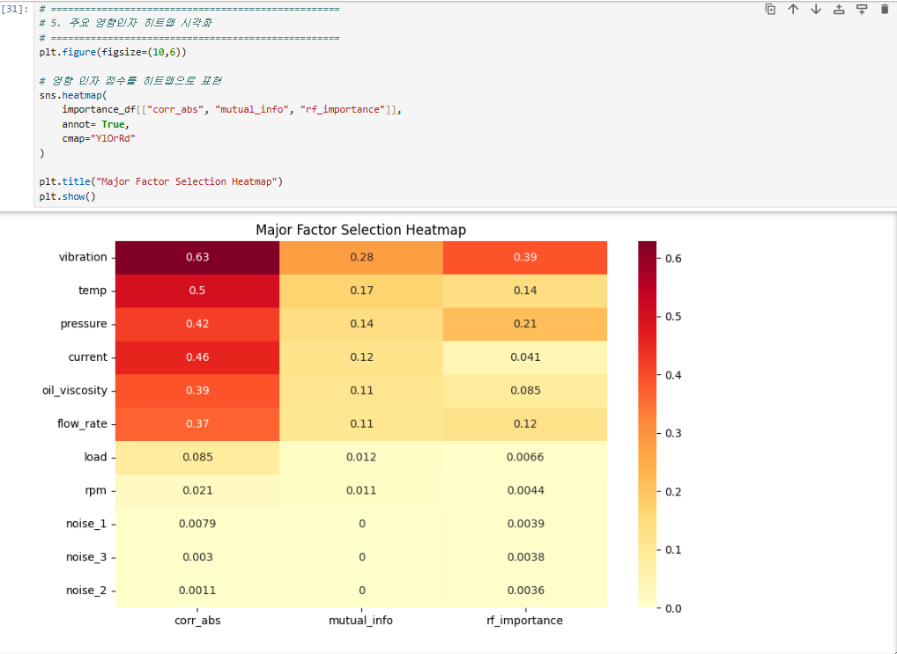
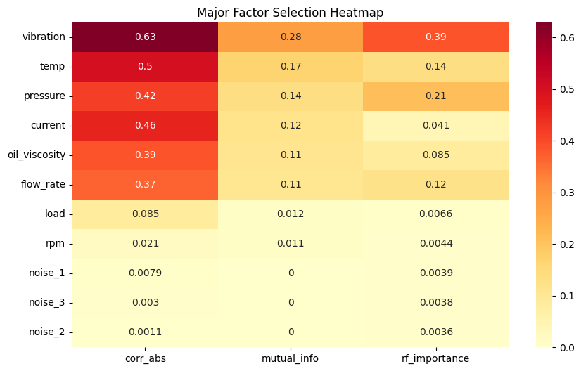
- vibration 이 가장 주요하게 나오고 noise_1~3은 거의 주요하지 않게 나옴.
- 하나의 기준만으로 잠재 인자를 선정하기 보단 이처럼 여러가지 기준을 조합해서 잠재인자 선정하는 것이 조금 더 정확한 것 같다고 한다.
- 문제 -> 영향을 주는 x 값 무엇인지 찾는게 제일 먼저이다. (치명인자/잠재인자 찾는 것)

### 지금부터가 중요 (본격적 분석)
- 실무(현장)에서는 예외 케이스가 너무 많아서 전부 고려해서 짜려고 하다 보면 코드가 엄청 길어질 수밖에 없다.
- 도메인을 알아야 함. 현업 담당자와 지지고 볶고 해야함..
- 공장에 가서 불량 기다림. -> 불량 났다 -> 뛰어가서 그 시간대 데이터들 비교 분석하고 시나리오 정의하고... 이런 식으로 진행한다.

### [6] [중요] 설비 특성 기반의 파생변수(치명인자) 생성 (row 기준) --> 헬스 인덱스 뽑기
- 로우데이터 데이터 프레임 기반으로 -> 
```py
# 파생변수 생성 함수 구현
def add_critical_features(df):
    # 원본 날라가면 안되니까 원본 보호하기 위해 복사본 생성
    df = df.copy() 

    # 1. 열-전류(상관관계 밀접했던 관계) 스트레스 지수 생성
    # --> 온도와 전류가 높고, 회전수가 낮으면 부하성 열화 가능성이 높다고 판단
    df["thermal_stress_index"] = df.temp*df.current/(df.rpm+1)

    # 2. 진동/부하 결합 지수 생성
    # --> 부하가 커지면 진동도 커짐 -> 베이링/구동계 이상 가능성이 커진다고 판단
    # - 부하가 커도 진동이 낮을수도 있다 온도가 높은데 전류가 낮은 경우도 있다.
    # - 그래서 결합 지수를 만드는 것이다. 하지만 고장 시나리오에 맞춰 지수를 만듦
    df["vibration_load_index"] = df.vibration*df.load # 진동과 부하를 곱한 값

    # 3. 유압 효율 지수 생성
    # --> 같은 전류가 나오는데, 압력과 유량이 낮으면 효율 저하 가능성이 있다고 판단.
    df["hydraulic_efficiency_index"] = df.pressure*df.flow_rate/(df.current+1)

    # 4. 윤활 열화 지수 생성
    # --> 온도가 높고, 점도가 낮으면 윤활 불량 가능성이 높다고 판단.
    df["lubrication_degradation_index"] = df.temp/(df.oil_viscosity+1)

    # 5. 압력-유량 균형 지수 생성
    # - 모든 설비는 압력에 의해.. 압력은 유량이 잘 공급돼야 됨 + 압력 없으면 설비 안돌아감
    # --> 유압 시스템에서 압력과 유량의 비정상 관계를 확인하기 위한 지표
    df["pressure_flow_balance"] = df.pressure/(df.flow_rate+1)

    # 6. 기계 마찰 지수 생성
    # --> 전류와 진동이 동시에 높으면 마찰 또는 정렬 불량 가능성이 있다고 판단.
    df["mechanical_friction_index"] = df.current*df.vibration/(df.load+1)

    # 7. 에너지 손실 지수 생성
    # --> 전류는 높은데 압력이 낮으면 에너지 손실 또는 누설 가능성이 있다고 판단.
    df["energy_loss_index"] = df.current/(df.pressure+1)

    return df

# 파생변수 추가한 DataFrame 저장
df_feat = add_critical_features(df)
critical_cols = ["thermal_stress_index","vibration_load_index","hydraulic_efficiency_index","lubrication_degradation_index", "pressure_flow_balance", "mechanical_friction_index", "energy_loss_index"]

df_feat.head()
df_feat.columns
```
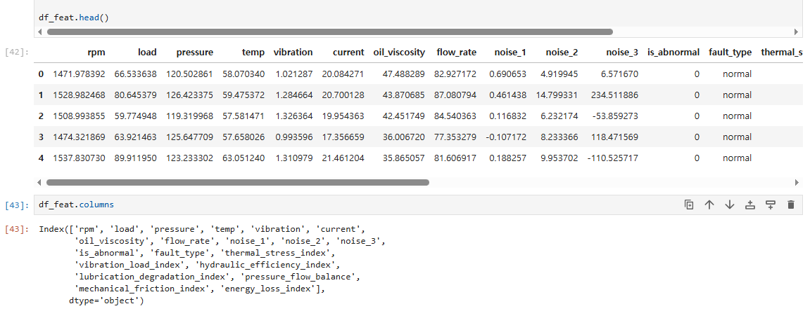
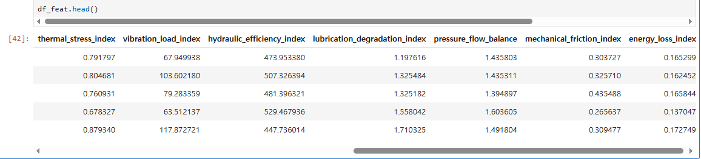
- 파생변수들까지 생성 완료
- 이런 로직은 도메인 관점에서 만들면 된다.
- 설비 동역학 관점에서의 로직 -> 조금 더 동역학 관점에서 보면 좋다.
- 파생변수를 기준으로 이상감지/원인분류 를 풀어나갈 것이다.
- 파생변수 중에서도 x와 y를 가장 잘 대변하는 파생변수를 뽑을 것이다.

#### AI 설명
1. thermal_stress_index = 온도 × 전류 / (회전수+1)
- 온도 그리고 전류가 둘 다 높을 때 큰 값이 나오게 곱했습니다(둘 다 높아야 위험). 그걸 회전수에 비해서 봅니다. 회전수가 낮은데도 열과 전류가 높으면 더 위험하므로 회전수로 나눕니다. 빠르게 도니까 뜨거운 건 그럴 수 있지만, 천천히 도는데 뜨겁고 전류까지 세면 부하성 열화를 의심하는 구조입니다.
2. vibration_load_index = 진동 × 부하
- 진동 그리고 부하가 둘 다 높을 때를 잡으려고 곱했습니다. 부하가 커질수록 진동도 커지는 게 자연스러운데, 둘이 함께 크게 튀면 베어링·구동계 이상을 의심합니다. 여기엔 나누기가 없으니 "대비" 개념 없이 순수하게 "둘 다 높음"만 봅니다.
3. hydraulic_efficiency_index = 압력 × 유량 / (전류+1)
- 압력 그리고 유량(나온 결과)을 곱해 묶고, 전류(들인 에너지)에 비해서 봅니다. 같은 전류를 쓰는데 압력·유량이 적으면 효율이 나쁜 것이므로 값이 작아집니다. 연비(기름 대비 거리)와 같은 개념으로, 유압 누설이나 효율 저하를 잡아냅니다.
4. lubrication_degradation_index = 온도 / (점도+1)
- 여기는 곱이 없고 나누기만 있습니다. 점도에 비해서 온도가 얼마나 높은가를 봅니다. 윤활 불량이면 점도는 떨어지고 온도는 올라가는데, 온도를 점도로 나누면 온도↑·점도↓일 때 값이 같이 커져서 윤활 불량 신호가 한 방향으로 모입니다.
5. pressure_flow_balance = 압력 / (유량+1)
- 이것도 나누기만 있습니다. 유량에 비해서 압력이 어떤지를 봅니다. 정상이라면 압력과 유량이 일정한 균형을 이루는데, 이 비율이 평소와 달라지면 유압 시스템의 비정상 관계를 의심합니다.
6. mechanical_friction_index = 전류 × 진동 / (부하+1)
- 전류 그리고 진동이 둘 다 높을 때를 곱으로 잡고, 부하에 비해서 봅니다. 부하가 크면 전류·진동이 높은 게 당연하므로 부하로 나눠서 "부하 탓이 아닌데도 높은가"를 걸러냅니다. 부하가 크지 않은데 전류와 진동이 같이 튀면 마찰이나 정렬 불량을 의심합니다.

### [7] 최적 Indicator 선정
- 파생변수로 랜덤포레스트 모델을 돌려서 x와 y의 영향도를 피쳐임포턴스로 뽑아서 우선도를 정할 것이다.
```py
# x: 파생 변수 인자만 입력 변수로 선택
# [참고] df_feat에 데이터를 만들어 뒀었다.
X_critical = df_feat[critical_cols] 

# indicator 모델 생성 (랜덤포레스트)
rf_indicator = RandomForestClassifier(n_estimators=300, random_state=42)
# 파생 변수로 정상/이상 분류 모델 학습
rf_indicator.fit(X_critical, y_abnormal)

# 파생 변수에 대한 중요도 계산
# 피쳐임포턴스를 통해 변수의 중요도를 뽑는다.
indicator_importance = pd.Series(
    rf_indicator.feature_importances_,
    index=critical_cols
).sort_values(ascending=False)
# 치명인자 중요도 출력
print(indicator_importance)

plt.figure(figsize=(10,5))
indicator_importance.plot(kind='bar') # 막대바
plt.title("Critical Indicator Inportance")
plt.ylabel("Inportance")
plt.show()
```
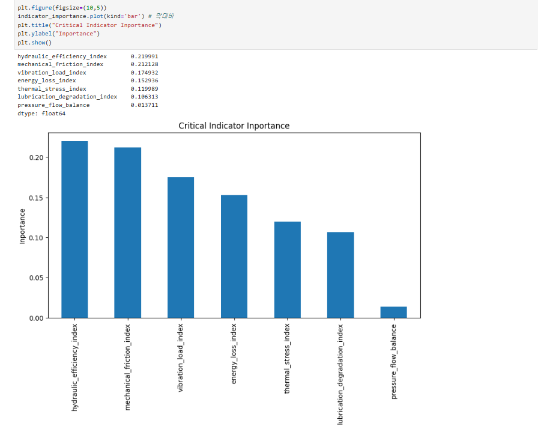
- 6번에서 만든 파생변수들 중 어떤 것이 고장을 가장 잘 잡아내는지 랜덤포레스트로 학습시켜 중요도 순으로 뽑고 막대그래프로 보여주었다.
- pressure_flow_balance는 이 상태값이 있는 케이스가 흔하진 않았을 거라서 그래프가 낮게 나왔는데, 실제로 발생하면 100% 불량이라서 안 보면 안 되는 데이터이다.
- 지금은 1차원으로 표현했지만, 이제 히트맵과 그래프로 보면 또 관계에 대한 해석 결과가 다르게 나올 수 있다.

### [8] 치명인자 간 관계 영향도 그래프 출력 - corr
```py
# 1) 히트맵 
# 치명인자들 간의 상관계수를 계산
critical_corr = df_feat[critical_cols].corr()

# 
plt.figure(figsize=(10,7))

sns.heatmap(
    critical_corr,
    annot= True,
    cmap="coolwarm",
    vmin=-1,
    vmax=1
)

plt.title("Relationship Heatmap Between Critical Indicators")
plt.show()
```
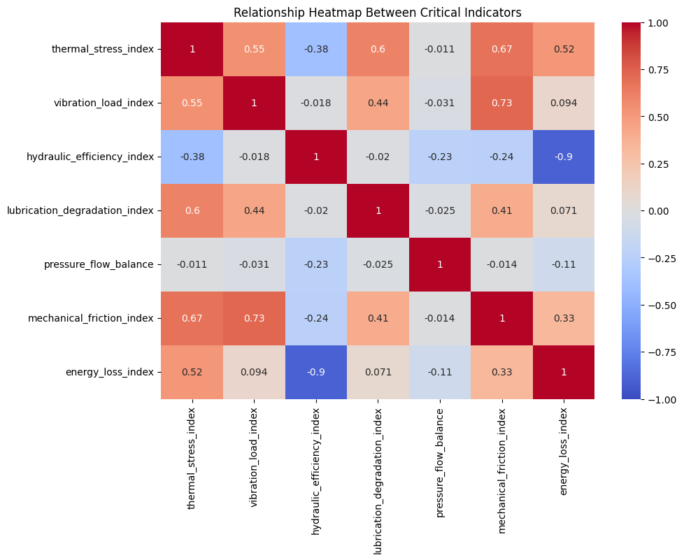
- 에너지 로스: 1, 6번째 영향을 탐
- 변수들 간의 상관관계를 히트맵으로 표현한 것이다.
- thermal stress index가 나왔어 -> 그러면 진동, lubrication index도 같이 봐야할 수 있다고 분석할 수 있다.. (같이 나타날 수 있는 문제들)
- 이때문에 다변량으로 분석해야 하는 것이다. 모든 문제는 복합적 영향에 의해 문제가 뻥 터진다.

### [8-2] 치명인자 간 관계 영향도 그래프 출력 - networkx
- 치명인자간 얼마나 강하게 연결되어 있는가를 보여주는 네트워크 그래프
```py
# 변수 간 관계 그래프 객체 생성
G = nx.Graph()

# 치명인자 이름을 그래프 노드로 추가
for col in critical_cols:
    G.add_node(col)

# 두 치명인자 간 상관계수 값 추출 및 의미있는 관계 판단
for i in range(len(critical_cols)):
    for ii in range(i+1, len(critical_cols)):
        # 두 치명인자 간 상관계수 값 추출
        corr_value = critical_corr.iloc[i, ii]

        # 상관계수 절대값이 0.45 이상이면 의미있는 관계로 판단
        if abs(corr_value) >= 0.45:
            G.add_edge(
                critical_cols[i],
                critical_cols[ii],
                weight=abs(corr_value)
            )

# 그래프 출력
plt.figure(figsize=(11,7))
pos = nx.spring_layout(G, seed=42)
nx.draw_networkx_nodes(G, pos, node_size=2500) # 변수를 노드로 그리기
nx.draw_networkx_labels(G, pos, font_size=9) # 노드 이름 표시
nx.draw_networkx_edges(G, pos, width=2) # 노드 간 관계선 표시
plt.title("Impact Relationship Graph Between Critical Indicators")
plt.axis("off")
plt.show()
```
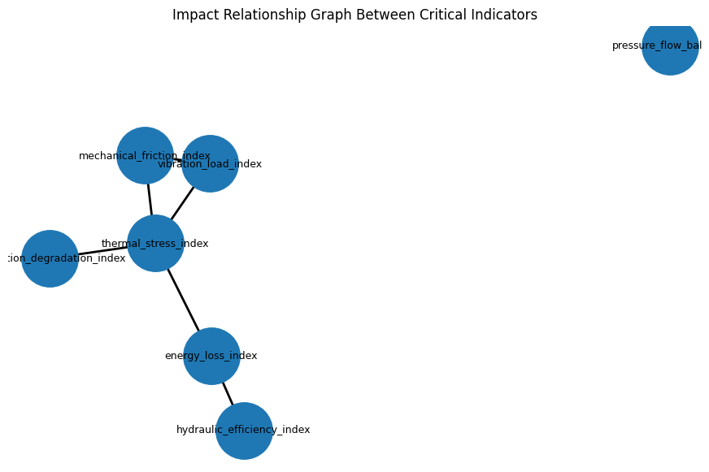
- themal_stress_index 중심으로 연결되어있다. 여러 치명 인자들과 관계가 있다.
- vibration_load_index 도 어느정도 강한 연결 관계가 있다.
- 선들이 같이 이어진 관계들은 서로 강한 관계가 있다는 의미이다.
- 변수들에 대한 분석은 어느정도 이뤄진 것 같다. 이제 치명인자로 이상을 감지하기 위해 머신러닝 모델을 이용해 최적의 threshold를 찾을 것이다. 

### 번외
- 도메인 특성 관점에서의 결측치도 많이 있다.
- 설비 구동 중 떨어졌다가 모터 속도 엄청 올라가다가 다시 안정구간으로 가는 경우는 데이터 상으로는 이상 구간이지만 운영 상에서는 문제가 아닌 경우이다. -> 필요없는 알람 발생 -> 안정화되기 전까지는 데이터를 제거해야 한다.
- 포트폴리오 예시에 글이 너무 많은 것 같다. 글로 표현 못하는 것을 요약식으로 짧게짧게 해야 한다. (좋은 포멧은 아닌 것 같다.)

### [9] 이상감지 모델 학습 (비지도 학습 모델 사용 - 레이블이 없기 때문)
```py
# 정상 데이터만 선택
normal_df = df_feat[df_feat["is_abnormal"] == 0]
# 파생변수(치명인자) 데이터만 선택
X_normal = normal_df[critical_cols]

# 정규화 처리 (데이터의 파생변수들을 표준화)
# - 원래 트리모델에서는 정규화 처리를 안 하는데, 
# - 데이터 중 스케일이 너무 큰 차이가 있는 경우 정규화를 해도 된다)
scaler = StandardScaler()
X_normal_scaled = scaler.fit_transform(X_normal) 

# 아이솔레이션(비지도학습 머신러닝 모델) 모델 사용
iso_model = IsolationForest(
    n_estimators=300, # 트리 개수: 300개
    contamination=0.05, # 학습 정상 데이터 중 이상치로 볼 비율
    random_state=42
)
# 정상 데이터만 사용하여 이상 감지 모델(아이솔레이션 모델) 학습
iso_model.fit(X_normal_scaled)

# 전체 데이터의 치명인자를 정상 기준 스케일로 변환
X_all_scaled = scaler.transform(df_feat[critical_cols])

# Isolation Forest의 decision score 계산
# --> 값이 낮을 수록 이상일 가능성이 높다.
raw_score = iso_model.decision_function(X_all_scaled)

# 해석하기 편하게 값을 변경하는 작업 (값이 클수록 이상이 되도록 부호를 반전)
# --> 정상 0.10, 0.15 / 비정상 0.65, 0.85
df_feat["anomaly_score"] = -raw_score

# 이상 점수와 실제 이상 라벨 기준으로 auc를 계산한다.
# - AUC는 정상 데이터보다 이상 데이터에 더 높은 anomaly score를 줄 확률을 계산하는 것이다.
# --> Threshold 를 정하지 않은 상태에서 이상 점수 자체가 
# --> 정상과 이상을 얼마나 잘 분리하는지 평가하는 지표이다.
auc = roc_auc_score(df_feat.is_abnormal, df_feat.anomaly_score)

print(f"Anomaly Detection AUC: ", auc)
```
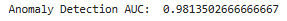
- Anomaly Detection AUC:  0.9813502666666667 가 나왔다.
- 정상과 이상을 거의 유력하게 구분할 수 있는 수치이다.
- 1: 정상/이상 완벽하게 분류할 수 있는 수치
- 0.8: 매우 잘 분류
- 0.7: 보통

### [10] Warning / Critical Threshold 정의(Warning Line, Critical Line 구하기)
- 현장에서는 숫자를 보는 게 아니라 주의, 경고, 위험 등의 경고를 주는 것이다. 따라서 수치를 주는 것보다는 roc 커브를 기준으로 정상/이상 잘 구분하는 critical threshold 를 정의해야 한다.
- 현장은 정상, 주의, 위험으로 표시됨
- `Critical`: 주의 또는 위험으로 표현해야 함. 그래서 ROC_CURVE를 이용해서 정상과 이상을 가장 잘 구분하는 Critical Threshold를 정의
- `Warning`: 정상 데이터 분포의 상위 5% 지점을 Warning Threshold로 정의 (정상이지만, 고장 전조 단계이므로 경고) 
- Normal -> Warning -> Critical 3단계 위험등급 체계를 구축
- 라인 3개 정의 
    - fpr: 정상을 이상으로 잡은 것
    - tpr: 정상을 정상으로 잡은 것
    - 현장에서는 정상을 이상으로 잡은 경우 클레임이 많이 들어온다.
    - 가성 알람을 줄이는 게 사실 좀 더 중요하다. 굉장히 예민하므로 최소화 해야함.
    ```
```py
# ROC 곡선을 이용하여 threshold 후보들 계산
fpr, tpr, threshold = roc_curve(df_feat.is_abnormal, df_feat.anomaly_score)

# fpr(정상 -> 이상으로 잡은 것) 최소화하기 위해 아래의 알고리즘 사용한다.
# youden_index: 민감도는 높고 가성알람은 낮은 지점을 찾기 위한 기준 (이상을 잘 찾으면서 가성알람은 적은 지점 탐색)
youden_index = tpr-fpr  
# youden_index 가 가장 큰 threshold 위치 저장
best_idx = np.argmax(youden_index)
# Critical 기준 threshold 설정
critical_threshold = threshold[best_idx]

'''
ex)
threshold  TPR  FPR  Youden
0.5 0.95 0.40 0.55
1.0 0.90 0.10 [0.80] <- Youden 가장 큰 값 (이상/정상 가장 잘 구분할 수 있는 기준) / threshold 1.0 이 정상/이상 구분 가장 잘함.
1.5 0.75 0.05 0.70
'''

# 정상 데이터의 이상 점수만 선택 (정상/이상 구분)
# 그래프를 그리기 위해 데이터를 뽑음
normal_score = df_feat[df_feat.is_abnormal==0]["anomaly_score"]
# 정상 데이터 상위 15% 지점을 warning 기준으로 설정
warning_threshold = np.percentile(normal_score, 85)

print("Warning Threshold: ", warning_threshold)
print("Critical Threshold: ", critical_threshold)

# 이상 점수를 입력받아 위험 등급을 반환하는 함수
def classify_risk_level(score, warning_threshold, critical_threshold):
    if score >= critical_threshold:
        return "CRITICAL"
    elif score >= warning_threshold:
        return "WARNING"
    else: 
        return "NORMAL"

# 전체 데이터에 대해 위험 등급 계산
df_feat["risk_level"] = df_feat.anomaly_score.apply(
    lambda x: classify_risk_level(x, warning_threshold, critical_threshold)
)

# 위험 등급별 개수 출력
print(df_feat.risk_level.value_counts())
```
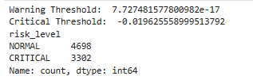
- 워닝과 크리티컬 라인 그어놓고 해당 라인 기준으로 노말과 크리티컬도 뽑아 보았다.
- 크리티컬이 많게 나왔다. 왜 많은지 그래프로 출력해 볼 것인데, 이 그래프 중요하다.

### [11] [중요] 이상 점수를 기준으로 위험 등급 생성 및 그래프 시각화
```py
# 전체 데이터 스케일링
X_all_scaled = scaler.transform(df_feat[critical_cols])
# 이상 점수 계산
raw_score = iso_model.decision_function(X_all_scaled)

# anomaly score 생성
df_feat["anomaly_score"] = -raw_score
# anomaly score를 warning/critical 기준과 비교해서 normal, warning, critical 등급 생성
df_feat["risk+level"] = df_feat.anomaly_score.apply(
    lambda score: classify_risk_level(score, warning_threshold, critical_threshold)
)

# 치명인자 & 이상데이터 시계열 + 이상 구간 비교 시각화
critical_plot_cols = ["thermal_stress_index","vibration_load_index","hydraulic_efficiency_index","lubrication_degradation_index"]
# 시각화할 치명인자 개수 + 1개(맨 아래 종합용 칸)만큼 세로로 서브플롯 생성
fig, axes = plt.subplots(
    len(critical_plot_cols)+1,
    1,
    figsize=(16,24),
    sharex=True, # sharex=True: 모든 그래프가 x축(인덱스)을 공유하도록 설정
)
# 각 치명인자마다 하나의 서브플롯에 그래프를 그림
for i, col in enumerate(critical_plot_cols):
    # 해당 치명인자 값을 시계열(선 그래프)로 표시
    axes[i].plot(df_feat.index, df_feat[col], linewidth=1.5, label=col)
    # 실제 이상 데이터 표시
    abnormal_idx = df_feat[df_feat.is_abnormal==1].index
    # 이상 데이터 지점을 빨간 점으로 겹쳐 표시 (실제 고장 구간 확인용)
    axes[i].scatter(abnormal_idx, df_feat.loc[abnormal_idx, col], color="red", s=10, alpha=0.5, label="Actual Abnormal")
    axes[i].set_ylabel(col) # y축 라벨을 해당 치명인자 이름으로 설정
    axes[i].legend() # 범례 표시 (선/점이 무엇인지 안내)
    axes[i].grid(True) # 배경에 그리드 형식으로 선 표시

# 마지막 그래프 = 이상 점수
# is_abnormal 값(0/1)에 따라 점 색을 다르게 표시 (정상/이상 색 구분)
axes[-1].scatter(df_feat.index, df_feat.anomaly_score, c=df_feat.is_abnormal, cmap="coolwarm", alpha=0.7)
# Warning 기준선을 주황색 점선으로 가로로 표시 (이 선을 넘으면 경고 단계)
axes[-1].axhline(warning_threshold, color="orange", linestyle="--", linewidth=2, label="Warning")
# Critical 기준선을 빨간색 실선으로 가로로 표시 (이 선을 넘으면 위험 단계)
axes[-1].axhline(critical_threshold, color="red", linestyle="-", linewidth=2, label="Critical")

# 그래프 레이아웃 설정
axes[-1].set_ylabel("Anomaly Score") # y축 라벨을 이상 점수로 설정
axes[-1].legend() # 범례 표시 (정상/이상 점, Warning/Critical 선 안내)
axes[-1].grid(True) # 배경에 그리드 선 표시
axes[-1].set_xlabel("Sample Index") # x축 라벨을 샘플 인덱스로 설정 (맨 아래 칸에만 표시)

# 그래프 출력
plt.suptitle("Critical Indicator Trend and Anomaly Detection", fontsize=16) # 전체 그래프 상단 제목
plt.tight_layout() # 그래프 간 간격을 자동 조정해 라벨/제목 겹침 방지
plt.show() # 완성된 그래프 출력
```
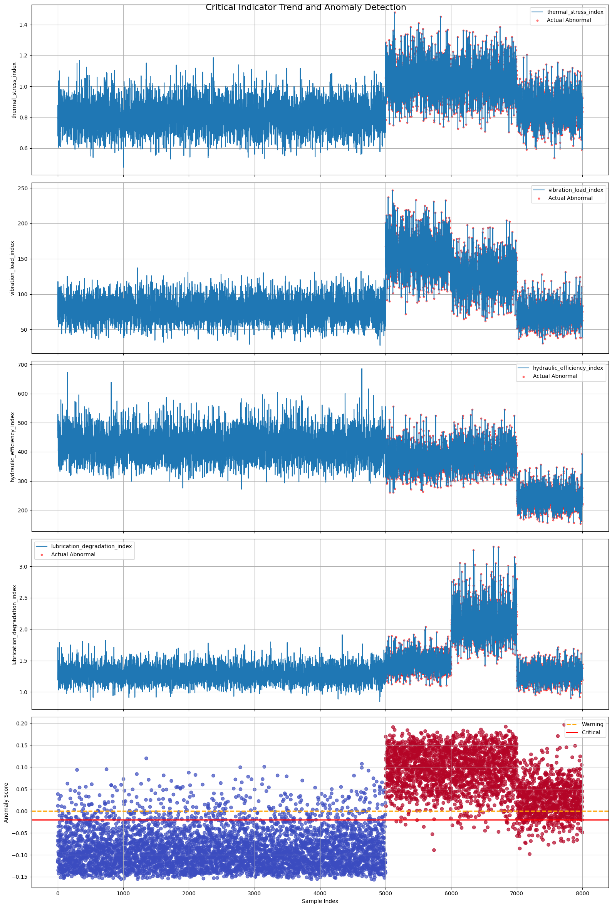
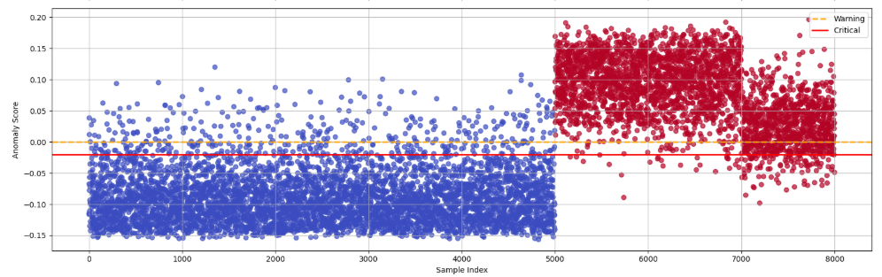
- 5000개 데이터: 정상 데이터, 1000/1000/1000개 이상 데이터로 선정 했었다. 그 데이터 기준으로 라인이 그어졌다.
- 그 아래 실제 파생변수들 비교해서 볼 것이다. (시간은 동일하게 싱크되어 있다.)
- 각 파생변수들도 이상으로 막 찍혀있다.
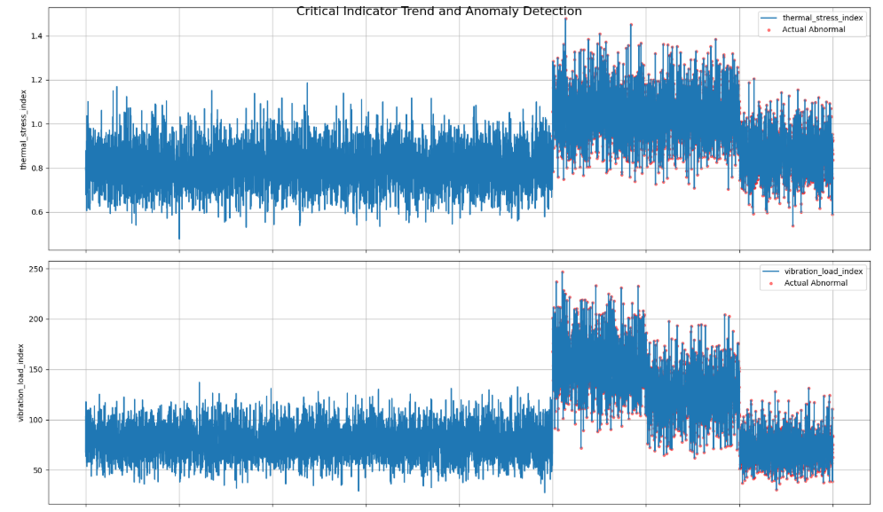
- 위 그래프는 이상인 구간에서 튀어오름.
- 아래 그래프는 살짝 내려감.
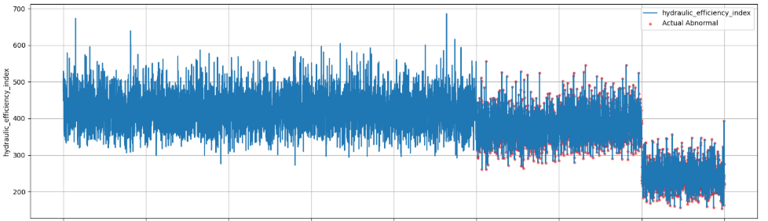
- 아무튼 파생변수들도 이상 구간에서는 튀는 것이 보인다.
- threshold 기준을 잘 잡은 것 같이 나왔다.
- 하지만 정상 구간인데도 빨갛다. 데이터 생성에 문제가 있다.
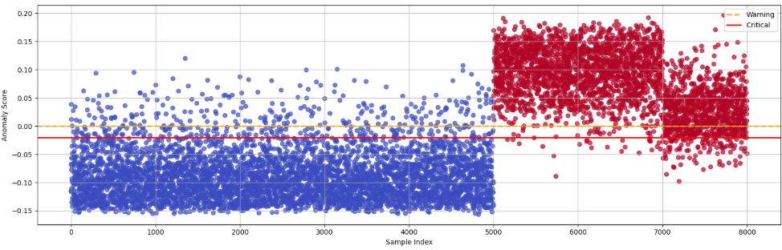
- 이 부분이 넘는 부분들은 이상이라고 보는 것이다. 
- 아무튼 튀는 구간에서 문제 발생 했을 때, 다른 파생변수 들에서도 이상하게 튄 것들이 발생 -> 이 변수들이 영향을 미친 치명 인자가 맞는 것 같다.
- threshold도 적정해 보인다. 랜덤 데이터를 생성해서 저렇게 점이 많이 튀어 나왔는세 실제로는 그만큼 튀어나오지는 않는다.
- 이처럼 어떤 변수들이 이상하게 튀었는지 찾아 나가는 것이다.
- 실제 데이터들도 이런 형태로 나타난다. 치명인자에 따른 이상 있는 부분에 튀는 현상이 같이 나타난다. 근데 로우데이터만 봤을땐 이렇게 안나타나는 경우가 있는데 파생변수로 나타내니까 나온 것이다.
- 파생변수는 도메인의 특성 기반으로 만들었었다.
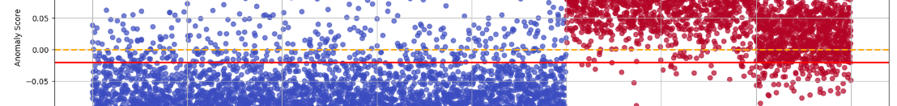
- 정상에서 상위 5% 수준을 워닝 라인으로 잡았었고, 이상과 정상을 딱 구분할 수 있는 경계선은 그 아래였던 것으로 나온 것이다. 그래서 워닝과 크리티컬 이 반대로 나와 보인다. 가상 데이터로 만들다 보니 이렇게 나왔다. (데이터를 정상과 겹치게 만들어서 약간 오류처럼 보이게됨)
- 정상에서 상위 15% 수준을 워닝 라인으로 잡도록 바꾸니까 정상적으로 보이게 됨: 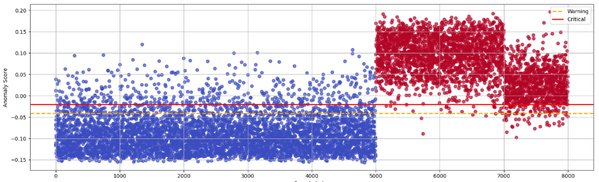

#### [중요] 나중에 이렇게 그래프 정상 데이터 이상 데이터 영향 미쳤던 변수들 타임싱크 맞춰서 같이 상태 어떻게 나타나는지 비교해서 보라고 한다.

### [12] 
- 원인 진단 분류 모델
```py
```

### [] 
```py
```

### []
```py
```

### []
```py
```

### []
```py
```

