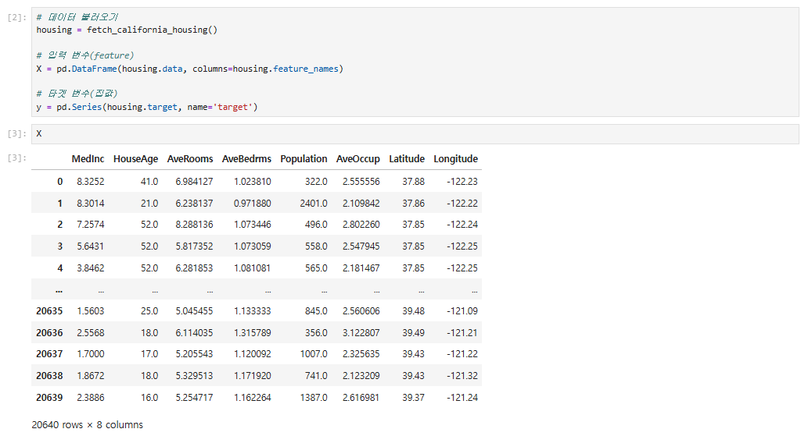
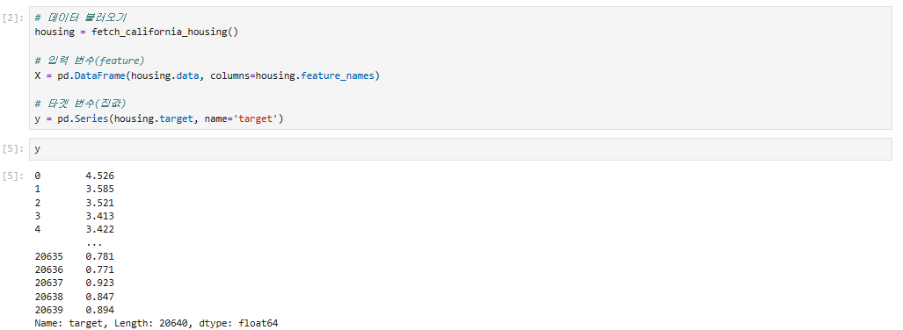
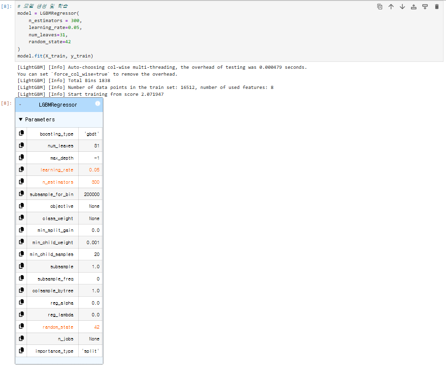
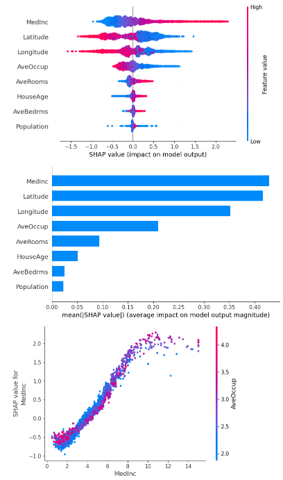

# 9일차 - 6/8(원) #
- 회의 참석: https://whaleon.us/o/CSvuJa/64dffed07c6741c990f69804e3b62d6e

# 머신러닝 실습 - 이어서
## 5. x 변수의 특성 기호도 측정 (SHAP) - 캘리포니아 집값 / lightGBM - 이어서
- 새로운 파일 생성: [7-05) SHAP]
- 아나콘다 프롬프트에서 가상환경 접속(`activate ai`)후 shap 설치: `pip install shap`

### [1] 라이브러리 임포트
```py
# import 
import numpy as np
import pandas as pd
import matplotlib.pyplot as plt

from sklearn.datasets import fetch_california_housing
from sklearn.model_selection import train_test_split
from lightgbm import LGBMRegressor

import shap
```

### [2] 데이터 불러오기
```py
# 데이터 불러오기
housing = fetch_california_housing()

# 입력 변수(feature)
X = pd.DataFrame(housing.data, columns=housing.feature_names)

# 타겟 변수(집값)
y = pd.Series(housing.target, name='target')
```



### [3] 데이터 분할
```py
# 데이터 분할
X_train, X_test, y_train, y_test = train_test_split(
    X, y,
    test_size=0.2,
    random_state=42,
)
```

### [4] 모델 생성 및 학습
```py
# 모델 생성 및 학습
model = LGBMRegressor(
    n_estimators = 300,
    learning_rate=0.05,
    num_leaves=31,
    random_state=42
)
model.fit(X_train, y_train)
```


### [5] SHAP Explainer 생성
```py
# SHAP Explainer 생성
explainer = shap.TreeExplainer(model)

# shap value 계산 (학습 데이터가 아니라, 테스트 데이터 기준으로 계산)
shap_values = explainer.shap_values(X_test) # 각 feature가 얼마나 예측 했는지의 기여도를 스코어로 계산
```

# [월] 여기서 부터 다시 진행
### [6] 영향도 시각화 - 이어서
```py
# 매직 코드: 그래프가 한번에 쫙 보여지는 것이다.
%matplotlib inline

# 영향도 시각화
shap.summary_plot(shap_values, X_test) # 점 위치: 영향 방향(+/-), 색: feature 값 크기
# shap bar plot(방향성)
shap.summary_plot(shap_values, X_test, plot_type='bar')
# shap dependence plot
shap.dependence_plot("MedInc", shap_values, X_test)

# shap waterfall plot
sample_index = 0
# 개별 샘플 shap 값
shap.initjs() # 시각화 초기화
# 
shap.waterfall_plot()
```

- 그래프 뽑고 해석하는 건 다음 주 월요일 예정. (오후에 진행 예정)


# 머신러닝 응용 실습 (난이도 조금 높임)
